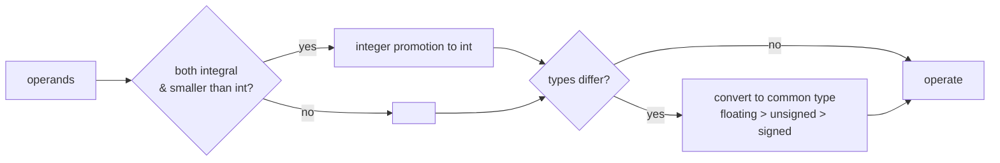

# Arithmetic Operators

Arithmetic operators compute numeric results from numeric operands. The surface syntax is
trivial — the subtleties are in *integer division*, *modulo sign rules*, *overflow*, and the
*implicit conversions* applied before the operation runs.

:::info Scope
This page covers the semantics that bite in practice. For the bird's-eye list of every operator
see [Expressions and Statements](../expressions-and-statements.md); for the conversions applied to
mixed operands see [Conversions and Promotions](../../03-types-and-values/conversions-and-promotions.md).
:::

## The operators

| Operator | Name           | Example  | Notes                                            |
|----------|----------------|----------|--------------------------------------------------|
| `+`      | addition       | `a + b`  | also unary plus (`+a`)                           |
| `-`      | subtraction    | `a - b`  | also unary minus (`-a`)                          |
| `*`      | multiplication | `a * b`  |                                                  |
| `/`      | division       | `a / b`  | **integer** division when both operands integral |
| `%`      | modulo         | `a % b`  | integers only — no floating modulo (use `fmod`)  |
| `++`     | increment      | `++a` / `a++` | pre vs post differ (see below)              |
| `--`     | decrement      | `--a` / `a--` |                                             |

## Integer vs floating division

`/` picks its behaviour from the operand types, not from the type you assign into. This is the
single most common arithmetic surprise.

```cpp showLineNumbers
int   a = 7 / 2;        // 3   — integer division truncates toward zero
double b = 7 / 2;       // 3.0 — division happens in int first, THEN converts
double c = 7.0 / 2;     // 3.5 — one floating operand promotes the whole expression
double d = 7 / 2.0;     // 3.5 — same
double e = static_cast<double>(7) / 2;  // 3.5 — force it explicitly
```

:::warning Truncation, not rounding
Integer `/` truncates toward zero (`-7 / 2 == -3`, not `-4`). If you need rounding, do it
deliberately, e.g. `(a + b/2) / b` for positive values, or `std::lround`.
:::

## Modulo and sign

`%` is defined only for integers. Since C++11 the result takes the **sign of the dividend**, and
the identity `(a/b)*b + a%b == a` always holds:

```cpp showLineNumbers
 7 %  3;   //  1
-7 %  3;   // -1   — sign follows the left operand (the dividend)
 7 % -3;   //  1
-7 % -3;   // -1
```

A frequent bug: using `%` to wrap an index that might be negative. Use a sign-correcting helper.

```cpp showLineNumbers
int wrap(int i, int n) { return ((i % n) + n) % n; }   // always in [0, n)
```

Division or modulo by zero is **undefined behaviour** for integers (not a catchable exception) —
see [Undefined Behavior](../../10-error-handling-and-safety/06-undefined-behavior.md).

## Increment and decrement

Prefix returns the value *after* the change; postfix returns a copy of the value *before* it.

```cpp showLineNumbers
int a = 5;
int x = ++a;   // a == 6, x == 6   (increment, then read)
int b = 5;
int y = b++;   // b == 6, y == 5   (read, then increment)
```

:::tip Prefer prefix
For built-in types they optimise identically. For iterators and other class types, `it++` must
build and return a temporary copy, while `++it` does not — prefer `++it` in loops out of habit.
:::

## Overflow

Signed integer overflow is **undefined behaviour** — the compiler may assume it never happens and
optimise on that assumption. Unsigned arithmetic instead wraps modulo `2ⁿ`, which is well defined
but a notorious source of bugs (e.g. `size_t` underflow in reverse loops).

```cpp showLineNumbers
int      s = INT_MAX + 1;     // UB — do not rely on wrapping
unsigned u = 0u - 1u;         // 4294967295 — defined wrap, often unintended

// Safe checked arithmetic (C++20):
int r;
if (__builtin_add_overflow(a, b, &r)) { /* overflow handling */ }   // GCC/Clang
// or std::add_sat / std::mul_sat (C++26) for saturating results
```

See [Signedness](../../03-types-and-values/signedness.md) for why mixing signed and unsigned in one
expression is dangerous.

## Mixed-type operands

Before any binary arithmetic, operands undergo the **usual arithmetic conversions**: smaller integers
promote to `int`, then both sides convert to a common type. This is why `'A' + 1` has type `int`,
and why an `int`/`unsigned` mix silently converts the `int` to `unsigned`.



## Summary

- `/` and `%` on two integers stay integer — convert an operand first for real division.
- `%` follows the dividend's sign; guard it when indices can be negative.
- Signed overflow is UB; unsigned wraps. Neither is a safety net.
- Prefer `++it` over `it++`; they only differ for class types, but the habit is free.
- Mixed operands convert *before* the operation via the usual arithmetic conversions.

## Related

- [Expressions and Statements](../expressions-and-statements.md) — full operator inventory
- [Conversions and Promotions](../../03-types-and-values/conversions-and-promotions.md)
- [Signedness](../../03-types-and-values/signedness.md)
- [Operator Precedence](./operator-precedence.md)
