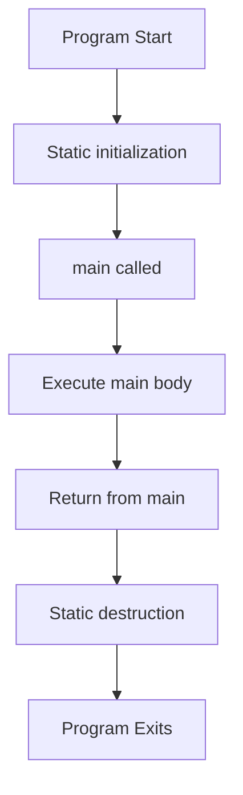

# Program Structure

C++ programs consist of one or more source files containing declarations, definitions, and the required `main()` function.

:::info Entry Point
Every C++ program must have exactly one `main()` function - this is where execution begins.
:::

## Minimal Program

```cpp showLineNumbers 
int main() {
    return 0;  // 0 indicates success
}
```

This is the simplest valid C++ program. It does nothing but exit successfully.

---

## Complete Program Structure

```cpp showLineNumbers 
// 1. Preprocessor directives
#include <iostream>
#include "myheader.h"
#define MAX_SIZE 100

// 2. Namespace declarations
using namespace std;  // Or specific: using std::cout;

// 3. Global declarations/definitions
const double PI = 3.14159;
int global_counter = 0;

// 4. Function declarations (prototypes)
void helper_function();
int calculate(int x, int y);

// 5. Class/struct definitions
class Widget {
    int value;
public:
    Widget(int v);
    void display();
};

// 6. Main function (entry point)
int main() {
    Widget w(42);
    w.display();
    return 0;
}

// 7. Function definitions
void helper_function() {
    // Implementation
}

int calculate(int x, int y) {
    return x + y;
}

Widget::Widget(int v) : value(v) {}

void Widget::display() {
    std::cout << value << "\n";
}
```

---

## The main() Function

### Standard Signatures

```cpp showLineNumbers 
// No arguments
int main() {
    return 0;
}

// With command-line arguments
int main(int argc, char* argv[]) {
    // argc: argument count
    // argv: argument values (array of C-strings)
    return 0;
}

// Alternative (less common)
int main(int argc, char** argv) {
    return 0;
}
```

### Command-Line Arguments

```cpp showLineNumbers 
#include <iostream>

int main(int argc, char* argv[]) {
    std::cout << "Program name: " << argv[0] << "\n";
    std::cout << "Argument count: " << argc << "\n";
    
    for (int i = 1; i < argc; i++) {
        std::cout << "Arg " << i << ": " << argv[i] << "\n";
    }
    
    return 0;
}

// Run: ./program hello world
// Output:
// Program name: ./program
// Argument count: 3
// Arg 1: hello
// Arg 2: world
```

### Return Values

```cpp showLineNumbers 
int main() {
    // Return value indicates success/failure to OS
    
    if (error_condition) {
        return 1;     // Failure (non-zero)
    }
    
    return 0;         // Success
    // If no return, 0 is implicit (C++11)
}
```

**Convention**:
- `0`: Success
- Non-zero: Error code (1, -1, EXIT_FAILURE)

```cpp showLineNumbers 
#include <cstdlib>

int main() {
    return EXIT_SUCCESS;  // 0
    // or
    return EXIT_FAILURE;  // Non-zero
}
```

---

## File Organization

### Single File Program

```cpp showLineNumbers 
// simple.cpp
#include <iostream>

void greet() {
    std::cout << "Hello!\n";
}

int main() {
    greet();
    return 0;
}
```

### Multi-File Program

**Header file (math.h)**:
```cpp showLineNumbers 
#pragma once

int add(int a, int b);
int multiply(int a, int b);
```

**Implementation file (math.cpp)**:
```cpp showLineNumbers 
#include "math.h"

int add(int a, int b) {
    return a + b;
}

int multiply(int a, int b) {
    return a * b;
}
```

**Main file (main.cpp)**:
```cpp showLineNumbers 
#include <iostream>
#include "math.h"

int main() {
    int result = add(5, 3);
    std::cout << result << "\n";
    return 0;
}
```

**Compilation**:
```bash
g++ main.cpp math.cpp -o program
./program
```

---

## Typical Project Structure

```
project/
├── include/           # Public headers
│   └── mylib/
│       ├── api.h
│       └── utils.h
├── src/               # Source files
│   ├── main.cpp
│   ├── api.cpp
│   └── utils.cpp
├── tests/             # Test files
│   └── test_api.cpp
├── CMakeLists.txt     # Build configuration
└── README.md
```

---

## Namespaces in Programs

### Global Namespace

```cpp showLineNumbers 
// Global scope
int global_var = 42;

void global_func() {
    // Can access global_var
}

int main() {
    // Can access both
}
```

### Custom Namespace

```cpp showLineNumbers 
namespace math {
    const double PI = 3.14159;
    
    double square(double x) {
        return x * x;
    }
}

int main() {
    double result = math::square(5);
    std::cout << math::PI << "\n";
}
```

### Using Declarations

```cpp showLineNumbers 
#include <iostream>
#include <vector>

// Specific using declarations (preferred)
using std::cout;
using std::vector;

int main() {
    vector<int> nums = {1, 2, 3};
    cout << nums[0] << "\n";  // No std:: prefix
}
```

### Using Directive

```cpp showLineNumbers 
// Entire namespace (avoid in headers!)
using namespace std;

int main() {
    cout << "Hello\n";  // No std:: needed
    vector<int> v;
}
```

:::warning Avoid in Headers
Never use `using namespace` in header files - it pollutes the namespace for all files that include the header.
:::

---

## Execution Flow



### Static Initialization

```cpp showLineNumbers 
#include <iostream>

// Initialized before main() starts
int global = []() {
    std::cout << "Global initialized\n";
    return 42;
}();

class Logger {
public:
    Logger() {
        std::cout << "Logger constructed\n";
    }
    ~Logger() {
        std::cout << "Logger destroyed\n";
    }
};

Logger log;  // Constructed before main

int main() {
    std::cout << "In main\n";
    return 0;
}

// Output:
// Global initialized
// Logger constructed
// In main
// Logger destroyed
```

---

## Forward Declarations

Declare functions before use:

```cpp showLineNumbers 
// Forward declaration
void helper();

int main() {
    helper();  // OK: declared above
    return 0;
}

// Definition can come after
void helper() {
    std::cout << "Helper\n";
}
```

Without forward declaration:
```cpp showLineNumbers 
int main() {
    helper();  // ❌ Error: 'helper' not declared
    return 0;
}

void helper() {
    std::cout << "Helper\n";
}
```

---

## Compilation Units

Each `.cpp` file is a separate compilation unit:

```bash
# Separate compilation
g++ -c main.cpp      # → main.o
g++ -c utils.cpp     # → utils.o
g++ -c math.cpp      # → math.o

# Link into executable
g++ main.o utils.o math.o -o program
```

---

## Summary

C++ program structure:

1. **Preprocessor directives**: `#include`, `#define`
2. **Declarations**: Forward declarations, `extern`
3. **Definitions**: Functions, classes, globals
4. **main() function**: Required entry point
5. **Implementation**: Function bodies

**main() function**:
- Required (exactly one)
- Returns `int`
- `return 0` = success
- Can accept command-line arguments

**Organization**:
- Headers (`.h`): Declarations
- Source (`.cpp`): Definitions
- One `main()` per program

```cpp showLineNumbers 
// Template structure
#include <headers>

// Declarations
void function();

// main function
int main(int argc, char* argv[]) {
    // Program logic
    return 0;
}

// Implementations
void function() {
    // ...
}
```