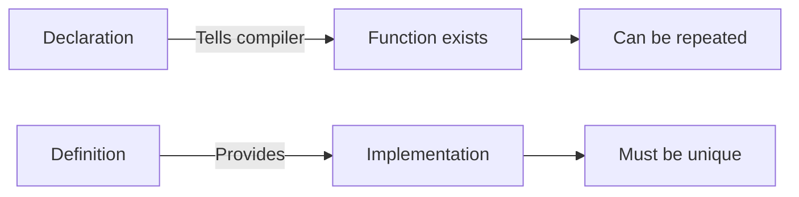

# Function Declarations and Definitions

A **function declaration** (or prototype) specifies a function's name, return type, and parameters without providing the implementation.

## Basic Syntax
```cpp
// Declaration (forward declaration)
int add(int a, int b);

// Definition (implementation)
int add(int a, int b) {
    return a + b;
}

// Usage
int result = add(5, 3);
```

## Declaration vs Definition

```cpp
// Declaration (can appear multiple times)
void foo();
void foo();  // OK: redeclaration

// Definition (must appear exactly once)
void foo() {
    // Implementation
}

// void foo() { }  // Error: redefinition!
```

## Function Signature

The **signature** uniquely identifies a function:
```cpp
// Signature: name + parameter types (NOT return type!)
int calculate(double x, double y);      // Signature: calculate(double, double)
double calculate(int x, int y);         // Different signature!
int calculate(double x, double y);      // Same signature as first - ERROR!
```

:::info
The function signature includes the function name and parameter types, but **NOT** the return type.
:::

## Parameter Names in Declarations
```cpp
// Parameter names are optional in declarations
void process(int, double);              // OK
void process(int count, double value);  // Better: shows intent

// Definition must have names
void process(int count, double value) {
    // Use count and value
}
```

## Common Declaration Patterns

### Pattern 1: Header/Source Split
```cpp
// widget.h
class Widget {
public:
    void setSize(int width, int height);
    int getWidth() const;
    
private:
    int width_, height_;
};

// widget.cpp
void Widget::setSize(int width, int height) {
    width_ = width;
    height_ = height;
}

int Widget::getWidth() const {
    return width_;
}
```

### Pattern 2: Forward Declarations
```cpp
// Declare class without full definition
class Database;

// Can use pointers/references
class UserManager {
    Database* db_;  // OK: pointer to forward-declared class
    
public:
    void setDatabase(Database* db);
};

// Full definition later
class Database {
    // ...
};
```

### Pattern 3: Namespace Scope
```cpp
namespace math {
    double sqrt(double x);
    double pow(double base, double exp);
}

// Implementation
namespace math {
    double sqrt(double x) {
        // Implementation
    }
}
```

## Special Member Functions
```cpp
class Widget {
public:
    // Constructor
    Widget(int value);
    
    // Destructor
    ~Widget();
    
    // Copy constructor
    Widget(const Widget& other);
    
    // Copy assignment
    Widget& operator=(const Widget& other);
    
    // Move constructor
    Widget(Widget&& other) noexcept;
    
    // Move assignment
    Widget& operator=(Widget&& other) noexcept;
};
```

## Function Attributes

### const Member Functions
```cpp
class Point {
    int x_, y_;
    
public:
    int getX() const;        // Doesn't modify object
    void setX(int x);        // May modify object
};
```

### noexcept Specification
```cpp
void safeFunction() noexcept;           // Never throws
void mayThrow();                        // May throw
void conditionalNoexcept() noexcept(true);
```

### [[nodiscard]] Attribute (C++17)
```cpp
[[nodiscard]] int calculate();

void usage() {
    calculate();  // Warning: ignoring return value
    int result = calculate();  // OK
}
```

## Trailing Return Type (C++11)
```cpp
// Traditional syntax
int getValue();

// Trailing return type
auto getValue() -> int;

// Useful with templates
template<typename T, typename U>
auto multiply(T a, U b) -> decltype(a * b) {
    return a * b;
}

// C++14: auto deduction
auto add(int a, int b) {
    return a + b;  // Return type deduced
}
```

## Function Pointers
```cpp
// Declaration
int (*funcPtr)(int, int);

// Assignment
int add(int a, int b) { return a + b; }
funcPtr = &add;

// Call
int result = funcPtr(5, 3);

// Using type alias
using BinaryOp = int(*)(int, int);
BinaryOp operation = &add;
```

## Practical Examples

### Example 1: API Header
```cpp
// api.h
#ifndef API_H
#define API_H

#include <string>
#include <vector>

namespace api {
    // User management
    bool createUser(const std::string& username, const std::string& password);
    bool deleteUser(const std::string& username);
    std::vector<std::string> listUsers();
    
    // Data operations
    bool saveData(const std::string& key, const std::string& value);
    std::string loadData(const std::string& key);
}

#endif
```

### Example 2: Class Interface
```cpp
class TextEditor {
public:
    // File operations
    bool open(const std::string& filename);
    bool save();
    bool saveAs(const std::string& filename);
    void close();
    
    // Edit operations
    void insertText(size_t position, const std::string& text);
    void deleteText(size_t start, size_t length);
    std::string getText() const;
    
    // Query operations
    size_t getLength() const;
    bool isModified() const;
    std::string getFilename() const;
    
private:
    std::string content_;
    std::string filename_;
    bool modified_;
};
```

## Best Practices

:::success
**DO:**
- Declare functions in headers, define in source files
- Use meaningful parameter names in declarations
- Mark const member functions with `const`
- Use `noexcept` for functions that don't throw
- Use forward declarations to reduce dependencies
  :::

:::danger
**DON'T:**
- Define functions in headers (causes multiple definition errors)
- Forget to include headers with declarations
- Declare functions without defining them (causes linker errors)
- Mismatch declarations and definitions
  :::

## Related Topics

- **[Default Arguments](default-arguments.md)** - Optional parameters
- **[Overloading](overloading.md)** - Multiple functions same name
- **[noexcept](noexcept.md)** - Exception specifications
- **[constexpr Functions](constexpr-functions.md)** - Compile-time functions