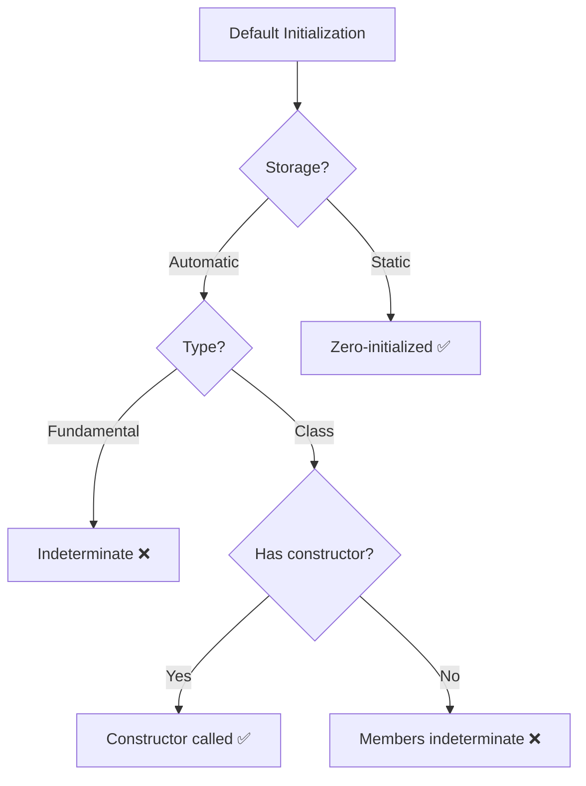

# Default Initialization

Object created without explicit initializer. Behavior depends on type and storage duration. **Dangerous for fundamental types in local scope.**

:::warning Undefined Values
Local fundamental types (int, double, pointers) = indeterminate values = undefined behavior when read.
:::

## Fundamental Types

### Automatic Storage (Local Variables)
```cpp showLineNumbers
void function() {
    int x;        // Indeterminate value ❌
    double d;     // Indeterminate value ❌
    int* ptr;     // Indeterminate pointer ❌
    
    std::cout << x;    // ❌ UB: reading garbage
    std::cout << d;    // ❌ UB
    *ptr = 42;         // ❌ UB: pointer points nowhere
}
```

**Why**: Performance - no automatic zeroing. **Problem**: Forgetting to initialize = bugs.

### Static Storage (Globals/Static)
```cpp showLineNumbers
int global;              // Zero-initialized ✅
static int file_static;  // Zero-initialized ✅

void function() {
    static int local_static;  // Zero-initialized ✅
    
    std::cout << global;        // ✅ Safe: 0
    std::cout << file_static;   // ✅ Safe: 0
    std::cout << local_static;  // ✅ Safe: 0
}
```

**Rule**: Static storage = always zero before any other initialization.

## Storage Duration Comparison

| Storage | Scope | Initialization | Lifetime |
|---------|-------|---------------|----------|
| **Automatic** | Local | Indeterminate ❌ | Block scope |
| **Static** | Global/Static | Zero ✅ | Program lifetime |

## Class Types

### With Default Constructor
```cpp showLineNumbers
class Widget {
    int value;
public:
    Widget() : value(42) {}  // Default constructor
};

Widget w;  // Calls Widget() ✅
// w.value guaranteed to be 42
```

**Guarantee**: Default constructor always called, object always valid.

### Implicit Default Constructor
```cpp showLineNumbers
// ❌ Dangerous
class Point {
    int x, y;  // No constructor
};

Point p;  // x, y indeterminate! ❌

// ✅ Safe
class SafePoint {
    int x, y;
public:
    SafePoint() : x(0), y(0) {}  // Explicit init
};

SafePoint sp;  // x=0, y=0 ✅
```

**Lesson**: Compiler-generated default constructor doesn't initialize fundamental members.

### Deleted Default Constructor
```cpp showLineNumbers
class File {
public:
    File() = delete;  // Prevent default construction
    File(const char* filename) { /* open file */ }
};

// File f;  // ❌ Error: default constructor deleted
File f("data.txt");  // ✅ Must provide filename
```

**Use**: Force required parameters at construction.

## Arrays
```cpp showLineNumbers
void function() {
    int arr[10];  // All elements indeterminate ❌
    std::cout << arr[0];  // ❌ UB
}

static int global_arr[10];  // All zeros ✅
std::cout << global_arr[0];  // ✅ Safe: 0
```

### Class Type Arrays
```cpp showLineNumbers
class Widget {
public:
    Widget() { std::cout << "Constructed\n"; }
};

Widget arr[3];  // Calls Widget() three times ✅
// All elements properly initialized
```

## Member Variables
```cpp showLineNumbers
// ❌ Bad
class Bad {
    int value;  // Not initialized!
public:
    Bad() {}  // Constructor doesn't init value
    
    int getValue() { return value; }  // ❌ Returns garbage
};

// ✅ Good
class Good {
    int value;
public:
    Good() : value(0) {}  // Initializer list
    
    int getValue() { return value; }  // ✅ Returns 0
};
```

**Fix**: Always initialize in constructor initializer list.

### In-Class Initializers (C++11)
```cpp showLineNumbers
class Widget {
    int value = 42;              // In-class initializer
    std::string name = "default";
    
public:
    Widget() {}  // Uses defaults
    Widget(int v) : value(v) {}  // Overrides value only
};
```

**Best practice**: Provide defaults, override when needed.

## Quick Decision Tree


## Best Practices

:::success DO
- Always initialize fundamental types explicitly
- Use in-class initializers (C++11)
- Initialize in constructor initializer list
- Use value initialization `{}` for safety
  :::

:::danger DON'T
- Read uninitialized local variables
- Rely on implicit zero for local variables
- Assume compiler-generated constructors initialize members
- Leave member variables uninitialized
  :::

## Summary

Default initialization behavior: **automatic storage** (locals) = indeterminate for fundamentals (UB), **static storage** (globals) = always zero. Classes with default constructors always call constructor. Compiler-generated constructors don't initialize fundamental members. **Always explicitly initialize** fundamental types to avoid undefined behavior. Use value initialization `{}` or in-class initializers for safety.
```cpp
// Interview answer:
// "Default initialization: local fundamentals get indeterminate
// values (UB if read), static/global get zeros. Classes call
// default constructor if available, but compiler-generated ones
// don't initialize fundamental members. Solution: always
// explicitly initialize fundamentals, use value initialization
// {} or in-class initializers, initialize members in constructor."
```