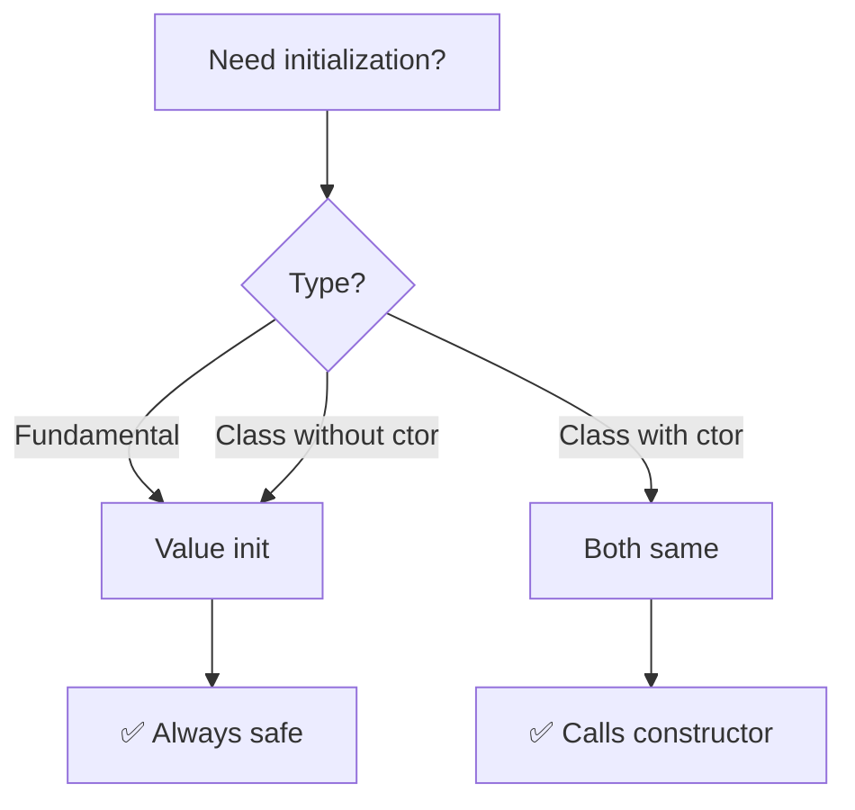

# Value Initialization

Explicitly request **zero-initialization** for fundamentals, **default construction** for classes. Safer than default initialization.

:::success Guaranteed Zero
Value initialization ensures fundamentals are zeroed, not indeterminate. Always safe to read.
:::

## Syntax

Empty parentheses or braces trigger value initialization.
```cpp showLineNumbers
int x{};        // 0
int y = int();  // 0
double d{};     // 0.0
bool b{};       // false
int* ptr{};     // nullptr

std::cout << x;    // ✅ Safe: 0
std::cout << ptr;  // ✅ Safe: nullptr
```

**Key**: Zero-initialization happens **before** any construction.

## Fundamental Types
```cpp showLineNumbers
void function() {
    // Default initialization (dangerous)
    int a;       // Indeterminate ❌
    double b;    // Indeterminate ❌
    char* c;     // Indeterminate ❌
    
    // Value initialization (safe)
    int x{};     // 0 ✅
    double y{};  // 0.0 ✅
    char* z{};   // nullptr ✅
}
```

## Comparison Table

| Type | Default Init | Value Init |
|------|-------------|-----------|
| `int` (local) | Indeterminate ❌ | 0 ✅ |
| `double` (local) | Indeterminate ❌ | 0.0 ✅ |
| `pointer` (local) | Indeterminate ❌ | nullptr ✅ |
| `int` (static) | 0 ✅ | 0 ✅ |
| Class with ctor | Calls ctor ✅ | Calls ctor ✅ |
| Class without ctor | Members indeterminate ❌ | Members zeroed ✅ |

## Class Types

### With User-Defined Constructor
```cpp showLineNumbers
class Widget {
    int value;
public:
    Widget() : value(42) {}
};

Widget w1;    // Default init → calls Widget()
Widget w2{};  // Value init → also calls Widget()

// Identical when constructor exists
```

**Rule**: User-defined constructor = same behavior for both.

### Without User-Defined Constructor

This is where value initialization shines.
```cpp showLineNumbers
struct Point {
    int x, y;
    // No constructor
};

Point p1;    // Default init: x, y indeterminate ❌
Point p2{};  // Value init: x=0, y=0 ✅

std::cout << p1.x;  // ❌ UB
std::cout << p2.x;  // ✅ Safe: 0
```

**Benefit**: Simple aggregates safely zeroed with `{}`.

## Arrays
```cpp showLineNumbers
int arr1[5];     // Indeterminate ❌
int arr2[5]{};   // All zeros ✅

std::cout << arr1[0];  // ❌ UB
std::cout << arr2[0];  // ✅ Safe: 0

// Multi-dimensional
int matrix[3][3]{};  // All zeros ✅
```

## Dynamic Allocation
```cpp showLineNumbers
int* p1 = new int;      // Indeterminate ❌
int* p2 = new int();    // 0 ✅
int* p3 = new int{};    // 0 ✅

std::cout << *p1;  // ❌ UB
std::cout << *p2;  // ✅ Safe: 0

delete p1; delete p2; delete p3;

// Arrays
int* arr1 = new int[10];     // Indeterminate ❌
int* arr2 = new int[10]();   // All zeros ✅
int* arr3 = new int[10]{};   // All zeros ✅

delete[] arr1; delete[] arr2; delete[] arr3;
```

**Critical**: Always use `()` or `{}` with `new` for fundamentals.

## Member Initialization
```cpp showLineNumbers
class Container {
    int value;
    double ratio;
    int* ptr;
    
public:
    Container() 
        : value{},    // 0
          ratio{},    // 0.0
          ptr{}       // nullptr
    {}
};
```

**Pattern**: Value-initialize all members for guaranteed valid state.

## Quick Decision Guide


## Performance
```cpp showLineNumbers
void compare() {
    // Default: no cost, but dangerous
    int arr1[1000000];  // Instant, but garbage ❌
    
    // Value: small cost, but safe
    int arr2[1000000]{};  // ~microseconds, all zeros ✅
}
```

**Reality**: Cost is negligible vs safety benefit. Modern CPUs efficiently zero memory.

## When to Use Each

| Scenario | Use |
|----------|-----|
| **Local fundamental** | Value init `{}` (safe) |
| **Immediately assigning** | Default init (performance) |
| **Class with ctor** | Either (same result) |
| **Aggregate** | Value init `{}` (zeros members) |
| **Dynamic allocation** | Value init `()` or `{}` |

## Common Patterns
```cpp showLineNumbers
// ✅ Safe patterns
int x{};                    // Zero
int* p = new int{};         // Zero on heap
int arr[10]{};              // All zeros
struct Point { int x, y; };
Point p{};                  // x=0, y=0

// ❌ Dangerous patterns
int x;                      // Indeterminate
int* p = new int;           // Indeterminate
int arr[10];                // All indeterminate
Point p;                    // x, y indeterminate
```

## Summary

Value initialization with `{}` or `()` guarantees zero for fundamentals, default constructor for classes. **Always safe to read** after value initialization. For classes without constructors, value init zeros all members (unlike default init). Small performance cost is negligible vs safety. **Best practice**: use `{}` for fundamentals unless immediately assigning. Essential for `new` allocations and member initialization.
```cpp
// Interview answer:
// "Value initialization with empty braces {} guarantees
// zero-initialization for fundamentals (0, 0.0, nullptr) and
// calls default constructor for classes. Default initialization
// leaves local fundamentals indeterminate (UB if read). For
// classes without constructors, value init zeros members while
// default leaves them indeterminate. Always prefer {} for safety
// unless immediately assigning a value. Tiny performance cost
// is worth preventing undefined behavior."
```