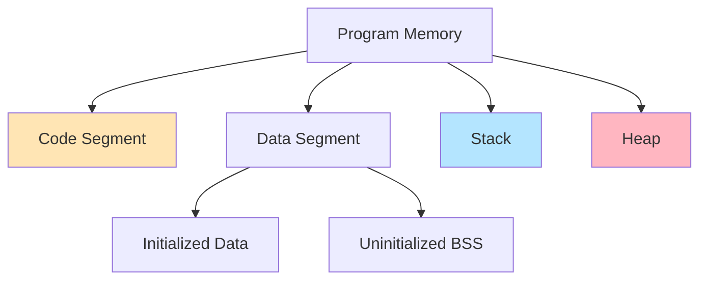

# C++ Memory Model Overview

The C++ memory model defines how programs interact with memory - address spaces, storage locations, and memory layout.

:::info Foundation
Understanding the memory model is essential for grasping pointers, references, object lifetime, and concurrency.
:::

## Memory Regions



### 1. Code/Text Segment

Contains executable instructions:

```cpp showLineNumbers 
void function() {  // Code stored here
    // Instructions
}

// Read-only, shared, fixed size
```

### 2. Data Segment

**Initialized data (.data)**:
```cpp showLineNumbers 
int global = 42;              // .data
static int file_static = 100; // .data
const char* str = "hello";    // Pointer in .data, string in .rodata
```

**Uninitialized data (.bss)**:
```cpp showLineNumbers 
int global_uninit;            // .bss
static int file_static_uninit; // .bss
// Zero-initialized at program start
```

### 3. Stack

Automatic (local) variables:

```cpp showLineNumbers 
void function() {
    int local = 10;        // On stack
    char buffer[100];      // On stack
    Widget w;              // On stack
}  // Destroyed when function returns
```

**Properties**:
- Fast allocation/deallocation
- Limited size (~1-8 MB)
- LIFO (Last In, First Out)
- Automatic lifetime management

### 4. Heap

Dynamic allocations:

```cpp showLineNumbers 
int* ptr = new int(42);        // Heap allocation
delete ptr;                    // Manual cleanup

int* arr = new int[1000];      // Heap array
delete[] arr;
```

**Properties**:
- Slower than stack
- Large size (GBs available)
- Manual management required
- Flexible lifetime

---

## Address Space


```
High Address
┌─────────────────┐
│ Stack           │ ↓ Grows down
│                 │
├─────────────────┤
│ (unmapped)      │
├─────────────────┤
│ Heap            │ ↑ Grows up
│                 │
├─────────────────┤
│ .bss (uninit)   │ Uninitialized globals
├─────────────────┤
│ .data (init)    │ Initialized globals
├─────────────────┤
│ .rodata         │ Read-only data
├─────────────────┤
│ .text (code)    │ Instructions
└─────────────────┘
Low Address
```

---

## Object Representation

Every object has:
- **Type**: Determines size and operations
- **Address**: Location in memory
- **Value**: Content at that location
- **Lifetime**: When object exists

```cpp showLineNumbers 
int x = 42;

// sizeof(x)  → 4 bytes (typical)
// &x         → Address (e.g., 0x7fff1234)
// x          → Value (42)
// Lifetime   → Until scope ends
```

---

## Memory Alignment

Objects align to boundaries for CPU efficiency:

```cpp showLineNumbers 
struct Example {
    char c;      // 1 byte
    // 3 bytes padding
    int i;       // 4 bytes (aligned to 4-byte boundary)
    char c2;     // 1 byte
    // 3 bytes padding
};  // Total: 12 bytes (not 6!)

sizeof(Example);  // 12 bytes
```

**Alignment requirements**:
- `char`: 1-byte alignment
- `short`: 2-byte alignment
- `int`: 4-byte alignment
- `double`: 8-byte alignment
- Pointers: Platform-dependent (4 or 8 bytes)

---

## Storage Duration

### Automatic Storage

```cpp showLineNumbers 
void function() {
    int x = 42;  // Created on entry, destroyed on exit
}
```

### Static Storage

```cpp showLineNumbers 
int global = 10;              // Program lifetime
static int file_scope = 20;   // Program lifetime

void function() {
    static int function_scope = 30;  // Program lifetime
}
```

### Dynamic Storage

```cpp showLineNumbers 
int* ptr = new int(42);  // Lives until delete
delete ptr;
```

### Thread Storage (C++11)

```cpp showLineNumbers 
thread_local int tls_var = 0;  // Per-thread lifetime
```

---

## Memory Operations

### Allocation

```cpp showLineNumbers 
// Stack (automatic)
int x;                    // Uninitialized
int y = 42;              // Initialized
Widget w;                // Constructor called

// Heap (manual)
int* p1 = new int;       // Uninitialized
int* p2 = new int(42);   // Initialized
int* p3 = new int[10];   // Array

Widget* w1 = new Widget();  // Constructor called
```

### Deallocation

```cpp showLineNumbers 
// Stack: automatic
{
    int x = 42;
}  // x destroyed

// Heap: manual
int* ptr = new int(42);
delete ptr;  // Destructor + free memory

int* arr = new int[10];
delete[] arr;  // Array delete

Widget* w = new Widget();
delete w;  // Destructor called
```

---

## Pointers and Memory

```cpp showLineNumbers 
int x = 42;
int* ptr = &x;  // Pointer holds address

// Pointer arithmetic
int arr[5] = {1, 2, 3, 4, 5};
int* p = arr;
p++;         // Points to arr[1]
p += 2;      // Points to arr[3]
*p = 100;    // Modifies arr[3]

// Dereference
int value = *ptr;  // Read value at address
*ptr = 10;         // Write value to address
```

---

## Memory Model in Concurrency

### Atomic Operations

```cpp showLineNumbers 
#include <atomic>

std::atomic<int> counter{0};

void thread_func() {
    counter++;  // Atomic increment
}
```

### Memory Ordering

```cpp showLineNumbers 
std::atomic<int> x{0}, y{0};

// Thread 1
x.store(1, std::memory_order_release);

// Thread 2
if (y.load(std::memory_order_acquire) == 1) {
    // Guaranteed to see x == 1
}
```

---

## Common Memory Issues

### Memory Leak

```cpp showLineNumbers 
void leak() {
    int* ptr = new int(42);
    // Never deleted! Memory leaked
}
```

### Dangling Pointer

```cpp showLineNumbers 
int* dangling() {
    int x = 42;
    return &x;  // ❌ Returns address of destroyed variable
}
```

### Double Free

```cpp showLineNumbers 
int* ptr = new int(42);
delete ptr;
delete ptr;  // ❌ Undefined behavior
```

### Use After Free

```cpp showLineNumbers 
int* ptr = new int(42);
delete ptr;
*ptr = 10;  // ❌ Undefined behavior
```

---

## Memory Safety Tools

```bash
# Valgrind (memory leak detection)
valgrind --leak-check=full ./program

# AddressSanitizer (ASan)
g++ -fsanitize=address program.cpp
./a.out

# Detect: leaks, use-after-free, buffer overflow
```

---

## Summary

**Memory regions**:
- **Code**: Executable instructions
- **Data**: Global/static variables
- **Stack**: Automatic variables (fast, limited)
- **Heap**: Dynamic allocations (slow, flexible)

**Storage duration**:
- Automatic: Scope-based
- Static: Program lifetime
- Dynamic: Manual (new/delete)
- Thread: Per-thread

**Key concepts**:
```cpp showLineNumbers 
// Stack (fast, automatic)
int x = 42;

// Heap (flexible, manual)
int* ptr = new int(42);
delete ptr;

// Alignment matters
struct S { char c; int i; };  // Has padding

// Lifetime management critical
// Use RAII or smart pointers
```

Understanding the memory model enables writing efficient, safe C++ code and debugging memory issues effectively.