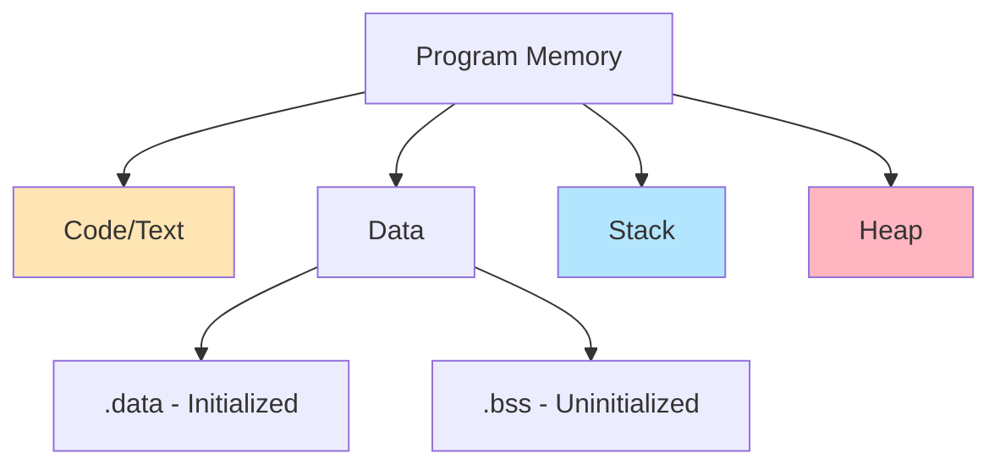

# Memory Model and Allocation

Understanding how C++ programs use memory is fundamental to writing efficient, safe code. Memory is divided into distinct regions with different characteristics and management strategies.

:::info Foundation
The memory model defines how programs interact with memory - regions, lifetimes, and allocation strategies. Master this to understand pointers, object lifetime, and performance.
:::

## Memory Regions

Every C++ program's memory is organized into distinct regions, each serving a specific purpose.


### Complete Address Space Layout


```
High Address
┌─────────────────┐
│ Stack           │ ↓ Grows downward
│ (automatic)     │   ~1-8 MB
│                 │
├─────────────────┤
│ (unmapped)      │
├─────────────────┤
│ Heap            │ ↑ Grows upward
│ (dynamic)       │   Large (GBs)
│                 │
├─────────────────┤
│ .bss            │ Uninitialized globals
│ (zero-init)     │
├─────────────────┤
│ .data           │ Initialized globals/static
├─────────────────┤
│ .rodata         │ Read-only data (string literals)
├─────────────────┤
│ .text           │ Executable instructions
└─────────────────┘
Low Address
```

### Code/Text Segment

Contains executable machine instructions. Read-only, shared between processes.
```cpp showLineNumbers
void function() {  // Code stored in .text segment
    int x = 42;    // Instructions here
}

// Properties:
// - Read-only (attempting to modify causes crash)
// - Shared (multiple instances share same code)
// - Fixed size (determined at compile time)
```

### Data Segment

**Initialized data (.data):**
```cpp showLineNumbers
int global = 42;              // .data segment
static int fileStatic = 100;  // .data segment
const char* str = "hello";    // Pointer in .data, string in .rodata

// Properties:
// - Initialized at program start
// - Writable (unless const)
// - Program lifetime
```

**Uninitialized data (.bss):**
```cpp showLineNumbers
int globalUninit;             // .bss segment
static int fileStaticUninit;  // .bss segment

// Properties:
// - Zero-initialized at program start
// - Doesn't take space in executable
// - Allocated at runtime
```

### Stack Memory

Automatic storage for local variables. Fast, limited, LIFO (Last In, First Out).
```cpp showLineNumbers
void function() {
    int local = 10;        // Stack allocation
    char buffer[100];      // Stack array
    Widget w;              // Stack object (constructor called)
}  // All destroyed automatically when function returns
```

**Stack characteristics:**
- **Speed:** Extremely fast (~1 ns allocation)
- **Size:** Limited (typically 1-8 MB)
- **Lifetime:** Scope-based (automatic cleanup)
- **Management:** Automatic (RAII)
- **Allocation:** O(1) pointer bump
- **Deallocation:** O(1) pointer bump
- **Fragmentation:** None
- **Thread-safety:** Each thread has its own stack

**How stack works:**
```
Stack frame for function():
High Address
├─────────────┐
│   local=10  │ ← Stack pointer (SP)
├─────────────┤
│  buffer[0]  │
│  buffer[1]  │
│     ...     │
│ buffer[99]  │
├─────────────┤
│   Widget w  │
├─────────────┤
│   (free)    │
Low Address

// When function returns, SP moves up, deallocating everything
```

### Heap Memory


Dynamic memory for runtime allocations. Flexible, large, manually managed.
```cpp showLineNumbers
void function() {
    int* ptr = new int(42);        // Heap allocation
    char* buffer = new char[1024]; // Heap array
    Widget* w = new Widget();      // Heap object
    
    // Must manually clean up
    delete ptr;
    delete[] buffer;
    delete w;
}
```

**Heap characteristics:**
- **Speed:** Slower (~50-100 ns allocation)
- **Size:** Large (gigabytes available)
- **Lifetime:** Explicit (new/delete)
- **Management:** Manual
- **Allocation:** O(1) to O(log n) depending on allocator
- **Deallocation:** Complex (coalescing, free lists)
- **Fragmentation:** Possible
- **Thread-safety:** Requires synchronization

**How heap works:**
```
Memory allocator maintains free lists:

Free blocks:
[16 bytes] → [32 bytes] → [1024 bytes] → ...

Allocation:
1. Find suitable block (best-fit, first-fit, etc.)
2. Split if too large
3. Return pointer

Deallocation:
1. Mark block as free
2. Coalesce with adjacent free blocks
```

## Stack vs Heap Comparison

| Aspect             | Stack                | Heap                      |
|--------------------|----------------------|---------------------------|
| **Speed**          | Very fast (~1 ns)    | Slower (~50-100 ns)       |
| **Size**           | Limited (1-8 MB)     | Large (GBs)               |
| **Lifetime**       | Automatic (scope)    | Manual (new/delete)       |
| **Allocation**     | O(1), trivial        | O(1) to O(log n)          |
| **Deallocation**   | O(1), automatic      | Manual, can leak          |
| **Fragmentation**  | None                 | Possible                  |
| **Cache locality** | Excellent            | Variable                  |
| **Thread-safe**    | Per-thread           | Requires sync             |
| **Overflow**       | Stack overflow crash | Returns nullptr or throws |

## When to Use Each

### Use Stack When:
```cpp showLineNumbers
// ✅ Small objects
int x = 42;
std::array<int, 100> arr;

// ✅ Scope-limited lifetime
{
    Widget w;
}  // Destroyed automatically

// ✅ Performance-critical code
void hotPath() {
    int temp[16];  // Stack is faster
    process(temp);
}

// ✅ RAII objects
std::lock_guard<std::mutex> lock(mtx);  // Automatic unlock
```

### Use Heap When:
```cpp showLineNumbers
// ✅ Large objects (exceed stack size)
int* huge = new int[1000000];  // 4 MB

// ✅ Runtime-determined size
int* arr = new int[userInput];

// ✅ Lifetime beyond scope
Widget* create() {
    return new Widget();  // Outlives function
}

// ✅ Polymorphism
Base* ptr = new Derived();  // Dynamic type

// ✅ Shared ownership
std::shared_ptr<Resource> shared = std::make_shared<Resource>();
```

## Performance Impact
```cpp showLineNumbers
// Benchmark: 1 million allocations

// Stack: ~1ms total (~1 ns each)
void stackBenchmark() {
    for (int i = 0; i < 1000000; ++i) {
        int arr[10];  // Nearly free
    }
}

// Heap: ~50-100ms total (~50-100 ns each)
void heapBenchmark() {
    for (int i = 0; i < 1000000; ++i) {
        int* arr = new int[10];
        delete[] arr;
    }
}

// Stack is 50-100x faster!
```

## Common Issues

### Stack Overflow
```cpp showLineNumbers
// ❌ Stack overflow causes
void recursiveBomb() {
    recursiveBomb();  // Infinite recursion
}

void largeLocals() {
    int huge[1000000];  // 4 MB, exceeds typical stack
}

void deepNesting() {
    int arr[10000];     // 40 KB
    anotherFunction();  // Each call adds to stack
}
```

**Solutions:**
```bash
# Check stack size
ulimit -s  # Linux

# Increase stack size (temporary)
ulimit -s unlimited

# Compile with stack protection
g++ -fstack-protector-all program.cpp
```

### Heap Fragmentation
```cpp showLineNumbers
// Fragmentation example
char* a = new char[100];  // [100]
char* b = new char[100];  // [100][100]
delete a;                 // [free:100][100]

// Can't fit 150-byte allocation in 100-byte hole
char* c = new char[150];  // Allocated elsewhere
// Heap: [free:100][used:100][used:150 elsewhere]
```

### Memory Leaks
```cpp showLineNumbers
// ❌ Leak
void leak() {
    int* ptr = new int(42);
    // Never deleted!
}

// ✅ RAII solution
void noLeak() {
    std::unique_ptr<int> ptr = std::make_unique<int>(42);
    // Automatically deleted
}

// ✅ Smart pointer for arrays
void arraySafe() {
    std::vector<int> vec(1000);  // Manages heap internally
    // Automatic cleanup
}
```

## Object Representation

Every object has four key properties:
```cpp showLineNumbers
int x = 42;

// 1. Type: int
// 2. Size: sizeof(x) = 4 bytes (typical)
// 3. Address: &x = 0x7fff1234 (example)
// 4. Value: x = 42
// 5. Lifetime: Until scope ends (stack) or delete (heap)
```

---

## Memory Alignment

Objects must be aligned to boundaries for CPU efficiency.
```cpp showLineNumbers
struct Example {
    char c;      // 1 byte, offset 0
    // 3 bytes padding
    int i;       // 4 bytes, offset 4 (aligned to 4)
    char c2;     // 1 byte, offset 8
    // 3 bytes padding
};  // Total: 12 bytes (not 6!)

sizeof(Example);   // 12 bytes
alignof(Example);  // 4 (from int)
```

**Alignment requirements:**
- `char`: 1-byte
- `short`: 2-byte
- `int`: 4-byte
- `double`: 8-byte
- Pointers: 4 or 8 bytes (platform-dependent)

## Storage Duration

### Automatic Storage (Stack)
```cpp showLineNumbers
void function() {
    int x = 42;  // Created on entry, destroyed on exit
}
```

### Static Storage
```cpp showLineNumbers
int global = 10;              // Program lifetime
static int fileScope = 20;    // Program lifetime

void function() {
    static int functionScope = 30;  // Program lifetime, initialized once
}
```

### Dynamic Storage (Heap)
```cpp showLineNumbers
int* ptr = new int(42);  // Lives until delete
delete ptr;
```

### Thread Storage (C++11)
```cpp showLineNumbers
thread_local int tlsVar = 0;  // Per-thread lifetime
```

## Best Practices

:::success DO
- **Default to stack** for local variables
- **Use smart pointers** for heap (unique_ptr, shared_ptr)
- **Prefer std::vector** over new[] for dynamic arrays
- **Use std::string** over char* for strings
- **Profile before optimizing** memory usage
:::

:::danger DON'T
- **Don't put large arrays on stack** (causes overflow)
- **Don't forget to delete** heap allocations
- **Don't use new/delete** when stack works
- **Don't assume heap is always bad** (sometimes necessary)
- **Don't mix new/delete** with malloc/free
:::

## Summary

**Memory regions:**
- **Code (.text)** - executable instructions, read-only
- **Data (.data/.bss)** - global/static variables
- **Stack** - automatic variables, fast, limited
- **Heap** - dynamic allocations, flexible, manual

**Stack advantages:**
- Extremely fast (~1 ns allocation)
- Automatic cleanup (RAII)
- Excellent cache locality
- No fragmentation
- No memory leaks possible

**Heap advantages:**
- Large size (gigabytes)
- Runtime-determined sizes
- Lifetime beyond scope
- Shared ownership

**Decision guide:**
```cpp
// Stack (default choice)
int x = 42;
Widget w;
std::array<int, 100> arr;

// Heap (when needed)
std::vector<int> dynamicArr;            // Dynamic size
std::unique_ptr<Widget> ptr;            // Outlives scope
std::shared_ptr<Resource> shared;       // Multiple owners
new Widget();                           // Polymorphism (but use smart ptr!)
```

**Golden rule:** Use stack unless you have a specific reason for heap. When using heap, prefer smart pointers and RAII wrappers over raw new/delete.
