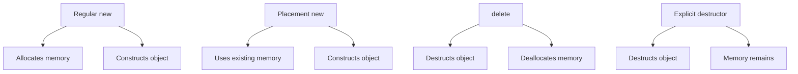

# Placement new

Constructs objects in pre-allocated memory **without allocating**. Separates construction from allocation for custom memory management.

:::info Construction Only
Placement new = constructor call on existing memory. You manage memory separately and must call destructor explicitly.
:::

## Basic Syntax
```cpp showLineNumbers
#include <new>  // Required

alignas(int) char buffer[sizeof(int)];  // Pre-allocated memory

int* p = new (buffer) int(42);          // Construct at buffer
std::cout << *p;                        // ✅ Works: 42

p->~int();                              // ✅ Explicit destructor
// Don't delete p! Memory not from new
```

**Form**: `new (address) Type(args)` constructs `Type` at `address`.

## Memory Requirements
```cpp showLineNumbers
class Widget {
    int data[10];
public:
    Widget(int x) { data[0] = x; }
    ~Widget() { std::cout << "~Widget\n"; }
};

// ✅ Correct: properly sized and aligned
alignas(Widget) char buffer[sizeof(Widget)];
Widget* w = new (buffer) Widget(42);
w->~Widget();

// ❌ Wrong: too small
char tiny[1];
Widget* bad = new (tiny) Widget(42);    // ❌ Buffer overflow!

// ❌ Wrong: misaligned
char unaligned[sizeof(Widget)];
Widget* bad = new (unaligned) Widget(42); // ❌ May crash!
```

**Requirements**:
- Size ≥ `sizeof(T)`
- Alignment = `alignof(T)` (use `alignas`)

## Explicit Destructor
```cpp showLineNumbers
class Resource {
    int* data;
public:
    Resource() : data(new int[100]) {}
    ~Resource() { delete[] data; }
};

alignas(Resource) char buffer[sizeof(Resource)];

Resource* r = new (buffer) Resource();  // Construct
r->~Resource();                         // ✅ Explicit destructor
// buffer memory still exists, object destroyed

// ❌ WRONG
delete r;  // Crash! buffer not from new
```

## Use Case: Memory Pool
```cpp showLineNumbers
class SimplePool {
    alignas(Widget) char pool[100 * sizeof(Widget)];
    bool used[100] = {};
    
public:
    Widget* allocate() {
        for (int i = 0; i < 100; ++i) {
            if (!used[i]) {
                used[i] = true;
                void* slot = pool + i * sizeof(Widget);
                return new (slot) Widget();  // Construct in pool
            }
        }
        return nullptr;
    }
    
    void deallocate(Widget* w) {
        w->~Widget();  // Destroy object
        
        size_t index = (reinterpret_cast<char*>(w) - pool) / sizeof(Widget);
        used[index] = false;  // Mark free
    }
};
```

**Benefit**: Pre-allocate once, construct many objects. Fast, no heap calls.

## Stack-Based Objects
```cpp showLineNumbers
void function() {
    // Object storage on stack
    alignas(std::string) char buffer[sizeof(std::string)];
    
    std::string* s = new (buffer) std::string("Hello");
    std::cout << *s;  // Works like normal string
    
    s->~std::string();  // Cleanup before stack unwind
}
```

**Use**: Object behavior with stack storage. Useful for embedded/performance.

## Regular new vs Placement new

```cpp showLineNumbers
// Regular new
Widget* w1 = new Widget(42);
delete w1;  // Destructs + deallocates

// Placement new
alignas(Widget) char buffer[sizeof(Widget)];
Widget* w2 = new (buffer) Widget(42);
w2->~Widget();  // Destructs only (memory still exists)
```

## Common Mistakes
```cpp showLineNumbers
// ❌ 1. Calling delete on placement new
alignas(Widget) char buffer[sizeof(Widget)];
Widget* w = new (buffer) Widget();
delete w;  // ❌ UB! buffer not from new

// ❌ 2. Buffer too small
char small[1];
Widget* w = new (small) Widget();  // ❌ Overflow

// ❌ 3. Forgetting destructor
{
    alignas(Widget) char buffer[sizeof(Widget)];
    Widget* w = new (buffer) Widget();
}  // ❌ Destructor never called - leak!

// ❌ 4. Reusing without destroying
Widget* w1 = new (buffer) Widget(1);
Widget* w2 = new (buffer) Widget(2);  // ❌ Didn't destroy w1!
```

## Array Placement
```cpp showLineNumbers
constexpr size_t N = 5;
alignas(Widget) char buffer[N * sizeof(Widget)];

// Construct array
Widget* arr = new (buffer) Widget[N];

// Destroy in reverse order
for (size_t i = N; i > 0; --i) {
    arr[i-1].~Widget();
}
```

## When to Use

| Use Case              | Why Placement new                 |
|-----------------------|-----------------------------------|
| **Memory pools**      | Pre-allocate, construct on demand |
| **Custom allocators** | Control allocation strategy       |
| **Stack objects**     | Object semantics, stack storage   |
| **Embedded systems**  | Fixed memory regions              |
| **Containers**        | `vector` growth, relocation       |

**Don't use**: Normal application code (use regular `new` or smart pointers)

## Summary

Placement new constructs objects in pre-allocated memory: `new (ptr) T(args)`. Memory must be properly sized (`sizeof(T)`) and aligned (`alignas(T)`). Objects need explicit destructor calls (`obj->~T()`) and cannot be deleted. Enables memory pools, custom allocators, and containers. Common errors: deleting placement new objects, insufficient buffers, missing destructors. Low-level facility for performance-critical or embedded code, rarely needed in application-level programming.
```cpp
// Interview template:
// "Placement new constructs objects at a specified address
// without allocating: new (buffer) T(args). Requires properly
// sized/aligned buffer and explicit destructor call. Enables
// memory pools and custom allocators. Regular new does
// allocate+construct; placement new only constructs. Used in
// container implementations and performance-critical code."
```