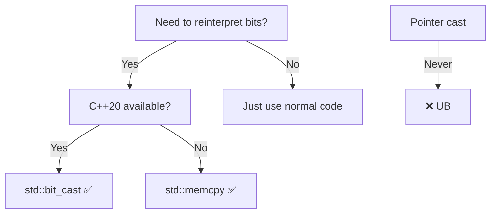

# Strict Aliasing Rule

Pointers of different types cannot point to the same memory (with exceptions). Enables compiler optimizations but causes undefined behavior when violated.

:::danger Undefined Behavior
Accessing an object through an incompatible pointer type = UB, even if it "works" in debug. Compiler assumes no aliasing and optimizes accordingly.
:::

## The Rule

Access object storage only through compatible pointer types. Incompatible access = undefined behavior.
```cpp showLineNumbers
int x = 42;
float* fp = reinterpret_cast<float*>(&x);

*fp = 3.14f;  // ❌ UB: accessing int through float*
// Compiler assumes int* and float* never alias
// May optimize based on this assumption
```

## Why It Exists

Enables aggressive optimizations. If compiler knows pointers can't alias, it can reorder operations and cache values.
```cpp showLineNumbers
void optimize(int* a, float* b) {
    *a = 1;
    *b = 2.0f;
    *a = 3;  // Compiler can eliminate first *a = 1
             // because b "cannot" point to same memory as a
}

// Optimization: Only one write to *a (faster)
// If aliasing occurred: Wrong result (UB)
```

**Performance**: Strict aliasing enables 10-30% speedups in optimized code.

## Allowed Aliasing

Specific exceptions for practical programming:
```cpp showLineNumbers
struct Widget { int x; };
Widget w;

// ✅ Same type
Widget* wp = &w;

// ✅ char*/unsigned char* can alias anything
char* cp = (char*)&w;  // Byte access

// ✅ void* can alias anything
void* vp = &w;  // Generic pointer

// ✅ Signed/unsigned variants
int x;
unsigned* up = (unsigned*)&x;

// ✅ Base and derived (inheritance)
struct Derived : Base {};
Derived d;
Base* bp = &d;
```

**Why exceptions**: Enable generic memory manipulation, byte access, and inheritance.

## Violation Consequences

Behavior depends on optimization level - hard to debug!
```cpp showLineNumbers
void demonstrate() {
    int x = 42;
    float* fp = reinterpret_cast<float*>(&x);
    
    x = 100;
    float f = *fp;  // Might see 42, 100, or garbage!
    
    // -O0: Works (no optimization)
    // -O2: Broken (compiler caches x, fp sees stale value)
}
```

## Safe Type Punning

Three portable methods:

### 1. memcpy (C++11, Best)
```cpp showLineNumbers
int x = 42;
float f;

std::memcpy(&f, &x, sizeof(float));  // ✅ Safe reinterpretation
// Compiler optimizes to simple copy - no actual function call
```

**Why safe**: Operates on storage (bytes), not objects.

### 2. std::bit_cast (C++20, Type-Safe)
```cpp showLineNumbers
#include <bit>

int x = 42;
float f = std::bit_cast<float>(x);  // ✅ Type-safe, constexpr

// Compile-time checks:
static_assert(sizeof(int) == sizeof(float));  // Same size
// Both must be trivially copyable
```

**Best**: Type-safe, constexpr-capable, fails at compile-time if invalid.

### 3. Union (C++11, Extension)
```cpp showLineNumbers
union IntFloat {
    int i;
    float f;
};

IntFloat u;
u.i = 42;
float f = u.f;  // ✅ Allowed (implementation-defined)
// Some compilers warn - memcpy more portable
```

**Note**: Technically implementation-defined, not fully portable.

## Common Violations
```cpp showLineNumbers
// ❌ Classic violation
int x = 42;
float* fp = (float*)&x;
*fp = 3.14f;  // UB

// ❌ Array trick (still UB)
int arr[1] = {42};
float* fp = (float*)arr;
float f = *fp;  // UB

// ❌ Reinterpret cast
int x = 42;
float f = *reinterpret_cast<float*>(&x);  // UB
```

## Real-World Example
```cpp showLineNumbers
// ❌ Wrong: inspecting struct bytes
struct Data { int x; float y; };
Data d;
int* ip = (int*)&d.y;  // ❌ UB: accessing float through int*

// ✅ Right: use char* for byte access
char* bytes = (char*)&d;
for (size_t i = 0; i < sizeof(d); ++i) {
    process_byte(bytes[i]);  // ✅ char* exception
}

// ✅ Right: use memcpy
float y_copy;
std::memcpy(&y_copy, &d.y, sizeof(float));
```

## Comparison Table

| Method | Standard | Portable | Performance | Use |
|--------|----------|----------|-------------|-----|
| **Pointer cast** | ❌ UB | ❌ No | ⚠️ Breaks | Never |
| **memcpy** | ✅ C++11 | ✅ Yes | ✅ Fast | Default |
| **bit_cast** | ✅ C++20 | ✅ Yes | ✅ Fast | Modern |
| **Union** | ⚠️ Ext | ⚠️ Mostly | ✅ Fast | Legacy |

## Compiler Flags
```bash
# Warnings
g++ -O2 -Wstrict-aliasing=2 code.cpp

# Disable optimization (debug only)
g++ -O2 -fno-strict-aliasing code.cpp

# Sanitizers (runtime detection)
g++ -O2 -fsanitize=undefined code.cpp
```

## Decision Tree


## Summary

Strict aliasing rule: pointers of different types cannot point to same memory. Enables compiler optimizations (10-30% faster) by assuming no aliasing between unrelated types. Violations cause undefined behavior - code works in debug, breaks in release. **Allowed exceptions**: same type, `char*` (byte access), `void*` (generic), signed/unsigned variants, inheritance. **Safe type punning**: `std::memcpy` (C++11, always works), `std::bit_cast` (C++20, best), unions (implementation-defined). **Never** use pointer casts for type punning. Rule exists for performance; respect it or use `-fno-strict-aliasing` (slow).
```cpp
// Interview answer:
// "Strict aliasing: accessing an object through incompatible
// pointer type is UB. Enables optimizations - compiler assumes
// int* and float* never alias. Violations work in debug but
// break in release. Safe type-punning: std::memcpy (always),
// std::bit_cast (C++20), unions (mostly). Never use pointer
// casts. Rule exists for performance, violations cause subtle
// optimizer-dependent bugs."
```