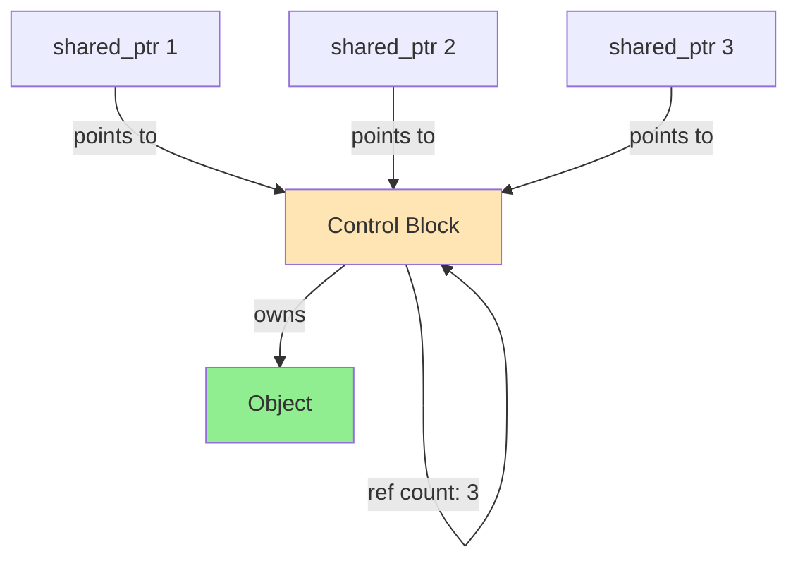

# std::shared_ptr

Smart pointer with shared ownership via reference counting. Multiple `shared_ptr`s can own the same object, deleted when last owner destroyed.

:::info Reference Counting
Each copy increments count, each destruction decrements it.
**Count reaches zero → automatic deletion**
```cpp
auto ptr1 = std::make_shared<int>(42);  // count = 1
auto ptr2 = ptr1;                        // count = 2
ptr1.reset();                            // count = 1
ptr2.reset();                            // count = 0 → delete
```
:::

## Reference Counting Model

```
Control Block contains:
┌──────────────────────┐
│ Reference Count: 3   │
│ Weak Count: 0        │
│ Deleter              │
│ Allocator            │
└──────────────────────┘
```

## Basic Usage

Creating and copying `shared_ptr`s is straightforward. All copies share ownership of the same object.

```cpp showLineNumbers 
#include <memory>

// Create shared_ptr
std::shared_ptr<int> ptr1 = std::make_shared<int>(42);

// Copy shares ownership
auto ptr2 = ptr1;
std::cout << ptr1.use_count();  // 2
std::cout << ptr2.use_count();  // 2

// Both point to same object
*ptr2 = 100;
std::cout << *ptr1;  // 100

// Last owner deletes
ptr1.reset();  // count = 1
ptr2.reset();  // count = 0 → delete
```

Copying a `shared_ptr` increments the reference count. The object persists as long as any `shared_ptr` owns it. When the last `shared_ptr` is destroyed, the reference count reaches zero and the object is automatically deleted.

### make_shared (C++11)

Always prefer `std::make_shared` over direct `new` for efficiency and exception safety.

```cpp showLineNumbers 
// ✅ Preferred: make_shared (single allocation)
auto ptr1 = std::make_shared<int>(42);
auto ptr2 = std::make_shared<std::string>("hello");

// ❌ Avoid: direct new (two allocations)
std::shared_ptr<int> ptr3(new int(42));
```

`make_shared` allocates the object and control block (containing reference count) in a single memory allocation, which is more efficient than separate allocations. It's also exception-safe, preventing leaks if an exception occurs during construction.

## Reference Counting

`shared_ptr` maintains a reference count tracking how many `shared_ptrs` own the object.

```cpp showLineNumbers 
auto ptr1 = std::make_shared<int>(42);

// Check owner count
std::cout << ptr1.use_count();  // 1

{
    auto ptr2 = ptr1;  // Copy
    auto ptr3 = ptr1;  // Copy
    std::cout << ptr1.use_count();  // 3
    
    ptr2.reset();      // Decrement
    std::cout << ptr1.use_count();  // 2
}  // ptr3 destroyed

std::cout << ptr1.use_count();  // 1
// Object still alive
```

Each `shared_ptr` can query the current reference count with `use_count()`. When the count drops to zero, the managed object is deleted. The count is shared across all copies through the control block.

### Thread Safety

Reference count updates are thread-safe (atomic), but the pointed-to object is not automatically protected.

```cpp showLineNumbers 
std::shared_ptr<int> global_ptr = std::make_shared<int>(42);

void thread1() {
    auto local = global_ptr;  // ✅ Thread-safe copy
    // Reference count increment is atomic
}

void thread2() {
    auto local = global_ptr;  // ✅ Thread-safe copy
    *local = 100;  // ❌ Data race if thread1 also modifies!
}
```

Copying `shared_ptr`s between threads is safe - the reference count operations are atomic. However, if multiple threads access the pointed-to object, you need additional synchronization (mutex, atomic operations) to protect the data.

:::warning Thread Safety
- ✅ Control block operations (ref counting) are atomic
- ❌ Object itself is NOT automatically protected
- Need mutex/atomics to protect shared data
:::

## Shared Ownership Patterns

Multiple `shared_ptr`s can own the same object, useful for shared resources and graph structures.

### Multiple Owners
```cpp showLineNumbers
class Node {
public:
    std::string data;
    std::vector<std::shared_ptr<Node>> neighbors;
};

auto node1 = std::make_shared<Node>();
auto node2 = std::make_shared<Node>();
auto node3 = std::make_shared<Node>();

// Graph structure
node1->neighbors.push_back(node2);
node1->neighbors.push_back(node3);
node2->neighbors.push_back(node1);  // Multiple owners

std::cout << node1.use_count();  // 2 (node1 + node2->neighbors)
```

This enables building complex data structures where multiple objects reference the same sub-object. The shared object persists as long as any owner exists.


### Cache Pattern
```cpp showLineNumbers
class ResourceCache {
    std::map<std::string, std::shared_ptr<Resource>> cache;
    
public:
    std::shared_ptr<Resource> get(const std::string& key) {
        auto it = cache.find(key);
        if (it != cache.end()) {
            return it->second;  // Return shared ownership
        }
        
        auto resource = std::make_shared<Resource>(key);
        cache[key] = resource;
        return resource;
    }
};
```


## Key Operations
```cpp showLineNumbers
auto ptr = std::make_shared<int>(42);

// Access
*ptr = 100;
int* raw = ptr.get();

// Check validity
if (ptr) {
    std::cout << *ptr;
}

// Owner count
long count = ptr.use_count();

// Reset (release ownership)
ptr.reset();             // Decrement count
ptr.reset(new int(200)); // Take new ownership

// Unique ownership check
if (ptr.use_count() == 1) {
    // Only owner - can modify safely
}
```

## Function Parameters

Different parameter types express different ownership and lifetime requirements.

```cpp showLineNumbers 
// Observe: doesn't extend lifetime
void observe(const Widget* w) {
    w->inspect();
}

// Use: doesn't affect ownership (preferred)
void use(const Widget& w) {
    w->process();
}

// Share: participates in ownership
void share(std::shared_ptr<Widget> w) {
    // Keeps object alive during function
}

// Observe through shared_ptr (unusual)
void observe_shared(const std::shared_ptr<Widget>& w) {
    w->inspect();
}

auto widget = std::make_shared<Widget>();

observe(widget.get());     // Just observing
use(*widget);              // Using temporarily
share(widget);             // Sharing ownership (increment count)
observe_shared(widget);    // Observing (no count change)
```

Pass by `raw pointer` or `reference` when the function doesn't need ownership. Pass by `shared_ptr` value when the function should extend the object's lifetime (store it, pass to async operations). Pass by const reference to `shared_ptr` when you need to check/copy the `shared_ptr` itself without affecting ownership.

:::info Parameter Guidelines
| Intent | Type | Overhead |
|--------|------|----------|
| Observe | `const T*` or `const T&` | None |
| Share | `shared_ptr<T>` (by value) | Atomic inc/dec |
| Check/copy ptr | `const shared_ptr<T>&` | None |
:::

## Circular References Problem

`shared_ptr` can create circular references that prevent deletion, causing memory leaks.

```cpp showLineNumbers
class Node {
public:
    std::shared_ptr<Node> next;
    std::shared_ptr<Node> prev;  // ❌ Creates cycle!
    ~Node() { std::cout << "~Node\n"; }
};

auto node1 = std::make_shared<Node>();
auto node2 = std::make_shared<Node>();

node1->next = node2;  // node1 → node2
node2->prev = node1;  // node2 → node1 (cycle!)

// When scope ends:
// - node1's count: 1 (node2->prev keeps it alive)
// - node2's count: 1 (node1->next keeps it alive)
// - Neither ever deleted → MEMORY LEAK!
```

Each node keeps the other alive through its `shared_ptr`. When the original `shared_ptr`s go out of scope, the reference counts only drop to 1 (the circular reference), never reaching zero. The objects are never deleted - a memory leak despite using smart pointers.

:::danger Circular Reference Leak
```
node1 (count=2) ──next──> node2 (count=2)
         ^                   |
         |                   |
         └────────prev───────┘

Both keep each other alive → never deleted
```
:::

### Breaking Cycles with weak_ptr

Use `weak_ptr` to break circular references (covered in the next section).

```cpp showLineNumbers
class Node {
public:
    std::shared_ptr<Node> next;  // Strong reference forward
    std::weak_ptr<Node> prev;    // ✅ Weak reference back
    ~Node() { std::cout << "~Node\n"; }
};

auto node1 = std::make_shared<Node>();
auto node2 = std::make_shared<Node>();

node1->next = node2;  // Strong: count = 2
node2->prev = node1;  // Weak: count stays 1

// Destructors called correctly!
```

## Polymorphism

`shared_ptr` works naturally with inheritance and polymorphism.

```cpp showLineNumbers 
class Base {
public:
    virtual ~Base() { std::cout << "~Base\n"; }
    virtual void identify() { std::cout << "Base\n"; }
};

class Derived : public Base {
public:
    ~Derived() override { std::cout << "~Derived\n"; }
    void identify() override { std::cout << "Derived\n"; }
};

std::shared_ptr<Base> ptr1 = std::make_shared<Derived>();
ptr1->identify();  // "Derived"

std::shared_ptr<Base> ptr2 = ptr1;  // Share ownership
std::cout << ptr1.use_count();  // 2

// Proper cleanup: ~Derived, then ~Base
```

The virtual destructor ensures correct cleanup. All `shared_ptr`s can share ownership of the derived object through base class pointers, and cleanup happens correctly when the last owner is destroyed.

## Containers of shared_ptr

Containers can hold `shared_ptr`s, enabling collections where multiple containers can reference the same objects.

```cpp showLineNumbers 
class Widget {
public:
    int id;
    Widget(int i) : id(i) {}
};

std::vector<std::shared_ptr<Widget>> all_widgets;
std::vector<std::shared_ptr<Widget>> active_widgets;

auto w1 = std::make_shared<Widget>(1);
auto w2 = std::make_shared<Widget>(2);

all_widgets.push_back(w1);
all_widgets.push_back(w2);

active_widgets.push_back(w1);  // w1 shared between both vectors

std::cout << w1.use_count();  // 3 (w1 variable + 2 vectors)
std::cout << w2.use_count();  // 2 (w2 variable + all_widgets)
```

Objects persist as long as any container holds a `shared_ptr` to them. This enables flexible ownership patterns where objects can be referenced from multiple collections.

## aliasing Constructor

`shared_ptr` supports aliasing - storing one pointer but referencing another, useful for managing members of an object.

```cpp showLineNumbers 
struct Widget {
    int value;
    Widget(int v) : value(v) {}
};

auto widget = std::make_shared<Widget>(42);

// Aliased shared_ptr to member
std::shared_ptr<int> value_ptr(widget, &widget->value);

std::cout << *value_ptr;  // 42
std::cout << widget.use_count();  // 2 (widget and value_ptr)

value_ptr.reset();
std::cout << widget.use_count();  // 1

// widget keeps the object alive as long as value_ptr exists
```

The aliased `shared_ptr` shares ownership of the `Widget` but points to its member. This ensures the `Widget` stays alive as long as any pointer to its members exists.

## Custom Deleters

`shared_ptr` supports custom deleters for non-standard cleanup, passed at construction time.

```cpp showLineNumbers 
auto deleter = [](FILE* f) {
    if (f) {
        std::cout << "Closing file\n";
        fclose(f);
    }
};

std::shared_ptr<FILE> file(fopen("data.txt", "r"), deleter);

// File closed when last shared_ptr destroyed
```

Unlike `unique_ptr`, the deleter type isn't part of `shared_ptr`'s type, making it easier to work with. We'll cover custom deleters in detail in the next section.

## Performance Considerations

`shared_ptr` has overhead compared to `unique_ptr` and raw pointers due to reference counting.

```cpp showLineNumbers 
// Size overhead
sizeof(std::shared_ptr<int>);  // 16 bytes (2 pointers)
sizeof(std::unique_ptr<int>);  // 8 bytes (1 pointer)
sizeof(int*);                  // 8 bytes

// Runtime overhead
// - Atomic reference counting
// - Control block allocation (unless make_shared)
// - Indirection through control block
```

The control block contains the reference count and weak count, requiring extra memory. Atomic increment/decrement operations for thread safety are slower than simple pointer copies. Use `shared_ptr` when you need shared ownership; prefer `unique_ptr` for exclusive ownership (cheaper).

**Cost breakdown:**
- Copy: atomic increment (~50 cycles)
- Destruction: atomic decrement (~50 cycles)
- Dereference: same as raw pointer
- Creation: allocation + atomic init

:::warning When to Avoid
Use `unique_ptr` unless you need shared ownership:
- Faster (no atomic operations)
- Smaller (8 vs 16 bytes)
- Clearer ownership semantics
:::

## enable_shared_from_this
```cpp showLineNumbers
class Widget : public std::enable_shared_from_this<Widget> {
public:
    std::shared_ptr<Widget> getShared() {
        return shared_from_this();  // ✅ Safe
    }
    
    void registerCallback() {
        auto self = shared_from_this();
        callbacks.push_back([self]() {
            self->doWork();  // Keeps Widget alive
        });
    }
};

// ✅ Correct usage
auto w = std::make_shared<Widget>();
auto shared = w->getShared();

// ❌ Wrong - creates second control block
std::shared_ptr<Widget> bad(this);  // DISASTER!
```

:::danger Never Create from this
```cpp
class Bad {
    std::shared_ptr<Bad> getPtr() {
        return std::shared_ptr<Bad>(this);  // ❌ Second control block!
    }
};

auto ptr1 = std::make_shared<Bad>();
auto ptr2 = ptr1->getPtr();  // Two control blocks → double delete!
```
:::

## Summary

**Core features:**
- Shared ownership (multiple owners)
- Reference counting (automatic)
- Thread-safe counting (atomic operations)
- Last owner deletes object

**Key operations:**
- `make_shared<T>(args)` - create (preferred)
- `ptr.use_count()` - check owner count
- `ptr.reset()` - release ownership
- Copy shares ownership (count++)

**Circular references:**
- `shared_ptr` cycles cause leaks
- Use `weak_ptr` to break cycles
- Parent→child: strong
- Child→parent: weak

**Performance:**
- 16 bytes (vs 8 for `unique_ptr`)
- Atomic operations overhead
- Use only when truly need shared ownership

**Best practices:**
- Prefer `unique_ptr` by default
- Use `make_shared` for efficiency
- Break cycles with `weak_ptr`
- `enable_shared_from_this` for `this` sharing
- Pass by const& to observe without cost
