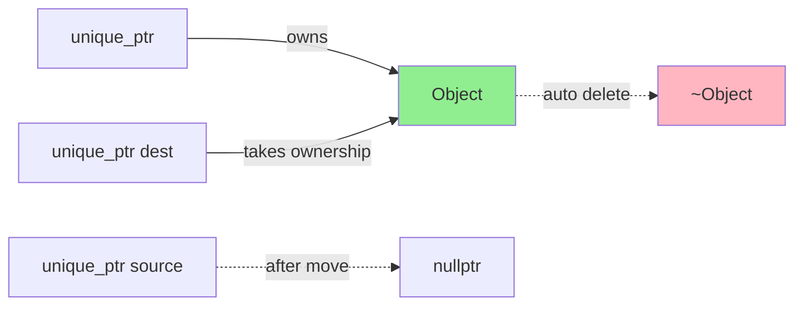

# std::unique_ptr

Smart pointer with exclusive ownership. Zero overhead, automatic cleanup, move-only semantics. The default choice for dynamic memory.

:::info Exclusive Ownership
**One owner at a time** - cannot be copied, only moved.
- Automatic deletion when destroyed (RAII)
- Zero runtime overhead vs raw pointers
- Makes ownership explicit in code
:::

## Memory Model


## Basic Usage

Creating and using a `unique_ptr` is straightforward. The managed object is automatically deleted when the `unique_ptr` is destroyed.

```cpp showLineNumbers 
#include <memory>

// Create unique_ptr
std::unique_ptr<int> ptr = std::make_unique<int>(42);

// Use like a raw pointer
std::cout << *ptr;      // 42
*ptr = 100;
std::cout << *ptr;      // 100

// Automatic cleanup
// No delete needed!
```

The key benefit is automatic cleanup: you never call `delete`. The `unique_ptr`'s destructor handles deallocation, preventing memory leaks. This is _RAII (Resource Acquisition Is Initialization)_ - the resource lifetime is tied to object lifetime.

### make_unique (C++14)

Always prefer `std::make_unique` over direct `new` for exception safety and conciseness.

```cpp showLineNumbers
// Exception-safe, concise
auto ptr1 = std::make_unique<Widget>(args);

// Can leak if exception between new and construction
std::unique_ptr<Widget> ptr2(new Widget(args));

// Safe: atomic construction
process(std::make_unique<W>(), std::make_unique<G>());

// Disaster if exception between allocations
process(std::unique_ptr<W>(new W), std::unique_ptr<G>(new G));
```

`make_unique` is exception-safe because it creates the object and wraps it in the `unique_ptr` atomically. With raw `new`, if an exception occurs between allocation and the `unique_ptr` construction, the memory leaks.

## Exclusive Ownership

`unique_ptr` cannot be copied because that would create two owners. It can only be moved, transferring ownership.

### Move Semantics
```cpp showLineNumbers
auto ptr1 = std::make_unique<int>(42);

// ❌ Cannot copy
// auto ptr2 = ptr1;  // Error: deleted copy constructor

// ✅ Can move (transfers ownership)
auto ptr2 = std::move(ptr1);
// ptr1 is now nullptr
// ptr2 owns the int

if (!ptr1) {
    std::cout << "ptr1 is empty\n";
}
std::cout << *ptr2;  // 42
```

After moving, the source `unique_ptr` becomes `null`. This ensures exclusive ownership: at most one `unique_ptr` owns the object at any time. Moving is cheap (just pointer copy) and makes ownership transfer explicit in code.

Return values are automatically moved, so no explicit `std::move` needed when returning. For function parameters, you must explicitly move to transfer ownership, documenting the ownership transfer at the call site.

### Ownership Transfer
```
Before move:
ptr1 ──owns──> [42]
ptr2           [empty]

After std::move(ptr1):
ptr1           [nullptr]
ptr2 ──owns──> [42]
```

## Key Operations

### Accessing the Pointer

`unique_ptr` provides several ways to access the managed pointer for different use cases.

```cpp showLineNumbers 
auto ptr = std::make_unique<int>(42);

// Dereference
int value = *ptr;        // 42
*ptr = 100;

// Get raw pointer (doesn't transfer ownership)
int* raw = ptr.get();    // Get raw pointer
std::cout << *raw;       // 100
// ptr still owns the object

// Bool conversion (check if not null)
if (ptr) {
    std::cout << "Valid\n";
}

// Arrow operator for member access
auto widget = std::make_unique<Widget>();
widget->doSomething();
```

The `get()` method returns the raw pointer without transferring ownership. This is useful when passing to functions that need a raw pointer but don't take ownership. Never delete the pointer returned by `get()` - the `unique_ptr` still owns it.

### Releasing Ownership

You can explicitly release ownership, getting the raw pointer and leaving the `unique_ptr` empty.

```cpp showLineNumbers 
auto ptr = std::make_unique<int>(42);

int* raw = ptr.release();  // ptr becomes nullptr
// You now own the pointer and must delete it

delete raw;  // Your responsibility now

// After release, ptr is empty
if (!ptr) {
    std::cout << "Empty\n";
}
```

Use `release()` when transferring ownership to code that expects raw pointers (legacy APIs, C libraries). You're responsible for deletion after `release`. This is rarely needed with modern C++ but necessary when interfacing with older code.

### Resetting

Reset deletes the current object and optionally takes ownership of a new one.

```cpp showLineNumbers 
auto ptr = std::make_unique<int>(42);

ptr.reset();  // Deletes int(42), ptr becomes nullptr

ptr.reset(new int(100));  // Takes ownership of new int
std::cout << *ptr;  // 100

// Can also reset to nullptr explicitly
ptr.reset(nullptr);  // Equivalent to ptr.reset()
```

`reset` is useful when you want to replace the managed object or delete it early without waiting for the `unique_ptr` to go out of scope. The old object (if any) is deleted before taking ownership of the new one.

## Function Parameters

Different parameter types express different ownership semantics for functions.

```cpp showLineNumbers 
// Observe: doesn't take ownership
void observe(const Widget* w) {
    w->inspect();
}

// Use: doesn't take ownership (preferred for observation)
void use(const Widget& w) {
    w.process();
}

// Consume: takes ownership
void consume(std::unique_ptr<Widget> w) {
    w->finalize();
}  // w deleted here

// Modify but don't take ownership
void modify(Widget* w) {
    w->update();
}

// Usage
auto widget = std::make_unique<Widget>();

observe(widget.get());        // Just looking
use(*widget);                 // Using without ownership
modify(widget.get());         // Modifying
consume(std::move(widget));   // Transferring ownership
// widget is now nullptr
```

Pass by `raw pointer` or `reference` when the function doesn't take ownership. Pass by `unique_ptr` when transferring ownership. This makes ownership semantics explicit in the function signature and at call sites.

:::info Parameter Guidelines
| Intent | Parameter Type | Call Site |
|--------|---------------|-----------|
| Observe | `const T&` or `const T*` | `func(*ptr)` or `func(ptr.get())` |
| Modify | `T&` or `T*` | `func(*ptr)` or `func(ptr.get())` |
| Take ownership | `unique_ptr<T>` | `func(std::move(ptr))` |
:::

## Factory Pattern

`unique_ptr` is ideal for factory functions that create and return objects.

```cpp showLineNumbers 
class Shape {
public:
    virtual ~Shape() = default;
    virtual void draw() = 0;
};

class Circle : public Shape {
public:
    void draw() override { std::cout << "Circle\n"; }
};

class Square : public Shape {
public:
    void draw() override { std::cout << "Square\n"; }
};

// Factory returns ownership
std::unique_ptr<Shape> createShape(const std::string& type) {
    if (type == "circle")
        return std::make_unique<Circle>();
    else if (type == "square")
        return std::make_unique<Square>();
    return nullptr;
}

// Clear ownership transfer
auto shape = createShape("circle");
if (shape) {
    shape->draw();
}
```

The factory returns ownership to the caller through `unique_ptr`. This is clearer than returning a raw pointer where ownership is ambiguous. The caller knows they own the object and it will be automatically cleaned up.

## Arrays

`unique_ptr` has a partial specialization for arrays that calls `delete[]` instead of `delete`.

```cpp showLineNumbers 
// Array specialization
auto arr = std::make_unique<int[]>(10);
arr[0] = 1;
arr[9] = 10;
// Automatic delete[] (not delete)

// But prefer std::vector
std::vector<int> vec(10);  // Better interface
vec[5] = 42;
vec.push_back(99);         // Can grow
vec.size();                // Know size
```

The array specialization changes the interface slightly: you can use subscript notation but not dereference. However, prefer `std::vector` or `std::array` over `unique_ptr` to arrays - they provide better interfaces and safety.

### Prefer Containers

For dynamic arrays, standard containers are almost always better than `unique_ptr` to arrays.

```cpp showLineNumbers 
// ❌ unique_ptr to array
auto arr1 = std::make_unique<int[]>(10);
// No size(), no bounds checking, no convenience methods

// ✅ Use vector
std::vector<int> arr2(10);
// Full container interface, bounds checking, growth
```

`unique_ptr` to arrays lacks the convenience methods containers provide. Use it only when you need a smart pointer to a C-style array, typically when interfacing with C APIs.

## Polymorphism

`unique_ptr` works seamlessly with polymorphism, properly calling derived class destructors.

```cpp showLineNumbers 
class Base {
public:
    virtual ~Base() { std::cout << "~Base\n"; }
    virtual void identify() { std::cout << "Base\n"; }
};

class Derived : public Base {
public:
    ~Derived() override { std::cout << "~Derived\n"; }
    void identify() override { std::cout << "Derived\n"; }
};

std::unique_ptr<Base> ptr = std::make_unique<Derived>();
ptr->identify();  // "Derived" (polymorphic call)

// Proper cleanup: ~Derived, then ~Base
```

:::info Virtual Destructor Required
```cpp showLineNumbers
class Base {
public:
    virtual ~Base() = default;  // ✅ Must be virtual
};

// Without virtual destructor:
// ~Base called, ~Derived NOT called → resource leak!
```
:::

## Containers of unique_ptr

Containers can hold `unique_ptrs`, enabling collections of polymorphic objects with automatic cleanup.

```cpp showLineNumbers 
std::vector<std::unique_ptr<Widget>> widgets;

widgets.push_back(std::make_unique<Widget>(1));
widgets.push_back(std::make_unique<Widget>(2));

// Access
widgets[0]->use();

// Move into container
auto widget = std::make_unique<Widget>(3);
widgets.push_back(std::move(widget));
// widget is now nullptr

// All automatically deleted when vector destroyed
```

This pattern is common for managing collections of polymorphic objects. Each vector element owns its widget. When the vector is destroyed or elements are removed, the widgets are automatically deleted.


## Custom Deleters

You can provide a custom deleter for non-standard cleanup (we'll cover this in detail in the [Custom Deleters](./custom-deleters.md) section).

```cpp showLineNumbers 
auto deleter = [](FILE* f) {
    if (f) {
        std::cout << "Closing file\n";
        fclose(f);
    }
};

std::unique_ptr<FILE, decltype(deleter)> file(
    fopen("data.txt", "r"),
    deleter
);

// File automatically closed when unique_ptr destroyed
```

Custom deleters enable using `unique_ptr` with resources that aren't heap-allocated (files, sockets, handles) or that need special cleanup beyond `delete`.

:::warning Deleter in Type
```cpp showLineNumbers
// Deleter type is part of unique_ptr type
std::unique_ptr<int, CustomDeleter> ptr1;
std::unique_ptr<int> ptr2;
// ptr1 and ptr2 are DIFFERENT types
```
:::


## Performance

`unique_ptr` has zero overhead compared to raw pointers. The abstraction is completely compile-time.

```cpp showLineNumbers 
// Same size as raw pointer
sizeof(std::unique_ptr<int>) == sizeof(int*)  // true (8 bytes)

// Zero runtime overhead
auto ptr = std::make_unique<int>(42);
int* raw = ptr.get();
// ptr and raw are identical in memory representation
// Dereferencing ptr compiles to same code as dereferencing raw
```

The compiler inlines all `unique_ptr` operations. The destructor call, null checks, and member access compile to the same machine code as manual memory management. You get safety without sacrificing performance.

## Common Patterns

### RAII Guard
```cpp showLineNumbers
class Resource {
public:
    Resource() { std::cout << "Acquired\n"; }
    ~Resource() { std::cout << "Released\n"; }
};

void process() {
    auto guard = std::make_unique<Resource>();
    
    if (error) {
        return;  // ✅ Resource automatically released
    }
    
    // Use resource...
    
    // ✅ Automatic cleanup on any exit path
}
```

### Pimpl Idiom
```cpp showLineNumbers
// widget.h
class Widget {
    class Impl;
    std::unique_ptr<Impl> pImpl;
public:
    Widget();
    ~Widget();  // Must define in .cpp for unique_ptr<Impl>
    // ...
};

// widget.cpp
class Widget::Impl {
    // Implementation details hidden
};

Widget::Widget() : pImpl(std::make_unique<Impl>()) {}
Widget::~Widget() = default;  // unique_ptr knows how to delete Impl
```

## Common Mistakes

:::danger Pitfalls
```cpp
// ❌ Forgetting std::move
void consume(std::unique_ptr<int> p) { }
auto ptr = std::make_unique<int>(42);
// consume(ptr);  // Error: cannot copy
consume(std::move(ptr));  // ✅ Explicit transfer

// ❌ Double ownership
int* raw = new int(42);
std::unique_ptr<int> p1(raw);
std::unique_ptr<int> p2(raw);  // ❌ Both will delete!

// ❌ Deleting what unique_ptr manages
auto ptr = std::make_unique<int>(42);
delete ptr.get();  // ❌ Double delete when ptr destroyed

// ❌ Storing get() result long-term
int* raw = ptr.get();
ptr.reset();
*raw;  // ❌ Dangling pointer
```
:::

## Summary

:::info Core features
- Exclusive ownership (one owner at a time)
- Move-only (cannot copy)
- Zero overhead (same as raw pointer)
- Automatic cleanup (RAII)
:::

:::info Key operations
- `make_unique<T>(args)` - create (preferred)
- `ptr.get()` - observe (doesn't transfer ownership)
- `ptr.release()` - transfer ownership out
- `ptr.reset(p)` - delete current, optionally take new
- `std::move(ptr)` - transfer ownership
:::

:::info Function parameters
- Observe: `const T*` or `const T&`
- Modify: `T*` or `T&`
- Take ownership: `unique_ptr<T>` (by value)
:::

:::success When to use
- Default choice for dynamic memory
- Factory functions (clear ownership transfer)
- RAII guards and resources
- Exclusive ownership scenarios
:::

:::success Performance
- Same size as raw pointer
- No runtime overhead
- Compile-time only abstraction
:::
