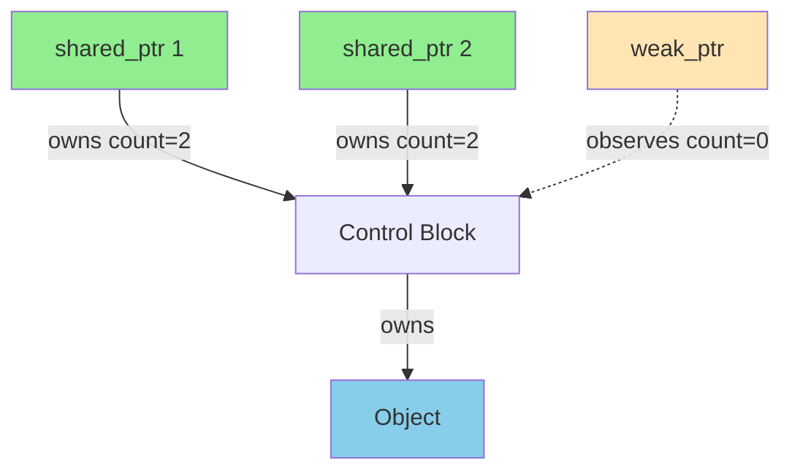

# std::weak_ptr

Non-owning observer of `shared_ptr`-managed objects. Doesn't increase reference count, enables checking if object still exists.

:::info Non-Owning Observer
**Watches without owning** - object can be deleted while weak_ptrs exist
- Doesn't increase reference count
- Breaks circular references
- Must convert to shared_ptr to access
- Conversion fails safely if object deleted
:::

## Ownership Model

```
Control Block:
┌────────────────────────┐
│ Strong refs:  2        │ ← shared_ptrs
│ Weak refs:    1        │ ← weak_ptrs
│ Object:       alive    │
└────────────────────────┘

When strong refs → 0: delete object
When weak refs → 0: delete control block
```

## Basic Concept

A `weak_ptr` doesn't increase the reference count of the object it observes. The object can be deleted even if `weak_ptr`s still exist.

```cpp showLineNumbers 
#include <memory>

std::weak_ptr<int> weak;

{
    auto shared = std::make_shared<int>(42);
    weak = shared;  // Observe (doesn't increase count)
    
    std::cout << shared.use_count();  // 1 (weak_ptr doesn't count)
    std::cout << weak.use_count();    // 1 (reports shared count)
}  // shared destroyed, int deleted

// weak now refers to deleted object
if (weak.expired()) {
    std::cout << "Object is gone\n";  // This executes
}
```

The `weak_ptr` watches the `shared_ptr` but doesn't participate in ownership. When all `shared_ptrs` are destroyed, the object is deleted even if `weak_ptrs` remain. The weak_ptr then becomes "expired."

## Creating weak_ptr

You create `weak_ptr`s from `shared_ptr`s, never from raw pointers or `unique_ptr`s.

```cpp showLineNumbers 
auto shared = std::make_shared<int>(42);

// Create weak_ptr from shared_ptr
std::weak_ptr<int> weak1 = shared;
std::weak_ptr<int> weak2(shared);
auto weak3 = std::weak_ptr<int>(shared);

// Copy weak_ptr
std::weak_ptr<int> weak4 = weak1;

std::cout << shared.use_count();  // 1 (weak_ptrs don't increase count)
```

All these weak_ptrs observe the same object but don't own it. The shared_ptr's reference count remains 1 because weak ownership doesn't count toward keeping the object alive.

## Checking Validity

Before accessing an object through weak_ptr, you must check if it still exists.

```cpp showLineNumbers 
std::weak_ptr<int> weak;

{
    auto shared = std::make_shared<int>(42);
    weak = shared;
    
    // Check if object still exists
    if (!weak.expired()) {
        std::cout << "Object exists\n";
    }
}

// Object deleted
if (weak.expired()) {
    std::cout << "Object is gone\n";
}

// Alternatively, check use_count
if (weak.use_count() == 0) {
    std::cout << "No owners left\n";
}
```

The `expired()` method checks if the object has been deleted (equivalent to `use_count() == 0`). You must check before attempting to access the object because the `shared_ptr`s might have been destroyed.

## Locking: Converting to shared_ptr

To access the object, convert the `weak_ptr` to `shared_ptr` using `lock()`. This fails safely if the object has been deleted.

```cpp showLineNumbers 
std::weak_ptr<int> weak;

{
    auto shared = std::make_shared<int>(42);
    weak = shared;
    
    // Convert to shared_ptr (atomic check + lock)
    if (auto locked = weak.lock()) {
        std::cout << *locked;  // 42
        // locked keeps object alive in this scope
    } else {
        std::cout << "Object gone\n";
    }
}

// Try to lock after object deleted
if (auto locked = weak.lock()) {
    // Won't execute - lock() returns empty shared_ptr
} else {
    std::cout << "Lock failed\n";  // This executes
}
```

`lock()` returns a `shared_ptr` that either owns the object (if it still exists) or is empty (if object was deleted). This is the safe way to access the object - it's atomic, preventing the object from being deleted between checking and accessing.

### Why lock() Instead of Direct Access

Directly checking and then accessing would have a race condition in multithreaded code.

```cpp showLineNumbers 
// ❌ Race condition (don't do this)
if (!weak.expired()) {
    // Another thread might destroy last shared_ptr here!
    auto shared = weak.lock();  // Might return empty
}

// ✅ Safe: atomic check-and-lock
if (auto shared = weak.lock()) {
    // Guaranteed to have valid shared_ptr here
    *shared = 100;
}
```

`lock()` atomically checks if the object exists and creates a `shared_ptr` if it does. This prevents the object from being deleted after checking but before accessing.

## Breaking Circular References

### The Problem
```cpp showLineNumbers
class Node {
public:
    std::shared_ptr<Node> next;
    std::shared_ptr<Node> prev;  // ❌ Circular reference!
    ~Node() { std::cout << "~Node\n"; }
};

auto n1 = std::make_shared<Node>();
auto n2 = std::make_shared<Node>();

n1->next = n2;  // n1 owns n2
n2->prev = n1;  // n2 owns n1 (cycle!)

// Memory leak - neither ever deleted
```

**Cycle diagram:**
```
n1 (count=2) ──next──> n2 (count=2)
      ^                   │
      │                   │
      └────────prev───────┘
```

### The Solution

The primary use case for `weak_ptr` is breaking circular references that would prevent `shared_ptr` from deleting objects.

```cpp showLineNumbers 
class Node {
public:
    std::string data;
    std::shared_ptr<Node> next;     // Strong reference forward
    std::weak_ptr<Node> prev;       // Weak reference back (breaks cycle)
    
    Node(std::string d) : data(d) {}
    ~Node() { std::cout << "~Node(" << data << ")\n"; }
};

auto node1 = std::make_shared<Node>("first");
auto node2 = std::make_shared<Node>("second");

// Build doubly-linked list
node1->next = node2;
node2->prev = node1;  // Weak - doesn't create cycle

// All destructors called correctly when nodes go out of scope!
```

**Fixed:**
```
n1 (count=1) ──next──> n2 (count=2)
      ^                   │
      │                   │
      └·····prev··········┘
         (weak - doesn't count)
```

Without `weak_ptr`, the `prev` pointers would be `shared_ptr`s, creating reference cycles where each node keeps the previous one alive, and nothing ever gets deleted. `weak_ptr` allows traversal in both directions without ownership cycles.

## Common Patterns

### Parent-Child Relationships

Parent-child relationships typically use `shared_ptr` from parent to child and `weak_ptr` from child to parent.

```cpp showLineNumbers 
class Child;

class Parent {
public:
    std::vector<std::shared_ptr<Child>> children;  // Owns children
    ~Parent() { std::cout << "~Parent\n"; }
};

class Child {
public:
    std::weak_ptr<Parent> parent;  // Observes parent, doesn't own
    ~Child() { std::cout << "~Child\n"; }
    
    void notifyParent() {
        if (auto p = parent.lock()) {
            std::cout << "Parent exists\n";
            // Use p safely
        } else {
            std::cout << "Parent is gone\n";
        }
    }
};

{
    auto parent = std::make_shared<Parent>();
    auto child = std::make_shared<Child>();
    
    parent->children.push_back(child);
    child->parent = parent;
    
    child->notifyParent();  // "Parent exists"
}  // ~Parent, ~Child (correct order)
```

The parent owns the children (strong references), and children observe the parent (weak reference). This prevents cycles: when the parent is destroyed, it releases its children, and the children can detect that their parent is gone.

:::success Ownership Rule
```
Parent ──owns──> Child  (shared_ptr)
Child ·observes· Parent (weak_ptr)
```
- Strong references: ownership (parent → child)
- Weak references: observation (child → parent)
:::

### Observer Pattern

`weak_ptr` is ideal for implementing observers that should not keep observed objects alive.

```cpp showLineNumbers 
class Subject {
    std::vector<std::weak_ptr<Observer>> observers;
    
public:
    void attach(std::shared_ptr<Observer> obs) {
        observers.push_back(obs);  // Weak reference
    }
    
    void notify() {
        // Remove expired observers
        observers.erase(
            std::remove_if(observers.begin(), observers.end(),
                [](auto& weak) { return weak.expired(); }),
            observers.end()
        );
        
        // Notify remaining observers
        for (auto& weak : observers) {
            if (auto obs = weak.lock()) {
                obs->update();
            }
        }
    }
};
```

Observers can be destroyed without notifying the subject. The subject doesn't keep observers alive - they're held weakly. When notifying, expired observers are skipped or removed automatically.

:::success Benefits
- Observers can be destroyed without notifying subject
- Subject doesn't keep observers alive
- Automatic cleanup of dead observers
:::

### Caching

`weak_ptr` enables caches that don't prevent cached objects from being deleted.

```cpp showLineNumbers 
class ResourceCache {
    std::map<std::string, std::weak_ptr<Resource>> cache;
    
public:
    std::shared_ptr<Resource> get(const std::string& key) {
        // Check cache
        auto it = cache.find(key);
        if (it != cache.end()) {
            if (auto resource = it->second.lock()) {
                std::cout << "Cache hit\n";
                return resource;  // Return cached resource
            }
        }
        
        // Create new resource
        std::cout << "Cache miss\n";
        auto resource = std::make_shared<Resource>(key);
        cache[key] = resource;  // Store weak reference
        return resource;
    }
};
```

The cache stores `weak_ptr`s, so it doesn't prevent resources from being deleted when no longer needed. If a resource is still in use elsewhere (has active `shared_ptr`s), the cache can return it. Otherwise, the cache entry is expired and a new resource is created.

:::success Benefits
- Cache doesn't prevent deletion
- Resources deleted when no longer used
- Cache automatically cleans up
:::

## weak_ptr Operations

`weak_ptr` provides several operations for observation and conversion.

```cpp showLineNumbers 
auto shared = std::make_shared<int>(42);
std::weak_ptr<int> weak = shared;

// Check if expired
bool gone = weak.expired();  // false

// Get owner count
long count = weak.use_count();  // 1

// Lock to shared_ptr
if (auto locked = weak.lock()) {
    std::cout << *locked;
}

// Reset (stop observing)
weak.reset();
// weak is now empty

// Check if empty
if (weak.expired()) {
    std::cout << "Empty or expired\n";
}
```

## Thread Safety

Like `shared_ptr`, `weak_ptr`'s control block operations are thread-safe, but the observed object isn't automatically protected.

```cpp showLineNumbers 
std::shared_ptr<int> shared = std::make_shared<int>(42);
std::weak_ptr<int> weak = shared;

void thread1() {
    auto locked = weak.lock();  // ✅ Thread-safe lock
    if (locked) {
        *locked = 100;  // ❌ Data race if thread2 also modifies
    }
}

void thread2() {
    auto locked = weak.lock();  // ✅ Thread-safe lock
    if (locked) {
        *locked = 200;  // ❌ Data race with thread1
    }
}
```

Creating and destroying weak_ptrs, copying them, and calling `lock()` are all thread-safe. However, if multiple threads lock and access the object simultaneously, you need additional synchronization.

:::info Thread Safety
- ✅ `lock()` is thread-safe (atomic)
- ✅ Creating/destroying weak_ptr is thread-safe
- ❌ Object itself needs separate synchronization
:::

## enable_shared_from_this

When you need to create a `shared_ptr` or `weak_ptr` to `this` inside a member function, inherit from `enable_shared_from_this`.

```cpp showLineNumbers 
class Widget : public std::enable_shared_from_this<Widget> {
public:
    std::weak_ptr<Widget> getWeakPtr() {
        return weak_from_this();  // ✅ Safe
    }
    
    std::shared_ptr<Widget> getSharedPtr() {
        return shared_from_this();  // ✅ Safe
    }
    
    void registerCallback() {
        auto self = weak_from_this();
        callbacks.push_back([self]() {
            if (auto locked = self.lock()) {
                locked->doWork();
            }
        });
    }
};

auto widget = std::make_shared<Widget>();
auto weak = widget->getWeakPtr();  // ✅ Correctly shares control block
```

Never create a shared_ptr directly from `this` - it creates a second control block, causing double-delete. `enable_shared_from_this` provides the correct way to get shared ownership of `this`.

## Common Mistake: Creating from this

:::danger Pitfalls
```cpp
// ❌ Cannot dereference weak_ptr
std::weak_ptr<int> weak = ...;
// *weak;  // Error: no operator*

// ❌ Checking expired separately
if (!weak.expired()) {
    auto shared = weak.lock();  // ⚠️ Race: might expire here
}

// ✅ Use lock() directly
if (auto shared = weak.lock()) {
    // Safe
}

// ❌ Creating from this
class Bad {
    std::weak_ptr<Bad> getWeak() {
        return std::weak_ptr<Bad>(this);  // ❌ Wrong!
    }
};

// ✅ Use enable_shared_from_this
class Good : public std::enable_shared_from_this<Good> {
    std::weak_ptr<Good> getWeak() {
        return weak_from_this();  // ✅ Correct
    }
};
```
:::

## Performance

`weak_ptr` has minimal overhead - it's essentially a pointer plus a pointer to the control block.

```cpp showLineNumbers 
sizeof(std::weak_ptr<int>) == sizeof(std::shared_ptr<int>)
// Both: 16 bytes (2 pointers)

// Minimal overhead
// - No atomic ops when checking/locking
// - Only when creating/destroying weak_ptr
```

## Summary

:::info Core features:
- Non-owning observer (doesn't increase count)
- Breaks circular references
- Safe check if object exists
- Must lock() to access
:::

:::info Key operations:
- `weak = shared` - create from shared_ptr
- `weak.expired()` - check if deleted
- `weak.lock()` - convert to shared_ptr (atomic)
- `weak.use_count()` - get strong ref count
:::

:::info Use cases:
- Break cycles (linked structures, parent-child)
- Observer pattern (don't keep observers alive)
- Caching (don't prevent deletion)
- Callbacks (object might be destroyed)
:::

:::info Guidelines:
- Strong forward, weak backward
- Parent owns child (strong)
- Child observes parent (weak)
- Always use `lock()` for atomic check-and-access
:::

:::info Thread safety:
- Control operations are thread-safe
- Object access needs separate synchronization
:::
