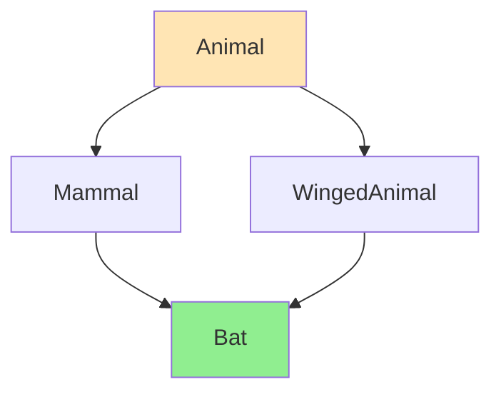

# Multiple Inheritance

Multiple inheritance allows a class to inherit from multiple base classes. This enables combining functionality but introduces complexity, especially the diamond problem.

:::info Multiple Inheritance
**Power** = Combine multiple base classes  
**Danger** = Diamond problem (ambiguity and duplication)  
**Solution** = Virtual inheritance
:::

## Basic Multiple Inheritance

A class can inherit from multiple base classes, getting members from all of them.
```cpp showLineNumbers
class Flyable {
public:
    void fly() { std::cout << "Flying\n"; }
};

class Swimmable {
public:
    void swim() { std::cout << "Swimming\n"; }
};

class Duck : public Flyable, public Swimmable {
public:
    void quack() { std::cout << "Quack\n"; }
};

Duck d;
d.fly();   // From Flyable
d.swim();  // From Swimmable
d.quack(); // From Duck
```

Duck has all members from both Flyable and Swimmable plus its own. This works cleanly when base classes are independent.

## Memory Layout

Each base class appears as a subobject within the derived class.
```cpp showLineNumbers
class Base1 {
    int b1;
public:
    void f1() {}
};

class Base2 {
    int b2;
public:
    void f2() {}
};

class Derived : public Base1, public Base2 {
    int d;
public:
    void f3() {}
};

sizeof(Derived);  // 12 bytes
```

**Memory layout:**
```
[Base1: b1 (4 bytes)]
[Base2: b2 (4 bytes)]
[Derived: d (4 bytes)]
Total: 12 bytes
```

Each base class occupies its own space in the derived object. The order matches the inheritance list.

## Ambiguity Problem

When multiple bases have members with the same name, you must disambiguate.
```cpp showLineNumbers
class Base1 {
public:
    void print() { std::cout << "Base1\n"; }
};

class Base2 {
public:
    void print() { std::cout << "Base2\n"; }
};

class Derived : public Base1, public Base2 {
};

Derived d;
// d.print();  // ❌ Error: ambiguous! Which print()?

d.Base1::print();  // ✅ Explicitly specify Base1's version
d.Base2::print();  // ✅ Explicitly specify Base2's version
```

The compiler won't guess which base class member to use. You must be explicit.

### Resolving Ambiguity

Override the ambiguous member in the derived class.
```cpp showLineNumbers
class Derived : public Base1, public Base2 {
public:
    void print() {
        std::cout << "Derived's print\n";
        Base1::print();  // Can call base versions
        Base2::print();
    }
};

Derived d;
d.print();  // ✅ Calls Derived's version
```

## The Diamond Problem

The diamond problem occurs when a class inherits from two classes that share a common base.
```cpp showLineNumbers
class Animal {
public:
    int age;
    void eat() { std::cout << "Eating\n"; }
};

class Mammal : public Animal {
public:
    void nurse() { std::cout << "Nursing\n"; }
};

class WingedAnimal : public Animal {
public:
    void fly() { std::cout << "Flying\n"; }
};

class Bat : public Mammal, public WingedAnimal {
public:
    void sonar() { std::cout << "Sonar\n"; }
};
```

**Diamond structure:**


### Diamond Problem Issues

Bat inherits **two copies** of Animal - one through Mammal, one through WingedAnimal.
```cpp showLineNumbers
Bat bat;

// ❌ Ambiguity: which Animal's age?
// bat.age = 5;  // Error: ambiguous

// ❌ Ambiguity: which Animal's eat()?
// bat.eat();    // Error: ambiguous

// Must disambiguate:
bat.Mammal::age = 5;
bat.WingedAnimal::age = 3;  // Different variable!

bat.Mammal::eat();
bat.WingedAnimal::eat();

sizeof(Bat);  // Contains TWO Animal subobjects!
```

**Memory layout with diamond:**
```
[Animal (via Mammal): age]
[Mammal data]
[Animal (via WingedAnimal): age]  ← Duplicate!
[WingedAnimal data]
[Bat data]
```

This duplication causes:
- **Ambiguity** - which Animal member?
- **Waste** - duplicate data
- **Inconsistency** - two `age` variables can have different values

## Virtual Inheritance Solution

Virtual inheritance ensures only **one copy** of the common base class.
```cpp showLineNumbers
class Animal {
public:
    int age;
    void eat() { std::cout << "Eating\n"; }
};

class Mammal : public virtual Animal {  // virtual inheritance
public:
    void nurse() { std::cout << "Nursing\n"; }
};

class WingedAnimal : public virtual Animal {  // virtual inheritance
public:
    void fly() { std::cout << "Flying\n"; }
};

class Bat : public Mammal, public WingedAnimal {
public:
    void sonar() { std::cout << "Sonar\n"; }
};

Bat bat;
bat.age = 5;   // ✅ No ambiguity - only one Animal!
bat.eat();     // ✅ No ambiguity

bat.nurse();   // From Mammal
bat.fly();     // From WingedAnimal
bat.sonar();   // From Bat
```

With virtual inheritance, Bat contains only **one** Animal subobject shared by both Mammal and WingedAnimal.

### Virtual Inheritance Memory Layout
```
[Mammal data + vptr]
[WingedAnimal data + vptr]
[Bat data]
[Shared Animal: age]  ← Only one copy!
```

Virtual bases are placed at the end of the object, and each path to the virtual base has a vptr pointing to offset information.

## Virtual Inheritance Constructor

The **most derived class** must initialize the virtual base, not intermediate classes.
```cpp showLineNumbers
class Animal {
    int age;
public:
    Animal(int a) : age(a) {}
};

class Mammal : public virtual Animal {
public:
    Mammal(int a) : Animal(a) {}  // ⚠️ Ignored when Mammal is a base!
};

class WingedAnimal : public virtual Animal {
public:
    WingedAnimal(int a) : Animal(a) {}  // ⚠️ Ignored when base!
};

class Bat : public Mammal, public WingedAnimal {
public:
    // Bat must initialize Animal directly!
    Bat(int a) 
        : Animal(a),           // ✅ Most derived class initializes
          Mammal(a),           // These don't initialize Animal
          WingedAnimal(a) {}
};

Bat bat(5);  // Bat's constructor initializes Animal
```

:::warning Virtual Base Initialization
With virtual inheritance, the **most derived class** is responsible for initializing the virtual base, even if intermediate classes have constructors that would normally initialize it.
:::

## Virtual Inheritance Cost

Virtual inheritance has performance overhead.
```cpp showLineNumbers
class Base {
    int data;
};

class NormalDerived : public Base {
    int d;
};
sizeof(NormalDerived);  // 8 bytes (4 + 4)

class VirtualDerived : public virtual Base {
    int d;
};
sizeof(VirtualDerived);  // 24 bytes (includes vptr for offset)
```

**Costs:**
- **Size:** Extra vtable pointer per virtual base path
- **Speed:** Indirect access through vtable to find virtual base
- **Complexity:** More complex construction/destruction order

## When to Use Multiple Inheritance
```cpp showLineNumbers
// ✅ Good: Combining independent interfaces
class Serializable {
public:
    virtual std::string serialize() = 0;
};

class Drawable {
public:
    virtual void draw() = 0;
};

class Shape : public Serializable, public Drawable {
    // Implements both interfaces
};

// ✅ Good: Mixins (small utility classes)
class NonCopyable {
public:
    NonCopyable() = default;
    NonCopyable(const NonCopyable&) = delete;
};

class Widget : public NonCopyable {
    // Widget is now non-copyable
};
```

**Good use cases:**
- Pure interface classes (all pure virtual)
- Mixins (small utility/policy classes)
- Combining independent capabilities

## Alternatives to Multiple Inheritance

Often composition is clearer than multiple inheritance.
```cpp showLineNumbers
// Instead of multiple inheritance:
class Bat : public Mammal, public WingedAnimal {
};

// Consider composition:
class Bat {
    MammalBehavior mammalBehavior;
    FlyingBehavior flyingBehavior;
    
public:
    void nurse() { mammalBehavior.nurse(); }
    void fly() { flyingBehavior.fly(); }
};
```

:::success Composition benefits
- No diamond problem
- Clear ownership
- Easier to understand
- More flexible (can change behavior at runtime)
:::

## Summary

:::info Multiple inheritance basics
- Class inherits from multiple base classes
- Gets all members from all bases
- Each base is a subobject in derived class
:::

:::info Diamond problem
- Occurs when two bases share a common base
- Creates duplicate base subobjects
- Causes ambiguity and waste
:::

:::info Virtual inheritance
- Ensures only one copy of common base
- Use `public virtual BaseClass`
- Most derived class initializes virtual base
- Performance overhead (size and speed)
:::

:::info Best practices
- Use for pure interfaces (abstract classes)
- Good for mixins and independent capabilities
- Consider composition as alternative
- Virtual inheritance only when needed for diamond
:::

:::info Ambiguity resolution
- Disambiguate with `BaseClass::member`
- Override in derived class
- Virtual inheritance eliminates need
:::

:::info Costs
- Normal inheritance: no overhead
- Virtual inheritance: extra vptr per path, indirect access
- Diamond without virtual: duplicate data
- Diamond with virtual: shared data, complex layout
:::
