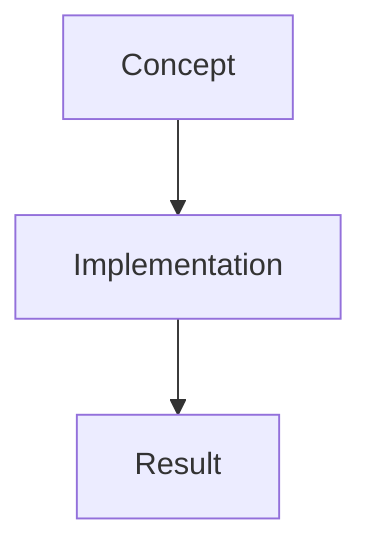

# Multiple Inheritance

Brief introduction to the topic...

:::info Key Concept
Important information about this topic
:::

## Overview

Explanation of the concept...

## Example

```cpp showLineNumbers 
// Example code
#include <iostream>

int main() {
    // TODO: Add relevant example
    return 0;
}
```

## Visualization



## Best Practices

:::success DO
- Follow these recommendations
- Use modern C++ features
:::

:::danger DON'T
- Avoid these common mistakes
- Don't ignore edge cases
:::

## Common Pitfalls

:::warning Watch Out
Common mistakes and how to avoid them
:::

## Summary

- Key takeaway 1
- Key takeaway 2
- Key takeaway 3

## Further Reading

- Related topics
- Advanced resources
