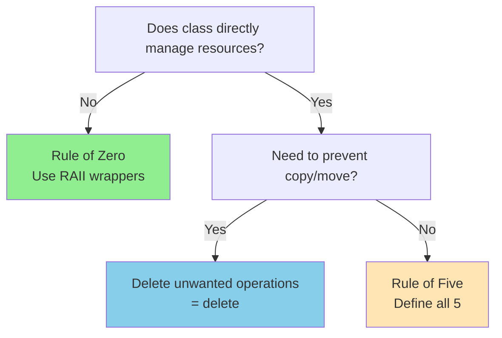

# Rule of Zero/Three/Five

These rules tell you which special member functions to define based on your class's resource management needs.

:::info The Three Rules
**Rule of Zero** - Use RAII wrappers, define nothing  
**Rule of Three** - If you need one, you need all three (C++98)  
**Rule of Five** - If you need one, you need all five (C++11+)
:::

## The Six Special Members

C++ can generate up to six special member functions:
```cpp showLineNumbers
class Widget {
public:
    Widget();                              // Default constructor
    ~Widget();                             // Destructor
    Widget(const Widget&);                 // Copy constructor
    Widget& operator=(const Widget&);      // Copy assignment
    Widget(Widget&&) noexcept;             // Move constructor
    Widget& operator=(Widget&&) noexcept;  // Move assignment
};
```

The compiler generates them when needed, but defaults only work for simple cases. When you manage resources, you need custom implementations.

## Rule of Zero (Best Case)

**If your class doesn't directly manage resources, don't define any special members.**
```cpp showLineNumbers
// ✅ Rule of Zero - no special members needed
class Person {
    std::string name;        // string manages its memory
    int age;                 // trivial type
    std::vector<int> scores; // vector manages its memory
    
    // Don't define:
    // - Destructor
    // - Copy constructor
    // - Copy assignment
    // - Move constructor
    // - Move assignment
    
    // Compiler handles everything automatically!
};

Person p1{"Alice", 30, {95, 87, 92}};
Person p2 = p1;            // ✅ Copy works
Person p3 = std::move(p1); // ✅ Move works
// p1 is now moved-from (empty)
```

**This is the ideal!** Use smart pointers, containers, and RAII wrappers. Let them handle resource management.

### Prefer RAII Wrappers
```cpp showLineNumbers
// ❌ Manual resource management (need Rule of 5)
class BadBuffer {
    char* data;
    size_t size;
    
public:
    BadBuffer(size_t s) : size(s), data(new char[size]) {}
    ~BadBuffer() { delete[] data; }
    // Need copy, move, assignment...
};

// ✅ Rule of Zero (standard types handle it)
class GoodBuffer {
    std::vector<char> data;
    
public:
    explicit GoodBuffer(size_t s) : data(s) {}
    // No special members needed!
};
```

`std::vector` automatically handles copying, moving, and cleanup. Shorter, safer, and easier to maintain.

## Rule of Three (Pre-C++11)

**If you define destructor, copy constructor, OR copy assignment, define all three.**

These operations are intimately related when managing resources.
```cpp showLineNumbers
class Buffer {
    char* data;
    size_t size;
    
public:
    // Constructor
    Buffer(size_t s) : size(s), data(new char[size]) {}
    
    // 1. Destructor (need it to free memory)
    ~Buffer() {
        delete[] data;
    }
    
    // 2. Copy constructor (need deep copy)
    Buffer(const Buffer& other) 
        : size(other.size), data(new char[size]) {
        std::copy(other.data, other.data + size, data);
    }
    
    // 3. Copy assignment (need deep copy)
    Buffer& operator=(const Buffer& other) {
        if (this != &other) {  // Self-assignment check
            delete[] data;     // Free old memory
            size = other.size;
            data = new char[size];
            std::copy(other.data, other.data + size, data);
        }
        return *this;
    }
};
```

:::warning Why All Three?
If you need a destructor to clean up, compiler-generated copy will just copy the pointer, causing **double-delete** bugs!
:::

### The Double-Delete Problem
```cpp showLineNumbers
// ❌ Only defined destructor
class Broken {
    int* data;
    
public:
    Broken(int v) : data(new int(v)) {}
    ~Broken() { delete data; }
    
    // Compiler generates copy that just copies pointer!
};

Broken b1(42);
Broken b2 = b1;  // ⚠️ Both point to same memory
// When b1 destructs: deletes memory
// When b2 destructs: tries to delete same memory 💥 Crash!
```

## Rule of Five (C++11+)

**If you define any of destructor, copy, or move operations, define or delete all five.**

Adding move operations enables efficient resource transfer.
```cpp showLineNumbers
class Buffer {
    char* data;
    size_t size;
    
public:
    // Constructor
    Buffer(size_t s) : size(s), data(new char[size]) {}
    
    // 1. Destructor
    ~Buffer() {
        delete[] data;
    }
    
    // 2. Copy constructor
    Buffer(const Buffer& other)
        : size(other.size), data(new char[size]) {
        std::copy(other.data, other.data + size, data);
    }
    
    // 3. Copy assignment
    Buffer& operator=(const Buffer& other) {
        if (this != &other) {
            delete[] data;
            size = other.size;
            data = new char[size];
            std::copy(other.data, other.data + size, data);
        }
        return *this;
    }
    
    // 4. Move constructor
    Buffer(Buffer&& other) noexcept
        : size(other.size), data(other.data) {
        other.data = nullptr;  // Steal resource, nullify source
        other.size = 0;
    }
    
    // 5. Move assignment
    Buffer& operator=(Buffer&& other) noexcept {
        if (this != &other) {
            delete[] data;         // Free our old resource
            data = other.data;     // Steal other's resource
            size = other.size;
            other.data = nullptr;  // Leave other valid
            other.size = 0;
        }
        return *this;
    }
};

Buffer b1(100);
Buffer b2 = std::move(b1);  // Move: fast pointer swap
// b1 is now empty (data = nullptr, size = 0)
```

**Move semantics** enable efficient transfer without copying. Move = "steal" the resource, leaving the source empty but valid.

### Why noexcept?
```cpp showLineNumbers
class Widget {
public:
    Widget(Widget&& other) noexcept {  // Mark noexcept!
        // Move implementation
    }
};

std::vector<Widget> vec;
vec.push_back(Widget());  // Can use move if noexcept
// Otherwise uses copy for exception safety
```

:::success Always noexcept
Move constructors and move assignments should almost always be `noexcept`. This enables optimizations in standard containers.
:::

## Explicitly Deleting Operations

Sometimes you want to prevent copying or moving.
```cpp showLineNumbers
class Uncopyable {
    std::mutex mtx;  // Mutexes can't be copied or moved
    
public:
    Uncopyable() = default;
    ~Uncopyable() = default;
    
    // Delete copy operations
    Uncopyable(const Uncopyable&) = delete;
    Uncopyable& operator=(const Uncopyable&) = delete;
    
    // Delete move operations
    Uncopyable(Uncopyable&&) = delete;
    Uncopyable& operator=(Uncopyable&&) = delete;
};

Uncopyable u1;
// Uncopyable u2 = u1;  // ❌ Error: copy deleted
// Uncopyable u3 = std::move(u1);  // ❌ Error: move deleted
```

`= delete` is clearer than making functions private and gives better error messages.

## Copy-and-Swap Idiom

Implement both copy and move assignment using one function.
```cpp showLineNumbers
class Buffer {
    char* data;
    size_t size;
    
public:
    // Constructor, destructor, copy constructor as before...
    
    // Swap member
    void swap(Buffer& other) noexcept {
        std::swap(data, other.data);
        std::swap(size, other.size);
    }
    
    // Unified assignment (note: parameter by value!)
    Buffer& operator=(Buffer other) {
        swap(other);  // Swap with parameter
        return *this;
        // other destructs, cleaning up our old data
    }
};

Buffer b1(100);
Buffer b2(200);

b1 = b2;           // Copy: other constructed via copy
b1 = std::move(b2); // Move: other constructed via move
```

**Benefits:**
- One assignment operator handles both copy and move
- Strong exception safety
- Less code, less chance for bugs

## Compiler Generation Rules

The compiler's rules for generating these functions are complex.
```cpp showLineNumbers
class Example1 {
public:
    // Declaring ANY constructor prevents default constructor
    Example1(int x) {}
    // Example1 obj;  // ❌ Error: no default constructor
};

class Example2 {
public:
    // Declaring destructor doesn't prevent copy/move
    ~Example2() {}
    // Copy and move still generated
};

class Example3 {
public:
    // Declaring copy constructor PREVENTS move generation
    Example3(const Example3&) {}
    // Move constructor and move assignment NOT generated
};

class Example4 {
public:
    // Declaring move constructor PREVENTS copy generation
    Example4(Example4&&) noexcept {}
    // Copy constructor and copy assignment DELETED
};
```

:::info Generation Rules Summary
- User-declared destructor → no move operations generated
- User-declared copy → no move operations generated
- User-declared move → copy operations deleted
- This encourages explicitly handling all or none
:::

## Decision Guide

```cpp showLineNumbers
// ✅ Rule of Zero (BEST)
class Widget {
    std::unique_ptr<Resource> resource;
    std::vector<int> data;
    // No special members needed!
};

// ✅ Rule of Five (only if you MUST manage resources)
class ManualResource {
    int* ptr;
    
public:
    ~ManualResource();
    ManualResource(const ManualResource&);
    ManualResource& operator=(const ManualResource&);
    ManualResource(ManualResource&&) noexcept;
    ManualResource& operator=(ManualResource&&) noexcept;
};

// ✅ Explicit deletion (when copies/moves don't make sense)
class NonCopyable {
public:
    NonCopyable() = default;
    NonCopyable(const NonCopyable&) = delete;
    NonCopyable& operator=(const NonCopyable&) = delete;
};
```

## Common Mistakes

:::danger Watch Out
**Self-Assignment:** Always check `if (this != &other)` in copy assignment

**Resource Leaks:** Delete old resource before acquiring new one in assignment

**Missing noexcept:** Move operations should be `noexcept`

**Shallow Copy:** Compiler-generated copy just copies pointers

**Dangling Pointers:** Leave moved-from objects in valid state (usually nullptr)

**Incomplete Rule:** If you define one, define or delete all
:::

## Summary

:::info Rule of Zero (preferred):
- Use RAII wrappers (smart pointers, containers)
- Don't define any special members
- Safest and simplest approach
:::

:::info Rule of Three (C++98):
- Destructor, copy constructor, copy assignment
- All related when managing resources
- If you need one, you need all three
:::

:::info Rule of Five (C++11+):
- Add move constructor and move assignment
- Enables efficient resource transfer
- If you manage resources, define or delete all five
:::

:::info Best practices:
- Prefer Rule of Zero whenever possible
- Mark move operations `noexcept`
- Check self-assignment: `if (this != &other)`
- Leave moved-from objects valid (empty/null)
- Use `= delete` to show intent explicitly
- Copy-and-swap provides exception safety
:::

:::info Generation rules:
- Declaring destructor prevents move generation
- Declaring copy prevents move generation
- Declaring move deletes copy operations
:::
