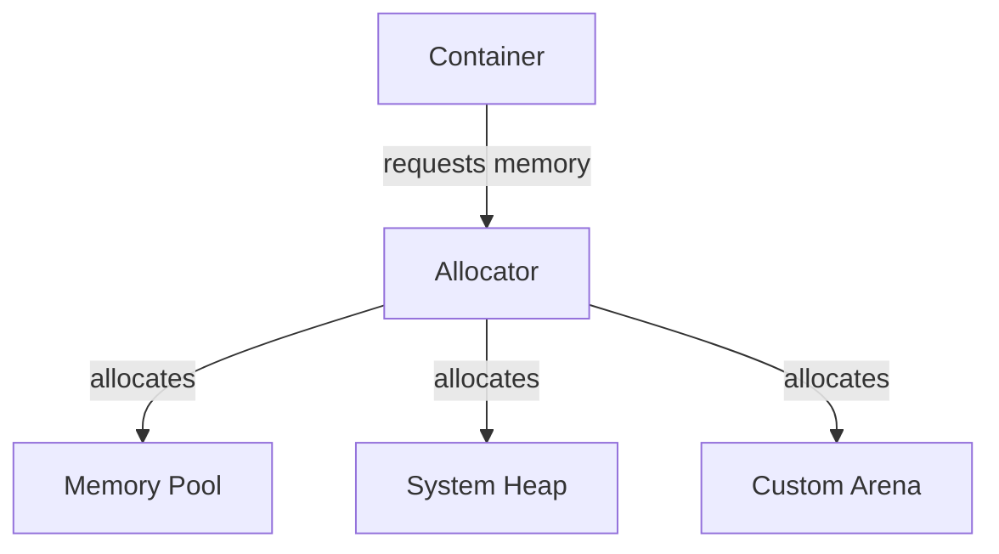

# Allocators

**Allocators** are objects that manage memory allocation for STL containers. They provide a standardized interface for customizing how containers acquire and release memory.

## Why Allocators?

By default, containers use `std::allocator<T>`, which calls `new`/`delete`. Custom allocators enable:

- **Memory pools** - Pre-allocate chunks for faster allocation
- **Arena allocation** - Allocate from fixed buffers
- **Debugging** - Track allocations and detect leaks
- **Performance** - Reduce fragmentation, improve cache locality


## Allocator Interface

Standard allocators must provide these members:
```cpp
template<typename T>
class MyAllocator {
public:
    using value_type = T;
    
    // Required: allocate N objects (not initialized)
    T* allocate(std::size_t n);
    
    // Required: deallocate memory
    void deallocate(T* p, std::size_t n);
    
    // Optional: construct object
    template<typename U, typename... Args>
    void construct(U* p, Args&&... args) {
        new(p) U(std::forward<Args>(args)...);
    }
    
    // Optional: destroy object
    template<typename U>
    void destroy(U* p) {
        p->~U();
    }
};
```

:::info
Since C++17, `construct()` and `destroy()` are optional. Containers use `std::allocator_traits` which provides defaults.
:::

## Using Allocators with Containers

All STL containers accept an allocator as a template parameter:
```cpp
#include <vector>
#include <memory>

void allocatorUsage() {
    // Default allocator
    std::vector<int> v1;
    
    // Custom allocator
    std::vector<int, MyAllocator<int>> v2;
    
    // Allocator-aware container operations
    std::vector<int> v3(100, MyAllocator<int>{});
}
```

## Standard Allocators

### std::allocator

The default allocator using `new`/`delete`:
```cpp
#include <memory>

template<typename T>
class std::allocator {
public:
    T* allocate(std::size_t n) {
        return static_cast<T*>(::operator new(n * sizeof(T)));
    }
    
    void deallocate(T* p, std::size_t n) {
        ::operator delete(p);
    }
};
```

### std::pmr::polymorphic_allocator (C++17)

Type-erased allocator that works with **memory resources**:
```cpp
#include <memory_resource>
#include <vector>

void pmrExample() {
    // Stack buffer
    std::byte buffer[1024];
    std::pmr::monotonic_buffer_resource mbr{buffer, sizeof(buffer)};
    
    // Vector using stack buffer
    std::pmr::vector<int> vec{&mbr};
    vec.push_back(1);
    vec.push_back(2);
    // Allocates from buffer, not heap!
}
```

:::success
**PMR Benefits:**
- Runtime polymorphism (no template bloat)
- Easy to swap memory strategies
- Built-in memory resources for common patterns
  :::

## Custom Allocator Example

### Simple Pool Allocator
```cpp
#include <memory>
#include <vector>

template<typename T>
class PoolAllocator {
private:
    static constexpr size_t POOL_SIZE = 1024;
    T pool[POOL_SIZE];
    size_t next_free = 0;

public:
    using value_type = T;
    
    PoolAllocator() = default;
    
    template<typename U>
    PoolAllocator(const PoolAllocator<U>&) noexcept {}
    
    T* allocate(std::size_t n) {
        if (next_free + n > POOL_SIZE) {
            throw std::bad_alloc();
        }
        T* result = &pool[next_free];
        next_free += n;
        return result;
    }
    
    void deallocate(T* p, std::size_t n) noexcept {
        // Simple pool: no deallocation
    }
    
    template<typename U>
    bool operator==(const PoolAllocator<U>&) const noexcept {
        return true;
    }
    
    template<typename U>
    bool operator!=(const PoolAllocator<U>&) const noexcept {
        return false;
    }
};

void usePoolAllocator() {
    std::vector<int, PoolAllocator<int>> vec;
    vec.push_back(42);  // Allocated from pool
}
```

### Logging Allocator

Track all allocations for debugging:
```cpp
#include <memory>
#include <iostream>

template<typename T>
class LoggingAllocator {
public:
    using value_type = T;
    
    LoggingAllocator() = default;
    
    template<typename U>
    LoggingAllocator(const LoggingAllocator<U>&) noexcept {}
    
    T* allocate(std::size_t n) {
        std::cout << "Allocating " << n << " objects of size " 
                  << sizeof(T) << '\n';
        return std::allocator<T>{}.allocate(n);
    }
    
    void deallocate(T* p, std::size_t n) noexcept {
        std::cout << "Deallocating " << n << " objects\n";
        std::allocator<T>{}.deallocate(p, n);
    }
    
    template<typename U>
    bool operator==(const LoggingAllocator<U>&) const noexcept {
        return true;
    }
};
```

## std::allocator_traits

Provides a uniform interface to allocators, filling in optional members:
```cpp
#include <memory>

template<typename Allocator>
void useTraits(Allocator& alloc) {
    using Traits = std::allocator_traits<Allocator>;
    using T = typename Traits::value_type;
    
    // Allocate
    T* ptr = Traits::allocate(alloc, 1);
    
    // Construct
    Traits::construct(alloc, ptr, /* constructor args */);
    
    // Destroy
    Traits::destroy(alloc, ptr);
    
    // Deallocate
    Traits::deallocate(alloc, ptr, 1);
}
```

:::info
Always use `std::allocator_traits` when writing allocator-aware code. It handles missing optional members automatically.
:::

## Memory Resources (C++17)

PMR provides pre-defined memory resources:
```cpp
#include <memory_resource>
#include <vector>

void memoryResources() {
    // 1. Monotonic buffer (fast, no deallocation)
    std::byte buffer[4096];
    std::pmr::monotonic_buffer_resource monotonic{buffer, sizeof(buffer)};
    
    // 2. Unsynchronized pool (single-threaded)
    std::pmr::unsynchronized_pool_resource pool;
    
    // 3. Synchronized pool (thread-safe)
    std::pmr::synchronized_pool_resource thread_safe_pool;
    
    // 4. Default resource (usually new/delete)
    std::pmr::memory_resource* default_mr = std::pmr::get_default_resource();
    
    // Use with containers
    std::pmr::vector<int> vec1{&monotonic};
    std::pmr::vector<int> vec2{&pool};
}
```

### Monotonic Buffer Resource

Fast allocator that never deallocates until destroyed:
```cpp
#include <memory_resource>
#include <vector>

void monotonicExample() {
    std::byte buffer[1024];
    std::pmr::monotonic_buffer_resource mbr{buffer, sizeof(buffer)};
    
    {
        std::pmr::vector<int> vec{&mbr};
        // Fast allocations from buffer
        for (int i = 0; i < 100; ++i) {
            vec.push_back(i);
        }
    }  // vec destroyed, but memory not returned to mbr
    
    // mbr can be reused
    std::pmr::vector<double> vec2{&mbr};
}  // All memory released when mbr destroyed
```

:::warning
Monotonic buffers **never deallocate** individual allocations. Only when the resource itself is destroyed is memory returned.
:::

### Pool Resources

Efficient for fixed-size allocations:
```cpp
#include <memory_resource>

void poolExample() {
    std::pmr::pool_options options;
    options.max_blocks_per_chunk = 100;
    options.largest_required_pool_block = 512;
    
    std::pmr::unsynchronized_pool_resource pool{options};
    
    // Allocate many small objects efficiently
    std::pmr::vector<int> vec{&pool};
    for (int i = 0; i < 1000; ++i) {
        vec.push_back(i);
    }
}
```

## Allocator-Aware Containers

Custom classes can be allocator-aware:
```cpp
#include <memory>
#include <vector>

template<typename T, typename Allocator = std::allocator<T>>
class MyContainer {
public:
    using allocator_type = Allocator;
    
private:
    Allocator alloc_;
    T* data_;
    std::size_t size_;
    
public:
    explicit MyContainer(const Allocator& alloc = Allocator{})
        : alloc_(alloc), data_(nullptr), size_(0) {}
    
    void push_back(const T& value) {
        T* new_data = std::allocator_traits<Allocator>::allocate(alloc_, size_ + 1);
        
        // Copy old elements
        for (std::size_t i = 0; i < size_; ++i) {
            std::allocator_traits<Allocator>::construct(alloc_, new_data + i, data_[i]);
        }
        
        // Add new element
        std::allocator_traits<Allocator>::construct(alloc_, new_data + size_, value);
        
        // Cleanup
        for (std::size_t i = 0; i < size_; ++i) {
            std::allocator_traits<Allocator>::destroy(alloc_, data_ + i);
        }
        std::allocator_traits<Allocator>::deallocate(alloc_, data_, size_);
        
        data_ = new_data;
        ++size_;
    }
    
    allocator_type get_allocator() const {
        return alloc_;
    }
};
```

## Performance Considerations
```cpp
#include <chrono>
#include <vector>
#include <memory_resource>

void performanceTest() {
    auto start = std::chrono::high_resolution_clock::now();
    
    // Standard allocator
    {
        std::vector<int> vec;
        for (int i = 0; i < 1'000'000; ++i) {
            vec.push_back(i);
        }
    }
    
    auto mid = std::chrono::high_resolution_clock::now();
    
    // Pool allocator
    {
        std::pmr::unsynchronized_pool_resource pool;
        std::pmr::vector<int> vec{&pool};
        for (int i = 0; i < 1'000'000; ++i) {
            vec.push_back(i);
        }
    }
    
    auto end = std::chrono::high_resolution_clock::now();
    
    // Pool is often faster for many small allocations
}
```

## Common Use Cases

### Arena Allocation

Allocate all memory upfront, free all at once:
```cpp
#include <memory_resource>

void arenaPattern() {
    std::byte buffer[1MB];
    std::pmr::monotonic_buffer_resource arena{buffer, sizeof(buffer)};
    
    // All allocations from arena
    std::pmr::vector<int> vec1{&arena};
    std::pmr::vector<double> vec2{&arena};
    std::pmr::list<char> list{&arena};
    
    // Do work...
    
    // All freed when arena destroyed
}
```

### Per-Thread Allocators
```cpp
#include <memory_resource>

thread_local std::pmr::unsynchronized_pool_resource thread_pool;

void threadFunction() {
    std::pmr::vector<int> vec{&thread_pool};
    // Fast allocation, no contention
}
```

## Best Practices

:::success
**DO:**
- Use `std::allocator_traits` for generic code
- Prefer PMR for runtime flexibility
- Use monotonic buffers for temporary allocations
- Profile before writing custom allocators
  :::

:::danger
**DON'T:**
- Mix allocators from different containers
- Forget to implement comparison operators
- Assume custom allocators are always faster
- Hold pointers to allocator-owned memory after container destruction
  :::

## Allocator Comparison

| Allocator | Thread-Safe | Deallocates | Use Case |
|-----------|-------------|-------------|----------|
| `std::allocator` | Yes | Yes | General purpose |
| `monotonic_buffer_resource` | No | No | Temporary/arena |
| `unsynchronized_pool_resource` | No | Yes | Single-threaded |
| `synchronized_pool_resource` | Yes | Yes | Multi-threaded |

## Related Topics

- **[Containers](containers.md)** - Container classes
- **[Memory Model](../05-memory-and-object-lifetime/memory-model-overview.md)** - Memory management
- **[Smart Pointers](../06-pointers-references-and-smart-pointers/unique-ptr.md)** - RAII memory management