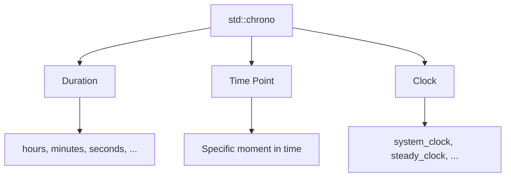

# Chrono

The **chrono** library provides type-safe time utilities for durations, time points, and clocks. It's designed to prevent common time-related bugs through strong typing.

## Core Concepts


## Durations

`std::chrono::duration` represents a time span:
```cpp showLineNumbers 
#include <chrono>
#include <iostream>

using namespace std::chrono;

void durationBasics() {
    // Pre-defined durations
    hours h{2};
    minutes m{30};
    seconds s{45};
    milliseconds ms{500};
    microseconds us{1000};
    nanoseconds ns{1000000};
    
    // Arithmetic
    auto total = h + m;              // 2h 30min
    auto diff = m - seconds{60};     // 29min
    
    // Conversion (implicit narrowing not allowed)
    seconds sec = minutes{5};         // OK: 300 seconds
    // minutes min = seconds{90};     // Error: narrowing
    minutes min = duration_cast<minutes>(seconds{90});  // OK: 1 minute
    
    // Count underlying value
    long long count = ms.count();     // 500
}
```

:::info
Conversions from coarser to finer granularity are implicit (hours → seconds), but finer to coarser require `duration_cast`.
:::

### Duration Arithmetic
```cpp showLineNumbers 
#include <chrono>

using namespace std::chrono;

void durationArithmetic() {
    seconds s1{10};
    seconds s2{5};
    
    // Addition/Subtraction
    auto sum = s1 + s2;              // 15s
    auto diff = s1 - s2;             // 5s
    
    // Multiplication/Division
    auto doubled = s1 * 2;           // 20s
    auto half = s1 / 2;              // 5s
    
    // Modulo
    auto remainder = s1 % s2;        // 0s
    
    // Comparison
    bool less = s1 < s2;             // false
    bool equal = s1 == s2;           // false
}
```

### Custom Durations
```cpp showLineNumbers 
#include <chrono>
#include <ratio>

// Custom duration: 1/100th of a second (centisecond)
using centiseconds = std::chrono::duration<long long, std::centi>;

// Days (available in C++20 as std::chrono::days)
using days = std::chrono::duration<int, std::ratio<86400>>;

void customDurations() {
    centiseconds cs{150};            // 1.5 seconds
    days d{7};                       // 1 week
    
    // Convert
    auto seconds = std::chrono::duration_cast<std::chrono::seconds>(cs);
    std::cout << seconds.count() << "s\n";  // 1s
}
```

## Time Points

`std::chrono::time_point` represents a specific moment in time:
```cpp showLineNumbers 
#include <chrono>
#include <iostream>

using namespace std::chrono;

void timePointBasics() {
    // Get current time
    auto now = system_clock::now();
    
    // Time point arithmetic
    auto future = now + hours{24};        // 24 hours from now
    auto past = now - minutes{30};        // 30 minutes ago
    
    // Duration between time points
    auto diff = future - now;
    auto hours_diff = duration_cast<hours>(diff).count();
    std::cout << hours_diff << " hours\n";  // 24
}
```

### Time Since Epoch
```cpp showLineNumbers 
#include <chrono>
#include <iostream>

using namespace std::chrono;

void epochTime() {
    auto now = system_clock::now();
    
    // Get duration since epoch
    auto since_epoch = now.time_since_epoch();
    
    // Convert to seconds
    auto sec = duration_cast<seconds>(since_epoch).count();
    std::cout << "Seconds since epoch: " << sec << '\n';
    
    // Convert to milliseconds
    auto ms = duration_cast<milliseconds>(since_epoch).count();
    std::cout << "Milliseconds since epoch: " << ms << '\n';
}
```

## Clocks

Chrono provides three standard clocks:

### system_clock

Represents the system-wide real-time clock (wall-clock time):
```cpp showLineNumbers 
#include <chrono>
#include <ctime>
#include <iostream>

void systemClockExample() {
    auto now = std::chrono::system_clock::now();
    
    // Convert to time_t for C-style formatting
    std::time_t now_c = std::chrono::system_clock::to_time_t(now);
    std::cout << "Current time: " << std::ctime(&now_c);
    
    // Back to time_point
    auto tp = std::chrono::system_clock::from_time_t(now_c);
}
```

:::warning
`system_clock` can jump backwards (e.g., daylight saving time, NTP adjustment). Don't use for measuring elapsed time!
:::

### steady_clock

Monotonic clock that never decreases:
```cpp showLineNumbers 
#include <chrono>
#include <iostream>

void steadyClockExample() {
    auto start = std::chrono::steady_clock::now();
    
    // Do some work...
    performTask();
    
    auto end = std::chrono::steady_clock::now();
    
    // Measure elapsed time
    auto elapsed = end - start;
    auto ms = std::chrono::duration_cast<std::chrono::milliseconds>(elapsed);
    std::cout << "Task took: " << ms.count() << "ms\n";
}
```

:::success
Always use `steady_clock` for **measuring durations** and **benchmarking**!
:::

### high_resolution_clock

The clock with the shortest tick period available (usually an alias to `steady_clock` or `system_clock`):
```cpp showLineNumbers 
#include <chrono>

void highResolutionExample() {
    auto start = std::chrono::high_resolution_clock::now();
    
    // Precise measurement
    expensiveOperation();
    
    auto end = std::chrono::high_resolution_clock::now();
    auto duration = std::chrono::duration_cast<std::chrono::nanoseconds>(end - start);
    std::cout << "Duration: " << duration.count() << "ns\n";
}
```

## Measuring Execution Time
```cpp showLineNumbers 
#include <chrono>
#include <iostream>
#include <thread>

template<typename Func>
auto measureTime(Func&& func) {
    auto start = std::chrono::steady_clock::now();
    
    func();
    
    auto end = std::chrono::steady_clock::now();
    return std::chrono::duration_cast<std::chrono::milliseconds>(end - start);
}

void example() {
    auto duration = measureTime([]() {
        std::this_thread::sleep_for(std::chrono::milliseconds{100});
    });
    
    std::cout << "Took: " << duration.count() << "ms\n";
}
```

## Chrono Literals (C++14)

Convenient syntax for durations:
```cpp showLineNumbers 
#include <chrono>

using namespace std::chrono_literals;

void literalsExample() {
    auto h = 2h;              // 2 hours
    auto m = 30min;           // 30 minutes
    auto s = 45s;             // 45 seconds
    auto ms = 500ms;          // 500 milliseconds
    auto us = 100us;          // 100 microseconds
    auto ns = 50ns;           // 50 nanoseconds
    
    // Mixed arithmetic
    auto total = 1h + 30min + 45s;
    
    // Sleep
    std::this_thread::sleep_for(100ms);
}
```

:::success
Always use chrono literals (e.g., `100ms`) instead of raw numbers for readability and type safety!
:::

## Calendar and Time Zones (C++20)

C++20 adds extensive calendar and time zone support:

### Dates
```cpp showLineNumbers 
#include <chrono>
#include <iostream>

using namespace std::chrono;

void dateExample() {
    // Create dates
    auto today = year_month_day{2024y, January, 15d};
    auto date2 = 2024y/January/15d;         // Alternative syntax
    auto date3 = January/15d/2024y;         // Another alternative
    
    // Date arithmetic
    auto tomorrow = sys_days{today} + days{1};
    auto next_week = sys_days{today} + weeks{1};
    
    // Components
    auto y = today.year();
    auto m = today.month();
    auto d = today.day();
    
    // Day of week
    auto weekday = year_month_weekday{today}.weekday();
    std::cout << weekday << '\n';  // e.g., "Mon"
    
    // Last day of month
    auto last = year_month_day_last{2024y, February/last};
}
```

### Time of Day
```cpp showLineNumbers 
#include <chrono>

using namespace std::chrono;

void timeOfDayExample() {
    // Create time of day
    auto time = 14h + 30min + 45s;
    
    // Hours, minutes, seconds
    auto hms = hh_mm_ss{time};
    std::cout << hms.hours().count() << ":"
              << hms.minutes().count() << ":"
              << hms.seconds().count() << '\n';  // 14:30:45
}
```

### Time Zones
```cpp showLineNumbers 
#include <chrono>
#include <iostream>

using namespace std::chrono;

void timeZoneExample() {
    // Get current time with time zone
    auto now = system_clock::now();
    auto local = zoned_time{current_zone(), now};
    auto utc = zoned_time{"UTC", now};
    
    std::cout << "Local: " << local << '\n';
    std::cout << "UTC:   " << utc << '\n';
    
    // Convert between time zones
    auto ny_time = zoned_time{"America/New_York", now};
    auto tokyo_time = zoned_time{"Asia/Tokyo", now};
    
    // Time zone info
    auto tz = current_zone();
    std::cout << "Current zone: " << tz->name() << '\n';
}
```

## Formatting and Parsing (C++20)
```cpp showLineNumbers 
#include <chrono>
#include <format>
#include <iostream>

using namespace std::chrono;

void formattingExample() {
    auto now = system_clock::now();
    
    // Format time point
    std::cout << std::format("{:%Y-%m-%d %H:%M:%S}", now) << '\n';
    std::cout << std::format("{:%A, %B %d, %Y}", now) << '\n';
    
    // Format duration
    auto dur = 125s;
    std::cout << std::format("{:%M:%S}", dur) << '\n';  // 02:05
}
```

## Practical Examples

### Example 1: Timeout Handler
```cpp showLineNumbers 
#include <chrono>

using namespace std::chrono;

class TimeoutHandler {
    steady_clock::time_point deadline_;
    
public:
    TimeoutHandler(milliseconds timeout)
        : deadline_(steady_clock::now() + timeout) {}
    
    bool hasExpired() const {
        return steady_clock::now() >= deadline_;
    }
    
    milliseconds remaining() const {
        auto now = steady_clock::now();
        if (now >= deadline_) return milliseconds{0};
        return duration_cast<milliseconds>(deadline_ - now);
    }
};

void usage() {
    TimeoutHandler timeout{5000ms};  // 5 seconds
    
    while (!timeout.hasExpired()) {
        // Do work
        if (workComplete()) break;
    }
}
```

### Example 2: Rate Limiter
```cpp showLineNumbers 
#include <chrono>
#include <deque>

using namespace std::chrono;

class RateLimiter {
    size_t max_requests_;
    milliseconds window_;
    std::deque<steady_clock::time_point> timestamps_;
    
public:
    RateLimiter(size_t max_requests, milliseconds window)
        : max_requests_(max_requests), window_(window) {}
    
    bool allow() {
        auto now = steady_clock::now();
        
        // Remove old timestamps
        while (!timestamps_.empty() && 
               now - timestamps_.front() > window_) {
            timestamps_.pop_front();
        }
        
        // Check limit
        if (timestamps_.size() >= max_requests_) {
            return false;
        }
        
        timestamps_.push_back(now);
        return true;
    }
};

void usage() {
    RateLimiter limiter{10, 1000ms};  // 10 requests per second
    
    if (limiter.allow()) {
        processRequest();
    }
}
```

### Example 3: Periodic Task
```cpp showLineNumbers 
#include <chrono>
#include <thread>

using namespace std::chrono;

void periodicTask(milliseconds interval, int iterations) {
    auto next = steady_clock::now() + interval;
    
    for (int i = 0; i < iterations; ++i) {
        // Do work
        performTask();
        
        // Sleep until next iteration
        std::this_thread::sleep_until(next);
        next += interval;  // Schedule next iteration
    }
}

void usage() {
    periodicTask(100ms, 10);  // Every 100ms, 10 times
}
```

### Example 4: Performance Profiler
```cpp showLineNumbers 
#include <chrono>
#include <iostream>
#include <string>
#include <map>

using namespace std::chrono;

class Profiler {
    struct Stats {
        size_t count = 0;
        nanoseconds total{0};
        nanoseconds min{nanoseconds::max()};
        nanoseconds max{0};
    };
    
    std::map<std::string, Stats> stats_;
    
public:
    class Scope {
        Profiler& profiler_;
        std::string name_;
        steady_clock::time_point start_;
        
    public:
        Scope(Profiler& p, std::string name)
            : profiler_(p), name_(std::move(name))
            , start_(steady_clock::now()) {}
        
        ~Scope() {
            auto duration = steady_clock::now() - start_;
            profiler_.record(name_, duration);
        }
    };
    
    void record(const std::string& name, nanoseconds duration) {
        auto& s = stats_[name];
        s.count++;
        s.total += duration;
        s.min = std::min(s.min, duration);
        s.max = std::max(s.max, duration);
    }
    
    void report() const {
        for (const auto& [name, stats] : stats_) {
            auto avg = stats.total / stats.count;
            std::cout << name << ":\n"
                      << "  Count: " << stats.count << "\n"
                      << "  Total: " << duration_cast<milliseconds>(stats.total).count() << "ms\n"
                      << "  Avg:   " << duration_cast<microseconds>(avg).count() << "us\n"
                      << "  Min:   " << duration_cast<microseconds>(stats.min).count() << "us\n"
                      << "  Max:   " << duration_cast<microseconds>(stats.max).count() << "ms\n";
        }
    }
};

void usage() {
    Profiler profiler;
    
    {
        Profiler::Scope scope{profiler, "database_query"};
        executeDatabaseQuery();
    }
    
    {
        Profiler::Scope scope{profiler, "network_request"};
        sendNetworkRequest();
    }
    
    profiler.report();
}
```

## Best Practices

:::success
**DO:**
- Use `steady_clock` for measuring durations
- Use `system_clock` for wall-clock time
- Use chrono literals (`100ms`, `5s`) for readability
- Prefer `duration_cast` for explicit conversions
- Use strong typing to avoid unit confusion
  :::

:::danger
**DON'T:**
- Use `system_clock` for performance measurement
- Mix raw numbers with durations (use literals)
- Assume `high_resolution_clock` is different from `steady_clock`
- Forget to handle potential negative durations
  :::

## Common Patterns
```cpp showLineNumbers 
#include <chrono>

using namespace std::chrono_literals;

// Sleep
std::this_thread::sleep_for(100ms);
std::this_thread::sleep_until(steady_clock::now() + 1s);

// Timeout
auto deadline = steady_clock::now() + 5s;
while (steady_clock::now() < deadline && !done()) {
    // work
}

// Benchmark
auto start = steady_clock::now();
doWork();
auto elapsed = steady_clock::now() - start;
```

## Related Topics

[//]: # (- **[Threads]&#40;../11-concurrency-and-memory-model/threads.md&#41;** - Thread sleep and timing)
- **[Filesystem](filesystem.md)** - File time operations
- **[Utilities](utilities.md)** - Time-related utilities