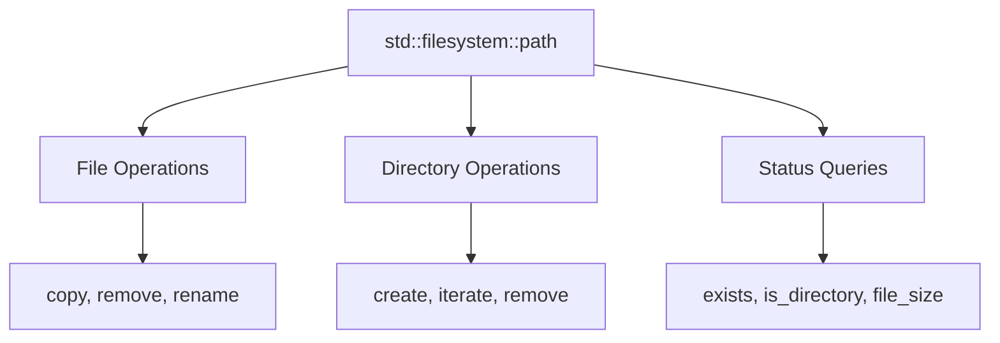

# Filesystem

The **filesystem** library (C++17) provides portable facilities for manipulating files and directories. It replaces platform-specific APIs and C-style file operations with a modern, type-safe interface.

## Basic Concepts

The library revolves around **paths** and **filesystem operations**:


## Paths

`std::filesystem::path` represents filesystem paths in a portable way:
```cpp showLineNumbers 
#include <filesystem>
#include <iostream>

namespace fs = std::filesystem;

void pathBasics() {
    // Construction
    fs::path p1 = "/usr/local/bin";
    fs::path p2 = "C:\\Windows\\System32";  // Windows
    fs::path p3 = "../relative/path.txt";
    
    // Path components
    std::cout << p1.root_name() << '\n';       // "" on Unix, "C:" on Windows
    std::cout << p1.root_directory() << '\n';  // "/"
    std::cout << p1.parent_path() << '\n';     // "/usr/local"
    std::cout << p1.filename() << '\n';        // "bin"
    std::cout << p1.stem() << '\n';            // "file" from "file.txt"
    std::cout << p1.extension() << '\n';       // ".txt"
}
```

:::info
Paths are **portable** - the library handles platform differences (\ vs /) automatically.
:::

### Path Operations
```cpp showLineNumbers 
#include <filesystem>

namespace fs = std::filesystem;

void pathOperations() {
    fs::path p = "/home/user/file.txt";
    
    // Concatenation
    fs::path p2 = p.parent_path() / "other.txt";  // "/home/user/other.txt"
    
    // Modification
    p.replace_extension(".cpp");     // "/home/user/file.cpp"
    p.replace_filename("new.txt");   // "/home/user/new.txt"
    
    // Comparison
    if (p == p2) { /* equal */ }
    if (p < p2) { /* lexicographic */ }
    
    // String conversion
    std::string str = p.string();
    std::wstring wstr = p.wstring();
}
```

## Checking File Status

Query file properties without reading contents:
```cpp showLineNumbers 
#include <filesystem>
#include <iostream>

namespace fs = std::filesystem;

void fileStatus() {
    fs::path p = "example.txt";
    
    // Existence
    if (fs::exists(p)) {
        std::cout << "File exists\n";
    }
    
    // Type checks
    if (fs::is_regular_file(p)) { /* regular file */ }
    if (fs::is_directory(p)) { /* directory */ }
    if (fs::is_symlink(p)) { /* symbolic link */ }
    
    // Size
    std::uintmax_t size = fs::file_size(p);  // in bytes
    
    // Modification time
    auto ftime = fs::last_write_time(p);
    
    // Permissions (Unix-style)
    fs::perms permissions = fs::status(p).permissions();
}
```

:::warning
`file_size()` throws if the file doesn't exist or isn't a regular file. Check with `exists()` first or use error code version.
:::

## File Operations

### Creating and Removing Files
```cpp showLineNumbers 
#include <filesystem>
#include <fstream>

namespace fs = std::filesystem;

void fileOps() {
    // Create file
    std::ofstream("new_file.txt") << "content";
    
    // Copy file
    fs::copy_file("source.txt", "dest.txt");
    
    // Copy with options
    fs::copy_file("source.txt", "backup.txt", 
                  fs::copy_options::overwrite_existing);
    
    // Move/rename
    fs::rename("old_name.txt", "new_name.txt");
    
    // Remove
    fs::remove("file.txt");
    
    // Remove if exists
    if (fs::remove("maybe_file.txt")) {
        std::cout << "File was removed\n";
    }
}
```

### Copying with Options
```cpp showLineNumbers 
#include <filesystem>

namespace fs = std::filesystem;

void copyOptions() {
    fs::copy_options opts = 
        fs::copy_options::overwrite_existing |
        fs::copy_options::recursive;
    
    // Copy directory recursively
    fs::copy("source_dir", "dest_dir", opts);
}
```

## Directory Operations

### Creating Directories
```cpp showLineNumbers 
#include <filesystem>

namespace fs = std::filesystem;

void directoryCUD() {
    // Create single directory
    fs::create_directory("new_dir");
    
    // Create directory tree
    fs::create_directories("path/to/nested/dir");
    
    // Check if created
    bool created = fs::create_directory("maybe_exists");  // false if already exists
    
    // Remove empty directory
    fs::remove("empty_dir");
    
    // Remove directory and contents
    std::uintmax_t removed = fs::remove_all("dir_with_contents");
    std::cout << "Removed " << removed << " items\n";
}
```

### Iterating Directories
```cpp showLineNumbers 
#include <filesystem>
#include <iostream>

namespace fs = std::filesystem;

void iterateDirectory() {
    // Non-recursive iteration
    for (const auto& entry : fs::directory_iterator(".")) {
        std::cout << entry.path() << '\n';
        
        if (entry.is_regular_file()) {
            std::cout << "  Size: " << entry.file_size() << " bytes\n";
        }
    }
    
    // Recursive iteration
    for (const auto& entry : fs::recursive_directory_iterator("./src")) {
        if (entry.path().extension() == ".cpp") {
            std::cout << entry.path() << '\n';
        }
    }
}
```

:::success
Use `recursive_directory_iterator` to walk entire directory trees easily!
:::

### Filtering Directory Entries
```cpp showLineNumbers 
#include <filesystem>
#include <vector>

namespace fs = std::filesystem;

std::vector<fs::path> findFiles(const fs::path& dir, const std::string& ext) {
    std::vector<fs::path> result;
    
    for (const auto& entry : fs::recursive_directory_iterator(dir)) {
        if (entry.is_regular_file() && entry.path().extension() == ext) {
            result.push_back(entry.path());
        }
    }
    
    return result;
}

void usage() {
    auto cpp_files = findFiles("./src", ".cpp");
    auto headers = findFiles("./include", ".h");
}
```

## Working Paths

### Current Directory
```cpp showLineNumbers 
#include <filesystem>
#include <iostream>

namespace fs = std::filesystem;

void currentDirectory() {
    // Get current path
    fs::path cwd = fs::current_path();
    std::cout << "Current: " << cwd << '\n';
    
    // Change current path
    fs::current_path("/tmp");
    
    // Restore
    fs::current_path(cwd);
}
```

### Absolute and Relative Paths
```cpp showLineNumbers 
#include <filesystem>

namespace fs = std::filesystem;

void pathConversion() {
    fs::path rel = "subdir/file.txt";
    
    // Convert to absolute
    fs::path abs = fs::absolute(rel);
    std::cout << abs << '\n';  // "/current/dir/subdir/file.txt"
    
    // Canonical path (resolves symlinks, .., .)
    fs::path canonical = fs::canonical(rel);  // throws if doesn't exist
    
    // Weakly canonical (doesn't require existence)
    fs::path weak = fs::weakly_canonical("nonexistent/../file.txt");
    
    // Relative path between two paths
    fs::path rel_path = fs::relative("/home/user/docs/file.txt", 
                                     "/home/user");
    // Result: "docs/file.txt"
}
```

## Temporary Files
```cpp showLineNumbers 
#include <filesystem>
#include <fstream>

namespace fs = std::filesystem;

void temporaryFile() {
    // Get temp directory
    fs::path temp_dir = fs::temp_directory_path();
    std::cout << "Temp: " << temp_dir << '\n';
    
    // Create unique temp file
    fs::path temp_file = temp_dir / "myapp_XXXXXX.txt";
    std::ofstream(temp_file) << "temporary data";
    
    // Use file...
    
    // Cleanup
    fs::remove(temp_file);
}
```

## Error Handling

Filesystem operations can use exceptions or error codes:
```cpp showLineNumbers 
#include <filesystem>
#include <iostream>

namespace fs = std::filesystem;

void errorHandling() {
    // Exception version
    try {
        fs::remove("nonexistent.txt");  // throws
    } catch (const fs::filesystem_error& e) {
        std::cerr << "Error: " << e.what() << '\n';
        std::cerr << "Path1: " << e.path1() << '\n';
        std::cerr << "Path2: " << e.path2() << '\n';
    }
    
    // Error code version (noexcept)
    std::error_code ec;
    fs::remove("nonexistent.txt", ec);
    if (ec) {
        std::cerr << "Error: " << ec.message() << '\n';
    }
}
```

:::success
Prefer **error code versions** in performance-critical code to avoid exception overhead.
:::

## Space Information

Query disk space:
```cpp showLineNumbers 
#include <filesystem>
#include <iostream>

namespace fs = std::filesystem;

void diskSpace() {
    fs::space_info info = fs::space("/");
    
    std::cout << "Capacity:  " << info.capacity << " bytes\n";
    std::cout << "Free:      " << info.free << " bytes\n";
    std::cout << "Available: " << info.available << " bytes\n";
    
    // Convert to GB
    double gb_free = static_cast<double>(info.free) / (1024 * 1024 * 1024);
    std::cout << "Free: " << gb_free << " GB\n";
}
```

## Practical Examples

### Example 1: Find All Files by Extension
```cpp showLineNumbers 
#include <filesystem>
#include <vector>
#include <string>

namespace fs = std::filesystem;

std::vector<fs::path> findByExtension(
    const fs::path& root,
    const std::string& ext)
{
    std::vector<fs::path> result;
    
    if (!fs::exists(root) || !fs::is_directory(root)) {
        return result;
    }
    
    for (const auto& entry : fs::recursive_directory_iterator(root)) {
        if (entry.is_regular_file() && entry.path().extension() == ext) {
            result.push_back(entry.path());
        }
    }
    
    return result;
}
```

### Example 2: Backup Directory
```cpp showLineNumbers 
#include <filesystem>
#include <chrono>
#include <sstream>
#include <iomanip>

namespace fs = std::filesystem;

void backupDirectory(const fs::path& source, const fs::path& backup_root) {
    // Create timestamped backup dir
    auto now = std::chrono::system_clock::now();
    auto time_t = std::chrono::system_clock::to_time_t(now);
    
    std::ostringstream oss;
    oss << "backup_" << std::put_time(std::localtime(&time_t), "%Y%m%d_%H%M%S");
    
    fs::path backup_dir = backup_root / oss.str();
    
    // Copy recursively
    fs::copy(source, backup_dir, 
             fs::copy_options::recursive | 
             fs::copy_options::overwrite_existing);
    
    std::cout << "Backed up to: " << backup_dir << '\n';
}
```

### Example 3: Clean Old Files
```cpp showLineNumbers 
#include <filesystem>
#include <chrono>

namespace fs = std::filesystem;

void cleanOldFiles(const fs::path& dir, std::chrono::hours max_age) {
    auto now = fs::file_time_type::clock::now();
    
    for (const auto& entry : fs::directory_iterator(dir)) {
        if (entry.is_regular_file()) {
            auto ftime = fs::last_write_time(entry);
            auto age = std::chrono::duration_cast<std::chrono::hours>(now - ftime);
            
            if (age > max_age) {
                std::cout << "Removing: " << entry.path() << '\n';
                fs::remove(entry);
            }
        }
    }
}

void usage() {
    cleanOldFiles("/tmp/cache", std::chrono::hours(24 * 7));  // 7 days
}
```

### Example 4: Calculate Directory Size
```cpp showLineNumbers 
#include <filesystem>

namespace fs = std::filesystem;

std::uintmax_t directorySize(const fs::path& dir) {
    std::uintmax_t size = 0;
    
    for (const auto& entry : fs::recursive_directory_iterator(dir)) {
        if (entry.is_regular_file()) {
            std::error_code ec;
            size += fs::file_size(entry, ec);
            // Ignore errors (e.g., permission denied)
        }
    }
    
    return size;
}
```

## Permissions

Work with file permissions (Unix-style):
```cpp showLineNumbers 
#include <filesystem>

namespace fs = std::filesystem;

void permissions() {
    fs::path p = "file.txt";
    
    // Set permissions
    fs::permissions(p, fs::perms::owner_all | fs::perms::group_read);
    
    // Add permissions
    fs::permissions(p, fs::perms::others_read, fs::perm_options::add);
    
    // Remove permissions
    fs::permissions(p, fs::perms::owner_write, fs::perm_options::remove);
    
    // Get permissions
    fs::file_status status = fs::status(p);
    fs::perms perms = status.permissions();
    
    if ((perms & fs::perms::owner_write) != fs::perms::none) {
        std::cout << "Owner can write\n";
    }
}
```

## Best Practices

:::success
**DO:**
- Use `fs::path` for all path manipulation
- Prefer error code versions in performance-critical code
- Check `exists()` before file operations
- Use `recursive_directory_iterator` for tree traversal
- Use `/` operator for path concatenation
  :::

:::danger
**DON'T:**
- Hardcode path separators (/ or \)
- Assume paths are UTF-8 strings
- Forget error handling (files can disappear!)
- Mix string and path operations
  :::

## Performance Tips
```cpp showLineNumbers 
#include <filesystem>

namespace fs = std::filesystem;

void performanceOptimization() {
    // Cache directory_entry for multiple queries
    for (const auto& entry : fs::directory_iterator(".")) {
        // Efficient: queries cached in entry
        if (entry.is_regular_file()) {
            auto size = entry.file_size();
            auto time = entry.last_write_time();
        }
        
        // Inefficient: separate system calls
        // if (fs::is_regular_file(entry.path())) { ... }
    }
    
    // Use error code version to avoid exceptions
    std::error_code ec;
    bool exists = fs::exists("file.txt", ec);
    if (!ec && exists) { /* ... */ }
}
```

## Related Topics

- **[IOStreams](iostreams.md)** - File I/O operations
- **[Strings](strings.md)** - Path string manipulation
- **[Chrono](chrono.md)** - File time operations