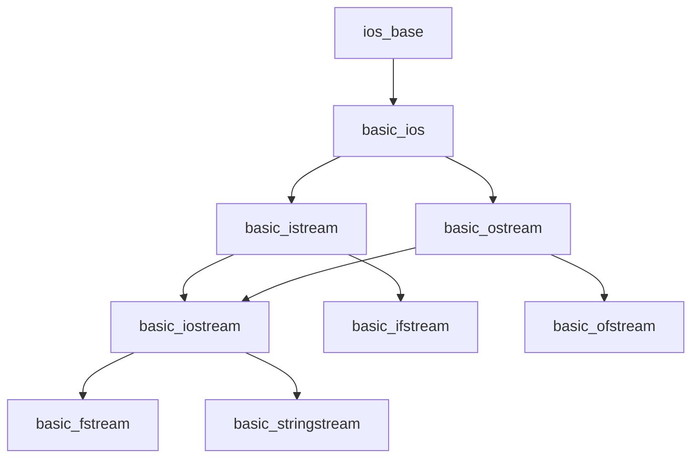

# IOStreams

The **iostream** library provides facilities for input/output operations through streams. It's a type-safe, extensible alternative to C's `printf/scanf`.

## Stream Hierarchy


## Standard Streams
```cpp
#include <iostream>

// Standard input/output streams
std::cin   // standard input (stdin)
std::cout  // standard output (stdout)
std::cerr  // standard error (unbuffered)
std::clog  // standard error (buffered)
```

:::info
`std::cerr` is **unbuffered** for immediate error output, while `std::clog` is **buffered** for performance.
:::

## Basic Input/Output
```cpp
#include <iostream>
#include <string>

int main() {
    // Output
    std::cout << "Enter your name: ";
    
    // Input
    std::string name;
    std::getline(std::cin, name);
    
    int age;
    std::cin >> age;
    
    std::cout << "Hello, " << name << "! Age: " << age << '\n';
}
```

## File Streams

### Reading from Files
```cpp
#include <fstream>
#include <string>

void readFile() {
    std::ifstream file("data.txt");
    
    if (!file.is_open()) {
        std::cerr << "Failed to open file\n";
        return;
    }
    
    std::string line;
    while (std::getline(file, line)) {
        std::cout << line << '\n';
    }
    
    // File automatically closed by destructor (RAII)
}
```

### Writing to Files
```cpp
#include <fstream>

void writeFile() {
    std::ofstream file("output.txt");
    
    file << "Hello, World!\n";
    file << "Number: " << 42 << '\n';
    
    // Explicit flush
    file.flush();
}
```

:::warning
Always check if a file opened successfully with `is_open()` or by testing the stream's bool conversion.
:::

## String Streams
```cpp
#include <sstream>
#include <string>

void stringStreamExample() {
    // Output string stream
    std::ostringstream oss;
    oss << "Value: " << 42 << ", Pi: " << 3.14;
    std::string result = oss.str();
    
    // Input string stream
    std::istringstream iss("123 45.6 hello");
    int i;
    double d;
    std::string s;
    iss >> i >> d >> s;  // i=123, d=45.6, s="hello"
}
```

## Stream Manipulators
```cpp
#include <iostream>
#include <iomanip>

void formatOutput() {
    double pi = 3.14159265359;
    
    // Precision
    std::cout << std::setprecision(3) << pi << '\n';  // 3.14
    
    // Width and alignment
    std::cout << std::setw(10) << std::left << "Left" << '\n';
    std::cout << std::setw(10) << std::right << "Right" << '\n';
    
    // Number formats
    int num = 255;
    std::cout << std::hex << num << '\n';      // ff
    std::cout << std::dec << num << '\n';      // 255
    std::cout << std::oct << num << '\n';      // 377
    
    // Boolean formatting
    std::cout << std::boolalpha << true << '\n';  // true
}
```

## Stream States
```cpp
#include <iostream>

void checkStreamState() {
    std::cin.clear();  // Clear error flags
    
    // State checking
    if (std::cin.good())   { /* All good */ }
    if (std::cin.eof())    { /* End of file */ }
    if (std::cin.fail())   { /* Logical error */ }
    if (std::cin.bad())    { /* Read/write error */ }
    
    // Clear and ignore bad input
    std::cin.clear();
    std::cin.ignore(std::numeric_limits<std::streamsize>::max(), '\n');
}
```

:::danger
Always clear error flags with `clear()` before retrying input after a failure.
:::

## Binary I/O
```cpp
#include <fstream>

struct Data {
    int id;
    double value;
};

void binaryIO() {
    // Write binary
    std::ofstream out("data.bin", std::ios::binary);
    Data d{42, 3.14};
    out.write(reinterpret_cast<const char*>(&d), sizeof(Data));
    out.close();
    
    // Read binary
    std::ifstream in("data.bin", std::ios::binary);
    Data loaded;
    in.read(reinterpret_cast<char*>(&loaded), sizeof(Data));
}
```

## Custom Stream Operators
```cpp
#include <iostream>

struct Point {
    int x, y;
};

std::ostream& operator<<(std::ostream& os, const Point& p) {
    return os << "(" << p.x << ", " << p.y << ")";
}

std::istream& operator>>(std::istream& is, Point& p) {
    char dummy;
    is >> dummy >> p.x >> dummy >> p.y >> dummy;  // (x, y)
    return is;
}

int main() {
    Point p{10, 20};
    std::cout << p << '\n';  // (10, 20)
}
```

## Best Practices

:::success
**DO:**
- Use RAII (file streams close automatically)
- Check stream state after operations
- Use `std::getline()` for line-based input
- Prefer `'\n'` over `std::endl` (avoids unnecessary flush)
- Use manipulators for formatting
  :::

:::danger
**DON'T:**
- Mix `>>` with `std::getline()` without clearing the buffer
- Forget to open files in binary mode for binary data
- Ignore return values from stream operations
  :::

## Performance Tips
```cpp
// Disable synchronization with C streams for better performance
std::ios_base::sync_with_stdio(false);
std::cin.tie(nullptr);

// Reserve buffer for string streams
std::ostringstream oss;
oss.str().reserve(1024);
```

## Related Topics

- **[Strings](strings.md)** - String manipulation
- **[Filesystem](filesystem.md)** - Modern file operations
- **[Utilities](utilities.md)** - Additional I/O utilities