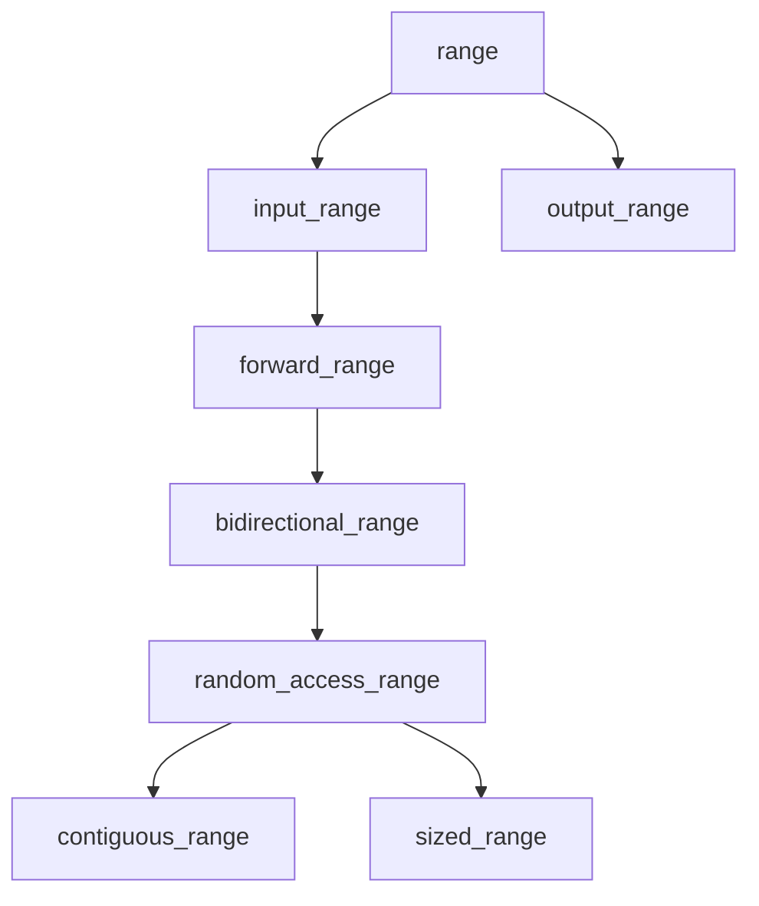
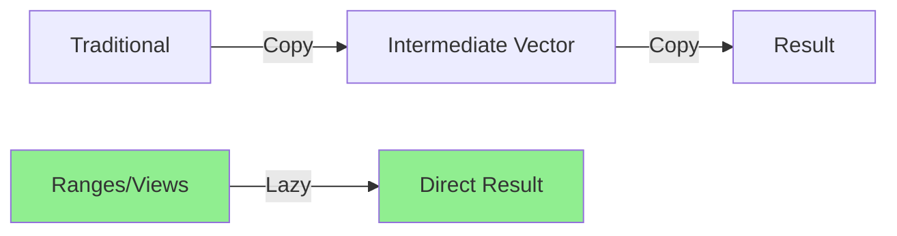

# Ranges

**Ranges** (C++20) is a modern library that provides composable, lazy-evaluated operations on sequences. It replaces traditional iterator pairs with range objects and introduces **views** for efficient data transformation pipelines.

## Why Ranges?

Traditional STL algorithms require iterator pairs, which is verbose and error-prone. Ranges simplify this:
```cpp
#include <vector>
#include <algorithm>
#include <ranges>

std::vector<int> nums = {1, 2, 3, 4, 5};

// Old way: iterator pairs
std::sort(nums.begin(), nums.end());

// New way: ranges
std::ranges::sort(nums);
```

:::success
**Benefits:**
- More concise syntax
- Composable operations (pipelines)
- Lazy evaluation (no intermediate containers)
- Better compile-time error messages
  :::

## Range Concepts

Ranges are defined by **concepts** that specify requirements:

```cpp
#include <ranges>
#include <vector>
#include <list>

template<std::ranges::range R>
void process(R&& r) {
    // Works with any range
}

// Different range types
std::vector<int> vec;        // random_access_range
std::list<int> lst;          // bidirectional_range
std::istream_iterator<int> it; // input_range
```

## Views

**Views** are lightweight, lazy-evaluated range adaptors. They don't own data and operations are performed on-demand.

### Basic Views
```cpp
#include <ranges>
#include <vector>
#include <iostream>

void basicViews() {
    std::vector<int> nums = {1, 2, 3, 4, 5, 6, 7, 8, 9, 10};
    
    // Filter: select elements
    auto evens = nums | std::views::filter([](int n) { return n % 2 == 0; });
    
    // Transform: modify elements
    auto squared = nums | std::views::transform([](int n) { return n * n; });
    
    // Take: first N elements
    auto first3 = nums | std::views::take(3);
    
    // Drop: skip first N elements
    auto skip2 = nums | std::views::drop(2);
    
    // Views are lazy - no computation yet!
    for (int n : evens) {
        std::cout << n << ' ';  // 2 4 6 8 10
    }
}
```

:::info
Views are **lazy** - they only compute values when iterated. This means no intermediate allocations!
:::

### View Composition (Pipelines)

The power of ranges comes from **composing** multiple views:
```cpp
#include <ranges>
#include <vector>

void pipelineExample() {
    std::vector<int> nums = {1, 2, 3, 4, 5, 6, 7, 8, 9, 10};
    
    // Chain multiple operations
    auto result = nums
        | std::views::filter([](int n) { return n % 2 == 0; })  // Keep evens
        | std::views::transform([](int n) { return n * n; })     // Square them
        | std::views::take(3);                                   // First 3
    
    // Prints: 4 16 36
    for (int n : result) {
        std::cout << n << ' ';
    }
}
```

### Common Views

| View | Purpose | Example |
|------|---------|---------|
| `filter` | Select elements by predicate | Evens only |
| `transform` | Apply function to each element | Square values |
| `take` | First N elements | First 5 items |
| `take_while` | Take until condition fails | While < 100 |
| `drop` | Skip first N elements | Skip header |
| `drop_while` | Skip until condition fails | Skip negatives |
| `reverse` | Reverse order | Backwards |
| `keys` | Extract keys from pairs | Map keys |
| `values` | Extract values from pairs | Map values |
```cpp
#include <ranges>
#include <map>

void commonViewsExample() {
    std::map<int, std::string> data = {{1, "one"}, {2, "two"}, {3, "three"}};
    
    // Extract keys
    auto keys = data | std::views::keys;
    
    // Extract values
    auto values = data | std::views::values;
    
    // Reverse iteration
    std::vector<int> nums = {1, 2, 3, 4, 5};
    auto reversed = nums | std::views::reverse;
}
```

## Range Factories

Create ranges from scratch without underlying containers:
```cpp
#include <ranges>
#include <iostream>

void rangeFactories() {
    // iota: sequence of incrementing values
    auto numbers = std::views::iota(1, 11);  // 1, 2, ..., 10
    
    // Infinite range (be careful!)
    auto infinite = std::views::iota(0);  // 0, 1, 2, 3, ...
    auto first10 = infinite | std::views::take(10);
    
    // single: single-element range
    auto one = std::views::single(42);
    
    // empty: empty range
    auto nothing = std::views::empty<int>;
    
    // repeat: same value N times (C++23)
    // auto fives = std::views::repeat(5, 10);  // 5, 5, 5, ... (10 times)
}
```

:::warning
`std::views::iota()` without a second argument creates an **infinite range**. Always use `take()` or similar to limit it!
:::

## Range Algorithms

C++20 adds range-based versions of all STL algorithms:
```cpp
#include <ranges>
#include <vector>
#include <algorithm>

void rangeAlgorithms() {
    std::vector<int> nums = {3, 1, 4, 1, 5, 9, 2, 6};
    
    // Sort entire range
    std::ranges::sort(nums);
    
    // Find element
    auto it = std::ranges::find(nums, 5);
    
    // Count occurrences
    auto count = std::ranges::count(nums, 1);
    
    // Copy with projection
    std::vector<int> dest(nums.size());
    std::ranges::copy(nums, dest.begin());
    
    // Unique elements
    auto [first, last] = std::ranges::unique(nums);
    nums.erase(first, last);
}
```

### Projections

Projections allow you to specify how to extract values for comparison:
```cpp
#include <ranges>
#include <vector>
#include <algorithm>

struct Person {
    std::string name;
    int age;
};

void projectionExample() {
    std::vector<Person> people = {
        {"Alice", 30},
        {"Bob", 25},
        {"Charlie", 35}
    };
    
    // Sort by age using projection
    std::ranges::sort(people, {}, &Person::age);
    
    // Sort by name
    std::ranges::sort(people, {}, &Person::name);
    
    // Find person by age
    auto it = std::ranges::find(people, 25, &Person::age);
}
```

:::success
**Projections** eliminate the need for custom comparators in many cases!
:::

## Practical Examples

### Example 1: Processing Text Lines
```cpp
#include <ranges>
#include <string>
#include <vector>
#include <iostream>

void processTextLines() {
    std::vector<std::string> lines = {
        "  hello  ",
        "world",
        "",
        "  C++20  ",
        "ranges"
    };
    
    auto result = lines
        | std::views::filter([](const auto& s) { return !s.empty(); })
        | std::views::transform([](auto s) {
              // Trim spaces (simplified)
              return s;
          })
        | std::views::take(3);
    
    for (const auto& line : result) {
        std::cout << line << '\n';
    }
}
```

### Example 2: Mathematical Operations
```cpp
#include <ranges>
#include <vector>
#include <numeric>

void mathOperations() {
    std::vector<int> nums = {1, 2, 3, 4, 5};
    
    // Sum of squares of even numbers
    auto sum = std::ranges::fold_left(
        nums 
        | std::views::filter([](int n) { return n % 2 == 0; })
        | std::views::transform([](int n) { return n * n; }),
        0,
        std::plus{}
    );  // 4 + 16 = 20
}
```

### Example 3: Zip and Enumerate
```cpp
#include <ranges>
#include <vector>

void zipEnumerate() {
    std::vector<std::string> names = {"Alice", "Bob", "Charlie"};
    std::vector<int> scores = {95, 87, 92};
    
    // Zip two ranges (C++23)
    // for (auto [name, score] : std::views::zip(names, scores)) {
    //     std::cout << name << ": " << score << '\n';
    // }
    
    // Enumerate with indices (C++23)
    // for (auto [idx, name] : std::views::enumerate(names)) {
    //     std::cout << idx << ". " << name << '\n';
    // }
}
```

## Range Adaptors

Create custom views for specific needs:
```cpp
#include <ranges>

// Custom view: chunk (group elements)
void customAdaptor() {
    std::vector<int> nums = {1, 2, 3, 4, 5, 6, 7, 8, 9};
    
    // chunk is available in C++23
    // auto chunks = nums | std::views::chunk(3);
    // Each chunk: {1,2,3}, {4,5,6}, {7,8,9}
}
```

## Performance Considerations


:::success
**Performance Benefits:**
- No intermediate allocations
- Lazy evaluation - only compute what's needed
- Better optimization opportunities for compilers
  :::
```cpp
#include <ranges>
#include <vector>

void performanceComparison() {
    std::vector<int> data(1'000'000);
    
    // Traditional: creates intermediate vectors
    std::vector<int> temp1, temp2, result;
    std::copy_if(data.begin(), data.end(), std::back_inserter(temp1), 
                 [](int n) { return n % 2 == 0; });
    std::transform(temp1.begin(), temp1.end(), std::back_inserter(temp2),
                   [](int n) { return n * n; });
    std::copy_n(temp2.begin(), 100, std::back_inserter(result));
    
    // Ranges: no intermediate allocations, lazy evaluation
    auto result_view = data
        | std::views::filter([](int n) { return n % 2 == 0; })
        | std::views::transform([](int n) { return n * n; })
        | std::views::take(100);
    
    std::vector<int> result2(result_view.begin(), result_view.end());
}
```

## Common Patterns

### Pattern 1: Filter-Transform-Collect
```cpp
std::vector<int> nums = {1, 2, 3, 4, 5, 6, 7, 8, 9, 10};

auto result = nums
    | std::views::filter([](int n) { return n > 5; })
    | std::views::transform([](int n) { return n * 2; });

std::vector<int> vec(result.begin(), result.end());
```

### Pattern 2: Flat Map (C++23)
```cpp
std::vector<std::vector<int>> nested = {{1, 2}, {3, 4}, {5, 6}};

// auto flat = nested | std::views::join;  // {1, 2, 3, 4, 5, 6}
```

### Pattern 3: Infinite Sequences
```cpp
// Generate infinite Fibonacci-like sequence
auto fibonacci = std::views::iota(0)
    | std::views::transform([](int n) { /* compute fib(n) */ return n; })
    | std::views::take(10);
```

## Best Practices

:::success
**DO:**
- Use views for lazy, composable operations
- Prefer range algorithms over iterator-based ones
- Use projections instead of custom comparators
- Chain operations with `|` operator for readability
  :::

:::danger
**DON'T:**
- Store views long-term (they don't own data)
- Modify underlying containers while iterating views
- Forget to limit infinite ranges with `take()`
- Use views when you need materialized results multiple times
  :::

## Migration from Traditional STL
```cpp
// Before (C++17)
std::vector<int> nums = {1, 2, 3, 4, 5};
std::vector<int> evens;
std::copy_if(nums.begin(), nums.end(), std::back_inserter(evens),
             [](int n) { return n % 2 == 0; });
std::transform(evens.begin(), evens.end(), evens.begin(),
               [](int n) { return n * n; });

// After (C++20)
auto result = nums
    | std::views::filter([](int n) { return n % 2 == 0; })
    | std::views::transform([](int n) { return n * n; });
```

## Related Topics

- **[Algorithms](algorithms.md)** - STL algorithms
- **[Iterators](iterators.md)** - Iterator concepts
- **[Containers](containers.md)** - Data structures