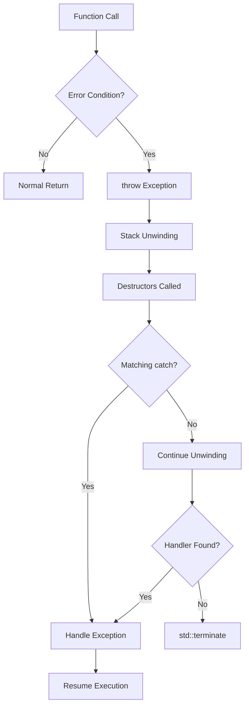
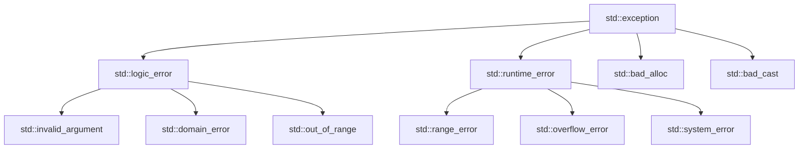
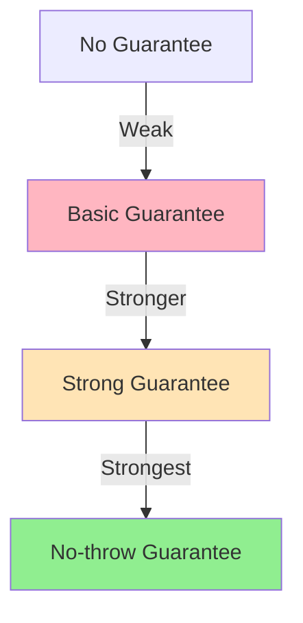

# Exception Handling

**Exceptions** provide a mechanism to transfer control from a point where an error occurs to a handler that can deal with it. They separate error-handling code from normal logic, making code cleaner and more maintainable.

## Basic Syntax

### Throwing Exceptions
```cpp showLineNumbers 
#include <stdexcept>
#include <string>

double divide(double a, double b) {
    if (b == 0.0) {
        throw std::invalid_argument("Division by zero");
    }
    return a / b;
}

void processFile(const std::string& filename) {
    if (filename.empty()) {
        throw std::runtime_error("Empty filename");
    }
    // Process file...
}
```

### Catching Exceptions
```cpp showLineNumbers 
#include <iostream>
#include <exception>

void exampleUsage() {
    try {
        double result = divide(10.0, 0.0);
        std::cout << "Result: " << result << '\n';
    }
    catch (const std::invalid_argument& e) {
        std::cerr << "Invalid argument: " << e.what() << '\n';
    }
    catch (const std::exception& e) {
        std::cerr << "Error: " << e.what() << '\n';
    }
    catch (...) {
        std::cerr << "Unknown error occurred\n";
    }
}
```

:::info
Catch handlers are checked in order. Always catch **more specific exceptions before general ones**.
:::

## Exception Flow


## Standard Exception Hierarchy


### Common Standard Exceptions

| Exception | Use Case | Example |
|-----------|----------|---------|
| `std::invalid_argument` | Invalid function argument | Negative size |
| `std::out_of_range` | Index out of bounds | `vec.at(100)` |
| `std::runtime_error` | Runtime condition | File not found |
| `std::logic_error` | Programming logic error | Precondition violated |
| `std::bad_alloc` | Memory allocation failed | `new` failed |
| `std::bad_cast` | Dynamic cast failed | Invalid `dynamic_cast` |
```cpp showLineNumbers 
#include <stdexcept>
#include <vector>

void standardExceptions() {
    std::vector<int> vec = {1, 2, 3};
    
    try {
        // Throws std::out_of_range
        int value = vec.at(10);
    }
    catch (const std::out_of_range& e) {
        std::cerr << "Out of range: " << e.what() << '\n';
    }
    
    try {
        // Throws std::bad_alloc if allocation fails
        int* huge = new int[1000000000000];
    }
    catch (const std::bad_alloc& e) {
        std::cerr << "Allocation failed: " << e.what() << '\n';
    }
}
```

## Custom Exceptions

### Simple Custom Exception
```cpp showLineNumbers 
#include <exception>
#include <string>

class FileError : public std::runtime_error {
    std::string filename_;
    
public:
    FileError(const std::string& msg, const std::string& filename)
        : std::runtime_error(msg), filename_(filename) {}
    
    const std::string& filename() const { return filename_; }
};

void useCustomException() {
    try {
        throw FileError("Cannot open file", "config.txt");
    }
    catch (const FileError& e) {
        std::cerr << "File error: " << e.what() 
                  << " (file: " << e.filename() << ")\n";
    }
}
```

### Exception with Additional Context
```cpp showLineNumbers 
#include <exception>
#include <string>

class DatabaseError : public std::runtime_error {
    int error_code_;
    std::string query_;
    
public:
    DatabaseError(const std::string& msg, int code, const std::string& query)
        : std::runtime_error(msg), error_code_(code), query_(query) {}
    
    int errorCode() const { return error_code_; }
    const std::string& query() const { return query_; }
};

void databaseOperation() {
    try {
        // Database operation fails
        throw DatabaseError("Query failed", 1064, "SELECT * FROM users");
    }
    catch (const DatabaseError& e) {
        std::cerr << "DB Error " << e.errorCode() << ": " << e.what() << '\n'
                  << "Query: " << e.query() << '\n';
    }
}
```

:::success
Derive custom exceptions from standard exception classes to maintain compatibility with generic handlers.
:::

## Stack Unwinding

When an exception is thrown, the stack is **unwound** - local objects are destroyed in reverse order of construction:
```cpp showLineNumbers 
#include <iostream>

class Resource {
    std::string name_;
    
public:
    Resource(const std::string& name) : name_(name) {
        std::cout << "Acquiring " << name_ << '\n';
    }
    
    ~Resource() {
        std::cout << "Releasing " << name_ << '\n';
    }
};

void demonstrateUnwinding() {
    try {
        Resource r1("Resource 1");
        Resource r2("Resource 2");
        
        throw std::runtime_error("Error!");
        
        Resource r3("Resource 3");  // Never constructed
    }
    catch (const std::exception& e) {
        std::cout << "Caught: " << e.what() << '\n';
    }
    // Output:
    // Acquiring Resource 1
    // Acquiring Resource 2
    // Releasing Resource 2
    // Releasing Resource 1
    // Caught: Error!
}
```

:::warning
Stack unwinding calls destructors but **does not execute** code after the throw point in the current scope.
:::

## RAII and Exception Safety

**RAII** (Resource Acquisition Is Initialization) ensures resources are properly released during stack unwinding:
```cpp showLineNumbers 
#include <fstream>
#include <memory>
#include <mutex>

void exceptionSafeFunction() {
    // File automatically closed on exception
    std::ifstream file("data.txt");
    
    // Memory automatically freed on exception
    auto ptr = std::make_unique<int[]>(100);
    
    // Mutex automatically unlocked on exception
    std::mutex mtx;
    std::lock_guard<std::mutex> lock(mtx);
    
    // If exception thrown here, all resources cleaned up
    if (someCondition()) {
        throw std::runtime_error("Error");
    }
    
    // Resources released automatically at scope exit
}
```

### Manual Resource Management (Unsafe)
```cpp showLineNumbers 
void unsafeFunction() {
    int* data = new int[100];
    FILE* file = fopen("data.txt", "r");
    
    // If exception thrown here, memory leaked!
    processData(data, file);
    
    delete[] data;      // May not execute
    fclose(file);       // May not execute
}
```

### RAII Resource Management (Safe)
```cpp showLineNumbers 
#include <memory>
#include <fstream>

void safeFunction() {
    auto data = std::make_unique<int[]>(100);
    std::ifstream file("data.txt");
    
    // Exception safe - resources automatically cleaned up
    processData(data.get(), file);
    
    // Automatic cleanup
}
```

:::success
Always use **RAII** wrappers (smart pointers, file streams, lock guards) for exception-safe resource management.
:::

## Exception Specifications

### noexcept Specifier

Mark functions that don't throw exceptions:
```cpp showLineNumbers 
// Guarantees no exceptions
void safeFunction() noexcept {
    // If exception thrown, std::terminate called
}

// Conditionally noexcept
template<typename T>
void swap(T& a, T& b) noexcept(std::is_nothrow_move_constructible_v<T>) {
    T temp = std::move(a);
    a = std::move(b);
    b = std::move(temp);
}
```

See **[noexcept and Strong Guarantee](02-noexcept-and-strong-guarantee.md)** for details.

## Rethrowing Exceptions
```cpp showLineNumbers 
#include <exception>

void processWithLogging() {
    try {
        riskyOperation();
    }
    catch (const std::exception& e) {
        logError(e.what());
        throw;  // Rethrow the same exception
    }
}

void convertException() {
    try {
        lowLevelOperation();
    }
    catch (const LowLevelError& e) {
        // Throw different exception
        throw HighLevelError("High-level operation failed", e.what());
    }
}
```

:::info
Use `throw;` without an argument to rethrow the **original exception** object, preserving its type and state.
:::

## Nested Exceptions (C++11)
```cpp showLineNumbers
#include <exception>
#include <stdexcept>

void nestedExceptionExample() {
    try {
        try {
            throw std::runtime_error("Low-level error");
        }
        catch (...) {
            std::throw_with_nested(std::runtime_error("High-level error"));
        }
    }
    catch (const std::exception& e) {
        std::cerr << e.what() << '\n';
        
        try {
            std::rethrow_if_nested(e);
        }
        catch (const std::exception& nested) {
            std::cerr << "  Caused by: " << nested.what() << '\n';
        }
    }
}
```

## Exception Safety Guarantees

### Basic Guarantee

Program remains in valid state; no resource leaks:
```cpp showLineNumbers 
void basicGuarantee(std::vector<int>& vec, int value) {
    vec.push_back(value);  // May throw, but vec remains valid
}
```

### Strong Guarantee

Operation either succeeds completely or has no effect:
```cpp showLineNumbers 
#include <vector>

void strongGuarantee(std::vector<int>& vec, int value) {
    std::vector<int> temp = vec;  // Copy
    temp.push_back(value);        // Modify copy
    vec = std::move(temp);        // Commit (noexcept)
}
```

### No-throw Guarantee

Operation never throws exceptions:
```cpp showLineNumbers 
void noThrowGuarantee(int& a, int& b) noexcept {
    std::swap(a, b);  // Guaranteed not to throw
}
```


## Exception-Safe Coding Patterns

### Copy-and-Swap Idiom
```cpp showLineNumbers 
class Widget {
    int* data_;
    size_t size_;
    
public:
    Widget& operator=(const Widget& other) {
        Widget temp(other);        // Copy (may throw)
        swap(temp);                 // Swap (noexcept)
        return *this;               // Strong guarantee
    }
    
    void swap(Widget& other) noexcept {
        std::swap(data_, other.data_);
        std::swap(size_, other.size_);
    }
};
```

### Two-Phase Construction
```cpp showLineNumbers 
class Database {
    Connection* conn_ = nullptr;
    
public:
    Database() = default;  // noexcept
    
    void connect(const std::string& url) {
        // Throwing operations after construction
        conn_ = new Connection(url);
    }
    
    ~Database() {
        delete conn_;
    }
};
```

## Performance Considerations
```cpp showLineNumbers 
#include <chrono>

// Exception path (zero-cost until thrown)
double divideException(double a, double b) {
    if (b == 0.0) {
        throw std::invalid_argument("Division by zero");
    }
    return a / b;
}

// Return code path (always check)
bool divideReturnCode(double a, double b, double& result) {
    if (b == 0.0) {
        return false;
    }
    result = a / b;
    return true;
}
```

:::info
**Zero-cost exceptions**: No overhead on the happy path (when no exception is thrown). Overhead only when exception is actually thrown.
:::

## Destructors and Exceptions

:::danger
**NEVER throw exceptions from destructors!** If a destructor throws during stack unwinding, `std::terminate` is called.
:::
```cpp showLineNumbers 
class BadExample {
public:
    ~BadExample() {
        // WRONG: May throw during unwinding
        throw std::runtime_error("Error in destructor");
    }
};

class GoodExample {
public:
    ~GoodExample() noexcept {
        try {
            cleanup();  // May throw
        }
        catch (...) {
            // Log error, but don't rethrow
            logError("Cleanup failed");
        }
    }
};
```

## Exception-Neutral Code

Code that doesn't handle exceptions but allows them to propagate:
```cpp showLineNumbers 
template<typename T>
void processContainer(std::vector<T>& vec) {
    for (auto& item : vec) {
        item.process();  // May throw - let it propagate
    }
    // Exception-neutral: doesn't catch, but maintains invariants
}
```

## Practical Examples

### Example 1: File Processing
```cpp showLineNumbers 
#include <fstream>
#include <string>
#include <stdexcept>

class FileProcessor {
public:
    void process(const std::string& filename) {
        std::ifstream file(filename);
        if (!file) {
            throw std::runtime_error("Cannot open file: " + filename);
        }
        
        std::string line;
        int lineNum = 0;
        
        while (std::getline(file, line)) {
            ++lineNum;
            try {
                processLine(line);
            }
            catch (const std::exception& e) {
                throw std::runtime_error(
                    "Error at line " + std::to_string(lineNum) + 
                    ": " + e.what()
                );
            }
        }
    }
    
private:
    void processLine(const std::string& line);
};
```

### Example 2: Transaction Pattern
```cpp showLineNumbers 
#include <vector>

class Transaction {
    std::vector<std::function<void()>> rollback_actions_;
    bool committed_ = false;
    
public:
    template<typename Action, typename Rollback>
    void execute(Action action, Rollback rollback) {
        action();
        rollback_actions_.push_back(rollback);
    }
    
    void commit() {
        committed_ = true;
        rollback_actions_.clear();
    }
    
    ~Transaction() {
        if (!committed_) {
            // Rollback in reverse order
            for (auto it = rollback_actions_.rbegin(); 
                 it != rollback_actions_.rend(); ++it) {
                try {
                    (*it)();
                }
                catch (...) {
                    // Log but continue rollback
                }
            }
        }
    }
};

void useTransaction() {
    Transaction txn;
    
    txn.execute(
        []{ createFile("temp.txt"); },
        []{ deleteFile("temp.txt"); }
    );
    
    txn.execute(
        []{ allocateResource(); },
        []{ freeResource(); }
    );
    
    txn.commit();  // Success - no rollback
}
```

### Example 3: Exception Guard
```cpp showLineNumbers 
template<typename Func>
class ExceptionGuard {
    Func func_;
    bool dismissed_ = false;
    
public:
    explicit ExceptionGuard(Func f) : func_(std::move(f)) {}
    
    ~ExceptionGuard() {
        if (!dismissed_) {
            try {
                func_();
            }
            catch (...) {
                // Suppress exception in destructor
            }
        }
    }
    
    void dismiss() { dismissed_ = true; }
};

void useGuard() {
    std::vector<int> vec;
    
    ExceptionGuard guard([&]{ vec.clear(); });
    
    vec.push_back(1);
    vec.push_back(2);
    
    if (success) {
        guard.dismiss();  // Keep changes
    }
    // Otherwise, guard will clear vec on destruction
}
```

## When to Use Exceptions

:::success
**Use Exceptions When:**
- Errors are exceptional (not expected in normal flow)
- Error handling code would clutter normal logic
- Errors need to propagate through multiple layers
- You need strong exception safety guarantees
- Constructors fail (can't return error codes)
  :::

:::warning
**Avoid Exceptions When:**
- Performance is critical and errors are frequent
- Writing real-time or embedded systems
- Interacting with C libraries
- Destructors or cleanup code
- noexcept functions
  :::

## Best Practices

:::success
**DO:**
- Throw by value, catch by const reference
- Use standard exception types when possible
- Provide meaningful error messages
- Maintain exception safety guarantees
- Document which exceptions functions may throw
- Use RAII for all resource management
  :::

:::danger
**DON'T:**
- Throw exceptions from destructors
- Catch exceptions by value (causes slicing)
- Use exceptions for control flow
- Throw pointers to exception objects
- Ignore exceptions with empty catch blocks
- Mix exception handling with resource management
  :::

## Related Topics

- **[noexcept and Strong Guarantee](02-noexcept-and-strong-guarantee.md)** - Exception specifications
- **[Error Codes](03-error-codes.md)** - Alternative error handling
- **[Assertions](04-assertions.md)** - Debug-time checks

[//]: # (- **[RAII]&#40;../14-idioms-and-design/raii.md&#41;** - Resource management)
