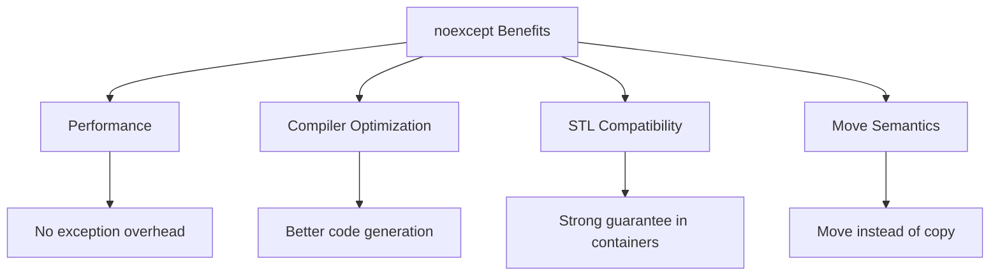
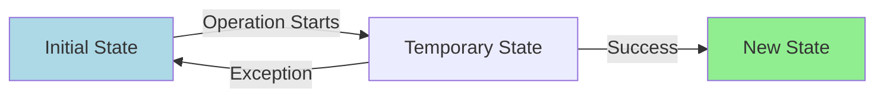

# noexcept and Strong Guarantee

The **noexcept** specifier indicates that a function won't throw exceptions. The **strong exception guarantee** ensures that operations either succeed completely or have no effect. Together, they enable writing robust, exception-safe code.

## noexcept Specifier

### Basic Usage
```cpp showLineNumbers 
// Unconditional noexcept
void safeFunction() noexcept {
    // Guaranteed not to throw
    // If it does, std::terminate is called
}

// Conditional noexcept
template<typename T>
void conditionalFunction(T value) noexcept(std::is_nothrow_move_constructible_v<T>) {
    T temp = std::move(value);
}

// Check if noexcept
constexpr bool is_safe = noexcept(safeFunction());  // true
```

:::info
`noexcept` is **not** checked at compile time. If a noexcept function throws, `std::terminate()` is called immediately.
:::

### noexcept vs noexcept(true) vs noexcept(false)
```cpp showLineNumbers 
void f1() noexcept;           // Same as noexcept(true)
void f2() noexcept(true);     // Explicitly noexcept
void f3() noexcept(false);    // May throw (default)
void f4();                    // May throw (no specification)

// Conditional noexcept based on expression
template<typename T>
void swap(T& a, T& b) noexcept(noexcept(T(std::move(a)))) {
    T temp(std::move(a));
    a = std::move(b);
    b = std::move(temp);
}
```

## Why noexcept Matters


### Performance Benefits
```cpp showLineNumbers 
#include <vector>

struct Widget {
    int* data;
    
    // Non-noexcept move constructor
    Widget(Widget&& other) {
        data = other.data;
        other.data = nullptr;
    }
};

struct FastWidget {
    int* data;
    
    // noexcept move constructor
    FastWidget(FastWidget&& other) noexcept {
        data = other.data;
        other.data = nullptr;
    }
};

void performanceTest() {
    std::vector<Widget> v1;
    v1.reserve(100);
    // Reallocation: COPIES elements (move not noexcept)
    
    std::vector<FastWidget> v2;
    v2.reserve(100);
    // Reallocation: MOVES elements (move is noexcept)
}
```

:::warning
STL containers will **copy** elements during reallocation if move constructor is not `noexcept`, even if move constructor exists!
:::

## noexcept Operator

The `noexcept` operator checks if an expression is declared to not throw:
```cpp showLineNumbers 
#include <type_traits>

void mayThrow();
void noThrow() noexcept;

constexpr bool check1 = noexcept(mayThrow());   // false
constexpr bool check2 = noexcept(noThrow());    // true
constexpr bool check3 = noexcept(1 + 2);        // true (built-in)

// Use in conditional noexcept
template<typename T>
void process(T value) noexcept(noexcept(T(value))) {
    T copy(value);
}
```

### Checking Type Traits
```cpp showLineNumbers 
#include <type_traits>

template<typename T>
void smartSwap(T& a, T& b) 
    noexcept(std::is_nothrow_move_constructible_v<T> &&
             std::is_nothrow_move_assignable_v<T>)
{
    T temp = std::move(a);
    a = std::move(b);
    b = std::move(temp);
}
```

## Strong Exception Guarantee

The strong guarantee ensures **all-or-nothing** semantics: operations either complete successfully or leave the program state unchanged.


### Exception Safety Levels

| Guarantee | Description | Example |
|-----------|-------------|---------|
| **No guarantee** | Undefined behavior | Raw pointers, no cleanup |
| **Basic guarantee** | No leaks, valid state | Partial update OK |
| **Strong guarantee** | All-or-nothing | Rollback on failure |
| **No-throw guarantee** | Never throws | `noexcept` functions |

### Basic Guarantee Example
```cpp showLineNumbers 
class Widget {
    std::vector<int> data_;
    int count_;
    
public:
    // Basic guarantee: valid state, but data may be partially modified
    void addItems(const std::vector<int>& items) {
        for (const auto& item : items) {
            data_.push_back(item);  // May throw midway
            ++count_;
        }
    }
};
```

### Strong Guarantee Example
```cpp showLineNumbers 
class Widget {
    std::vector<int> data_;
    int count_;
    
public:
    // Strong guarantee: all-or-nothing
    void addItems(const std::vector<int>& items) {
        std::vector<int> temp = data_;  // Copy
        
        for (const auto& item : items) {
            temp.push_back(item);  // Modify copy
        }
        
        // Commit (noexcept operations)
        data_ = std::move(temp);
        count_ += items.size();
    }
};
```

:::success
The strong guarantee often uses the **copy-and-swap** idiom: modify a copy, then swap (noexcept) to commit.
:::

## Copy-and-Swap Idiom

A classic pattern for strong exception safety:
```cpp showLineNumbers 
#include <algorithm>

class Resource {
    int* data_;
    size_t size_;
    
public:
    Resource(size_t size) : data_(new int[size]), size_(size) {}
    
    ~Resource() {
        delete[] data_;
    }
    
    // Copy constructor
    Resource(const Resource& other)
        : data_(new int[other.size_]), size_(other.size_) {
        std::copy(other.data_, other.data_ + size_, data_);
    }
    
    // Copy assignment with strong guarantee
    Resource& operator=(const Resource& other) {
        Resource temp(other);   // Copy (may throw)
        swap(temp);              // Swap (noexcept)
        return *this;            // Strong guarantee
    }
    
    // Swap (noexcept)
    void swap(Resource& other) noexcept {
        std::swap(data_, other.data_);
        std::swap(size_, other.size_);
    }
    
    // Move constructor (noexcept)
    Resource(Resource&& other) noexcept
        : data_(other.data_), size_(other.size_) {
        other.data_ = nullptr;
        other.size_ = 0;
    }
    
    // Move assignment (noexcept)
    Resource& operator=(Resource&& other) noexcept {
        Resource temp(std::move(other));
        swap(temp);
        return *this;
    }
};
```

## Conditional noexcept

Functions can be conditionally noexcept based on template parameters:
```cpp showLineNumbers 
#include <type_traits>

template<typename T>
class Container {
    T* data_;
    size_t size_;
    
public:
    // Conditionally noexcept based on T's move constructor
    Container(Container&& other) 
        noexcept(std::is_nothrow_move_constructible_v<T>)
        : data_(other.data_), size_(other.size_) {
        other.data_ = nullptr;
        other.size_ = 0;
    }
    
    // Conditionally noexcept based on T's destructor
    ~Container() noexcept(std::is_nothrow_destructible_v<T>) {
        for (size_t i = 0; i < size_; ++i) {
            data_[i].~T();
        }
        delete[] reinterpret_cast<char*>(data_);
    }
};
```

### Propagating noexcept
```cpp showLineNumbers 
template<typename Func>
auto wrapper(Func&& f) noexcept(noexcept(f())) {
    return f();
}

// Usage
int safeFunc() noexcept { return 42; }
int riskyFunc() { return 42; }

auto r1 = wrapper(safeFunc);   // noexcept
auto r2 = wrapper(riskyFunc);  // may throw
```

## Functions That Should Be noexcept
```cpp showLineNumbers 
class Widget {
public:
    // Destructors (implicitly noexcept)
    ~Widget() noexcept;
    
    // Move operations
    Widget(Widget&&) noexcept;
    Widget& operator=(Widget&&) noexcept;
    
    // Swap
    void swap(Widget&) noexcept;
    
    // Query operations (no modification)
    size_t size() const noexcept;
    bool empty() const noexcept;
    
    // Default constructors (if possible)
    Widget() noexcept;
};
```

:::success
**Always mark these noexcept if possible:**
- Destructors (already implicitly noexcept)
- Move constructors and move assignment
- Swap functions
- Non-throwing query operations
  :::

## Wide Contract vs Narrow Contract

### Wide Contract (Good for noexcept)

Functions with no preconditions - always valid to call:
```cpp showLineNumbers 
// Wide contract: any int value is valid
int abs(int value) noexcept {
    return value < 0 ? -value : value;
}

bool isEmpty(const std::string& s) noexcept {
    return s.empty();
}
```

### Narrow Contract (Risky for noexcept)

Functions with preconditions that must be checked:
```cpp showLineNumbers 
// Narrow contract: index must be valid
int& at(std::vector<int>& vec, size_t index) {
    if (index >= vec.size()) {
        throw std::out_of_range("Index out of range");
    }
    return vec[index];
}

// If marked noexcept, must use different error handling
int& atNoexcept(std::vector<int>& vec, size_t index) noexcept {
    assert(index < vec.size());  // Debug-time check
    return vec[index];            // UB if precondition violated
}
```

:::warning
Be cautious marking functions with **narrow contracts** as `noexcept` - you lose the ability to report errors via exceptions.
:::

## noexcept and std::terminate
```cpp showLineNumbers 
#include <exception>
#include <iostream>

void mayThrow() {
    throw std::runtime_error("Error!");
}

void noexceptFunction() noexcept {
    mayThrow();  // Throws exception
    // std::terminate called immediately!
}

void setTerminateHandler() {
    std::set_terminate([]() {
        std::cerr << "Terminating due to noexcept violation!\n";
        std::abort();
    });
    
    noexceptFunction();  // Calls terminate handler
}
```

## Implementing Strong Guarantee

### Pattern 1: Prepare-Commit
```cpp showLineNumbers 
class Database {
    std::vector<Record> records_;
    
public:
    // Strong guarantee
    void bulkInsert(const std::vector<Record>& newRecords) {
        // Prepare phase (may throw)
        std::vector<Record> temp = records_;
        temp.insert(temp.end(), newRecords.begin(), newRecords.end());
        
        // Validate (may throw)
        validateAll(temp);
        
        // Commit phase (noexcept)
        records_ = std::move(temp);
    }
};
```

### Pattern 2: Transaction Rollback
```cpp showLineNumbers 
class TransactionalVector {
    std::vector<int> data_;
    std::vector<int> backup_;
    
public:
    void transactionalPush(int value) {
        backup_ = data_;  // Backup
        
        try {
            data_.push_back(value);  // Try operation
            backup_.clear();          // Success - discard backup
        }
        catch (...) {
            data_ = std::move(backup_);  // Rollback
            throw;
        }
    }
};
```

### Pattern 3: Pimpl for Strong Guarantee
```cpp showLineNumbers 
class Widget {
    struct Impl;
    std::unique_ptr<Impl> pImpl_;
    
public:
    // Strong guarantee via pointer swap
    void updateState(const NewState& state) {
        auto newImpl = std::make_unique<Impl>(*pImpl_);  // Copy
        newImpl->update(state);                           // Modify copy
        pImpl_ = std::move(newImpl);                      // Commit
    }
};
```

## Practical Examples

### Example 1: Exception-Safe Stack
```cpp showLineNumbers 
template<typename T>
class Stack {
    std::vector<T> data_;
    
public:
    // Strong guarantee
    void push(const T& value) {
        data_.push_back(value);  // vector provides strong guarantee
    }
    
    // No-throw guarantee
    void pop() noexcept {
        if (!data_.empty()) {
            data_.pop_back();
        }
    }
    
    // Strong guarantee (copy returned by value)
    T top() const {
        if (data_.empty()) {
            throw std::out_of_range("Stack is empty");
        }
        return data_.back();
    }
    
    // No-throw guarantee
    bool empty() const noexcept {
        return data_.empty();
    }
    
    // No-throw guarantee
    size_t size() const noexcept {
        return data_.size();
    }
};
```

### Example 2: Configuration Manager
```cpp showLineNumbers 
#include <map>
#include <string>

class ConfigManager {
    std::map<std::string, std::string> settings_;
    
public:
    // Strong guarantee
    void updateSettings(const std::map<std::string, std::string>& newSettings) {
        auto temp = settings_;  // Copy current settings
        
        // Apply all updates to copy
        for (const auto& [key, value] : newSettings) {
            temp[key] = value;  // May throw
        }
        
        // Validate (may throw)
        validateSettings(temp);
        
        // Commit (noexcept move)
        settings_ = std::move(temp);
    }
    
    // No-throw guarantee
    std::string get(const std::string& key, 
                    const std::string& defaultValue = "") const noexcept {
        auto it = settings_.find(key);
        return it != settings_.end() ? it->second : defaultValue;
    }
    
private:
    void validateSettings(const std::map<std::string, std::string>& settings);
};
```

### Example 3: Atomic State Update
```cpp showLineNumbers 
#include <mutex>
#include <memory>

class ThreadSafeCache {
    struct State {
        std::map<int, std::string> data;
        int version = 0;
    };
    
    mutable std::mutex mutex_;
    std::shared_ptr<State> state_;
    
public:
    ThreadSafeCache() : state_(std::make_shared<State>()) {}
    
    // Strong guarantee with lock
    void update(int key, const std::string& value) {
        // Prepare new state
        auto newState = std::make_shared<State>(*state_);
        newState->data[key] = value;
        newState->version++;
        
        // Commit atomically
        std::lock_guard<std::mutex> lock(mutex_);
        state_ = std::move(newState);  // noexcept
    }
    
    // No-throw read
    std::shared_ptr<const State> getState() const noexcept {
        std::lock_guard<std::mutex> lock(mutex_);
        return state_;
    }
};
```

## Best Practices

:::success
**DO:**
- Mark move constructors/assignment `noexcept`
- Mark swap functions `noexcept`
- Mark destructors `noexcept` (implicit)
- Use conditional `noexcept` for templates
- Provide strong guarantee for state-modifying operations
- Use copy-and-swap for assignment operators
  :::

:::danger
**DON'T:**
- Mark functions `noexcept` if they might throw
- Use `noexcept` on functions with narrow contracts (that validate input)
- Assume `noexcept` provides compile-time checking
- Throw from destructors or `noexcept` functions
- Forget that `noexcept` violations call `std::terminate`
  :::

## Performance Impact
```cpp showLineNumbers 
// Without noexcept: additional exception handling code
void functionMayThrow() {
    // Compiler must generate exception handling paths
}

// With noexcept: optimized code generation
void functionNoThrow() noexcept {
    // Compiler can omit exception handling overhead
    // Better optimization opportunities
}
```

:::info
`noexcept` enables **better compiler optimizations** by eliminating the need for exception handling machinery.
:::

## Related Topics

- **[Exceptions](01-exceptions.md)** - Exception basics
- **[Move Semantics](../07-classes-and-oop/copy-and-move-semantics.md)** - Move operations

[//]: # (- **[RAII]&#40;../14-idioms-and-design/raii.md&#41;** - Resource management)

[//]: # (- **[Copy and Swap]&#40;../14-idioms-and-design/copy-and-swap.md&#41;** - Exception-safe idiom)