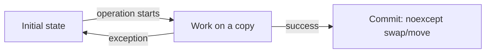

# Exception Safety and the Strong Guarantee

**Exception safety** is the contract a function makes about program state when an exception passes
through it. The four levels form a ladder; most code should aim for the **strong guarantee** —
all-or-nothing — and `noexcept` (the no-throw rung) is the tool that makes the commit step possible.

:::info Scope split
This page is about the *safety guarantees*. For the `noexcept` **specifier** itself — syntax, the
`noexcept` operator, conditional `noexcept`, which functions to mark, performance — see the canonical
[noexcept Specifier](../04-functions-and-call-mechanics/noexcept.md) page.
:::

## The four levels

| Guarantee | Promise on exception | Typical source |
|-----------|----------------------|----------------|
| **No guarantee** | anything — leaks, corruption | raw `new`/`delete`, no cleanup |
| **Basic** | no leaks, object still valid (but maybe changed) | partial update is acceptable |
| **Strong** | state is exactly as before — operation rolled back | commit-or-rollback designs |
| **No-throw** | never throws at all | `noexcept` functions, swaps, dtors |


```mermaid
flowchart LR
    A[Initial state] -->|operation starts| B[Work on a copy]
    B -->|success| C[Commit: noexcept swap/move]
    B -->|exception| A
```

The diagram is the strong guarantee in one picture: do the throwing work on a **copy**, then commit
with an operation that **cannot throw**. If the work throws, the original is untouched.

## Basic vs strong, concretely

```cpp showLineNumbers
// BASIC guarantee — if push_back throws midway, some items are already in,
// count_ may disagree with data_. No leak, but state changed.
void addItems(const std::vector<int>& items) {
    for (int x : items) { data_.push_back(x); ++count_; }
}

// STRONG guarantee — all work happens on a copy; the only mutation of *this
// is the final noexcept move. Throw anywhere above and *this is unchanged.
void addItems(const std::vector<int>& items) {
    std::vector<int> temp = data_;              // copy (may throw)
    temp.insert(temp.end(), items.begin(), items.end());  // (may throw)
    data_ = std::move(temp);                    // commit (noexcept)
    count_ += items.size();
}
```

This "prepare on a copy, commit with a non-throwing move/swap" shape is the core technique. The
[copy-and-swap idiom](../13-idioms-and-design/05-copy-and-swap.md) packages it for assignment
operators; [PIMPL](../13-idioms-and-design/02-pimpl.md) does it by swapping a single pointer.

:::warning The commit step *must* be no-throw
The whole scheme collapses if the commit can throw. That is why move assignment and `swap` need to be
`noexcept` — and why the standard library only *moves* (instead of copying) elements during vector
reallocation when the move constructor is `noexcept`. A throwing move would break the strong
guarantee, so the library plays it safe and copies. See
[noexcept and move semantics](../04-functions-and-call-mechanics/noexcept.md#move-semantics-and-noexcept).
:::

## Rollback when you can't prepare on a copy

If copying the whole object is too expensive, achieve the strong guarantee by saving enough to undo:

```cpp showLineNumbers
void transactionalPush(int value) {
    auto backup = data_;            // save what we need to restore
    try {
        data_.push_back(value);
        backup.clear();             // success — drop the backup
    } catch (...) {
        data_ = std::move(backup);  // rollback (noexcept move)
        throw;                      // rethrow: caller sees the original state
    }
}
```

## Choosing a level

You do not always want the strong guarantee — it has a cost (the copy). Pick deliberately:

- **No-throw** for destructors, swaps, move operations, and simple observers — and mark them `noexcept`.
- **Strong** for operations a caller will retry or that must not corrupt shared state (assignment,
  bulk updates, transactions).
- **Basic** when a copy is too expensive and the caller can cope with a valid-but-changed object.

:::tip Let the library do the work
Standard containers already provide strong/basic guarantees for their operations. The cheapest way
to be exception-safe is to build from `std::vector`, `std::string`, and smart pointers, and let
[RAII](../13-idioms-and-design/01-raii.md) handle every cleanup path — then you rarely write a
`try`/`catch` at all.
:::

## Worked example — an exception-safe `Stack`

Each method's guarantee is called out; note how the no-throw ones are `noexcept` and the mutating one
leans on `vector`'s own strong guarantee.

```cpp showLineNumbers
template <class T>
class Stack {
    std::vector<T> data_;
public:
    void push(const T& v)        { data_.push_back(v); }   // strong (vector's)
    void pop() noexcept          { if (!data_.empty()) data_.pop_back(); }
    bool   empty() const noexcept { return data_.empty(); }
    size_t size()  const noexcept { return data_.size(); }

    T top() const {                                        // strong: returns by value
        if (data_.empty()) throw std::out_of_range("empty stack");
        return data_.back();
    }
};
```

## Summary

- Exception safety has four levels: no-guarantee, **basic**, **strong**, **no-throw**.
- The strong guarantee = do throwing work on a copy, then commit with a **no-throw** move/swap.
- That commit step is why move/swap must be `noexcept` — and why containers copy instead of move when
  the move can throw.
- Use rollback when a full copy is too costly; choose the level deliberately — strong isn't free.
- Build on RAII and standard containers; they hand you most of these guarantees for free.

## Related

- [noexcept Specifier](../04-functions-and-call-mechanics/noexcept.md) — the specifier, operator, and where to apply it
- [Copy-and-Swap](../13-idioms-and-design/05-copy-and-swap.md) · [PIMPL](../13-idioms-and-design/02-pimpl.md) · [RAII](../13-idioms-and-design/01-raii.md)
- [Exceptions](./01-exceptions.md) · [Copy and Move Semantics](../07-classes-and-oop/copy-and-move-semantics.md)
