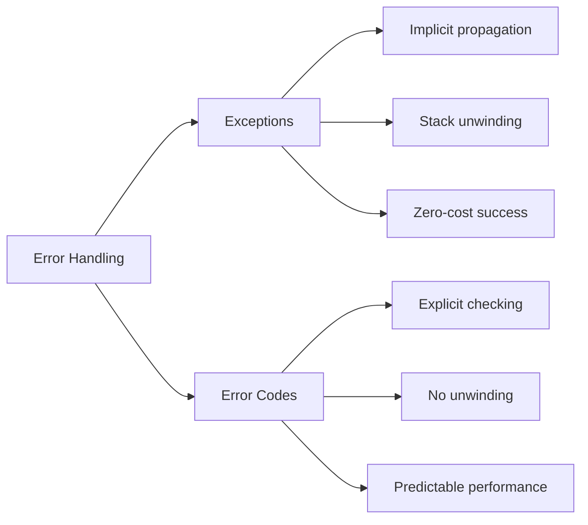

# Error Codes and std::error_code

**Error codes** provide an alternative to exceptions for error handling. They're explicit, predictable, and have zero overhead in the success case, making them ideal for performance-critical code and systems programming.

## Error Codes vs Exceptions


| Aspect | Exceptions | Error Codes |
|--------|------------|-------------|
| **Propagation** | Automatic | Manual |
| **Success overhead** | Zero | Minimal |
| **Failure overhead** | High | Low |
| **Visibility** | Implicit | Explicit |
| **Control flow** | Non-local | Local |
| **Best for** | Rare errors | Expected failures |

## Traditional Error Codes (C-Style)
```cpp showLineNumbers 
#include <cerrno>
#include <cstring>

// Return code approach
int openFile(const char* filename, FILE** out) {
    FILE* file = fopen(filename, "r");
    if (!file) {
        return errno;  // Return error code
    }
    *out = file;
    return 0;  // Success
}

void traditionalUsage() {
    FILE* file;
    int error = openFile("data.txt", &file);
    
    if (error != 0) {
        fprintf(stderr, "Error: %s\n", strerror(error));
        return;
    }
    
    // Use file...
    fclose(file);
}
```

:::warning
C-style error codes are **error-prone**: easy to ignore, no type safety, and require out-parameters for return values.
:::

## std::error_code (C++11)

Modern C++ provides `std::error_code` for type-safe error handling:
```cpp showLineNumbers 
#include <system_error>
#include <iostream>

std::error_code openFile(const std::string& filename, FILE*& out) {
    FILE* file = fopen(filename.c_str(), "r");
    if (!file) {
        return std::error_code(errno, std::system_category());
    }
    out = file;
    return {};  // Success (default-constructed error_code)
}

void modernUsage() {
    FILE* file;
    auto error = openFile("data.txt", file);
    
    if (error) {
        std::cerr << "Error: " << error.message() << '\n';
        return;
    }
    
    // Use file...
    fclose(file);
}
```

### Error Code Structure
```cpp showLineNumbers 
#include <system_error>

void errorCodeDetails() {
    std::error_code ec(ENOENT, std::system_category());
    
    // Query error
    int value = ec.value();                     // Numeric code
    std::string msg = ec.message();             // Human-readable message
    const std::error_category& cat = ec.category();  // Category
    
    // Boolean conversion
    if (ec) {
        std::cout << "Error occurred\n";
    }
    
    // Comparison
    if (ec == std::errc::no_such_file_or_directory) {
        std::cout << "File not found\n";
    }
}
```

## Error Categories

Error categories classify errors into domains:
```cpp showLineNumbers 
#include <system_error>

void errorCategories() {
    // System errors (errno)
    std::error_code sys_err(EINVAL, std::system_category());
    
    // Generic errors (portable)
    std::error_code gen_err = std::make_error_code(std::errc::invalid_argument);
    
    // IO stream errors
    std::error_code io_err(static_cast<int>(std::io_errc::stream), 
                           std::iostream_category());
    
    // Future errors
    std::error_code fut_err = std::make_error_code(std::future_errc::broken_promise);
}
```

### Standard Error Categories

| Category                 | Domain                | Examples          |
|--------------------------|-----------------------|-------------------|
| `std::system_category`   | OS errors (errno)     | ENOENT, EINVAL    |
| `std::generic_category`  | Portable errors       | permission_denied |
| `std::iostream_category` | I/O stream errors     | stream            |
| `std::future_category`   | Future/promise errors | broken_promise    |

## Custom Error Categories
```cpp showLineNumbers
#include <system_error>
#include <string>

enum class DatabaseError {
    Success = 0,
    ConnectionFailed = 1,
    QueryFailed = 2,
    Timeout = 3
};

class DatabaseErrorCategory : public std::error_category {
public:
    const char* name() const noexcept override {
        return "database";
    }
    
    std::string message(int ev) const override {
        switch (static_cast<DatabaseError>(ev)) {
            case DatabaseError::Success:
                return "Success";
            case DatabaseError::ConnectionFailed:
                return "Connection to database failed";
            case DatabaseError::QueryFailed:
                return "Query execution failed";
            case DatabaseError::Timeout:
                return "Operation timed out";
            default:
                return "Unknown error";
        }
    }
};

const DatabaseErrorCategory& databaseCategory() {
    static DatabaseErrorCategory category;
    return category;
}

std::error_code make_error_code(DatabaseError e) {
    return {static_cast<int>(e), databaseCategory()};
}

// Enable implicit conversion
namespace std {
    template<>
    struct is_error_code_enum<DatabaseError> : true_type {};
}

// Usage
std::error_code connectDatabase() {
    // Attempt connection...
    if (failed) {
        return DatabaseError::ConnectionFailed;
    }
    return DatabaseError::Success;
}
```

## std::error_condition

`std::error_condition` represents portable error conditions:
```cpp showLineNumbers 
#include <system_error>

void errorConditions() {
    std::error_code ec(ENOENT, std::system_category());
    
    // Compare with portable condition
    if (ec == std::errc::no_such_file_or_directory) {
        std::cout << "File not found (portable check)\n";
    }
    
    // Create condition
    std::error_condition cond = std::make_error_condition(
        std::errc::permission_denied
    );
}
```

## Return Value or Error Pattern

### Option 1: Out Parameter
```cpp showLineNumbers 
std::error_code readInt(const std::string& str, int& result) {
    try {
        result = std::stoi(str);
        return {};  // Success
    }
    catch (const std::invalid_argument&) {
        return std::make_error_code(std::errc::invalid_argument);
    }
    catch (const std::out_of_range&) {
        return std::make_error_code(std::errc::result_out_of_range);
    }
}

void usage1() {
    int value;
    auto ec = readInt("123", value);
    if (!ec) {
        std::cout << "Value: " << value << '\n';
    }
}
```

### Option 2: std::pair / std::tuple
```cpp showLineNumbers 
#include <utility>

std::pair<int, std::error_code> readInt(const std::string& str) {
    try {
        return {std::stoi(str), {}};
    }
    catch (const std::invalid_argument&) {
        return {0, std::make_error_code(std::errc::invalid_argument)};
    }
    catch (const std::out_of_range&) {
        return {0, std::make_error_code(std::errc::result_out_of_range)};
    }
}

void usage2() {
    auto [value, ec] = readInt("123");
    if (!ec) {
        std::cout << "Value: " << value << '\n';
    }
}
```

### Option 3: std::optional with Global Error
```cpp showLineNumbers 
#include <optional>

thread_local std::error_code last_error;

std::optional<int> readInt(const std::string& str) {
    try {
        last_error = {};
        return std::stoi(str);
    }
    catch (const std::invalid_argument&) {
        last_error = std::make_error_code(std::errc::invalid_argument);
        return std::nullopt;
    }
}

void usage3() {
    auto result = readInt("123");
    if (result) {
        std::cout << "Value: " << *result << '\n';
    } else {
        std::cerr << "Error: " << last_error.message() << '\n';
    }
}
```

## std::expected (C++23)

`std::expected<T, E>` is a modern alternative that can hold either a value or an error:
```cpp showLineNumbers 
#include <expected>  // C++23
#include <string>

std::expected<int, std::error_code> readInt(const std::string& str) {
    try {
        return std::stoi(str);
    }
    catch (const std::invalid_argument&) {
        return std::unexpected(
            std::make_error_code(std::errc::invalid_argument)
        );
    }
    catch (const std::out_of_range&) {
        return std::unexpected(
            std::make_error_code(std::errc::result_out_of_range)
        );
    }
}

void expectedUsage() {
    auto result = readInt("123");
    
    if (result) {
        std::cout << "Value: " << *result << '\n';
    } else {
        std::cerr << "Error: " << result.error().message() << '\n';
    }
    
    // Or use value_or
    int value = result.value_or(0);
    
    // Or use and_then for chaining
    auto doubled = result.and_then([](int n) -> std::expected<int, std::error_code> {
        return n * 2;
    });
}
```

:::success
`std::expected` combines the best of both worlds: type-safe error handling without exceptions, with ergonomic API similar to `std::optional`.
:::

## Result\<T, E\> Pattern (Pre-C++23)

Before `std::expected`, many codebases implemented similar types:
```cpp showLineNumbers 
#include <variant>
#include <string>

template<typename T, typename E>
class Result {
    std::variant<T, E> data_;
    
public:
    Result(T value) : data_(std::move(value)) {}
    Result(E error) : data_(std::move(error)) {}
    
    bool hasValue() const {
        return std::holds_alternative<T>(data_);
    }
    
    bool hasError() const {
        return std::holds_alternative<E>(data_);
    }
    
    T& value() & {
        return std::get<T>(data_);
    }
    
    const T& value() const & {
        return std::get<T>(data_);
    }
    
    E& error() & {
        return std::get<E>(data_);
    }
    
    const E& error() const & {
        return std::get<E>(data_);
    }
    
    T valueOr(T defaultValue) const {
        return hasValue() ? value() : defaultValue;
    }
    
    explicit operator bool() const {
        return hasValue();
    }
};

// Usage
Result<int, std::string> divide(int a, int b) {
    if (b == 0) {
        return std::string("Division by zero");
    }
    return a / b;
}

void resultUsage() {
    auto result = divide(10, 2);
    
    if (result) {
        std::cout << "Result: " << result.value() << '\n';
    } else {
        std::cerr << "Error: " << result.error() << '\n';
    }
}
```

## Error Propagation

### Manual Propagation
```cpp showLineNumbers 
std::error_code processFile(const std::string& filename) {
    FILE* file;
    auto ec = openFile(filename, file);
    if (ec) {
        return ec;  // Propagate error
    }
    
    // Process file...
    ec = processData(file);
    if (ec) {
        fclose(file);
        return ec;  // Propagate error
    }
    
    fclose(file);
    return {};  // Success
}
```

### Macro-Based Propagation
```cpp showLineNumbers 
#define TRY(expr) \
    do { \
        auto _ec = (expr); \
        if (_ec) return _ec; \
    } while(0)

std::error_code processFileWithMacro(const std::string& filename) {
    FILE* file;
    TRY(openFile(filename, file));
    
    TRY(processData(file));
    
    fclose(file);
    return {};
}
```

### Expected-Based Propagation (C++23)
```cpp showLineNumbers 
std::expected<void, std::error_code> processFile(const std::string& filename) {
    auto file = openFile(filename);
    if (!file) {
        return std::unexpected(file.error());
    }
    
    auto result = processData(*file);
    if (!result) {
        return std::unexpected(result.error());
    }
    
    return {};
}
```

## Practical Examples

### Example 1: Network Client
```cpp showLineNumbers 
#include <system_error>
#include <string>

enum class NetworkError {
    Success = 0,
    ConnectionRefused,
    Timeout,
    InvalidResponse
};

class NetworkErrorCategory : public std::error_category {
public:
    const char* name() const noexcept override { return "network"; }
    
    std::string message(int ev) const override {
        switch (static_cast<NetworkError>(ev)) {
            case NetworkError::Success: return "Success";
            case NetworkError::ConnectionRefused: return "Connection refused";
            case NetworkError::Timeout: return "Operation timed out";
            case NetworkError::InvalidResponse: return "Invalid response from server";
            default: return "Unknown network error";
        }
    }
};

const NetworkErrorCategory& networkCategory() {
    static NetworkErrorCategory cat;
    return cat;
}

std::error_code make_error_code(NetworkError e) {
    return {static_cast<int>(e), networkCategory()};
}

namespace std {
    template<> struct is_error_code_enum<NetworkError> : true_type {};
}

class HttpClient {
public:
    std::error_code connect(const std::string& url) {
        // Attempt connection
        if (/* connection failed */) {
            return NetworkError::ConnectionRefused;
        }
        return {};
    }
    
    std::error_code sendRequest(const std::string& data, std::string& response) {
        // Send request
        if (/* timeout */) {
            return NetworkError::Timeout;
        }
        
        // Read response
        if (/* invalid response */) {
            return NetworkError::InvalidResponse;
        }
        
        response = "...";
        return {};
    }
};
```

### Example 2: File Parser
```cpp showLineNumbers 
#include <fstream>
#include <vector>

enum class ParseError {
    Success = 0,
    FileNotFound,
    InvalidFormat,
    UnexpectedEOF
};

struct ParseResult {
    std::vector<std::string> lines;
    std::error_code error;
    
    explicit operator bool() const {
        return !error;
    }
};

ParseResult parseFile(const std::string& filename) {
    ParseResult result;
    
    std::ifstream file(filename);
    if (!file) {
        result.error = ParseError::FileNotFound;
        return result;
    }
    
    std::string line;
    while (std::getline(file, line)) {
        if (!validateLine(line)) {
            result.error = ParseError::InvalidFormat;
            result.lines.clear();
            return result;
        }
        result.lines.push_back(line);
    }
    
    if (!file.eof()) {
        result.error = ParseError::UnexpectedEOF;
        result.lines.clear();
        return result;
    }
    
    return result;
}

void usage() {
    auto result = parseFile("data.txt");
    
    if (result) {
        for (const auto& line : result.lines) {
            process(line);
        }
    } else {
        std::cerr << "Parse error: " << result.error.message() << '\n';
    }
}
```

### Example 3: Configuration Loader
```cpp showLineNumbers 
#include <map>
#include <string>
#include <expected>  // C++23

enum class ConfigError {
    Success = 0,
    FileNotFound,
    InvalidSyntax,
    MissingRequired
};

using Config = std::map<std::string, std::string>;
using ConfigResult = std::expected<Config, ConfigError>;

ConfigResult loadConfig(const std::string& filename) {
    std::ifstream file(filename);
    if (!file) {
        return std::unexpected(ConfigError::FileNotFound);
    }
    
    Config config;
    std::string line;
    
    while (std::getline(file, line)) {
        auto pos = line.find('=');
        if (pos == std::string::npos) {
            return std::unexpected(ConfigError::InvalidSyntax);
        }
        
        std::string key = line.substr(0, pos);
        std::string value = line.substr(pos + 1);
        config[key] = value;
    }
    
    // Check required keys
    if (!config.contains("database_url")) {
        return std::unexpected(ConfigError::MissingRequired);
    }
    
    return config;
}

void usage() {
    auto config = loadConfig("app.conf");
    
    if (config) {
        std::cout << "DB URL: " << (*config)["database_url"] << '\n';
    } else {
        switch (config.error()) {
            case ConfigError::FileNotFound:
                std::cerr << "Configuration file not found\n";
                break;
            case ConfigError::InvalidSyntax:
                std::cerr << "Invalid configuration syntax\n";
                break;
            case ConfigError::MissingRequired:
                std::cerr << "Missing required configuration\n";
                break;
        }
    }
}
```

## When to Use Error Codes

:::success
**Use Error Codes When:**
- Performance is critical (hot paths)
- Errors are expected/common
- Working in noexcept contexts
- Writing low-level or systems code
- Interfacing with C libraries
- Need predictable performance
  :::

:::warning
**Use Exceptions When:**
- Errors are truly exceptional
- Propagating through many layers
- Constructors fail
- Error handling would clutter logic
- Writing high-level application code
  :::

## Best Practices

:::success
**DO:**
- Check error codes immediately after calls
- Use `std::error_code` over raw integers
- Create custom error categories for domain-specific errors
- Use `std::expected<T, E>` (C++23) for value-or-error returns
- Document which errors a function can return
- Make error checking explicit in code
  :::

:::danger
**DON'T:**
- Ignore error codes (compiler warnings help here)
- Mix exceptions and error codes in the same API
- Use magic numbers for error codes
- Forget to handle all possible error cases
- Use global error variables (except thread_local)
  :::

## Performance Comparison
```cpp showLineNumbers 
#include <chrono>

// Exception version
int divideException(int a, int b) {
    if (b == 0) throw std::invalid_argument("Division by zero");
    return a / b;
}

// Error code version
int divideErrorCode(int a, int b, std::error_code& ec) {
    if (b == 0) {
        ec = std::make_error_code(std::errc::invalid_argument);
        return 0;
    }
    ec = {};
    return a / b;
}

// Benchmark
void benchmark() {
    // Success path: both perform similarly
    // Error path: error codes are much faster
}
```

:::info
**Error codes** have consistent, predictable performance. **Exceptions** are zero-cost on success but expensive on failure.
:::

## Related Topics

- **[Exceptions](01-exceptions.md)** - Exception-based error handling
- **[Assertions](04-assertions.md)** - Debug-time checks
- **[noexcept](02-noexcept-and-strong-guarantee.md)** - Exception specifications
- **[Undefined Behavior](06-undefined-behavior.md)** - What happens without error handling