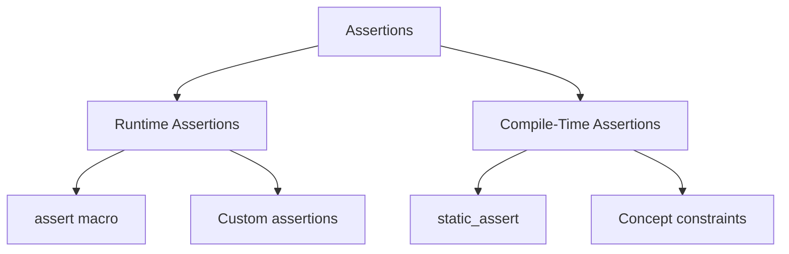

# Assertions and static_assert

**Assertions** are runtime or compile-time checks that verify program invariants and assumptions. They help catch bugs early during development and document expected conditions in code.

## Types of Assertions


## Runtime Assertions (assert)

The `assert` macro checks conditions at runtime in debug builds:
```cpp
#include <cassert>
#include <vector>

void processElement(const std::vector<int>& vec, size_t index) {
    // Precondition: index must be valid
    assert(index < vec.size());
    
    int value = vec[index];
    
    // Postcondition: value should be positive
    assert(value > 0);
    
    // Process value...
}

void invariantExample() {
    int* ptr = allocateMemory();
    
    // Invariant: allocation must succeed
    assert(ptr != nullptr);
    
    // Use ptr...
    
    delete ptr;
}
```

:::warning
`assert` is **disabled** in release builds (when `NDEBUG` is defined). Use it only for conditions that should never fail in correct code.
:::

## assert Behavior
```cpp
#include <cassert>

void assertBehavior() {
    int x = 5;
    
    // If condition is false:
    // 1. Prints error message with file, line, and condition
    // 2. Calls std::abort()
    // 3. Program terminates
    assert(x > 10);  // Assertion failed: x > 10, file.cpp:42
}

// Disable assertions in release builds
// Compile with: g++ -DNDEBUG program.cpp
#ifdef NDEBUG
    // assert becomes a no-op
#endif
```

### Assert vs Exception
```cpp
#include <cassert>
#include <stdexcept>

// Assert: programmer error (bug)
void assertExample(int* ptr) {
    assert(ptr != nullptr);  // Should never happen in correct code
    *ptr = 42;
}

// Exception: runtime error (expected failure)
void exceptionExample(const std::string& filename) {
    std::ifstream file(filename);
    if (!file) {
        throw std::runtime_error("Cannot open file");  // Expected failure
    }
}
```

| Assertion | Exception |
|-----------|-----------|
| **Programmer error** | **Runtime error** |
| Debug builds only | Always active |
| Documents assumptions | Handles failures |
| Terminates program | Recoverable |
| Preconditions/postconditions | Error handling |

## Assertion Categories

### Preconditions

Conditions that must be true before a function executes:
```cpp
#include <cassert>

double sqrt(double x) {
    // Precondition: x must be non-negative
    assert(x >= 0.0);
    
    // Implementation...
}

void processArray(int* arr, size_t size) {
    // Preconditions
    assert(arr != nullptr);
    assert(size > 0);
    
    // Process array...
}
```

### Postconditions

Conditions that must be true after a function executes:
```cpp
#include <cassert>

int* allocateBuffer(size_t size) {
    assert(size > 0);  // Precondition
    
    int* buffer = new int[size];
    
    assert(buffer != nullptr);  // Postcondition
    return buffer;
}

std::vector<int> sortVector(std::vector<int> vec) {
    std::sort(vec.begin(), vec.end());
    
    // Postcondition: vector is sorted
    assert(std::is_sorted(vec.begin(), vec.end()));
    
    return vec;
}
```

### Invariants

Conditions that must always be true for an object:
```cpp
#include <cassert>

class BankAccount {
    double balance_;
    
    void checkInvariant() const {
        // Invariant: balance cannot be negative
        assert(balance_ >= 0.0);
    }
    
public:
    BankAccount() : balance_(0.0) {
        checkInvariant();
    }
    
    void deposit(double amount) {
        assert(amount > 0.0);  // Precondition
        
        balance_ += amount;
        
        checkInvariant();  // Check invariant after modification
    }
    
    void withdraw(double amount) {
        assert(amount > 0.0);  // Precondition
        assert(balance_ >= amount);  // Precondition
        
        balance_ -= amount;
        
        checkInvariant();  // Check invariant
    }
};
```

## static_assert (Compile-Time)

`static_assert` checks conditions at compile time:
```cpp
#include <type_traits>

// Check type properties
template<typename T>
class Container {
    static_assert(std::is_copy_constructible_v<T>, 
                  "T must be copy constructible");
    static_assert(sizeof(T) <= 1024, 
                  "T is too large (max 1024 bytes)");
    
    // Implementation...
};

// Check constants
constexpr int BUFFER_SIZE = 256;
static_assert(BUFFER_SIZE > 0, "Buffer size must be positive");
static_assert(BUFFER_SIZE % 64 == 0, "Buffer size must be multiple of 64");

// Check sizes
static_assert(sizeof(int) == 4, "This code assumes 32-bit ints");
static_assert(sizeof(void*) == 8, "This code requires 64-bit pointers");

// Usage
void compileTimeChecks() {
    Container<int> c1;           // OK
    // Container<std::mutex> c2;  // Error: not copy constructible
}
```

:::success
`static_assert` provides **compile-time** guarantees with zero runtime cost. Use it for type checks, constants, and platform assumptions.
:::

## static_assert with Concepts (C++20)
```cpp
#include <concepts>

// Concept-based constraints
template<typename T>
concept Numeric = std::integral<T> || std::floating_point<T>;

template<typename T>
void processNumeric(T value) {
    static_assert(Numeric<T>, "T must be numeric type");
    // Or better: use concept directly
    // template<Numeric T> void processNumeric(T value) { ... }
}

// Compile-time size check
template<typename T>
struct Padded {
    static_assert(sizeof(T) < 256, "Type too large for padding");
    
    T data;
    char padding[256 - sizeof(T)];
};
```

## Custom Assertion Macros
```cpp
#include <iostream>
#include <cstdlib>

// Custom assert with custom message
#define ASSERT(condition, message) \
    do { \
        if (!(condition)) { \
            std::cerr << "Assertion failed: " << #condition << "\n" \
                      << "Message: " << message << "\n" \
                      << "File: " << __FILE__ << "\n" \
                      << "Line: " << __LINE__ << "\n"; \
            std::abort(); \
        } \
    } while(0)

// Verify macro (always active, even in release)
#define VERIFY(condition, message) \
    do { \
        if (!(condition)) { \
            std::cerr << "Verification failed: " << message << "\n"; \
            std::abort(); \
        } \
    } while(0)

void customAssertions() {
    int x = 5;
    
    ASSERT(x > 0, "x must be positive");
    VERIFY(x < 100, "x out of expected range");
}
```

### Release-Mode Assertions
```cpp
#include <iostream>

// Assertion that works in both debug and release
#define RELEASE_ASSERT(condition, message) \
    do { \
        if (!(condition)) { \
            std::cerr << "Critical error: " << message << "\n" \
                      << "At " << __FILE__ << ":" << __LINE__ << "\n"; \
            std::terminate(); \
        } \
    } while(0)

void criticalCheck() {
    int* ptr = getCriticalResource();
    
    // This check runs in release builds too
    RELEASE_ASSERT(ptr != nullptr, "Failed to acquire critical resource");
    
    // Use ptr...
}
```

## Assertion Levels
```cpp
// Level 0: Cheap checks (always enabled)
#define ASSERT_LEVEL_0(cond) assert(cond)

// Level 1: Moderate checks (debug only)
#if defined(DEBUG) && ASSERTION_LEVEL >= 1
    #define ASSERT_LEVEL_1(cond) assert(cond)
#else
    #define ASSERT_LEVEL_1(cond) ((void)0)
#endif

// Level 2: Expensive checks (verbose debug only)
#if defined(DEBUG) && ASSERTION_LEVEL >= 2
    #define ASSERT_LEVEL_2(cond) assert(cond)
#else
    #define ASSERT_LEVEL_2(cond) ((void)0)
#endif

void multilevelAssertions(const std::vector<int>& vec) {
    ASSERT_LEVEL_0(!vec.empty());                      // Cheap
    ASSERT_LEVEL_1(vec.size() < 1000);                 // Moderate
    ASSERT_LEVEL_2(std::is_sorted(vec.begin(), vec.end()));  // Expensive
}
```

## Assertion Patterns

### Unreachable Code
```cpp
#include <cassert>

enum class Color { Red, Green, Blue };

std::string colorToString(Color c) {
    switch (c) {
        case Color::Red:   return "Red";
        case Color::Green: return "Green";
        case Color::Blue:  return "Blue";
    }
    
    assert(false && "Unreachable: all enum values handled");
    return "Unknown";  // Suppress compiler warning
}

// C++23: std::unreachable
#if __cplusplus >= 202302L
    #include <utility>
    
    std::string colorToString(Color c) {
        switch (c) {
            case Color::Red:   return "Red";
            case Color::Green: return "Green";
            case Color::Blue:  return "Blue";
        }
        std::unreachable();  // Undefined behavior if reached
    }
#endif
```

### Range Checks
```cpp
#include <cassert>

template<typename T>
class BoundedValue {
    T value_;
    T min_;
    T max_;
    
    void checkInvariant() const {
        assert(value_ >= min_);
        assert(value_ <= max_);
    }
    
public:
    BoundedValue(T value, T min, T max)
        : value_(value), min_(min), max_(max) {
        assert(min <= max);
        checkInvariant();
    }
    
    void setValue(T value) {
        assert(value >= min_ && value <= max_);
        value_ = value;
        checkInvariant();
    }
    
    T getValue() const {
        checkInvariant();
        return value_;
    }
};
```

### Null Pointer Checks
```cpp
#include <cassert>
#include <memory>

template<typename T>
class NotNull {
    T* ptr_;
    
public:
    explicit NotNull(T* ptr) : ptr_(ptr) {
        assert(ptr != nullptr && "Pointer cannot be null");
    }
    
    NotNull(std::nullptr_t) = delete;  // Prevent null assignment
    
    T* get() const {
        assert(ptr_ != nullptr);  // Invariant
        return ptr_;
    }
    
    T& operator*() const {
        assert(ptr_ != nullptr);
        return *ptr_;
    }
    
    T* operator->() const {
        assert(ptr_ != nullptr);
        return ptr_;
    }
};

void usage() {
    int x = 42;
    NotNull<int> ptr(&x);
    
    // NotNull<int> invalid(nullptr);  // Compilation error
    
    std::cout << *ptr << '\n';  // Safe dereference
}
```

## Practical Examples

### Example 1: Circular Buffer
```cpp
#include <cassert>
#include <vector>

template<typename T>
class CircularBuffer {
    std::vector<T> buffer_;
    size_t head_ = 0;
    size_t tail_ = 0;
    size_t size_ = 0;
    
    void checkInvariant() const {
        assert(buffer_.capacity() > 0);
        assert(head_ < buffer_.capacity());
        assert(tail_ < buffer_.capacity());
        assert(size_ <= buffer_.capacity());
    }
    
public:
    explicit CircularBuffer(size_t capacity) {
        assert(capacity > 0);
        buffer_.resize(capacity);
        checkInvariant();
    }
    
    void push(const T& item) {
        assert(!isFull() && "Buffer is full");
        
        buffer_[tail_] = item;
        tail_ = (tail_ + 1) % buffer_.capacity();
        ++size_;
        
        checkInvariant();
    }
    
    T pop() {
        assert(!isEmpty() && "Buffer is empty");
        
        T item = buffer_[head_];
        head_ = (head_ + 1) % buffer_.capacity();
        --size_;
        
        checkInvariant();
        return item;
    }
    
    bool isEmpty() const {
        checkInvariant();
        return size_ == 0;
    }
    
    bool isFull() const {
        checkInvariant();
        return size_ == buffer_.capacity();
    }
};
```

### Example 2: Matrix Class
```cpp
#include <cassert>
#include <vector>

class Matrix {
    std::vector<double> data_;
    size_t rows_;
    size_t cols_;
    
    void checkInvariant() const {
        assert(rows_ > 0);
        assert(cols_ > 0);
        assert(data_.size() == rows_ * cols_);
    }
    
public:
    Matrix(size_t rows, size_t cols)
        : data_(rows * cols), rows_(rows), cols_(cols) {
        assert(rows > 0 && cols > 0);
        checkInvariant();
    }
    
    double& operator()(size_t row, size_t col) {
        assert(row < rows_);
        assert(col < cols_);
        checkInvariant();
        return data_[row * cols_ + col];
    }
    
    Matrix operator*(const Matrix& other) const {
        assert(cols_ == other.rows_ && "Incompatible matrix dimensions");
        
        Matrix result(rows_, other.cols_);
        
        // Matrix multiplication...
        
        result.checkInvariant();
        return result;
    }
};
```

### Example 3: State Machine
```cpp
#include <cassert>

enum class State { Idle, Running, Paused, Stopped };

class StateMachine {
    State state_ = State::Idle;
    
    void assertValidTransition(State from, State to) const {
        switch (from) {
            case State::Idle:
                assert(to == State::Running || to == State::Stopped);
                break;
            case State::Running:
                assert(to == State::Paused || to == State::Stopped);
                break;
            case State::Paused:
                assert(to == State::Running || to == State::Stopped);
                break;
            case State::Stopped:
                assert(to == State::Idle);
                break;
        }
    }
    
public:
    void start() {
        assertValidTransition(state_, State::Running);
        state_ = State::Running;
    }
    
    void pause() {
        assertValidTransition(state_, State::Paused);
        state_ = State::Paused;
    }
    
    void stop() {
        assertValidTransition(state_, State::Stopped);
        state_ = State::Stopped;
    }
    
    void reset() {
        assertValidTransition(state_, State::Idle);
        state_ = State::Idle;
    }
};
```

## Debug vs Release Builds
```cpp
// Debug build: g++ -g program.cpp
// - Assertions enabled
// - No optimization
// - Debug symbols

// Release build: g++ -O3 -DNDEBUG program.cpp
// - Assertions disabled
// - Full optimization
// - No debug symbols

void buildModes() {
    int x = calculateValue();
    
    #ifdef NDEBUG
        // Release mode
        if (x < 0) {
            handleError();  // Explicit error handling
        }
    #else
        // Debug mode
        assert(x >= 0);  // Catch bugs during development
    #endif
}
```

## Assertion Best Practices

:::success
**DO:**
- Use assertions to document assumptions
- Check preconditions, postconditions, and invariants
- Assert impossible conditions to catch bugs
- Use `static_assert` for compile-time checks
- Keep assertion conditions side-effect free
- Write meaningful assertion messages
  :::

:::danger
**DON'T:**
- Use assertions for error handling (use exceptions or error codes)
- Put important logic inside assertions (disabled in release!)
- Assert conditions that can legitimately fail at runtime
- Use assertions to validate user input
- Rely on assertions for security checks
  :::

## Common Mistakes
```cpp
// WRONG: Side effect in assertion
int count = 0;
assert(++count > 0);  // count not incremented in release build!

// CORRECT: Side-effect free
int count = getValue();
assert(count > 0);

// WRONG: Validating user input
void setAge(int age) {
    assert(age >= 0);  // User input needs runtime check!
    age_ = age;
}

// CORRECT: Runtime validation
void setAge(int age) {
    if (age < 0) {
        throw std::invalid_argument("Age cannot be negative");
    }
    age_ = age;
}

// WRONG: Security check
void authenticate(const std::string& password) {
    assert(password == correctPassword);  // Disabled in release!
}

// CORRECT: Always-active check
void authenticate(const std::string& password) {
    if (password != correctPassword) {
        throw std::runtime_error("Authentication failed");
    }
}
```

## Assertion vs Contract Programming
```cpp
// C++20 Contracts (not yet standardized, but proposed)
// [[expects: condition]]  - Precondition
// [[ensures: condition]]  - Postcondition
// [[assert: condition]]   - Assertion

// Future syntax (proposed):
double sqrt(double x)
    [[expects: x >= 0]]
    [[ensures result: result * result == x]]
{
    // Implementation...
}

// Current workaround:
double sqrtWithContract(double x) {
    // Precondition
    assert(x >= 0);
    
    double result = /* calculate sqrt */;
    
    // Postcondition
    assert(std::abs(result * result - x) < 0.0001);
    
    return result;
}
```

## Performance Considerations
```cpp
#include <cassert>
#include <algorithm>

void performanceSensitive(std::vector<int>& vec) {
    // Cheap assertion: OK even in hot path
    assert(!vec.empty());
    
    // Expensive assertion: use ASSERT_LEVEL_2
    #if ASSERTION_LEVEL >= 2
        assert(std::is_sorted(vec.begin(), vec.end()));
    #endif
    
    // Critical path code...
}
```

:::info
**Assertions are free in release builds** (with `NDEBUG` defined), but can be expensive in debug builds. Use assertion levels for expensive checks.
:::

## Related Topics

- **[Exceptions](01-exceptions.md)** - Runtime error handling
- **[Error Codes](03-error-codes.md)** - Alternative error handling
- **[Contracts](05-contracts.md)** - Formal contract programming
- **[Undefined Behavior](06-undefined-behavior.md)** - What happens when assertions fail