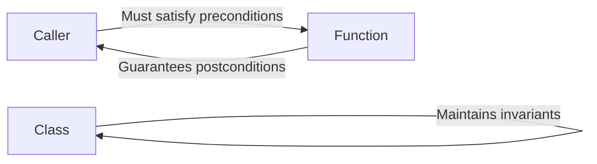

# Contracts (C++20)

**Contracts** are a programming paradigm that formally specifies the obligations and guarantees of code. They consist of **preconditions** (what callers must ensure), **postconditions** (what functions guarantee), and **invariants** (what must always be true).

## Design by Contract

Contract programming was popularized by Eiffel and formalizes the relationship between callers and callees:


### Contract Theory
```cpp
// Formal contract specification:
//
// Precondition:  What the caller must ensure before calling
// Postcondition: What the function guarantees after execution
// Invariant:     What must always be true for the object

// Example:
double sqrt(double x)
    // Precondition:  x >= 0
    // Postcondition: result * result == x (approximately)
{
    // Implementation...
}
```

## Current State (C++20/23)

:::warning
**Contracts were removed from C++20** before finalization. The feature is being redesigned for a future standard (possibly C++26). Current C++ uses **assertions** and **documentation** to express contracts.
:::

### Proposed Syntax (Future C++)
```cpp
// Proposed contract syntax (not yet standardized):

double sqrt(double x)
    [[expects: x >= 0.0]]
    [[ensures result: result * result == x]]
{
    double result = /* compute sqrt */;
    return result;
}

class BankAccount {
    double balance_;
    
    [[invariant: balance_ >= 0.0]]
    
public:
    void withdraw(double amount)
        [[expects: amount > 0.0]]
        [[expects: balance_ >= amount]]
        [[ensures: balance_ == old(balance_) - amount]]
    {
        balance_ -= amount;
    }
};
```

## Current Approaches

Since contracts aren't standardized, we use these alternatives:

### 1. Assertions
```cpp
#include <cassert>

double sqrt(double x) {
    // Precondition
    assert(x >= 0.0 && "sqrt requires non-negative input");
    
    double result = /* compute */;
    
    // Postcondition
    assert(std::abs(result * result - x) < 0.0001);
    
    return result;
}
```

### 2. Documentation
```cpp
/**
 * Computes the square root of a number.
 * 
 * @param x The number to compute square root of
 * @return The square root of x
 * 
 * @pre x >= 0.0
 * @post result * result == x (approximately)
 */
double sqrt(double x);
```

### 3. Runtime Checks
```cpp
#include <stdexcept>

double sqrt(double x) {
    if (x < 0.0) {
        throw std::invalid_argument("sqrt requires non-negative input");
    }
    
    double result = /* compute */;
    
    // Postcondition check (in debug builds)
    assert(std::abs(result * result - x) < 0.0001);
    
    return result;
}
```

### 4. Custom Contract Macros
```cpp
#include <iostream>
#include <cstdlib>

#define REQUIRES(condition, message) \
    do { \
        if (!(condition)) { \
            std::cerr << "Precondition violated: " << message << "\n" \
                      << "At " << __FILE__ << ":" << __LINE__ << "\n"; \
            std::abort(); \
        } \
    } while(0)

#define ENSURES(condition, message) \
    do { \
        if (!(condition)) { \
            std::cerr << "Postcondition violated: " << message << "\n" \
                      << "At " << __FILE__ << ":" << __LINE__ << "\n"; \
            std::abort(); \
        } \
    } while(0)

double sqrt(double x) {
    REQUIRES(x >= 0.0, "x must be non-negative");
    
    double result = /* compute */;
    
    ENSURES(std::abs(result * result - x) < 0.0001, 
            "result must be approximate square root");
    
    return result;
}
```

## Preconditions

Conditions that must be true before a function executes:
```cpp
#include <cassert>
#include <vector>

// Precondition: index must be valid
int& elementAt(std::vector<int>& vec, size_t index) {
    assert(index < vec.size() && "Index out of bounds");
    return vec[index];
}

// Precondition: pointers must not be null
void swap(int* a, int* b) {
    assert(a != nullptr && "First pointer is null");
    assert(b != nullptr && "Second pointer is null");
    
    int temp = *a;
    *a = *b;
    *b = temp;
}

// Multiple preconditions
void transfer(BankAccount& from, BankAccount& to, double amount) {
    assert(amount > 0.0 && "Amount must be positive");
    assert(from.balance() >= amount && "Insufficient funds");
    assert(&from != &to && "Cannot transfer to same account");
    
    from.withdraw(amount);
    to.deposit(amount);
}
```

### Precondition Checking Strategies
```cpp
// Strategy 1: Debug assertions only
void debugCheckOnly(int* ptr) {
    assert(ptr != nullptr);  // Disabled in release
    *ptr = 42;
}

// Strategy 2: Always check, throw exception
void alwaysCheck(int* ptr) {
    if (ptr == nullptr) {
        throw std::invalid_argument("Null pointer");
    }
    *ptr = 42;
}

// Strategy 3: Conditional compilation
void conditionalCheck(int* ptr) {
    #ifdef ENABLE_CONTRACT_CHECKS
        if (ptr == nullptr) {
            std::cerr << "Contract violation: null pointer\n";
            std::abort();
        }
    #endif
    *ptr = 42;
}
```

## Postconditions

Conditions that must be true after a function executes:
```cpp
#include <cassert>
#include <algorithm>

std::vector<int> sortVector(std::vector<int> vec) {
    std::sort(vec.begin(), vec.end());
    
    // Postcondition: result is sorted
    assert(std::is_sorted(vec.begin(), vec.end()));
    
    return vec;
}

// Postcondition with old value
int increment(int& value) {
    int old_value = value;
    ++value;
    
    // Postcondition: value increased by 1
    assert(value == old_value + 1);
    
    return value;
}

// Complex postcondition
std::vector<int> merge(const std::vector<int>& a, const std::vector<int>& b) {
    std::vector<int> result;
    result.reserve(a.size() + b.size());
    
    std::merge(a.begin(), a.end(), b.begin(), b.end(), 
               std::back_inserter(result));
    
    // Postconditions
    assert(result.size() == a.size() + b.size());
    assert(std::is_sorted(result.begin(), result.end()));
    
    return result;
}
```

### Postcondition Helper
```cpp
#include <functional>

template<typename T>
class PostconditionChecker {
    T old_value_;
    std::function<void(const T&, const T&)> check_;
    T& current_value_;
    
public:
    PostconditionChecker(T& value, std::function<void(const T&, const T&)> check)
        : old_value_(value), check_(check), current_value_(value) {}
    
    ~PostconditionChecker() {
        check_(old_value_, current_value_);
    }
};

void usePostconditionChecker() {
    int count = 0;
    
    {
        PostconditionChecker checker(count, [](int old_val, int new_val) {
            assert(new_val == old_val + 1 && "Count should increment by 1");
        });
        
        ++count;
    }  // Checker validates postcondition here
}
```

## Invariants

Conditions that must always be true for an object:
```cpp
#include <cassert>

class Stack {
    std::vector<int> data_;
    
    // Class invariant: size is non-negative and matches container
    void checkInvariant() const {
        assert(data_.size() >= 0);  // Always true for vector
    }
    
public:
    Stack() {
        checkInvariant();
    }
    
    void push(int value) {
        size_t old_size = data_.size();
        
        data_.push_back(value);
        
        checkInvariant();
        assert(data_.size() == old_size + 1);
    }
    
    int pop() {
        assert(!data_.empty() && "Cannot pop from empty stack");
        
        int value = data_.back();
        data_.pop_back();
        
        checkInvariant();
        return value;
    }
    
    size_t size() const {
        checkInvariant();
        return data_.size();
    }
};
```

### Complex Invariants
```cpp
class BinarySearchTree {
    struct Node {
        int value;
        Node* left;
        Node* right;
    };
    
    Node* root_ = nullptr;
    size_t size_ = 0;
    
    // Invariant: tree is correctly structured
    bool checkInvariant(Node* node, int min, int max) const {
        if (node == nullptr) return true;
        
        // Value must be in range
        if (node->value <= min || node->value >= max) {
            return false;
        }
        
        // Recursively check subtrees
        return checkInvariant(node->left, min, node->value) &&
               checkInvariant(node->right, node->value, max);
    }
    
public:
    void insert(int value) {
        // Insert logic...
        ++size_;
        
        // Check invariant after modification
        assert(checkInvariant(root_, 
                              std::numeric_limits<int>::min(),
                              std::numeric_limits<int>::max()));
    }
};
```

## Contract Levels
```cpp
// Level 0: No checks (release build)
#define CONTRACT_LEVEL 0

// Level 1: Cheap checks (basic validation)
#define CONTRACT_LEVEL 1

// Level 2: All checks (full validation)
#define CONTRACT_LEVEL 2

#if CONTRACT_LEVEL >= 1
    #define REQUIRES_BASIC(cond) assert(cond)
#else
    #define REQUIRES_BASIC(cond) ((void)0)
#endif

#if CONTRACT_LEVEL >= 2
    #define REQUIRES_FULL(cond) assert(cond)
#else
    #define REQUIRES_FULL(cond) ((void)0)
#endif

void processData(const std::vector<int>& data) {
    REQUIRES_BASIC(!data.empty());  // Always check in dev builds
    REQUIRES_FULL(std::is_sorted(data.begin(), data.end()));  // Expensive
    
    // Process...
}
```

## Practical Examples

### Example 1: Bank Account with Contracts
```cpp
#include <cassert>
#include <string>

class BankAccount {
    std::string owner_;
    double balance_;
    
    // Invariant
    void checkInvariant() const {
        assert(!owner_.empty() && "Owner name cannot be empty");
        assert(balance_ >= 0.0 && "Balance cannot be negative");
    }
    
public:
    BankAccount(const std::string& owner, double initial_balance)
        : owner_(owner), balance_(initial_balance) {
        // Preconditions
        assert(!owner.empty() && "Owner name cannot be empty");
        assert(initial_balance >= 0.0 && "Initial balance cannot be negative");
        
        checkInvariant();
    }
    
    void deposit(double amount) {
        // Precondition
        assert(amount > 0.0 && "Deposit amount must be positive");
        
        double old_balance = balance_;
        balance_ += amount;
        
        // Postcondition
        assert(balance_ == old_balance + amount);
        checkInvariant();
    }
    
    void withdraw(double amount) {
        // Preconditions
        assert(amount > 0.0 && "Withdrawal amount must be positive");
        assert(balance_ >= amount && "Insufficient funds");
        
        double old_balance = balance_;
        balance_ -= amount;
        
        // Postcondition
        assert(balance_ == old_balance - amount);
        checkInvariant();
    }
    
    double getBalance() const {
        checkInvariant();
        return balance_;
    }
};
```

### Example 2: Bounded Queue
```cpp
#include <cassert>
#include <deque>

template<typename T>
class BoundedQueue {
    std::deque<T> queue_;
    size_t max_size_;
    
    // Invariants
    void checkInvariant() const {
        assert(max_size_ > 0 && "Max size must be positive");
        assert(queue_.size() <= max_size_ && "Queue exceeded max size");
    }
    
public:
    explicit BoundedQueue(size_t max_size) : max_size_(max_size) {
        assert(max_size > 0 && "Max size must be positive");
        checkInvariant();
    }
    
    bool push(const T& item) {
        checkInvariant();
        
        // Precondition documented, but not enforced (returns bool instead)
        if (queue_.size() >= max_size_) {
            return false;
        }
        
        size_t old_size = queue_.size();
        queue_.push_back(item);
        
        // Postconditions
        assert(queue_.size() == old_size + 1);
        checkInvariant();
        
        return true;
    }
    
    T pop() {
        // Precondition
        assert(!queue_.empty() && "Cannot pop from empty queue");
        checkInvariant();
        
        T item = queue_.front();
        size_t old_size = queue_.size();
        queue_.pop_front();
        
        // Postcondition
        assert(queue_.size() == old_size - 1);
        checkInvariant();
        
        return item;
    }
    
    bool isEmpty() const {
        checkInvariant();
        return queue_.empty();
    }
    
    bool isFull() const {
        checkInvariant();
        return queue_.size() >= max_size_;
    }
};
```

### Example 3: Safe Division
```cpp
#include <optional>
#include <cassert>

// Contract-based division
std::optional<double> safeDivide(double numerator, double denominator) {
    // Precondition: denominator must not be zero
    // Instead of asserting, we return optional to handle gracefully
    
    if (denominator == 0.0) {
        return std::nullopt;
    }
    
    double result = numerator / denominator;
    
    // Postcondition: result * denominator == numerator (approximately)
    assert(std::abs(result * denominator - numerator) < 0.0001);
    
    return result;
}

// Strict contract version
double strictDivide(double numerator, double denominator) {
    // Precondition: must be enforced by caller
    assert(denominator != 0.0 && "Division by zero");
    
    double result = numerator / denominator;
    
    // Postcondition
    assert(std::abs(result * denominator - numerator) < 0.0001);
    
    return result;
}
```

## Contract Violation Handling
```cpp
#include <iostream>
#include <cstdlib>

enum class ContractViolation {
    Precondition,
    Postcondition,
    Invariant
};

void handleContractViolation(ContractViolation type, 
                             const char* message,
                             const char* file,
                             int line) {
    const char* type_str;
    switch (type) {
        case ContractViolation::Precondition:
            type_str = "Precondition";
            break;
        case ContractViolation::Postcondition:
            type_str = "Postcondition";
            break;
        case ContractViolation::Invariant:
            type_str = "Invariant";
            break;
    }
    
    std::cerr << type_str << " violation: " << message << "\n"
              << "At " << file << ":" << line << "\n";
    
    std::abort();
}

#define CHECK_PRECONDITION(cond, msg) \
    do { \
        if (!(cond)) { \
            handleContractViolation(ContractViolation::Precondition, \
                                   msg, __FILE__, __LINE__); \
        } \
    } while(0)

#define CHECK_POSTCONDITION(cond, msg) \
    do { \
        if (!(cond)) { \
            handleContractViolation(ContractViolation::Postcondition, \
                                   msg, __FILE__, __LINE__); \
        } \
    } while(0)
```

## Benefits of Contract Programming

:::success
**Advantages:**
- **Documentation** - Contracts formalize API requirements
- **Bug Detection** - Catch errors early, close to their source
- **Defensive Programming** - Explicit about assumptions
- **Testing** - Contracts serve as executable specifications
- **Maintenance** - Clear responsibilities between components
  :::

## Contract vs Exception
```cpp
// Contract approach: caller's responsibility
void processIndex(const std::vector<int>& vec, size_t index) {
    // Precondition: caller must ensure valid index
    assert(index < vec.size());
    
    int value = vec[index];
    // Process...
}

// Exception approach: function validates and reports
void processIndexSafe(const std::vector<int>& vec, size_t index) {
    // Function validates input
    if (index >= vec.size()) {
        throw std::out_of_range("Index out of bounds");
    }
    
    int value = vec[index];
    // Process...
}

// When to use which:
// - Contracts: programmer errors (bugs)
// - Exceptions: runtime errors (external failures)
```

## Best Practices

:::success
**DO:**
- Document all preconditions, postconditions, and invariants
- Check invariants at the end of every public method
- Use assertions for development builds
- Keep contract checks side-effect free
- Make preconditions as weak as possible
- Make postconditions as strong as possible
  :::

:::danger
**DON'T:**
- Use contracts for validating external input (use exceptions)
- Put important logic inside contract checks
- Make contracts too expensive (affects debug performance)
- Violate contracts intentionally
- Assume contracts replace all testing
  :::

_## Related Topics_

- **[Assertions](04-assertions.md)** - Runtime and compile-time checks
- **[Exceptions](01-exceptions.md)** - Error handling mechanism
- **[Error Codes](03-error-codes.md)** - Alternative error handling
- **[Undefined Behavior](06-undefined-behavior.md)** - Consequences of violations