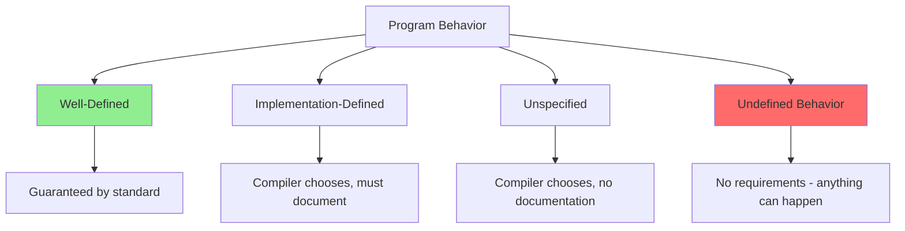

# Undefined Behavior

**Undefined Behavior (UB)** occurs when the C++ standard places no requirements on what happens in a given situation. The program may crash, produce incorrect results, or appear to work correctly—there are no guarantees.

## What is Undefined Behavior?


### Why UB Exists
```cpp
// Reason 1: Performance
int arr[10];
int x = arr[5];  // No bounds checking for speed

// Reason 2: Platform differences
int size = sizeof(int);  // Different on different platforms

// Reason 3: Impossible to detect all cases
int* ptr = nullptr;
if (someComplexCondition()) {
    ptr = &value;
}
*ptr;  // Compiler cannot always detect UB
```

:::danger
Undefined Behavior is **not a bug that can be caught**. It means the C++ standard makes **no guarantees** about program behavior. The program might work today and fail tomorrow.
:::

## Common Sources of UB

### 1. Out-of-Bounds Access
```cpp
#include <vector>

void outOfBounds() {
    int arr[5] = {1, 2, 3, 4, 5};
    
    // UB: accessing beyond array bounds
    int x = arr[10];        // Undefined behavior!
    arr[-1] = 42;           // Undefined behavior!
    
    std::vector<int> vec = {1, 2, 3};
    vec[10] = 42;           // UB: no bounds checking with []
    
    // Correct: bounds-checked access
    int y = vec.at(1);      // Throws if out of bounds
}
```

### 2. Null Pointer Dereference
```cpp
void nullPointerDereference() {
    int* ptr = nullptr;
    
    // UB: dereferencing null pointer
    *ptr = 42;              // Undefined behavior!
    int x = *ptr;           // Undefined behavior!
    
    // Correct: check before dereferencing
    if (ptr != nullptr) {
        *ptr = 42;
    }
}
```

### 3. Use After Free / Dangling Pointers
```cpp
void useAfterFree() {
    int* ptr = new int(42);
    delete ptr;
    
    // UB: using pointer after delete
    *ptr = 100;             // Undefined behavior!
    int x = *ptr;           // Undefined behavior!
    
    // UB: double delete
    delete ptr;             // Undefined behavior!
}

void danglingPointer() {
    int* ptr;
    {
        int value = 42;
        ptr = &value;
    }  // value destroyed
    
    // UB: ptr now points to destroyed object
    *ptr = 100;             // Undefined behavior!
}
```

### 4. Signed Integer Overflow
```cpp
#include <limits>

void signedOverflow() {
    int max = std::numeric_limits<int>::max();
    
    // UB: signed integer overflow
    int overflow = max + 1;  // Undefined behavior!
    
    // UB: signed integer underflow  
    int min = std::numeric_limits<int>::min();
    int underflow = min - 1;  // Undefined behavior!
    
    // Note: unsigned overflow is well-defined (wraps around)
    unsigned int u_max = std::numeric_limits<unsigned int>::max();
    unsigned int u_wrap = u_max + 1;  // OK: wraps to 0
}
```

### 5. Division by Zero
```cpp
void divisionByZero() {
    int x = 10;
    int y = 0;
    
    // UB: division by zero
    int result = x / y;      // Undefined behavior!
    int remainder = x % y;   // Undefined behavior!
    
    // Correct: check before dividing
    if (y != 0) {
        result = x / y;
    }
}
```

### 6. Uninitialized Variables
```cpp
void uninitializedVariables() {
    int x;                   // Uninitialized
    
    // UB: reading uninitialized variable
    int y = x + 1;          // Undefined behavior!
    
    // Correct: initialize before use
    int z = 0;
    int w = z + 1;          // OK
}
```

### 7. Data Races
```cpp
#include <thread>

int global_counter = 0;

void dataRace() {
    // UB: data race on global_counter
    std::thread t1([]{ ++global_counter; });
    std::thread t2([]{ ++global_counter; });
    
    t1.join();
    t2.join();
    // Result is undefined!
}
```

### 8. Modifying String Literals
```cpp
void modifyStringLiteral() {
    char* str = "Hello";
    
    // UB: string literals are immutable
    str[0] = 'h';           // Undefined behavior!
    
    // Correct: use mutable array
    char str2[] = "Hello";
    str2[0] = 'h';          // OK
}
```

### 9. Invalid Casts
```cpp
void invalidCasts() {
    int x = 42;
    
    // UB: reinterpret_cast with incompatible types
    double* ptr = reinterpret_cast<double*>(&x);
    *ptr = 3.14;            // Undefined behavior!
    
    // UB: accessing wrong member of union
    union U {
        int i;
        double d;
    };
    
    U u;
    u.i = 42;
    double d = u.d;         // Undefined behavior!
}
```

### 10. Violating the One Definition Rule (ODR)
```cpp
// file1.cpp
struct Widget {
    int x;
};

// file2.cpp
struct Widget {
    double x;  // Different definition!
};

// UB: ODR violation
```

### 11. Array Index Out of Bounds in Constant Expression
```cpp
constexpr int arr[] = {1, 2, 3};

constexpr int getElement() {
    // UB: out of bounds in constexpr
    return arr[10];  // Compilation may fail or produce UB
}
```

### 12. Strict Aliasing Violation
```cpp
void strictAliasing() {
    int x = 42;
    
    // UB: violating strict aliasing rule
    float* f = reinterpret_cast<float*>(&x);
    *f = 3.14f;             // Undefined behavior!
    
    // Correct: use memcpy
    float result;
    std::memcpy(&result, &x, sizeof(float));
}
```

## Consequences of UB
```cpp
// Example 1: Optimizer assumes no UB
int foolTheOptimizer(int* ptr) {
    int value = *ptr;       // Optimizer assumes ptr is not null
    
    if (ptr == nullptr) {
        return 0;           // Optimizer may remove this check!
    }
    
    return value;
}

// Example 2: Time travel
bool timeTravel() {
    int* p = nullptr;
    bool result = (p != nullptr);  // false
    
    *p = 42;                // UB: null dereference
    
    // Compiler may optimize based on UB assumption:
    // "If we reach here, p must have been non-null"
    // So it may return true!
    return result;
}

// Example 3: Nasal demons
void nasalDemons() {
    // With UB, literally anything can happen:
    // - Crash
    // - Silent corruption
    // - Appear to work
    // - Format hard drive
    // - Make demons fly out of your nose (famous quote)
}
```

:::warning
Compilers **assume UB never happens** and optimize accordingly. This can lead to seemingly impossible behavior!
:::

## Detecting Undefined Behavior

### 1. Compiler Warnings
```bash
# Enable all warnings
g++ -Wall -Wextra -Wpedantic program.cpp

# Specific UB-related warnings
g++ -Wnull-dereference -Wuninitialized -Warray-bounds program.cpp
```

### 2. Sanitizers
```bash
# Address Sanitizer (memory errors)
g++ -fsanitize=address program.cpp

# Undefined Behavior Sanitizer
g++ -fsanitize=undefined program.cpp

# Thread Sanitizer (data races)
g++ -fsanitize=thread program.cpp

# Memory Sanitizer (uninitialized reads)
clang++ -fsanitize=memory program.cpp
```
```cpp
// Example with AddressSanitizer
#include <iostream>

int main() {
    int arr[5] = {1, 2, 3, 4, 5};
    
    // ASan will detect this
    std::cout << arr[10] << '\n';
    
    return 0;
}

// Compile: g++ -fsanitize=address -g test.cpp
// Output: AddressSanitizer: heap-buffer-overflow
```

### 3. Static Analysis Tools
```bash
# Clang Static Analyzer
clang++ --analyze program.cpp

# Clang-Tidy
clang-tidy program.cpp

# Cppcheck
cppcheck program.cpp
```

### 4. Valgrind
```bash
# Memory error detection
valgrind --leak-check=full ./program

# Example output for UB:
# Invalid read of size 4
# Address 0x0 is not stack'd, malloc'd or (recently) free'd
```

## Avoiding Undefined Behavior

### Safe Coding Patterns
```cpp
#include <vector>
#include <optional>
#include <cassert>

// Pattern 1: Bounds checking
void safeBoundsCheck(const std::vector<int>& vec, size_t index) {
    // Use at() instead of []
    try {
        int value = vec.at(index);
    } catch (const std::out_of_range&) {
        // Handle error
    }
    
    // Or check manually
    if (index < vec.size()) {
        int value = vec[index];
    }
}

// Pattern 2: Optional for possibly-null values
std::optional<int> findValue(const std::vector<int>& vec, int target) {
    auto it = std::find(vec.begin(), vec.end(), target);
    if (it != vec.end()) {
        return *it;
    }
    return std::nullopt;
}

// Pattern 3: RAII for resource management
void safeResourceManagement() {
    auto ptr = std::make_unique<int>(42);
    // Automatic cleanup, no dangling pointers
}

// Pattern 4: Assertions for preconditions
void safePreconditions(int* ptr) {
    assert(ptr != nullptr);
    *ptr = 42;
}

// Pattern 5: Range-based for loops
void safeIteration(const std::vector<int>& vec) {
    // No index arithmetic
    for (int value : vec) {
        process(value);
    }
}
```

### Safe Integer Arithmetic
```cpp
#include <limits>
#include <optional>

// Check before overflow
std::optional<int> safeAdd(int a, int b) {
    if (a > 0 && b > std::numeric_limits<int>::max() - a) {
        return std::nullopt;  // Would overflow
    }
    if (a < 0 && b < std::numeric_limits<int>::min() - a) {
        return std::nullopt;  // Would underflow
    }
    return a + b;
}

// Use wider type
int64_t safeMultiply(int32_t a, int32_t b) {
    return static_cast<int64_t>(a) * static_cast<int64_t>(b);
}

// Use checked arithmetic library (C++26 or external)
#if __cplusplus >= 202600L
    #include <stdckdint.h>
    
    bool safeAddChecked(int a, int b, int* result) {
        return !ckd_add(result, a, b);
    }
#endif
```

## Real-World UB Examples

### Example 1: Buffer Overflow
```cpp
// WRONG: buffer overflow
void unsafeCopy(const char* source) {
    char buffer[10];
    strcpy(buffer, source);  // UB if source > 10 chars
}

// CORRECT: bounds checking
void safeCopy(const char* source) {
    char buffer[10];
    strncpy(buffer, source, sizeof(buffer) - 1);
    buffer[sizeof(buffer) - 1] = '\0';
}

// BETTER: use std::string
void modernCopy(const std::string& source) {
    std::string buffer = source.substr(0, 9);
}
```

### Example 2: Iterator Invalidation
```cpp
#include <vector>

// WRONG: iterator invalidation
void unsafeIteration(std::vector<int>& vec) {
    for (auto it = vec.begin(); it != vec.end(); ++it) {
        if (*it == 0) {
            vec.erase(it);  // UB: invalidates iterator!
        }
    }
}

// CORRECT: use erase return value
void safeIteration(std::vector<int>& vec) {
    for (auto it = vec.begin(); it != vec.end(); ) {
        if (*it == 0) {
            it = vec.erase(it);  // Returns next valid iterator
        } else {
            ++it;
        }
    }
}

// MODERN: use erase-remove idiom
void modernIteration(std::vector<int>& vec) {
    vec.erase(std::remove(vec.begin(), vec.end(), 0), vec.end());
}
```

### Example 3: Object Lifetime
```cpp
// WRONG: returning reference to local
const std::string& unsafeReturn() {
    std::string local = "temporary";
    return local;  // UB: returns reference to destroyed object
}

// CORRECT: return by value
std::string safeReturn() {
    std::string local = "temporary";
    return local;  // OK: moved or copied
}

// CORRECT: return static
const std::string& safeStaticReturn() {
    static std::string persistent = "permanent";
    return persistent;  // OK: static storage duration
}
```

## Practical Guidelines

:::success
**DO:**
- Enable all compiler warnings (`-Wall -Wextra`)
- Use sanitizers during development
- Initialize all variables before use
- Use bounds-checked access (`at()` instead of `[]`)
- Use RAII for resource management
- Validate input from external sources
- Use smart pointers instead of raw pointers
- Write unit tests with sanitizers enabled
  :::

:::danger
**DON'T:**
- Assume uninitialized variables are zero
- Dereference pointers without checking
- Access arrays without bounds checking
- Mix signed and unsigned arithmetic carelessly
- Cast between unrelated types with reinterpret_cast
- Modify string literals
- Ignore compiler warnings
- Assume "it works on my machine" means it's correct
  :::

## UB vs Other Behaviors

| Type                       | Definition                         | Example                           |
|----------------------------|------------------------------------|-----------------------------------|
| **Undefined Behavior**     | No guarantees                      | Null dereference                  |
| **Implementation-Defined** | Compiler chooses, must document    | `sizeof(int)`                     |
| **Unspecified**            | Compiler chooses, no documentation | Order of function args evaluation |
| **Well-Defined**           | Standardized behavior              | `1 + 1 == 2`                      |

## Common Myths

:::warning
**Myth**: "UB crashes the program"
**Reality**: UB can do anything, including appearing to work correctly

**Myth**: "If it works in testing, it's safe"
**Reality**: UB can be triggered by optimization levels, platforms, or compiler versions

**Myth**: "The compiler will warn about all UB"
**Reality**: Many UB cases are impossible to detect at compile time

**Myth**: "UB is like a runtime error"
**Reality**: UB means the entire program is meaningless, not just the error point
:::

## Related Topics

- **[Assertions](04-assertions.md)** - Catching violations early
- **[Exceptions](01-exceptions.md)** - Handling errors
- **[Error Codes](03-error-codes.md)** - Alternative error handling

[//]: # (- **[Sanitizers]&#40;../15-debugging-and-profiling/sanitizers.md&#41;** - Detecting UB at runtime)
[//]: # (- **[Static Analysis]&#40;../17-testing-and-quality/static-analysis.md&#41;** - Finding UB at compile time)