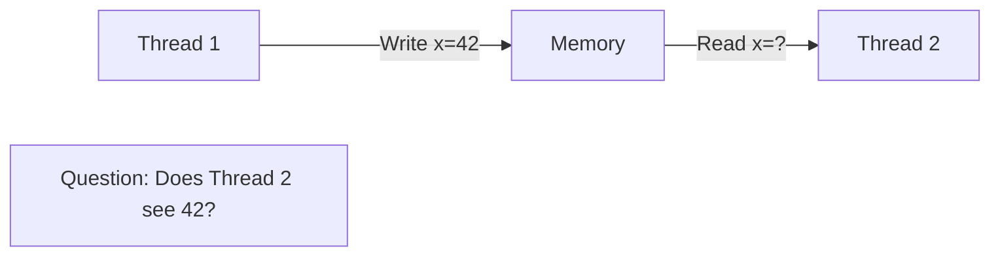

# C++ Memory Model

The **C++ memory model** defines how threads interact through memory, including visibility of writes, ordering of operations, and synchronization primitives.

## Why a Memory Model?


Without a memory model, behavior is **undefined**. The memory model provides guarantees.

## Sequential Consistency

The simplest model: operations appear in program order:
```cpp
// Thread 1
int x = 0;
int y = 0;

// Thread 1
x = 1;
y = 2;

// Thread 2
int a = y;  // If a==2...
int b = x;  // ...then b==1 (sequential consistency)
```

:::info
**Sequential consistency** means all threads see operations in the same order. This is intuitive but expensive.
:::

## Happens-Before Relationship

Operation A **happens-before** operation B if:
1. A and B are in the same thread and A comes before B
2. A synchronizes-with B
3. Transitivity: A happens-before C, C happens-before B → A happens-before B
```cpp
#include <atomic>
#include <thread>

std::atomic<bool> ready{false};
int data = 0;

void producer() {
    data = 42;              // (1)
    ready.store(true);      // (2) Release
}

void consumer() {
    while (!ready.load()) { // (3) Acquire
        // Wait
    }
    assert(data == 42);     // (4) Guaranteed to see 42
}

// (1) happens-before (2) happens-before (3) happens-before (4)
```

## Memory Orders

C++ provides six memory orderings:

| Order | Guarantee | Use Case |
|-------|-----------|----------|
| `memory_order_relaxed` | No ordering, only atomicity | Counters |
| `memory_order_consume` | Data dependency ordering | Rarely used |
| `memory_order_acquire` | Synchronize with release | Lock acquisition |
| `memory_order_release` | Synchronize with acquire | Lock release |
| `memory_order_acq_rel` | Both acquire and release | Read-modify-write |
| `memory_order_seq_cst` | Sequential consistency | Default (safe) |

### Sequential Consistency (seq_cst)
```cpp
#include <atomic>

std::atomic<int> x{0}, y{0};

// Thread 1
x.store(1, std::memory_order_seq_cst);
int r1 = y.load(std::memory_order_seq_cst);

// Thread 2
y.store(1, std::memory_order_seq_cst);
int r2 = x.load(std::memory_order_seq_cst);

// Guarantee: r1==0 && r2==0 is IMPOSSIBLE with seq_cst
```

### Acquire-Release
```cpp
#include <atomic>
#include <thread>

std::atomic<bool> ready{false};
int payload = 0;

void producer() {
    payload = 42;
    ready.store(true, std::memory_order_release);  // Release
}

void consumer() {
    while (!ready.load(std::memory_order_acquire)) {  // Acquire
        // Spin
    }
    assert(payload == 42);  // Guaranteed!
}
```

:::success
**Acquire-Release** is faster than seq_cst and sufficient for most synchronization.
:::

### Relaxed
```cpp
#include <atomic>

std::atomic<int> counter{0};

void increment() {
    counter.fetch_add(1, std::memory_order_relaxed);
}

// Only atomicity guaranteed, no ordering
// Good for statistics counters where exact order doesn't matter
```

## Data Races

A **data race** occurs when:
1. Two threads access the same memory location
2. At least one access is a write
3. No synchronization between them
```cpp
// DATA RACE!
int global = 0;

void thread1() {
    global = 1;  // Write
}

void thread2() {
    int x = global;  // Read
}

// Solution: Use atomic or mutex
std::atomic<int> global{0};
```

:::danger
Data races cause **undefined behavior**. Use atomics or locks to prevent them.
:::

## Practical Examples

### Example 1: Spinlock
```cpp
#include <atomic>

class Spinlock {
    std::atomic<bool> locked_{false};
    
public:
    void lock() {
        while (locked_.exchange(true, std::memory_order_acquire)) {
            // Spin
        }
    }
    
    void unlock() {
        locked_.store(false, std::memory_order_release);
    }
};
```

### Example 2: Lazy Initialization
```cpp
#include <atomic>

class Singleton {
    static std::atomic<Singleton*> instance_;
    
    Singleton() = default;
    
public:
    static Singleton* getInstance() {
        Singleton* tmp = instance_.load(std::memory_order_acquire);
        if (tmp == nullptr) {
            tmp = new Singleton();
            instance_.store(tmp, std::memory_order_release);
        }
        return tmp;
    }
};
```

### Example 3: Statistics Counter
```cpp
#include <atomic>

class Stats {
    std::atomic<int> requests_{0};
    std::atomic<int> errors_{0};
    
public:
    void recordRequest() {
        requests_.fetch_add(1, std::memory_order_relaxed);
    }
    
    void recordError() {
        errors_.fetch_add(1, std::memory_order_relaxed);
    }
    
    int getRequests() const {
        return requests_.load(std::memory_order_relaxed);
    }
};
```

## Best Practices

:::success
**DO:**
- Use `seq_cst` (default) unless profiling shows bottleneck
- Use acquire-release for locks and flags
- Use relaxed for independent counters
- Prefer high-level primitives (mutex, condition_variable)
  :::

:::danger
**DON'T:**
- Use relaxed memory order without understanding it
- Mix atomic and non-atomic access to same variable
- Assume operations are ordered without synchronization
  :::

## Related Topics

- **[Atomics and fences](02-atomics-and-fences.md)** - Atomic operations and memory barriers
- **[Mutexes](05-mutexes.md)** - Synchronization primitives
- **[Data Races](03-data-races.md)** - Race conditions