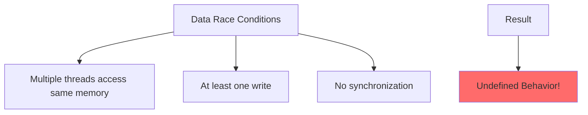

# Data Races and Race Conditions

A **data race** occurs when two or more threads access the same memory location concurrently, at least one access is a write, and there's no synchronization between them. Data races cause **undefined behavior**.

## What is a Data Race?

```cpp
// DATA RACE!
int counter = 0;

void increment() {
    ++counter;  // Read, increment, write
}

// Thread 1 and Thread 2 both call increment()
// Load: 0       Load: 0
// Add:  1       Add:  1
// Store: 1      Store: 1
// Result: counter = 1 (should be 2!)
```

## Common Data Race Examples

### Example 1: Unsynchronized Counter
```cpp
// WRONG: Data race
int globalCounter = 0;

void worker() {
    for (int i = 0; i < 1000; ++i) {
        ++globalCounter;  // DATA RACE!
    }
}

int main() {
    std::thread t1(worker);
    std::thread t2(worker);
    t1.join();
    t2.join();
    
    std::cout << globalCounter << '\n';  // Undefined! (likely < 2000)
}
```

### Example 2: Unsynchronized Flag
```cpp
// WRONG: Data race
bool done = false;
int result = 0;

void producer() {
    result = compute();
    done = true;  // DATA RACE on 'done'!
}

void consumer() {
    while (!done) {  // DATA RACE on 'done'!
        // Wait
    }
    std::cout << result << '\n';  // May see old value!
}
```

### Example 3: Vector Modification
```cpp
// WRONG: Data race
std::vector<int> data;

void reader() {
    if (!data.empty()) {
        std::cout << data[0] << '\n';  // DATA RACE!
    }
}

void writer() {
    data.push_back(42);  // DATA RACE!
}
```

## Solutions to Data Races

### Solution 1: Mutexes
```cpp
#include <mutex>

int counter = 0;
std::mutex mtx;

void increment() {
    std::lock_guard<std::mutex> lock(mtx);
    ++counter;  // Protected
}
```

### Solution 2: Atomics
```cpp
#include <atomic>

std::atomic<int> counter{0};

void increment() {
    ++counter;  // Atomic, no race
}
```

### Solution 3: Thread-Local Storage
```cpp
thread_local int counter = 0;  // Each thread has its own

void increment() {
    ++counter;  // No race, thread-local
}
```

### Solution 4: Immutable Data
```cpp
const std::vector<int> data = {1, 2, 3, 4, 5};

void reader() {
    std::cout << data[0] << '\n';  // No race, read-only
}
```

## Read-Modify-Write Races
```cpp
// WRONG: Even separate read/write can race
int value = 0;

void thread1() {
    int temp = value;  // Read
    value = temp + 1;  // Write
}

void thread2() {
    int temp = value;  // Read
    value = temp + 2;  // Write
}
```

## Benign Races (Still UB!)
```cpp
// WRONG: "Benign" race is still UB
bool initialized = false;

void initialize() {
    if (!initialized) {  // DATA RACE!
        setup();
        initialized = true;  // DATA RACE!
    }
}

// Correct: Use std::call_once
std::once_flag flag;

void initialize() {
    std::call_once(flag, setup);
}
```

## Detecting Data Races

### ThreadSanitizer (TSan)
```bash
# Compile with TSan
g++ -fsanitize=thread -g program.cpp -o program

# Run
./program

# Output on data race:
# WARNING: ThreadSanitizer: data race
#   Write of size 4 at 0x7b0400000000
#   Previous write of size 4 at 0x7b0400000000
```

### Example with TSan
```cpp
#include <thread>

int counter = 0;

void increment() {
    ++counter;  // TSan will detect this race
}

int main() {
    std::thread t1(increment);
    std::thread t2(increment);
    t1.join();
    t2.join();
    return 0;
}
```

## Common Misconceptions

### Misconception 1: "But it works!"
```cpp
// "Works" on your machine, UB on others
bool flag = false;

void thread1() {
    flag = true;
}

void thread2() {
    while (!flag);  // May loop forever!
}
```

:::warning
Just because code "works" doesn't mean there's no data race. Compiler optimizations or different hardware can expose the race.
:::

### Misconception 2: "volatile fixes races"
```cpp
// WRONG: volatile doesn't prevent data races!
volatile int counter = 0;

void increment() {
    ++counter;  // STILL A DATA RACE!
}

// Correct: Use atomic
std::atomic<int> counter{0};
```

### Misconception 3: "Aligned types are safe"
```cpp
// WRONG: Even aligned types can race
alignas(64) int counter = 0;

void increment() {
    ++counter;  // STILL A DATA RACE!
}
```

## Safe Concurrent Patterns

### Pattern 1: Message Passing
```cpp
#include <queue>
#include <mutex>

template<typename T>
class ThreadSafeQueue {
    std::queue<T> queue_;
    std::mutex mutex_;
    
public:
    void push(T value) {
        std::lock_guard<std::mutex> lock(mutex_);
        queue_.push(std::move(value));
    }
    
    bool pop(T& value) {
        std::lock_guard<std::mutex> lock(mutex_);
        if (queue_.empty()) return false;
        value = std::move(queue_.front());
        queue_.pop();
        return true;
    }
};
```

### Pattern 2: Double-Checked Locking (Correct)
```cpp
#include <atomic>
#include <mutex>

class Singleton {
    static std::atomic<Singleton*> instance_;
    static std::mutex mutex_;
    
public:
    static Singleton* getInstance() {
        Singleton* tmp = instance_.load(std::memory_order_acquire);
        if (tmp == nullptr) {
            std::lock_guard<std::mutex> lock(mutex_);
            tmp = instance_.load(std::memory_order_relaxed);
            if (tmp == nullptr) {
                tmp = new Singleton();
                instance_.store(tmp, std::memory_order_release);
            }
        }
        return tmp;
    }
};
```

### Pattern 3: Reader-Writer Lock
```cpp
#include <shared_mutex>

class SharedData {
    mutable std::shared_mutex mutex_;
    std::vector<int> data_;
    
public:
    int read(size_t index) const {
        std::shared_lock lock(mutex_);  // Multiple readers
        return data_[index];
    }
    
    void write(size_t index, int value) {
        std::unique_lock lock(mutex_);  // Exclusive writer
        data_[index] = value;
    }
};
```

## Best Practices

:::success
**DO:**
- Use ThreadSanitizer during development
- Protect shared data with mutexes or atomics
- Prefer immutable data when possible
- Use high-level concurrency primitives
- Design for thread safety from the start
  :::

:::danger
**DON'T:**
- Assume "it works" means no race
- Use `volatile` for synchronization
- Access shared data without protection
- Ignore ThreadSanitizer warnings
- Mix synchronized and unsynchronized access
  :::

## Quick Reference

| Scenario                | Solution            |
|-------------------------|---------------------|
| Simple counter          | `std::atomic<int>`  |
| Complex data structure  | `std::mutex`        |
| Read-heavy workload     | `std::shared_mutex` |
| One-time initialization | `std::call_once`    |
| Producer-consumer       | Thread-safe queue   |

## Related Topics

- **[Atomics](02-atomics.md)** - Lock-free synchronization
- **[Mutexes](06-mutexes.md)** - Mutual exclusion
- **[C++ Memory Model](01-cpp-memory-model.md)** - Memory ordering
- **[Threads](05-threads.md)** - Thread basics