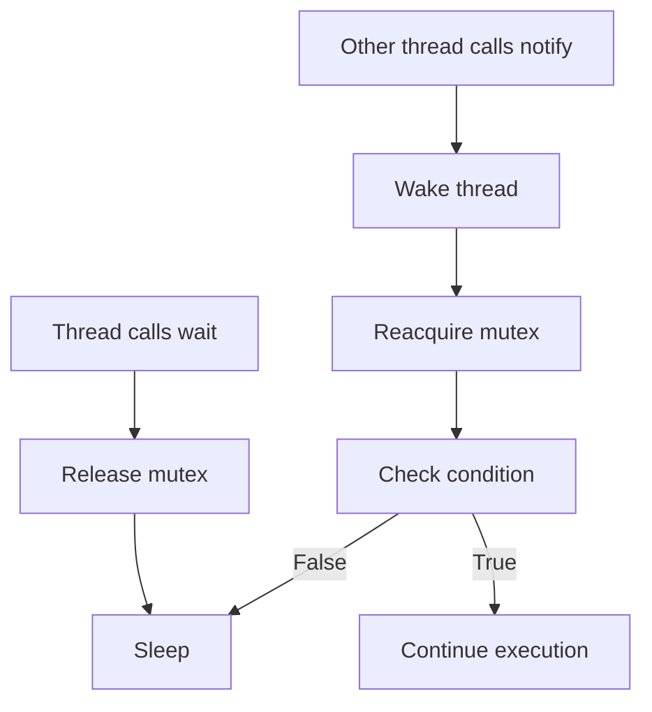

# Condition Variables

**Condition variables** allow threads to wait for specific conditions to become true, enabling efficient thread coordination beyond simple mutexes.

## Basic Usage
```cpp
#include <condition_variable>
#include <mutex>
#include <thread>

std::mutex mtx;
std::condition_variable cv;
bool ready = false;

void waiter() {
    std::unique_lock<std::mutex> lock(mtx);
    cv.wait(lock, []{ return ready; });  // Wait until ready == true
    // Continue when notified and ready == true
}

void notifier() {
    {
        std::lock_guard<std::mutex> lock(mtx);
        ready = true;
    }
    cv.notify_one();  // Wake up one waiting thread
}
```

## How Condition Variables Work


## wait() Variants

### wait() with Predicate
```cpp
#include <condition_variable>

std::mutex mtx;
std::condition_variable cv;
bool data_ready = false;

void consumer() {
    std::unique_lock<std::mutex> lock(mtx);
    
    // Equivalent to:
    // while (!data_ready) {
    //     cv.wait(lock);
    // }
    cv.wait(lock, []{ return data_ready; });
    
    processData();
}
```

:::info
Always use a **predicate** with `wait()` to handle spurious wakeups—the thread may wake even when not notified!
:::

### wait_for() - Timeout
```cpp
#include <chrono>

void consumerWithTimeout() {
    std::unique_lock<std::mutex> lock(mtx);
    
    if (cv.wait_for(lock, std::chrono::seconds(5), []{ return data_ready; })) {
        // Condition met within 5 seconds
        processData();
    } else {
        // Timeout
        handleTimeout();
    }
}
```

### wait_until() - Absolute Time
```cpp
#include <chrono>

void consumerWithDeadline() {
    std::unique_lock<std::mutex> lock(mtx);
    
    auto deadline = std::chrono::system_clock::now() + std::chrono::seconds(10);
    
    if (cv.wait_until(lock, deadline, []{ return data_ready; })) {
        processData();
    } else {
        handleTimeout();
    }
}
```

## notify Variants

### notify_one()

Wakes up **one** waiting thread:
```cpp
cv.notify_one();  // Wake one thread
```

### notify_all()

Wakes up **all** waiting threads:
```cpp
cv.notify_all();  // Wake all threads
```

## Producer-Consumer Pattern
```cpp
#include <queue>
#include <mutex>
#include <condition_variable>

template<typename T>
class BlockingQueue {
    std::queue<T> queue_;
    std::mutex mutex_;
    std::condition_variable cv_;
    
public:
    void push(T value) {
        {
            std::lock_guard<std::mutex> lock(mutex_);
            queue_.push(std::move(value));
        }
        cv_.notify_one();  // Wake a consumer
    }
    
    T pop() {
        std::unique_lock<std::mutex> lock(mutex_);
        cv_.wait(lock, [this]{ return !queue_.empty(); });
        
        T value = std::move(queue_.front());
        queue_.pop();
        return value;
    }
};

// Usage
BlockingQueue<int> queue;

void producer() {
    for (int i = 0; i < 10; ++i) {
        queue.push(i);
        std::this_thread::sleep_for(std::chrono::milliseconds(100));
    }
}

void consumer() {
    for (int i = 0; i < 10; ++i) {
        int value = queue.pop();  // Blocks until data available
        std::cout << "Consumed: " << value << '\n';
    }
}
```

## Practical Examples

### Example 1: Thread Pool Work Queue
```cpp
#include <thread>
#include <vector>
#include <functional>

class ThreadPool {
    std::vector<std::thread> workers_;
    std::queue<std::function<void()>> tasks_;
    
    std::mutex mutex_;
    std::condition_variable cv_;
    bool stop_ = false;
    
public:
    ThreadPool(size_t numThreads) {
        for (size_t i = 0; i < numThreads; ++i) {
            workers_.emplace_back([this] {
                while (true) {
                    std::function<void()> task;
                    
                    {
                        std::unique_lock<std::mutex> lock(mutex_);
                        cv_.wait(lock, [this]{ 
                            return stop_ || !tasks_.empty(); 
                        });
                        
                        if (stop_ && tasks_.empty()) return;
                        
                        task = std::move(tasks_.front());
                        tasks_.pop();
                    }
                    
                    task();
                }
            });
        }
    }
    
    void enqueue(std::function<void()> task) {
        {
            std::lock_guard<std::mutex> lock(mutex_);
            tasks_.push(std::move(task));
        }
        cv_.notify_one();
    }
    
    ~ThreadPool() {
        {
            std::lock_guard<std::mutex> lock(mutex_);
            stop_ = true;
        }
        cv_.notify_all();
        
        for (auto& worker : workers_) {
            worker.join();
        }
    }
};
```

### Example 2: Barrier Synchronization
```cpp
#include <condition_variable>

class Barrier {
    std::mutex mutex_;
    std::condition_variable cv_;
    size_t threshold_;
    size_t count_ = 0;
    size_t generation_ = 0;
    
public:
    explicit Barrier(size_t count) : threshold_(count) {}
    
    void wait() {
        std::unique_lock<std::mutex> lock(mutex_);
        size_t gen = generation_;
        
        if (++count_ >= threshold_) {
            ++generation_;
            count_ = 0;
            cv_.notify_all();
        } else {
            cv_.wait(lock, [this, gen]{ return gen != generation_; });
        }
    }
};

// Usage
Barrier barrier(3);

void worker(int id) {
    // Phase 1
    doWork(id);
    barrier.wait();  // All threads wait here
    
    // Phase 2 - starts only when all reached barrier
    doMoreWork(id);
}
```

### Example 3: Event Notification
```cpp
#include <condition_variable>

class Event {
    std::mutex mutex_;
    std::condition_variable cv_;
    bool signaled_ = false;
    
public:
    void wait() {
        std::unique_lock<std::mutex> lock(mutex_);
        cv_.wait(lock, [this]{ return signaled_; });
    }
    
    void signal() {
        {
            std::lock_guard<std::mutex> lock(mutex_);
            signaled_ = true;
        }
        cv_.notify_all();
    }
    
    void reset() {
        std::lock_guard<std::mutex> lock(mutex_);
        signaled_ = false;
    }
};

// Usage
Event startEvent;

void worker() {
    startEvent.wait();  // Wait for start signal
    doWork();
}

void coordinator() {
    prepareWork();
    startEvent.signal();  // Start all workers
}
```

## Common Pitfalls

### Pitfall 1: Lost Wakeup
```cpp
// WRONG: notify before wait
std::mutex mtx;
std::condition_variable cv;
bool ready = false;

void thread1() {
    ready = true;
    cv.notify_one();  // Notifies, but no one waiting yet!
}

void thread2() {
    std::this_thread::sleep_for(std::chrono::milliseconds(100));
    std::unique_lock<std::mutex> lock(mtx);
    cv.wait(lock, []{ return ready; });  // May wait forever
}

// CORRECT: Check condition in predicate
void thread2_fixed() {
    std::unique_lock<std::mutex> lock(mtx);
    cv.wait(lock, []{ return ready; });  // Returns immediately if ready
}
```

### Pitfall 2: Spurious Wakeups
```cpp
// WRONG: No predicate
void consumer() {
    std::unique_lock<std::mutex> lock(mtx);
    cv.wait(lock);  // May wake spuriously!
    processData();  // Data might not be ready
}

// CORRECT: Always use predicate
void consumer_fixed() {
    std::unique_lock<std::mutex> lock(mtx);
    cv.wait(lock, []{ return data_ready; });  // Handles spurious wakeups
    processData();
}
```

### Pitfall 3: Holding Lock During notify
```cpp
// LESS EFFICIENT
{
    std::lock_guard<std::mutex> lock(mtx);
    ready = true;
    cv.notify_one();  // Lock held during notify
}

// MORE EFFICIENT
{
    std::lock_guard<std::mutex> lock(mtx);
    ready = true;
}  // Lock released
cv.notify_one();  // Notify without holding lock
```

## Condition Variable vs Busy-Wait
```cpp
// BAD: Busy-wait (wastes CPU)
while (!ready) {
    std::this_thread::sleep_for(std::chrono::milliseconds(10));
}

// GOOD: Condition variable (efficient)
std::unique_lock<std::mutex> lock(mtx);
cv.wait(lock, []{ return ready; });
```

## Best Practices

:::success
**DO:**
- Always use a predicate with `wait()`
- Release locks before calling `notify()`
- Use `unique_lock` (not `lock_guard`) with condition variables
- Handle spurious wakeups with predicate
- Use `notify_all()` when multiple threads wait
  :::

:::danger
**DON'T:**
- Call `wait()` without checking condition
- Hold mutex while calling `notify()` (inefficient)
- Use condition variables without mutex
- Assume `wait()` returns only when notified
- Forget to notify waiting threads
  :::

## When to Use

| Scenario       | Use                   |
|----------------|-----------------------|
| Wait for data  | Condition variable    |
| Simple flag    | Atomic + busy-wait    |
| One-time event | `std::promise/future` |
| Periodic check | Timed wait            |

## Related Topics

- **[Mutexes](06-mutexes.md)** - Thread synchronization
- **[Futures and Promises](08-futures-and-promises.md)** - One-time values
- **[Threads](05-threads.md)** - Thread basics
- **[Thread Pools](09-thread-pools.md)** - Worker coordination