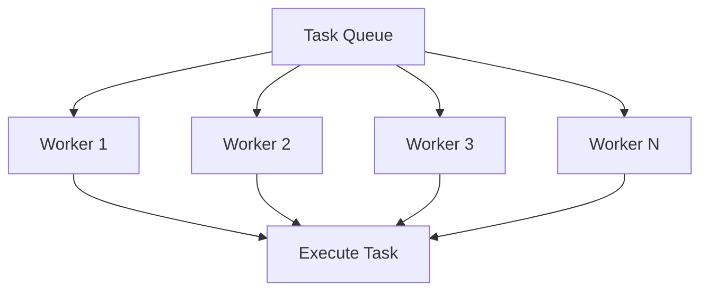

# Thread Pools

A **thread pool** manages a fixed set of worker threads that execute tasks from a queue, avoiding the overhead of creating and destroying threads repeatedly.

## Why Thread Pools?


**Benefits:**
- Reuse threads (avoid creation overhead)
- Limit concurrency (prevent resource exhaustion)
- Efficient task distribution
- Better cache locality

## Simple Thread Pool
```cpp
#include <vector>
#include <queue>
#include <thread>
#include <mutex>
#include <condition_variable>
#include <functional>

class ThreadPool {
    std::vector<std::thread> workers_;
    std::queue<std::function<void()>> tasks_;
    
    std::mutex mutex_;
    std::condition_variable cv_;
    bool stop_ = false;
    
public:
    explicit ThreadPool(size_t numThreads) {
        for (size_t i = 0; i < numThreads; ++i) {
            workers_.emplace_back([this] {
                while (true) {
                    std::function<void()> task;
                    
                    {
                        std::unique_lock<std::mutex> lock(mutex_);
                        cv_.wait(lock, [this] {
                            return stop_ || !tasks_.empty();
                        });
                        
                        if (stop_ && tasks_.empty()) {
                            return;
                        }
                        
                        task = std::move(tasks_.front());
                        tasks_.pop();
                    }
                    
                    task();
                }
            });
        }
    }
    
    template<typename F>
    void enqueue(F&& f) {
        {
            std::lock_guard<std::mutex> lock(mutex_);
            tasks_.emplace(std::forward<F>(f));
        }
        cv_.notify_one();
    }
    
    ~ThreadPool() {
        {
            std::lock_guard<std::mutex> lock(mutex_);
            stop_ = true;
        }
        cv_.notify_all();
        
        for (auto& worker : workers_) {
            worker.join();
        }
    }
};

// Usage
ThreadPool pool(4);  // 4 worker threads

for (int i = 0; i < 10; ++i) {
    pool.enqueue([i] {
        std::cout << "Task " << i << " on thread " 
                  << std::this_thread::get_id() << '\n';
    });
}
```

## Thread Pool with Futures
```cpp
#include <future>
#include <memory>

class ThreadPool {
    std::vector<std::thread> workers_;
    std::queue<std::function<void()>> tasks_;
    std::mutex mutex_;
    std::condition_variable cv_;
    bool stop_ = false;
    
public:
    explicit ThreadPool(size_t numThreads) {
        for (size_t i = 0; i < numThreads; ++i) {
            workers_.emplace_back([this] {
                while (true) {
                    std::function<void()> task;
                    
                    {
                        std::unique_lock<std::mutex> lock(mutex_);
                        cv_.wait(lock, [this] {
                            return stop_ || !tasks_.empty();
                        });
                        
                        if (stop_ && tasks_.empty()) return;
                        
                        task = std::move(tasks_.front());
                        tasks_.pop();
                    }
                    
                    task();
                }
            });
        }
    }
    
    template<typename F, typename... Args>
    auto enqueue(F&& f, Args&&... args) 
        -> std::future<typename std::invoke_result_t<F, Args...>>
    {
        using ReturnType = typename std::invoke_result_t<F, Args...>;
        
        auto task = std::make_shared<std::packaged_task<ReturnType()>>(
            std::bind(std::forward<F>(f), std::forward<Args>(args)...)
        );
        
        std::future<ReturnType> result = task->get_future();
        
        {
            std::lock_guard<std::mutex> lock(mutex_);
            tasks_.emplace([task]() { (*task)(); });
        }
        
        cv_.notify_one();
        return result;
    }
    
    ~ThreadPool() {
        {
            std::lock_guard<std::mutex> lock(mutex_);
            stop_ = true;
        }
        cv_.notify_all();
        
        for (auto& worker : workers_) {
            worker.join();
        }
    }
};

// Usage with results
ThreadPool pool(4);

auto result1 = pool.enqueue([](int x) { return x * x; }, 5);
auto result2 = pool.enqueue([](int x, int y) { return x + y; }, 3, 7);

std::cout << "Result 1: " << result1.get() << '\n';  // 25
std::cout << "Result 2: " << result2.get() << '\n';  // 10
```

## Practical Examples

### Example 1: Parallel Processing
```cpp
#include <vector>
#include <numeric>

std::vector<int> processData(const std::vector<int>& input) {
    ThreadPool pool(std::thread::hardware_concurrency());
    
    std::vector<std::future<int>> futures;
    
    for (int value : input) {
        futures.push_back(pool.enqueue([value] {
            return expensiveComputation(value);
        }));
    }
    
    std::vector<int> results;
    for (auto& fut : futures) {
        results.push_back(fut.get());
    }
    
    return results;
}
```

### Example 2: Map-Reduce
```cpp
template<typename Iterator, typename MapFunc, typename ReduceFunc>
auto mapReduce(Iterator first, Iterator last, 
               MapFunc mapFunc, ReduceFunc reduceFunc)
{
    ThreadPool pool(std::thread::hardware_concurrency());
    
    // Map phase
    std::vector<std::future<decltype(mapFunc(*first))>> futures;
    for (auto it = first; it != last; ++it) {
        futures.push_back(pool.enqueue(mapFunc, *it));
    }
    
    // Collect mapped values
    std::vector<decltype(mapFunc(*first))> mapped;
    for (auto& fut : futures) {
        mapped.push_back(fut.get());
    }
    
    // Reduce phase
    return std::accumulate(mapped.begin(), mapped.end(), 
                          mapped.front(), reduceFunc);
}

// Usage
std::vector<int> data = {1, 2, 3, 4, 5};
auto sum = mapReduce(
    data.begin(), data.end(),
    [](int x) { return x * x; },        // Map: square
    [](int a, int b) { return a + b; }  // Reduce: sum
);
```

### Example 3: Priority Queue
```cpp
class PriorityThreadPool {
    struct Task {
        int priority;
        std::function<void()> func;
        
        bool operator<(const Task& other) const {
            return priority < other.priority;  // Higher priority first
        }
    };
    
    std::vector<std::thread> workers_;
    std::priority_queue<Task> tasks_;
    std::mutex mutex_;
    std::condition_variable cv_;
    bool stop_ = false;
    
public:
    explicit PriorityThreadPool(size_t numThreads) {
        for (size_t i = 0; i < numThreads; ++i) {
            workers_.emplace_back([this] {
                while (true) {
                    std::function<void()> task;
                    
                    {
                        std::unique_lock<std::mutex> lock(mutex_);
                        cv_.wait(lock, [this] {
                            return stop_ || !tasks_.empty();
                        });
                        
                        if (stop_ && tasks_.empty()) return;
                        
                        task = std::move(tasks_.top().func);
                        tasks_.pop();
                    }
                    
                    task();
                }
            });
        }
    }
    
    template<typename F>
    void enqueue(int priority, F&& f) {
        {
            std::lock_guard<std::mutex> lock(mutex_);
            tasks_.push({priority, std::forward<F>(f)});
        }
        cv_.notify_one();
    }
    
    ~PriorityThreadPool() {
        {
            std::lock_guard<std::mutex> lock(mutex_);
            stop_ = true;
        }
        cv_.notify_all();
        
        for (auto& worker : workers_) {
            worker.join();
        }
    }
};

// Usage
PriorityThreadPool pool(4);

pool.enqueue(1, lowPriorityTask);
pool.enqueue(10, highPriorityTask);  // Executes first
```

## Dynamic Thread Pool
```cpp
class DynamicThreadPool {
    std::vector<std::thread> workers_;
    std::queue<std::function<void()>> tasks_;
    std::mutex mutex_;
    std::condition_variable cv_;
    
    size_t minThreads_;
    size_t maxThreads_;
    std::atomic<size_t> activeThreads_{0};
    bool stop_ = false;
    
public:
    DynamicThreadPool(size_t minThreads, size_t maxThreads)
        : minThreads_(minThreads), maxThreads_(maxThreads) {
        
        for (size_t i = 0; i < minThreads_; ++i) {
            addWorker();
        }
    }
    
    template<typename F>
    void enqueue(F&& f) {
        {
            std::lock_guard<std::mutex> lock(mutex_);
            tasks_.emplace(std::forward<F>(f));
            
            // Spawn new worker if needed
            if (tasks_.size() > activeThreads_ && 
                workers_.size() < maxThreads_) {
                addWorker();
            }
        }
        cv_.notify_one();
    }
    
private:
    void addWorker() {
        workers_.emplace_back([this] {
            while (true) {
                std::function<void()> task;
                
                {
                    std::unique_lock<std::mutex> lock(mutex_);
                    cv_.wait(lock, [this] {
                        return stop_ || !tasks_.empty();
                    });
                    
                    if (stop_ && tasks_.empty()) return;
                    
                    task = std::move(tasks_.front());
                    tasks_.pop();
                    ++activeThreads_;
                }
                
                task();
                --activeThreads_;
            }
        });
    }
};
```

## Best Practices

:::success
**DO:**
- Size pool based on `hardware_concurrency()`
- Use futures for results
- Handle task exceptions gracefully
- Implement graceful shutdown
- Consider task priorities for different workloads
  :::

:::danger
**DON'T:**
- Create too many threads (overhead)
- Block worker threads with I/O
- Forget to join/stop pool on destruction
- Submit blocking tasks (use separate I/O threads)
- Assume task execution order
  :::

## Performance Tuning
```cpp
// Optimal thread count
size_t optimalThreads() {
    // CPU-bound: number of cores
    return std::thread::hardware_concurrency();
    
    // I/O-bound: more threads
    return std::thread::hardware_concurrency() * 2;
    
    // Mixed: tune based on profiling
}

// Task granularity
void efficientBatching() {
    ThreadPool pool(4);
    
    // BAD: Too fine-grained
    for (int i = 0; i < 1000000; ++i) {
        pool.enqueue([i] { process(i); });
    }
    
    // GOOD: Batch tasks
    size_t batchSize = 10000;
    for (size_t i = 0; i < 1000000; i += batchSize) {
        pool.enqueue([i, batchSize] {
            for (size_t j = i; j < i + batchSize; ++j) {
                process(j);
            }
        });
    }
}
```

## Related Topics

- **[Threads](04-threads.md)** - Thread basics
- **[Futures and Promises](07-futures-and-promises.md)** - Async results
- **[Condition Variables](06-condition-variables.md)** - Thread coordination
- **[Mutexes](05-mutexes.md)** - Synchronization