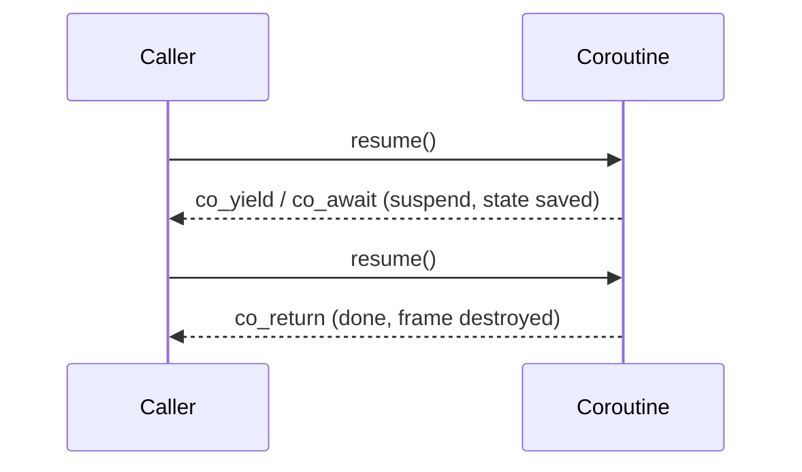

# Coroutines (C++20)

A **coroutine** is a function that can **suspend** itself, hand control back to its caller, and later
**resume** exactly where it left off — with all its local state intact. That makes two things natural
that ordinary functions can't express: **lazy sequences** (generators) and **asynchronous code that
reads like synchronous code**.

Any function is a coroutine if its body uses one of three keywords:

| Keyword | Meaning |
|---------|---------|
| `co_await` | suspend until an awaited operation is ready, then resume |
| `co_yield` | produce a value and suspend (the generator pattern) |
| `co_return` | finish the coroutine, optionally with a value |

:::warning C++20 ships the engine, not the car
C++20 standardised the **low-level machinery** (`std::coroutine_handle`, the `promise_type`
protocol) but almost no ready-to-use types. A usable `std::generator` arrives in **C++23**; `task`
and async types still come from libraries (cppcoro, Asio, libunifex) or your own glue. Expect to
either use a library or write a small amount of boilerplate.
:::

## Suspend and resume

Unlike a normal call that runs to completion, a coroutine bounces control back and forth with its
caller. Its state lives in a heap-allocated **coroutine frame** rather than on the stack (coroutines
are *stackless*), which is why locals survive across a suspension.



## Generators — the intuitive case (`co_yield`)

A generator computes values lazily: each `co_yield` produces one element and suspends until the
consumer asks for the next. The sequence can even be infinite, because nothing is computed ahead of
demand.

```cpp showLineNumbers
#include <generator>          // C++23

std::generator<int> fibonacci() {
    int a = 0, b = 1;
    while (true) {            // infinite — only as many are produced as are pulled
        co_yield a;          // hand back one value, suspend here
        a = std::exchange(a, b), b = a + b;
    }
}

int main() {
    for (int x : fibonacci()) {   // each iteration resumes the coroutine
        if (x > 50) break;
        std::print("{} ", x);     // 0 1 1 2 3 5 8 13 21 34
    }
}
```

This is the same lazy spirit as [Ranges](../09-standard-library/ranges.md) — and generators compose
with range adaptors.

## Async — synchronous-looking concurrency (`co_await`)

`co_await` suspends the coroutine until an operation completes, then resumes — without blocking the
thread. The code reads top-to-bottom even though it yields at each `await`:

```cpp showLineNumbers
// 'task<>' here is a library/utility type, not standard in C++20.
task<std::string> fetch_user(int id) {
    auto conn = co_await connect();        // suspend until connected
    auto row  = co_await conn.query(id);   // suspend until the query returns
    co_return row.name;                    // produce the result
}
```

Compared with [futures and promises](./07-futures-and-promises.md) or raw [threads](./04-threads.md),
coroutines avoid callback nesting and let one thread juggle many in-flight operations.

## The machinery, briefly

When you write a coroutine, the compiler rewrites it around two cooperating pieces:

- **`promise_type`** — found via the return type; its hooks (`get_return_object`, `initial_suspend`,
  `yield_value`, `return_value`, `final_suspend`) decide what the coroutine returns and how it
  suspends. This is the boilerplate libraries provide for you.
- **Awaiter** — what `co_await expr` drives: `await_ready()` (skip suspension if already done),
  `await_suspend(handle)` (schedule the resume), `await_resume()` (produce the awaited value).

You rarely write this by hand once you have a generator/task type — but knowing it exists explains
the error messages.

:::danger Dangling references in coroutine parameters
A coroutine's parameters are copied into the frame, but **references and views are copied as
references** — if the referent dies during a suspension, you have a dangling reference. Be especially
careful passing `std::string_view`, `span`, or `const T&` into a coroutine that suspends.

```cpp
task<void> log(const std::string& msg);   // risky if caller's string dies while suspended
task<void> log(std::string msg);          // safer: own the data in the frame
```
:::

## Summary

- A coroutine suspends and resumes, preserving locals in a heap frame (stackless).
- `co_yield` builds lazy/infinite **generators**; `co_await` builds **non-blocking async** flows; `co_return` finishes.
- C++20 provides only the low-level protocol; `std::generator` is C++23, and `task`/async types come from libraries.
- The `promise_type` + awaiter protocol is the plumbing the compiler generates around your code.
- Watch for dangling reference parameters across suspension points — prefer owning the data.

## Related

- [Futures and Promises](./07-futures-and-promises.md) · [Threads](./04-threads.md) · [Thread Pools](./08-thread-pools.md) — other concurrency models
- [Ranges](../09-standard-library/ranges.md) — the same lazy-sequence idea
- [C++ Versions](../00-overview/cpp-versions.md) — coroutines (C++20), `std::generator` (C++23)
