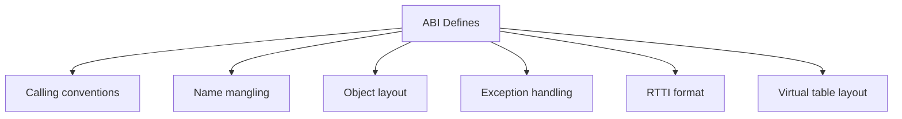

# Application Binary Interface (ABI)

ABI defines how compiled code interacts at the binary level: calling conventions, name mangling,
object layout, exception handling. Binary compatibility depends on ABI stability.

:::info Binary Contract
**API** = source code contract (headers)  
**ABI** = binary code contract (compiled libraries)  
Breaking ABI → must recompile everything
:::

## What ABI Specifies



**ABI components:**

- Function calling conventions (registers, stack)
- Name mangling scheme (see [Name Mangling](../01-toolchain-and-build/name-mangling.md))
- Object layout (see [Object Layout](02-object-layout.md))
- Exception propagation
- RTTI and virtual table format

## Calling Conventions

How functions pass arguments and return values.

```cpp showLineNumbers
// x86-64 System V ABI (Linux, macOS)
int foo(int a, int b, int c, int d, int e, int f, int g);
// Arguments: rdi, rsi, rdx, rcx, r8, r9, stack...

// x86-64 Microsoft ABI (Windows)
int foo(int a, int b, int c, int d, int e);
// Arguments: rcx, rdx, r8, r9, stack...

// Return value: rax (both)
```

**Platform differences:**

- **Linux/macOS**: System V ABI
- **Windows**: Microsoft x64 ABI
- Different register usage → incompatible binaries

## Name Mangling

See [Name Mangling](../01-toolchain-and-build/name-mangling.md) for details.

```cpp showLineNumbers
void func(int, double);

// GCC/Clang mangling
// _Z4funcid

// MSVC mangling
// ?func@@YAXHN@Z

// Different compilers → different mangled names → linking fails
```

**Impact**: Object files from different compilers usually can't link together.

## ABI Compatibility

### ABI-Breaking Changes

```cpp showLineNumbers
// Version 1.0
class Widget {
    int value_;
public:
    int getValue() const;
};

// Version 2.0 - ABI BREAK!
class Widget {
    int id_;         // New member BEFORE existing one
    int value_;      // Offset changed!
public:
    int getValue() const;
    int getId() const;  // New virtual function → vtable changed
};
```

**Breaking changes:**

- Reordering class members
- Adding/removing virtual functions
- Changing function signatures
- Modifying base class layout
- Changing exception specifications

### ABI-Safe Changes

```cpp showLineNumbers
// ✅ ABI-safe: adding non-virtual function
class Widget {
    int value_;
public:
    int getValue() const;
    int calculate() const;  // ✅ OK: non-virtual, new
};

// ✅ ABI-safe: adding at end
class Widget {
    int value_;
    int newField_;  // ✅ OK: at end, existing offsets unchanged
public:
    int getValue() const;
};
```

**Safe changes:**

- Adding non-virtual member functions
- Adding new members at end (if not final)
- Adding static members
- Changing private implementation (if using PIMPL)

## Versioning Strategies

### Symbol Versioning (Linux)

```cpp showLineNumbers
// lib.cpp
__asm__(".symver func_v1, func@VER_1.0");
__asm__(".symver func_v2, func@@VER_2.0");

void func_v1() { /* old implementation */ }
void func_v2() { /* new implementation */ }

// Programs linked against v1.0 use func_v1
// Programs linked against v2.0 use func_v2
```

### PIMPL (Pointer to Implementation)

```cpp showLineNumbers
// widget.h (stable ABI)
class Widget {
    struct Impl;
    Impl* pImpl;  // Opaque pointer
public:
    Widget();
    ~Widget();
    void doSomething();
};

// widget.cpp (can change freely)
struct Widget::Impl {
    int value;
    std::string name;
    // Add/remove members freely - doesn't affect ABI
};
```

**Benefit**: Internal changes don't affect binary interface.

## Compiler-Specific ABIs

| Platform | Compiler  | ABI             |
|----------|-----------|-----------------|
| Linux    | GCC/Clang | Itanium C++ ABI |
| Windows  | MSVC      | Microsoft ABI   |
| macOS    | Clang     | Itanium C++ ABI |
| Android  | Clang     | Itanium C++ ABI |

**Compatibility**: GCC ↔ Clang (same ABI). MSVC ↔ GCC/Clang ❌.

## Checking ABI Compatibility

```bash
# Check symbols
nm -C library.so | grep "func"

# Check ABI compliance
abidiff old.so new.so

# Check binary dependencies
ldd executable

# Display dynamic symbols
objdump -T library.so
```

## Platform-Specific Issues

### Windows DLL Export

```cpp showLineNumbers
// widget.h
#ifdef _WIN32
    #define EXPORT __declspec(dllexport)
#else
    #define EXPORT
#endif

class EXPORT Widget {
public:
    void doSomething();
};
```

### Exception ABI

```cpp showLineNumbers
// Throwing across DLL boundaries
// Both sides must use same ABI and compiler

// library.cpp
void mightThrow() {
    throw std::runtime_error("Error");
}

// main.cpp
try {
    mightThrow();  // ⚠️ Only safe if same compiler/ABI
} catch (...) {
}
```

## Best Practices

:::success DO

- Maintain ABI stability in public libraries
- Use PIMPL for implementation flexibility
- Version symbols on Linux
- Document ABI guarantees
- Test binary compatibility
  :::

:::danger DON'T

- Change virtual function order
- Reorder class members in public API
- Change function signatures in released libs
- Mix compilers for same library
- Assume cross-platform ABI compatibility
  :::

## Summary

:::info ABI
ABI is the binary interface
- Calling conventions (register usage)
- ABI compatibility (binary contracts)
- Name mangling (function signatures)
- Object layout (class structure)
- Exception handling
- Virtual tables
- Type compatibility
---
- Breaking ABI = Recompile everything
- Safe changes: append members, add non-virtual functions
- Unsafe: reorder members, change virtuals, modify signatures
:::

```cpp
// Interview answer:
// "ABI is the binary interface: calling conventions, name
// mangling, object layout, vtables. Breaking ABI (reordering
// members, changing virtuals) requires recompiling dependents.
// Safe changes: adding non-virtual functions, appending members.
// Different compilers have different ABIs - GCC/Clang compatible
// via Itanium ABI, MSVC uses Microsoft ABI. PIMPL pattern and
// symbol versioning maintain ABI stability."
```
