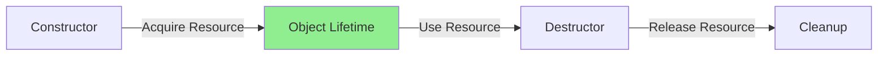
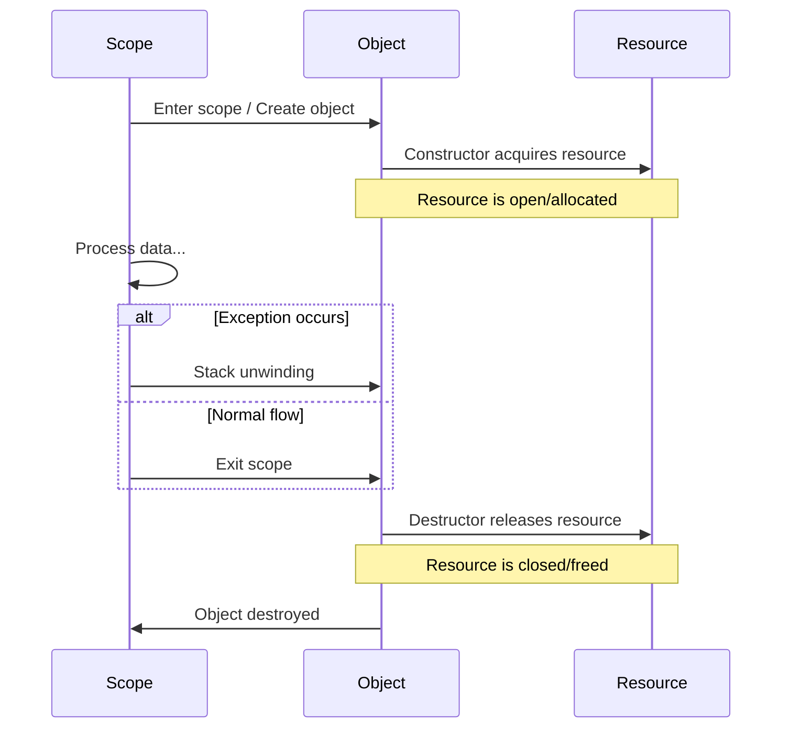
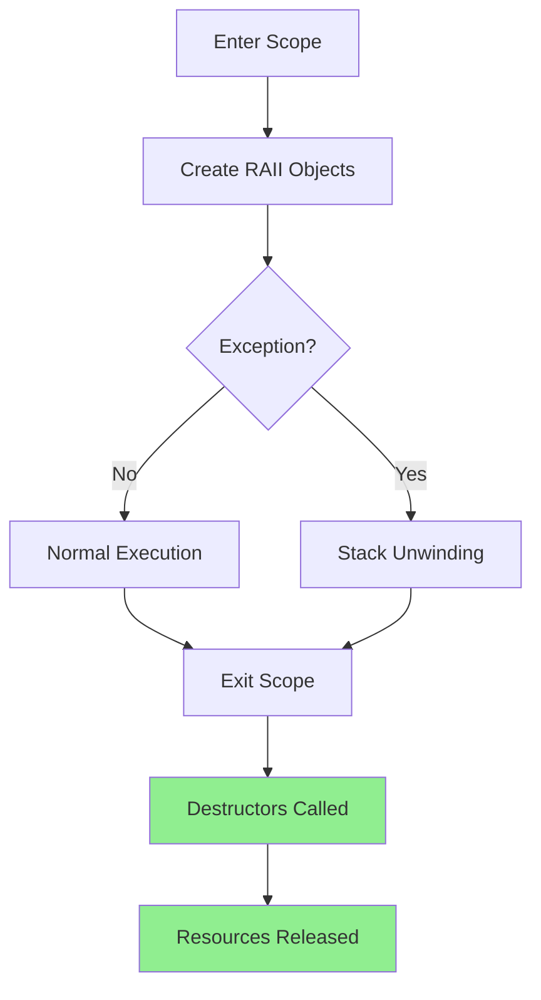

# RAII (Resource Acquisition Is Initialization)

**RAII** is a fundamental C++ idiom where resource lifetime is tied to object lifetime. Resources are acquired in constructors and released in destructors, ensuring automatic cleanup and exception safety.

The idea is simple: wrap resources in objects so that the language automatically manages their lifetime through constructor/destructor pairs.



:::info Core Principle
**Tie resource lifetime to object lifetime**
- Acquire resource in constructor
- Release resource in destructor
- Automatic cleanup when object goes out of scope
  :::

## The Problem: Manual Resource Management

```cpp showLineNumbers 
// ❌ Manual management - error prone!
void processFile() {
    FILE* file = fopen("data.txt", "r");
    if (!file) return;
    
    // Process file...
    if (errorCondition) {
        // 😱 Forgot to close! Memory leak!
        return;
    }
    
    // More processing...
    if (someException) {
        throw std::runtime_error("Error");
        // 😱 File not closed! Exception jumps over fclose!
    }
    
    fclose(file);  // Only reached if no early returns or exceptions
}
```

:::danger Problems with Manual Management
- Forgetting to release resources
- Exception-unsafe code
- Early returns skip cleanup
- Difficult to maintain
  :::

---

## The RAII Solution

```cpp showLineNumbers 
// RAII - automatic cleanup!

class FileHandle {
    FILE* file;
public:
    // Acquire resource in constructor
    FileHandle(const char* filename, const char* mode) {
        file = fopen(filename, mode);
        if (!file) {
            throw std::runtime_error("Cannot open file");
        }
    }
    
    // Release resource in destructor
    ~FileHandle() {
        if (file) {
            fclose(file);  // ALWAYS called!
        }
    }
    
    // Prevent copying
    FileHandle(const FileHandle&) = delete;
    FileHandle& operator=(const FileHandle&) = delete;
    
    FILE* get() { return file; }
};

void processFile() {
    FileHandle file("data.txt", "r");
    
    // Process file...
    if (errorCondition) {
        return;  // ✅ File automatically closed!
    }
    
    if (someException) {
        throw std::runtime_error("Error");
        // ✅ File automatically closed during stack unwinding!
    }
    
    // ✅ File automatically closed when going out of scope
}
```

:::success
RAII ensures resources are **always** released, even when exceptions are thrown, providing both safety and convenience.
:::

---

## How RAII Works



---

## Standard Library RAII Examples

### Smart Pointers

Smart pointers automatically manage dynamic memory, eliminating manual `delete` calls and preventing memory leaks.

```cpp showLineNumbers 
#include <memory>

void example() {
    // Old way - manual delete
    Widget* ptr = new Widget();
    delete ptr;  // Easy to forget!
    
    
    // *** RAII way - automatic cleanup ***

    // unique_ptr: exclusive ownership
    std::unique_ptr<Widget> ptr = std::make_unique<Widget>();
    // No delete needed - automatic cleanup
    
    // shared_ptr: shared ownership
    std::shared_ptr<Widget> ptr2 = std::make_shared_ptr<Widget>();
    auto ptr3 = ptr2;  // Reference counted
    // Deleted when last shared_ptr destroyed
}
```

### File Streams

File streams use RAII to ensure files are closed properly, even if errors occur during processing.

```cpp showLineNumbers 
#include <fstream>

void writeData() {
    std::ofstream file("output.txt");
    // File automatically opened
    
    file << "Hello, World!\n";
    
    if (errorCondition) {
        return;  // File automatically closed and flushed
    }

} // File automatically closed when going out of scope
```

### Locks

Lock guards ensure mutexes are always released, preventing deadlocks from forgotten unlocks or exceptions.

```cpp showLineNumbers 
#include <mutex>

std::mutex mtx;

void threadSafeFunction() {
    // Old way - manual unlock
    mtx.lock();
    // ... work ...
    mtx.unlock();  // Easy to forget if exception occurs!
    
    // ✅ RAII way - automatic unlock
    std::lock_guard<std::mutex> lock(mtx);
    // ... work ...
    // Lock automatically released when 'lock' goes out of scope
}
```

```cpp
#include 

std::mutex mtx;
int sharedData = 0;

void threadSafeOperation() {
    std::lock_guard lock(mtx);
    // Mutex locked
    
    ++sharedData;
    
    if (errorCondition()) {
        throw std::runtime_error("Error");
        // Lock still released!
    }
    
}  // Mutex automatically unlocked
```

---

## Building Your Own RAII Classes

### Example 1: Timer

Measures execution time and logs it when the scope exits.

```cpp showLineNumbers 
class Timer {
    std::chrono::time_point<std::chrono::high_resolution_clock> start;
    std::string name;
public:
    Timer(const std::string& n) : name(n) {
        start = std::chrono::high_resolution_clock::now();
    }
    
    ~Timer() {
        auto end = std::chrono::high_resolution_clock::now();
        auto duration = std::chrono::duration_cast<std::chrono::milliseconds>(end - start);
        std::cout << name << " took " << duration.count() << "ms\n";
    }
};

void expensiveOperation() {
    Timer t("expensiveOperation");
    // Do work...
    // ✅ Time automatically printed when function exits
}
```

### Example 2: Lock Guard


```cpp showLineNumbers 
template<typename Mutex>
class LockGuard {
    Mutex& mutex;
public:
    explicit LockGuard(Mutex& m) : mutex(m) {
        mutex.lock();
    }
    
    ~LockGuard() {
        mutex.unlock();
    }
    
    // Delete copy operations
    LockGuard(const LockGuard&) = delete;
    LockGuard& operator=(const LockGuard&) = delete;
};

std::mutex mtx;

void criticalSection() {
    LockGuard<std::mutex> lock(mtx);
    // Critical code here
    // ✅ Mutex automatically unlocked
}
```

### Example 3: Database Transaction

```cpp showLineNumbers 
class Transaction {
    Database& db;
    bool committed = false;
public:
    explicit Transaction(Database& database) : db(database) {
        db.beginTransaction();
    }
    
    ~Transaction() {
        if (!committed) {
            db.rollback();  // Auto-rollback if not committed
        }
    }
    
    void commit() {
        db.commit();
        committed = true;
    }
};

void transferMoney(Database& db) {
    Transaction txn(db);
    
    db.debit(account1, 100);
    db.credit(account2, 100);
    
    if (validationFails) {
        return;  // ✅ Auto-rollback!
    }
    
    txn.commit();  // Explicit commit
    // ✅ If commit throws, auto-rollback in destructor
}
```

---

## RAII and Exception Safety

RAII provides automatic exception safety - resources are cleaned up via destructors during stack unwinding.

```cpp showLineNumbers 
void exceptionSafeFunction() {
    std::unique_ptr<Widget> w1 = std::make_unique<Widget>();
    std::unique_ptr<Gadget> g1 = std::make_unique<Gadget>();
    std::ofstream file("output.txt");
    std::lock_guard<std::mutex> lock(mtx);
    
    // Even if exception occurs here...
    riskyOperation();
    
    // ✅ All resources automatically cleaned up:
    // - w1 and g1 automatically deleted
    // - file automatically closed
    // - mutex automatically unlocked
}
```



---

## RAII vs Manual Cleanup

| Aspect | Manual Management | RAII |
|--------|-------------------|------|
| **Cleanup** | Explicit calls | Automatic |
| **Exception Safety** | ❌ Must manually handle | ✅ Guaranteed |
| **Early Returns** | ❌ Easy to forget cleanup | ✅ Always cleans up |
| **Code Clarity** | Cluttered with cleanup | Clean, focused |
| **Error Prone** | ❌ Very | ✅ Minimal |

```cpp showLineNumbers 
// ❌ Manual - 10 lines of error-prone code
void manual() {
    Resource* r = acquire();
    if (!r) return;
    
    try {
        use(r);
    } catch (...) {
        release(r);
        throw;
    }
    release(r);
}

// ✅ RAII - 3 lines, exception-safe
void raii() {
    RAIIResource r;
    use(r);
}
```

---

## Common RAII Patterns

### Scope Guard

```cpp showLineNumbers 
template<typename Func>
class ScopeGuard {
    Func func;
    bool active = true;
public:
    ScopeGuard(Func f) : func(std::move(f)) {}
    
    ~ScopeGuard() {
        if (active) func();
    }
    
    void dismiss() { active = false; }
};

template<typename Func>
ScopeGuard<Func> makeScopeGuard(Func f) {
    return ScopeGuard<Func>(std::move(f));
}

void example() {
    auto guard = makeScopeGuard([] {
        std::cout << "Cleanup!\n";
    });
    
    // Do work...
    // guard.dismiss();  // Optionally cancel cleanup
    
    // ✅ Cleanup automatically runs
}
```

### Resource Pool

```cpp showLineNumbers 
template<typename T>
class PooledResource {
    ResourcePool<T>& pool;
    T* resource;
public:
    PooledResource(ResourcePool<T>& p) : pool(p) {
        resource = pool.acquire();
    }
    
    ~PooledResource() {
        pool.release(resource);
    }
    
    T* operator->() { return resource; }
};

void usePooledResource() {
    PooledResource<Connection> conn(connectionPool);
    conn->query("SELECT ...");
    // ✅ Connection automatically returned to pool
}
```

---

## Best Practices

:::success DO
- Use RAII for ALL resource management
- - Prefer standard library RAII types (`unique_ptr`, `lock_guard`)
- Make destructors `noexcept`
- Delete or carefully implement copy operations
- Make resource classes non-copyable by default
- Throw exceptions from constructors if acquisition fails
  :::

:::danger DON'T
- Mix RAII with manual resource management
- Throw exceptions from destructors
- Forget to handle move semantics
- Use raw pointers for ownership
- Acquire resources outside constructors
- Release resources before destructors
- Forget to mark destructors `noexcept`
  :::

### Good RAII Class Template

```cpp showLineNumbers 
class RAIIResource {
    Resource* resource;
    
public:
    // Constructor acquires
    RAIIResource() : resource(acquireResource()) {
        if (!resource) {
            throw std::runtime_error("Failed to acquire");
        }
    }
    
    // Destructor releases
    ~RAIIResource() noexcept {
        if (resource) {
            releaseResource(resource);
        }
    }
    
    // Delete copy (or implement carefully)
    RAIIResource(const RAIIResource&) = delete;
    RAIIResource& operator=(const RAIIResource&) = delete;
    
    // Move semantics
    RAIIResource(RAIIResource&& other) noexcept
        : resource(other.resource) {
        other.resource = nullptr;
    }
    
    RAIIResource& operator=(RAIIResource&& other) noexcept {
        if (this != &other) {
            // Release current resource
            if (resource) {
                releaseResource(resource);
            }
            // Take ownership
            resource = other.resource;
            other.resource = nullptr;
        }
        return *this;
    }
    
    // Access
    Resource* get() { return resource; }
};
```

---

## Real-World Examples

### OpenGL Context

```cpp showLineNumbers 
class GLContext {
    GLFWwindow* window;
public:
    GLContext(int width, int height) {
        glfwInit();
        window = glfwCreateWindow(width, height, "App", nullptr, nullptr);
        glfwMakeContextCurrent(window);
    }
    
    ~GLContext() {
        glfwDestroyWindow(window);
        glfwTerminate();
    }
    
    // ... methods ...
};
```

### Network Socket

```cpp showLineNumbers 
class Socket {
    int sockfd;
public:
    Socket(const char* host, int port) {
        sockfd = socket(AF_INET, SOCK_STREAM, 0);
        // ... connect ...
    }
    
    ~Socket() {
        if (sockfd >= 0) {
            close(sockfd);
        }
    }
    
    void send(const char* data, size_t len);
    void receive(char* buffer, size_t len);
};
```

---

## Common Pitfalls

:::warning Pitfall #1: Destructor Exceptions
```cpp showLineNumbers 
class Bad {
    ~Bad() {
        if (condition) {
            throw std::runtime_error("Error");  // ❌ Never throw from destructor!
        }
    }
};
// If exception during stack unwinding, std::terminate is called
```
:::

:::warning Pitfall #2: Incomplete Cleanup
```cpp showLineNumbers 
class Incomplete {
    FILE* file;
public:
    Incomplete() : file(fopen("data.txt", "r")) {}
    // ❌ No destructor! File handle leaked!
};
```
:::

:::warning Pitfall #3: Double Free
```cpp showLineNumbers 
class DoubleFree {
    int* data;
public:
    DoubleFree() : data(new int(42)) {}
    ~DoubleFree() { delete data; }
    
    // ❌ Default copy constructor copies pointer
    // Both objects will delete the same memory!
};
```
:::

---

## Summary

RAII is the foundation of modern C++:

- ✅ **Automatic cleanup** - no manual resource management
- ✅ **Exception safe** - resources cleaned even during exceptions
- ✅ **Deterministic** - cleanup happens at well-defined times
- ✅ **Simple** - one place for acquire, one for release
- ✅ **Composable** - RAII objects work together seamlessly

**"Acquire in constructor, release in destructor"** - this simple rule makes C++ code robust, exception-safe, and maintainable.

Every smart pointer, file stream, lock, and well-designed class uses RAII. Master this idiom, and you master C++ resource management.