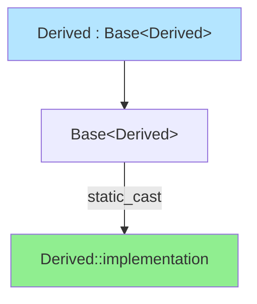

# CRTP (Curiously Recurring Template Pattern)

CRTP is a template pattern where a class `Derived` inherits from a template base class `Base<Derived>`, passing itself as a template argument. This enables compile-time polymorphism without virtual functions.

:::info Static Polymorphism
CRTP provides polymorphic behavior at compile-time through templates rather than runtime through virtual functions. Zero overhead, but less flexible than dynamic polymorphism.
:::

## Basic CRTP Pattern

```cpp showLineNumbers
// Base class takes derived type as template parameter
template<typename Derived>
class Base {
public:
    void interface() {
        // Call derived implementation
        static_cast<Derived*>(this)->implementation();
    }
    
    void implementation() {
        std::cout << "Base implementation\n";
    }
};

// Derived class passes itself to base
class Derived : public Base<Derived> {
public:
    void implementation() {
        std::cout << "Derived implementation\n";
    }
};

int main() {
    Derived d;
    d.interface();  // Calls Derived::implementation()
}
```

The base class can access derived class methods through the template parameter and `static_cast`.

## How CRTP Works



**Mechanism:**
1. `Derived` inherits from `Base<Derived>`
2. `Base` receives `Derived` as template parameter
3. `Base` can `static_cast<Derived*>(this)` to access derived methods
4. Resolved at compile-time - no virtual table overhead

## CRTP vs Virtual Functions

```cpp showLineNumbers
// Virtual functions (runtime polymorphism)
class BaseVirtual {
public:
    virtual void process() = 0;
    virtual ~BaseVirtual() = default;
};

class DerivedVirtual : public BaseVirtual {
public:
    void process() override {
        std::cout << "Virtual process\n";
    }
};

void useVirtual(BaseVirtual& obj) {
    obj.process();  // Runtime dispatch
}

// CRTP (compile-time polymorphism)
template<typename Derived>
class BaseCRTP {
public:
    void process() {
        static_cast<Derived*>(this)->processImpl();
    }
};

class DerivedCRTP : public BaseCRTP<DerivedCRTP> {
public:
    void processImpl() {
        std::cout << "CRTP process\n";
    }
};

template<typename T>
void useCRTP(BaseCRTP<T>& obj) {
    obj.process();  // Compile-time resolution
}
```

| Feature | Virtual Functions | CRTP |
|---------|------------------|------|
| **Dispatch** | Runtime | Compile-time |
| **Overhead** | Virtual table lookup | None |
| **Flexibility** | Can change type at runtime | Type fixed at compile-time |
| **Syntax** | Natural polymorphism | Template-based |
| **Use case** | Dynamic behavior | Performance-critical static behavior |

## Common CRTP Use Cases

### 1. Static Interface Enforcement

Ensure derived classes implement required methods:

```cpp showLineNumbers
template<typename Derived>
class Drawable {
public:
    void draw() const {
        static_cast<const Derived*>(this)->drawImpl();
    }
    
    void move(int x, int y) {
        auto& derived = static_cast<Derived&>(*this);
        derived.x_ += x;
        derived.y_ += y;
    }
};

class Circle : public Drawable<Circle> {
    int x_ = 0, y_ = 0, radius_ = 10;
    
    friend class Drawable<Circle>;  // Allow access to private
    
    void drawImpl() const {
        std::cout << "Circle at (" << x_ << "," << y_ 
                  << ") radius=" << radius_ << "\n";
    }
};

class Rectangle : public Drawable<Rectangle> {
    int x_ = 0, y_ = 0, width_ = 20, height_ = 10;
    
    friend class Drawable<Rectangle>;
    
    void drawImpl() const {
        std::cout << "Rectangle at (" << x_ << "," << y_ 
                  << ") " << width_ << "x" << height_ << "\n";
    }
};
```

If derived class forgets `drawImpl()`, you get a compile error when calling `draw()`.

### 2. Providing Common Functionality

Add generic operations to all derived classes:

```cpp showLineNumbers
template<typename Derived>
class Equality {
public:
    friend bool operator!=(const Derived& lhs, const Derived& rhs) {
        return !(lhs == rhs);
    }
};

class Point : public Equality<Point> {
    int x_, y_;
    
public:
    Point(int x, int y) : x_(x), y_(y) {}
    
    // Only need to implement ==
    friend bool operator==(const Point& lhs, const Point& rhs) {
        return lhs.x_ == rhs.x_ && lhs.y_ == rhs.y_;
    }
    
    // != automatically provided by CRTP base
};

int main() {
    Point p1(1, 2), p2(3, 4);
    
    if (p1 == p2) { /* ... */ }
    if (p1 != p2) { /* ... */ }  // Free, from CRTP
}
```

### 3. Counting Instances

Track how many objects of each type exist:

```cpp showLineNumbers
template<typename Derived>
class Counted {
    inline static int count_ = 0;
    
protected:
    Counted() { ++count_; }
    Counted(const Counted&) { ++count_; }
    ~Counted() { --count_; }
    
public:
    static int count() { return count_; }
};

class Widget : public Counted<Widget> {
    // ...
};

class Gadget : public Counted<Gadget> {
    // ...
};

int main() {
    Widget w1, w2;
    Gadget g1;
    
    std::cout << "Widgets: " << Widget::count() << "\n";  // 2
    std::cout << "Gadgets: " << Gadget::count() << "\n";  // 1
}
```

Each derived class gets its own `count_` due to template instantiation.

### 4. Method Chaining

Enable fluent interfaces:

```cpp showLineNumbers
template<typename Derived>
class Chainable {
public:
    Derived& setName(std::string name) {
        static_cast<Derived*>(this)->name_ = std::move(name);
        return static_cast<Derived&>(*this);
    }
    
    Derived& setAge(int age) {
        static_cast<Derived*>(this)->age_ = age;
        return static_cast<Derived&>(*this);
    }
};

class Person : public Chainable<Person> {
    friend class Chainable<Person>;
    std::string name_;
    int age_ = 0;
    
public:
    Person& setAddress(std::string addr) {
        address_ = std::move(addr);
        return *this;
    }
    
private:
    std::string address_;
};

int main() {
    Person p;
    p.setName("Alice")
     .setAge(30)
     .setAddress("123 Main St");  // All chain together
}
```

### 5. Performance-Critical Operations

Avoid virtual function overhead:

```cpp showLineNumbers
template<typename Derived>
class Algorithm {
public:
    void run() {
        auto& d = static_cast<Derived&>(*this);
        
        d.initialize();
        
        while (!d.isDone()) {
            d.step();
        }
        
        d.finalize();
    }
};

class FastAlgorithm : public Algorithm<FastAlgorithm> {
public:
    void initialize() { /* ... */ }
    bool isDone() const { return iteration_ >= maxIter_; }
    void step() { ++iteration_; /* compute */ }
    void finalize() { /* ... */ }
    
private:
    int iteration_ = 0;
    int maxIter_ = 1000;
};

// No virtual function overhead - all inlined
FastAlgorithm algo;
algo.run();  // Fully optimized at compile-time
```

## Advanced CRTP Patterns

### Multiple CRTP Bases

```cpp showLineNumbers
template<typename Derived>
class Printable {
public:
    void print() const {
        std::cout << static_cast<const Derived*>(this)->toString();
    }
};

template<typename Derived>
class Serializable {
public:
    std::string serialize() const {
        return static_cast<const Derived*>(this)->toJson();
    }
};

class MyClass : public Printable<MyClass>, 
                public Serializable<MyClass> {
public:
    std::string toString() const {
        return "MyClass instance";
    }
    
    std::string toJson() const {
        return R"({"type":"MyClass"})";
    }
};
```

### CRTP with Additional Base Class

```cpp showLineNumbers
class CommonBase {
public:
    virtual ~CommonBase() = default;
    void commonMethod() { /* ... */ }
};

template<typename Derived>
class CRTPMixin : public CommonBase {
public:
    void crtp_method() {
        static_cast<Derived*>(this)->specific_impl();
    }
};

class Final : public CRTPMixin<Final> {
public:
    void specific_impl() { /* ... */ }
};
```

## CRTP Helper for Safer Casting

```cpp showLineNumbers
template<typename Derived>
class CRTP {
protected:
    Derived& derived() {
        return static_cast<Derived&>(*this);
    }
    
    const Derived& derived() const {
        return static_cast<const Derived&>(*this);
    }
    
private:
    CRTP() = default;
    friend Derived;  // Only derived can construct
};

template<typename Derived>
class Base : private CRTP<Derived> {
    using CRTP<Derived>::derived;
    
public:
    void interface() {
        derived().implementation();
    }
};

class Derived : public Base<Derived> {
    friend class Base<Derived>;
    
    void implementation() {
        std::cout << "Implementation\n";
    }
};
```

## Checking Method Existence

```cpp showLineNumbers
#include <type_traits>

template<typename T, typename = void>
struct has_toString : std::false_type {};

template<typename T>
struct has_toString<T, std::void_t<
    decltype(std::declval<T>().toString())
>> : std::true_type {};

template<typename Derived>
class Base {
public:
    void print() const {
        if constexpr (has_toString<Derived>::value) {
            std::cout << static_cast<const Derived*>(this)->toString();
        } else {
            std::cout << "No toString available\n";
        }
    }
};
```

## Performance Comparison

```cpp showLineNumbers
#include <chrono>

// Virtual
class BaseVirtual {
public:
    virtual int compute(int x) = 0;
    virtual ~BaseVirtual() = default;
};

class DerivedVirtual : public BaseVirtual {
public:
    int compute(int x) override { return x * x; }
};

// CRTP
template<typename Derived>
class BaseCRTP {
public:
    int compute(int x) {
        return static_cast<Derived*>(this)->computeImpl(x);
    }
};

class DerivedCRTP : public BaseCRTP<DerivedCRTP> {
public:
    int computeImpl(int x) { return x * x; }
};

// Benchmark
void benchmarkVirtual() {
    DerivedVirtual d;
    BaseVirtual* ptr = &d;
    
    auto start = std::chrono::high_resolution_clock::now();
    long long sum = 0;
    for (int i = 0; i < 100000000; ++i) {
        sum += ptr->compute(i);
    }
    auto end = std::chrono::high_resolution_clock::now();
    
    std::cout << "Virtual: " 
              << std::chrono::duration_cast<std::chrono::milliseconds>(
                  end - start).count() << "ms\n";
}

void benchmarkCRTP() {
    DerivedCRTP d;
    
    auto start = std::chrono::high_resolution_clock::now();
    long long sum = 0;
    for (int i = 0; i < 100000000; ++i) {
        sum += d.compute(i);
    }
    auto end = std::chrono::high_resolution_clock::now();
    
    std::cout << "CRTP: " 
              << std::chrono::duration_cast<std::chrono::milliseconds>(
                  end - start).count() << "ms\n";
}

// Typical results: CRTP is 2-3x faster (fully inlined)
```

## Common Mistakes

### Forgetting to Inherit from Base

```cpp showLineNumbers
template<typename Derived>
class Base {
    // ...
};

// ❌ Wrong - Derived doesn't inherit
class Derived {
    // Won't work with Base<Derived>
};

// ✅ Correct
class Derived : public Base<Derived> {
    // ...
};
```

### Incomplete Type Issues

```cpp showLineNumbers
template<typename Derived>
class Base {
public:
    // ❌ Problem: Derived incomplete here
    void problem() {
        Derived d;  // Error: incomplete type
    }
    
    // ✅ OK: Only casting pointer
    void okay() {
        static_cast<Derived*>(this)->method();
    }
};
```

The derived class is incomplete during base class definition. Only pointer/reference operations allowed.

## Best Practices

:::success DO
- Use CRTP for zero-overhead static polymorphism
- Provide clear interface expectations in base
- Use `friend` for cleaner derived class API
- Document required methods in derived class
- Consider concepts (C++20) for better error messages
  :::

:::danger DON'T
- Mix CRTP and virtual functions unnecessarily
- Create deep CRTP hierarchies (compile-time cost)
- Use CRTP when runtime polymorphism needed
- Forget that derived type is incomplete in base
  :::

## C++20 Concepts with CRTP

```cpp showLineNumbers
template<typename T>
concept Drawable = requires(T t) {
    { t.drawImpl() } -> std::same_as<void>;
};

template<Drawable Derived>
class DrawableCRTP {
public:
    void draw() const {
        static_cast<const Derived*>(this)->drawImpl();
    }
};

class Circle : public DrawableCRTP<Circle> {
public:
    void drawImpl() const {
        std::cout << "Drawing circle\n";
    }
};

// Better error messages with concepts
```

## Summary

CRTP enables compile-time polymorphism by having derived classes pass themselves as template parameters to base classes:

**Pattern:**
```cpp
template<typename Derived>
class Base {
    void interface() {
        static_cast<Derived*>(this)->implementation();
    }
};

class Derived : public Base<Derived> {
    void implementation() { /* ... */ }
};
```

**Use cases:**
- Static interface enforcement
- Adding common functionality
- Zero-overhead polymorphism
- Method chaining
- Instance counting

**When to use:**
- Performance-critical code
- Compile-time dispatch sufficient
- Static type relationships known

**When NOT to use:**
- Need runtime polymorphism
- Dynamic type switching required
- Simple inheritance works better

```cpp
// Interview answer:
// "CRTP is where a derived class inherits from a base template
// parameterized by the derived class itself. Enables compile-time
// polymorphism without virtual function overhead. The base casts
// 'this' to Derived* to call derived methods. Common for static
// interfaces, adding functionality to classes, and performance-
// critical code. Trade-off: zero runtime cost but less flexible
// than virtual functions since types must be known at compile-time."
```