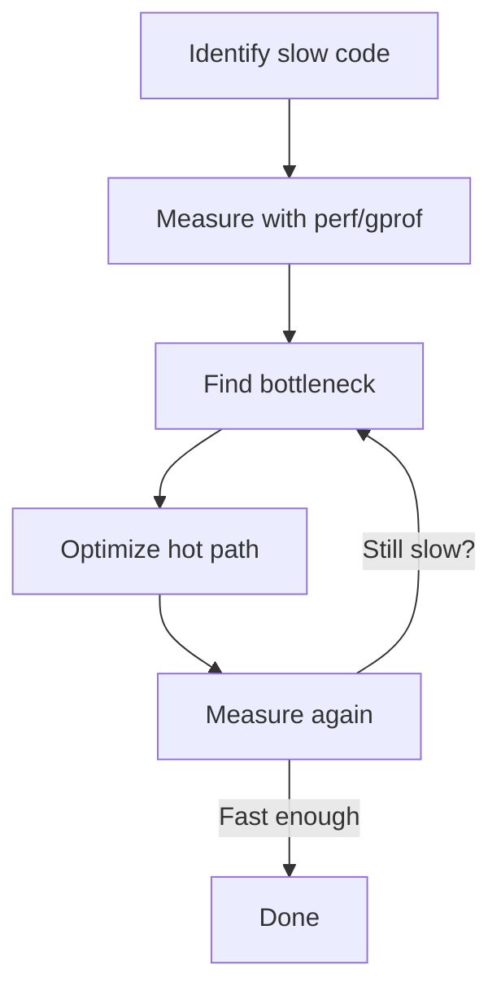

# Performance Profiling Tools

Tools for finding performance bottlenecks: CPU time, cache misses, branch mispredictions. Measure first, then optimize.

:::info Measure Before Optimizing
**Premature optimization is the root of all evil.** Profile to find actual bottlenecks, not perceived ones.
:::

## Linux perf

Powerful performance analysis tool using hardware performance counters.
```bash
# Install perf
sudo apt install linux-tools-generic  # Ubuntu
sudo yum install perf               # RedHat

# Record profile
perf record ./program

# View results
perf report

# Record with call graph
perf record -g ./program
perf report -g
```

### Basic Usage
```bash
# Profile specific command
perf record -g ./program args

# Profile running process
perf record -p <PID> -g sleep 30

# Record specific events
perf record -e cycles,cache-misses ./program

# Show live top
perf top
```

### Viewing Results
```bash
# Interactive report
perf report

# Annotate source code
perf annotate function_name

# Show statistics
perf stat ./program

# Flamegraph (install first)
perf script | stackcollapse-perf.pl | flamegraph.pl > flame.svg
```

### Example Output
```
# perf stat ./program

Performance counter stats for './program':

    1,234.56 msec task-clock          #    0.998 CPUs utilized
          45      context-switches    #    0.036 K/sec
           2      cpu-migrations      #    0.002 K/sec
         123      page-faults         #    0.100 K/sec
 3,456,789,012    cycles              #    2.801 GHz
 2,345,678,901    instructions        #    0.68  insn per cycle
   456,789,012    branches            #  370.123 M/sec
    12,345,678    branch-misses       #    2.70% of all branches
```

## gprof (GNU Profiler)

Traditional profiling tool.
```bash
# Compile with profiling
g++ -pg -g program.cpp -o program

# Run program (generates gmon.out)
./program

# View profile
gprof ./program gmon.out > analysis.txt
gprof ./program gmon.out | less
```

### gprof Output
```
Flat profile:

Each sample counts as 0.01 seconds.
  %   cumulative   self              self     total
 time   seconds   seconds    calls  ms/call  ms/call  name
 60.00      0.60     0.60    10000     0.06     0.06  slow_function
 30.00      0.90     0.30     5000     0.06     0.12  medium_function
 10.00      1.00     0.10        1   100.00   1000.00  main
```

**Reading:**
- `% time` = Percentage of total time
- `self seconds` = Time in function only
- `total` = Time including callees

## Time Command

Simple CPU time measurement.
```bash
# Basic timing
time ./program

# Output:
# real    0m1.234s   # Wall clock time
# user    0m0.890s   # CPU time in user mode
# sys     0m0.123s   # CPU time in kernel

# Detailed timing
/usr/bin/time -v ./program

# Shows:
# - Memory usage
# - Page faults
# - Context switches
```

## Callgrind (Valgrind Tool)

See [Valgrind](05-valgrind.md) section.
```bash
# Profile with callgrind
valgrind --tool=callgrind ./program

# Visualize
kcachegrind callgrind.out.<pid>
```

## Google Benchmark

Microbenchmarking library for C++.
```cpp showLineNumbers
#include <benchmark/benchmark.h>

static void BM_StringCopy(benchmark::State& state) {
    std::string x = "hello";
    for (auto _ : state) {
        std::string y = x;
        benchmark::DoNotOptimize(y);
    }
}
BENCHMARK(BM_StringCopy);

static void BM_VectorPush(benchmark::State& state) {
    for (auto _ : state) {
        std::vector<int> v;
        v.reserve(100);
        for (int i = 0; i < 100; ++i) {
            v.push_back(i);
        }
        benchmark::DoNotOptimize(v.data());
    }
}
BENCHMARK(BM_VectorPush);

BENCHMARK_MAIN();
```
```bash
# Compile
g++ -O2 -std=c++17 bench.cpp -lbenchmark -pthread -o bench

# Run
./bench

# Output:
# Benchmark              Time             CPU   Iterations
# BM_StringCopy         10 ns           10 ns     68000000
# BM_VectorPush        150 ns          150 ns      4600000
```

## Intel VTune

Commercial profiler (free for personal use).
```bash
# Collect profile
vtune -collect hotspots ./program

# View GUI
vtune-gui
```

**Features:**
- Hardware event analysis
- Threading analysis
- Memory access patterns

## AMD μProf

AMD's profiler for Ryzen/EPYC.

Similar to VTune but for AMD CPUs.

## Hotspot CPU Usage

Identify hot spots (functions using most CPU).
```bash
# With perf
perf record -g -F 99 ./program
perf report --stdio

# With gprof
g++ -pg program.cpp
./program
gprof ./program | head -20
```

## Cache Miss Analysis
```bash
# Count cache misses
perf stat -e cache-references,cache-misses ./program

# Detailed cache analysis
perf record -e cache-misses ./program
perf report

# Cachegrind (Valgrind)
valgrind --tool=cachegrind ./program
cg_annotate cachegrind.out.<pid>
```

## Branch Prediction Analysis
```bash
# Count branch misses
perf stat -e branches,branch-misses ./program

# Record branch misses
perf record -e branch-misses ./program
perf report
```

## Custom Performance Counters
```bash
# List available events
perf list

# CPU cycles
perf stat -e cycles ./program

# Instructions
perf stat -e instructions ./program

# Cache events
perf stat -e LLC-loads,LLC-load-misses ./program

# Multiple events
perf stat -e cycles,instructions,cache-references,cache-misses ./program
```

## Profiling Workflow


## Manual Instrumentation
```cpp showLineNumbers
#include <chrono>

class Timer {
    std::chrono::time_point<std::chrono::high_resolution_clock> start;
public:
    Timer() : start(std::chrono::high_resolution_clock::now()) {}
    
    ~Timer() {
        auto end = std::chrono::high_resolution_clock::now();
        auto duration = std::chrono::duration_cast<std::chrono::microseconds>(
            end - start);
        std::cout << "Time: " << duration.count() << " μs\n";
    }
};

void slow_function() {
    Timer t;  // Prints time on destruction
    // ... work ...
}
```

## Comparing Optimizations
```bash
# Before optimization
perf stat -r 10 ./program_old

# After optimization
perf stat -r 10 ./program_new

# Compare results
```

## Best Practices

:::success DO
- Profile before optimizing
- Focus on hot paths (90/10 rule)
- Measure real-world workloads
- Use release builds (`-O2/-O3`)
- Run multiple iterations
  :::

:::danger DON'T
- Optimize without measuring
- Profile debug builds
- Trust micro-benchmarks only
- Optimize cold paths
- Forget to disable turbo boost (for consistency)
  :::

## Quick Commands
```bash
# Quick CPU profiling
perf record -g ./program && perf report

# Quick stats
perf stat ./program

# Quick timing
time ./program

# Detailed profiling
g++ -pg program.cpp && ./program && gprof ./program

# Cache analysis
valgrind --tool=cachegrind ./program
```

## Summary
:::info
- **perf**: Linux profiler using hardware counters.
  - `perf record -g` (profile)
  - `perf report` (view). 
- **gprof**: Compile with `-pg`, generates `gmon.out`.
- **time**: Quick wall/CPU time.
- **Cachegrind**: Cache simulation.
- **Google Benchmark**: Microbenchmarks.
---
- Profile **before** optimizing, focus on hot paths, use release builds.
- Common metrics: CPU time, cache misses, branch mispredictions.
:::

```bash
# Daily workflow:
# 1. Quick check
time ./program

# 2. Find hotspots
perf record -g ./program
perf report

# 3. Analyze cache
valgrind --tool=cachegrind ./program

# 4. Optimize hot path
# 5. Measure again
perf stat ./program  # Compare before/after
```