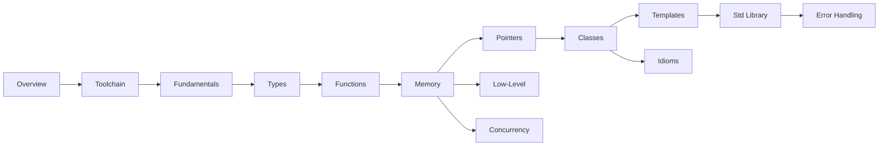

# C++ Knowledge Base

A structured reference for modern C++ (C++17/20/23): from the toolchain that turns text into a
binary, through the language and standard library, down to the memory model, ABI, and the tools you
use to debug and profile. Pages favour **why it behaves this way** over syntax dumps, and link to
each other instead of repeating themselves.

:::info How this is organised
Three loose tiers: the **foundation** (Overview, Toolchain, Language Fundamentals), the **language
and library** you write every day (Types through Standard Library), and the **systems-level and
tooling** layers (Error Handling through Debugging). Each folder is a self-contained topic; follow
the cross-links between them.
:::

## Sections

|   | Section | What it covers |
|---|---------|----------------|
| <Icon icon="lucide:book-open" inline /> | [Overview](./00-overview/what-is-cpp.md) | What C++ is, its philosophy, and the standard versions |
| <Icon icon="lucide:wrench" inline /> | [Toolchain & Build](./01-toolchain-and-build/compilation-pipeline.md) | Preprocess → compile → assemble → link, and the build tools around it |
| <Icon icon="lucide:braces" inline /> | [Language Fundamentals](./02-language-fundamentals/basic-syntax.md) | Syntax, expressions, operators, control flow |
| <Icon icon="lucide:shapes" inline /> | [Types & Values](./03-types-and-values/fundamental-types.md) | Fundamental types, conversions, `cv`-qualifiers, value categories, type deduction |
| <Icon icon="lucide:square-function" inline /> | [Functions & Call Mechanics](./04-functions-and-call-mechanics/function-declarations.md) | Overloading, default args, `inline`, `constexpr`, `noexcept`, calling conventions |
| <Icon icon="lucide:memory-stick" inline /> | [Memory & Object Lifetime](./05-memory-and-object-lifetime/memory-model-overview.md) | Storage duration, initialization, `new`/`delete`, lifetime, aliasing |
| <Icon icon="lucide:pointer" inline /> | [Pointers, References & Smart Pointers](./06-pointers-references-and-smart-pointers/raw-pointers.md) | Raw vs smart pointers, `unique_ptr`, `shared_ptr`, `weak_ptr` |
| <Icon icon="lucide:boxes" inline /> | [Classes & OOP](./07-classes-and-oop/constructors-and-destructors.md) | Construction, copy/move, inheritance, polymorphism, layout |
| <Icon icon="lucide:blocks" inline /> | [Templates & Metaprogramming](./08-templates-and-metaprogramming/function-templates.md) | Templates, deduction, SFINAE, concepts, traits, variadics |
| <Icon icon="lucide:library" inline /> | [Standard Library](./09-standard-library/containers.md) | Containers, iterators, algorithms, ranges, strings, chrono, filesystem |
| <Icon icon="lucide:shield-check" inline /> | [Error Handling & Safety](./10-error-handling-and-safety/01-exceptions.md) | Exceptions, the strong guarantee, error codes, assertions, contracts, UB |
| <Icon icon="lucide:waypoints" inline /> | [Concurrency & Memory Model](./11-concurrency-and-memory-model/01-cpp-memory-model.md) | The memory model, atomics, threads, mutexes, futures, pools |
| <Icon icon="lucide:binary" inline /> | [Low-Level & Platform](./12-low-level-and-platform/01-abi.md) | ABI, object layout, padding, endianness, `volatile`, C interop |
| <Icon icon="lucide:drafting-compass" inline /> | [Idioms & Design](./13-idioms-and-design/01-raii.md) | RAII, PIMPL, CRTP, non-copyable, copy-and-swap, type erasure, policies |
| <Icon icon="lucide:bug" inline /> | [Debugging & Profiling](./14-debugging-and-profiling/01-debugging-basics.md) | GDB, core dumps, sanitizers, Valgrind, `perf`, reading assembly |

## Suggested reading paths

- <Icon icon="lucide:rocket" inline /> **New to C++:** [Overview](./00-overview/what-is-cpp.md) → [Language Fundamentals](./02-language-fundamentals/basic-syntax.md) → [Types & Values](./03-types-and-values/fundamental-types.md) → [Classes & OOP](./07-classes-and-oop/constructors-and-destructors.md) → [Standard Library](./09-standard-library/containers.md). Enough to read and write real code.
- <Icon icon="lucide:arrow-left-right" inline /> **Coming from C:** skim [Overview](./00-overview/what-is-cpp.md) and [Language Fundamentals](./02-language-fundamentals/basic-syntax.md), then [Memory & Object Lifetime](./05-memory-and-object-lifetime/memory-model-overview.md), [Smart Pointers](./06-pointers-references-and-smart-pointers/unique-ptr.md) and [RAII](./13-idioms-and-design/01-raii.md) — that's where C++ diverges most.
- <Icon icon="lucide:cpu" inline /> **Systems / performance:** [Toolchain](./01-toolchain-and-build/linking.md), [Memory](./05-memory-and-object-lifetime/memory-model-overview.md), [Concurrency](./11-concurrency-and-memory-model/01-cpp-memory-model.md), [Low-Level & Platform](./12-low-level-and-platform/01-abi.md) and [Debugging & Profiling](./14-debugging-and-profiling/01-debugging-basics.md).

:::tip Conventions used across these docs
- Code blocks compile against C++17 or later; version-specific features are tagged inline (e.g. *(C++20)*).
- Admonitions flag the important bits: `info` for context, `tip` for guidance, `warning`/`danger` for foot-guns.
- Diagrams are Mermaid; data tables prefer plain words over decorative symbols.
:::
