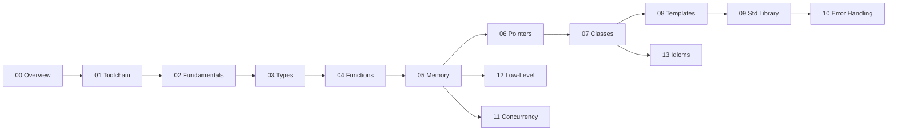

# C++ Knowledge Base

A structured reference for modern C++ (C++17/20/23): from the toolchain that turns text into a
binary, through the language and standard library, down to the memory model, ABI, and the tools you
use to debug and profile. Pages favour **why it behaves this way** over syntax dumps, and link to
each other instead of repeating themselves.

:::info How this is organised
Folders are numbered roughly by depth, not difficulty — `00`–`02` are the foundation, `03`–`09` are
the language and library you write every day, and `10`–`14` are the systems-level and tooling layers.
Each folder is a self-contained topic; follow the cross-links between them.
:::

## Sections

| #  | Section | What it covers |
|----|---------|----------------|
| 00 | [Overview](./00-overview/what-is-cpp.md) | What C++ is, its philosophy, and the standard versions |
| 01 | [Toolchain & Build](./01-toolchain-and-build/compilation-pipeline.md) | Preprocess → compile → assemble → link, and the build tools around it |
| 02 | [Language Fundamentals](./02-language-fundamentals/basic-syntax.md) | Syntax, expressions, operators, control flow |
| 03 | [Types & Values](./03-types-and-values/fundamental-types.md) | Fundamental types, conversions, `cv`-qualifiers, value categories, type deduction |
| 04 | [Functions & Call Mechanics](./04-functions-and-call-mechanics/function-declarations.md) | Overloading, default args, `inline`, `constexpr`, `noexcept`, calling conventions |
| 05 | [Memory & Object Lifetime](./05-memory-and-object-lifetime/memory-model-overview.md) | Storage duration, initialization, `new`/`delete`, lifetime, aliasing |
| 06 | [Pointers, References & Smart Pointers](./06-pointers-references-and-smart-pointers/raw-pointers.md) | Raw vs smart pointers, `unique_ptr`, `shared_ptr`, `weak_ptr` |
| 07 | [Classes & OOP](./07-classes-and-oop/constructors-and-destructors.md) | Construction, copy/move, inheritance, polymorphism, layout |
| 08 | [Templates & Metaprogramming](./08-templates-and-metaprogramming/function-templates.md) | Templates, deduction, SFINAE, concepts, traits, variadics |
| 09 | [Standard Library](./09-standard-library/containers.md) | Containers, iterators, algorithms, ranges, strings, chrono, filesystem |
| 10 | [Error Handling & Safety](./10-error-handling-and-safety/01-exceptions.md) | Exceptions, the strong guarantee, error codes, assertions, contracts, UB |
| 11 | [Concurrency & Memory Model](./11-concurrency-and-memory-model/01-cpp-memory-model.md) | The memory model, atomics, threads, mutexes, futures, pools |
| 12 | [Low-Level & Platform](./12-low-level-and-platform/01-abi.md) | ABI, object layout, padding, endianness, `volatile`, C interop |
| 13 | [Idioms & Design](./13-idioms-and-design/01-raii.md) | RAII, PIMPL, CRTP, non-copyable, copy-and-swap, type erasure, policies |
| 14 | [Debugging & Profiling](./14-debugging-and-profiling/01-debugging-basics.md) | GDB, core dumps, sanitizers, Valgrind, `perf`, reading assembly |

## Suggested reading paths

- **New to C++:** 00 → 02 → 03 → 07 → 09. Enough to read and write real code.
- **Coming from C:** skim 00–02, then 05 (lifetime), 06 (smart pointers), 13 (RAII) — that's where C++ diverges most.
- **Systems / performance:** 01 (linking), 05 (memory), 11 (concurrency), 12 (ABI/layout), 14 (profiling).

:::tip Conventions used across these docs
- Code blocks compile against C++17 or later; version-specific features are tagged inline (e.g. *(C++20)*).
- Admonitions flag the important bits: `info` for context, `tip` for guidance, `warning`/`danger` for foot-guns.
- Diagrams are Mermaid; tables prefer plain words over symbols.
:::
