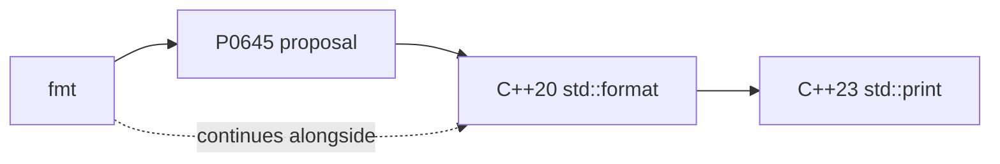

# Relationship to std::format

`std::format` is fmt, standardised. P0645 took fmt's design into the C++20 standard library almost
unchanged, which is why the two are near drop-in replacements for each other today — and why fmt is
still ahead, since it isn't bound to a standard's release cadence.

## The lineage

fmt didn't stop developing once `std::format` shipped — it kept adding features, and some of those
(`std::print` in C++23, for instance) later made their own way into the standard on the same path.

## What's in both

The format spec mini-language, `format`, `format_to`, `format_to_n`, `vformat`, and `formatter<T>`
customization all exist in both libraries with the same names and near-identical semantics. If you
know [the format spec syntax](../02-format-spec-mini-language/format-spec-syntax.md) for fmt, you
already know it for `std::format`.

## What's still fmt-only

| Feature | fmt | std::format |
|---|---|---|
| Named arguments (`fmt::arg`) | Yes | No |
| `fmt::join` for ranges with custom separators | Yes | Partial — via range formatting, less flexible |
| Color and text styles (`fmt/color.h`) | Yes | No |
| Printing directly to a `FILE*` | Yes (`fmt::print(FILE*, ...)`) | No |
| ostream fallback bridge | Yes (`fmt::streamed`) | No |
| Compile-time checks on older standards | Yes (`FMT_STRING`, works on C++11+) | No — needs C++20 |
| Speed and output size in practice | Consistently fast, small | Varies by standard library implementation |

## Toolchain reality

`std::format` needs a standard library new enough to have implemented it — libstdc++, libc++ and MSVC
STL all shipped it at different points, and older deployment targets simply don't have it.
`std::print` needs newer still.

:::note[If you must support an older libstdc++/libc++, fmt is not a preference — it's the only option]
On an LTS distribution or an embedded toolchain with an older standard library, `std::format` may not
exist yet regardless of which `-std=` flag you pass. fmt has no such dependency: it works back to
C++11.
:::

## Should I use fmt or std::format?

If your minimum supported toolchain has `std::format` and you don't need anything from the fmt-only
list above, prefer `std::format` — one fewer dependency, and the standard library ships it for free.
Otherwise, use fmt without hesitation: it is the reference implementation, it is faster in practice on
most standard libraries' current `std::format`, and it's available everywhere C++11 is. See
[Migration between fmt and std::format](../06-performance-and-best-practices/migration-from-std-format.md)
for the mechanical differences if you need to move between them later.

For `std::format`'s own presence in this knowledge base — in particular its chrono formatting
support — see [Chrono](../../cpp/09-standard-library/chrono.md).

## See also

- <Icon icon="lucide:sparkles" inline /> [What is fmt?](./what-is-fmt.md) — the broader context for this comparison.
- <Icon icon="lucide:arrow-left-right" inline /> [Migration between fmt and std::format](../06-performance-and-best-practices/migration-from-std-format.md) — the mechanical mapping between the two APIs.
- <Icon icon="lucide:scale" inline /> [Comparison with printf and iostreams](./comparison-with-printf-and-iostreams.md) — how both fmt and std::format compare to the older incumbents.
- <Icon icon="lucide:book-open" inline /> [fmt overview](../readme.md) — the full doc set.
