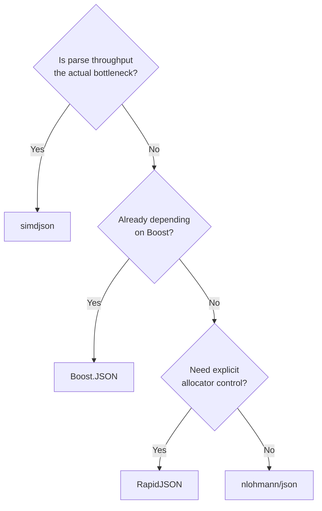

# Comparison with alternatives

Every C++ JSON library parses the same grammar into more or less the same tree shape. Where they
differ is what they optimize for — and "which JSON library should I use" is really a question about
which of those trade-offs matches your workload.

## The field

**RapidJSON** is the long-standing performance-oriented choice: a DOM/SAX hybrid with explicit
memory-pool allocators, in-situ parsing (mutating the input buffer instead of copying strings), and
very little ergonomic sugar. It's fast and predictable, at the cost of a C-like API.

**Boost.JSON** is a newer entry that targets the same performance tier as RapidJSON while offering
a friendlier, more STL-like `value` type — closer in spirit to nlohmann/json's ergonomics, but built
on Boost's allocator-aware container model, which makes it a natural pick for projects already
depending on Boost.

**simdjson** optimizes for one thing above all else: parse throughput, using SIMD instructions to
validate and index JSON at gigabytes-per-second. It achieves this with an "on-demand" parsing model
that is less forgiving to use casually than a full DOM.

**Reflection-based libraries** like [glaze](https://github.com/stephenberry/glaze) skip the DOM
step almost entirely, generating serialization code at compile time via reflection or macros to
convert directly between JSON text and your structs. They can be extremely fast for the specific
case of "I have a known struct and I want it in/out of JSON," at the cost of being less suited to
documents with a genuinely dynamic shape.

## Comparison table

| | nlohmann/json | RapidJSON | Boost.JSON | simdjson |
|---|---|---|---|---|
| Parse speed | Moderate | Fast | Fast | Fastest (SIMD) |
| Ergonomics | High (STL-like) | Low (C-like API) | Moderate–High | Low–moderate (on-demand API) |
| Allocation control | None (implicit) | Explicit memory pools | Allocator-aware | Minimal, buffer-focused |
| Mutability | Fully mutable DOM | Mutable DOM | Mutable DOM | Read-mostly (on-demand) |
| DOM vs streaming | DOM, with a SAX escape hatch | DOM and SAX | DOM, with streaming parser | On-demand streaming-style |
| Dependency weight | Single header, no deps | Header-only, no deps | Requires Boost | Header-only, no deps |
| C++ standard required | C++11 | C++03-ish | C++11 (Boost-dependent) | C++11 |

## Decision flow

## When nlohmann/json is the wrong tool

Three situations where reaching for something else is the right call:

- **Gigabyte-scale documents.** Building a full DOM for a document that size means a proportionally
  large number of heap allocations and a peak memory footprint several times the file size.
- **Hard real-time paths.** The DOM parser allocates freely and throws exceptions on malformed
  input; neither is compatible with a latency budget that can't tolerate an allocator call or an
  unwind.
- **Memory-constrained embedded targets.** The library's convenience comes from storing the full
  tree in memory; on a target with kilobytes of RAM, that's not available to spend.

:::note[The partial escape hatch]
You don't have to abandon the library entirely for large or streaming input — the
[SAX interface](../04-advanced-features/sax-interface.md) lets you consume events without building
a DOM, which recovers a lot of the memory-footprint problem while keeping the same library and the
same type conversions for the pieces you do keep.
:::

## See also

- <Icon icon="lucide:compass" inline /> [Design philosophy](./design-philosophy.md) — the trade-offs behind nlohmann/json's own choices.
- <Icon icon="lucide:book-open" inline /> [What is nlohmann/json?](./what-is-nlohmann-json.md) — what the library is optimizing for instead.
- <Icon icon="lucide:gauge" inline /> [Performance and best practices](../05-numbers-memory-and-performance/performance-and-best-practices.md) — getting the most out of nlohmann/json before reaching for another library.
- <Icon icon="lucide:file-json-2" inline /> [Boost.JSON](../../boost/12-serialization-and-data/boost-json.md) — a closer look at the Boost alternative.
- <Icon icon="lucide:book-open" inline /> [nlohmann/json overview](../readme.md) — the full section map.
