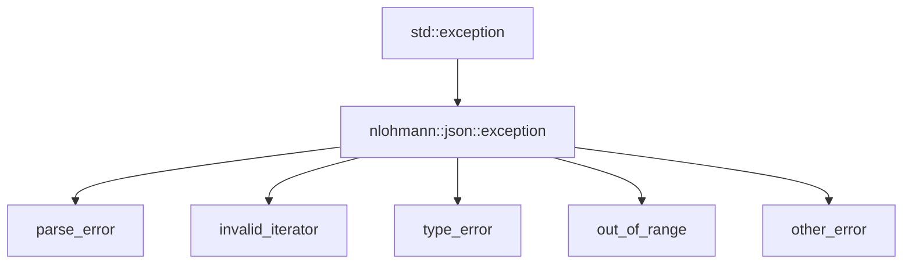

# Error handling and exceptions

Every failure in this library — a malformed parse, a wrong-type access, a missing key, an invalid
iterator — surfaces as one of five exception types, and every one of them carries a stable numeric
id you can match on. Learning this hierarchy once pays off across the whole library.

## The hierarchy



All five derive from `json::exception`, which derives from `std::exception`, so a single
`catch (const json::exception& e)` catches everything the library can throw, while `e.what()` and
`e.id` let you distinguish cases when you need to.

## What throws what

| Exception | id range | Typical trigger |
|---|---|---|
| `parse_error` | 1xx | `parse_error.101` — unexpected token while parsing malformed JSON text |
| `invalid_iterator` | 2xx | `invalid_iterator.202` — dereferencing or advancing an iterator that no longer points into the container |
| `type_error` | 3xx | `type_error.302` — `get<T>()` called with a `T` the stored value can't convert to; `type_error.305` — `operator[]` called with a key on a `json` that's an array or scalar, not an object |
| `out_of_range` | 4xx | `out_of_range.403` — key not found in `.at()` |
| `other_error` | 5xx | Miscellaneous — e.g. a failing `test` operation in `patch()` |

## Reading the message

`e.what()` always begins with a bracketed identifier of the exact form
`[json.exception.type_error.302]`, followed by a human-readable description — the bracketed part is
what you'd grep for in logs, the rest is for a person reading them. For `parse_error` specifically,
`e.byte` gives the byte offset into the input where the parser gave up, which is usually enough to
locate the bad token without re-running the parse with extra instrumentation.

```cpp
try {
    json j = json::parse(bad_input);
} catch (const json::parse_error& e) {
    std::cerr << "id=" << e.id << " byte=" << e.byte << " " << e.what() << "\n";
}
```

## Parsing without exceptions

If your codebase avoids exceptions on the parse path specifically, the `allow_exceptions = false`
overload returns a discarded value instead of throwing:

```cpp showLineNumbers
json j = json::parse(input, /* cb */ nullptr, /* allow_exceptions */ false);
if (j.is_discarded()) {
    // handle failure without a try/catch
    return std::nullopt;
}
```

This only covers the parse call itself — every other operation in the library (access, conversion,
patching) still throws on failure regardless of this flag.

## Building with exceptions disabled

For codebases compiled with exceptions turned off entirely, defining `JSON_NOEXCEPTION` before
including the header changes every `throw` in the library into a call to `abort()` instead.

:::danger[With JSON_NOEXCEPTION, malformed input aborts the process]
This isn't a graceful degradation — it's a hard process termination the instant any exceptional
path is hit, including ordinary malformed input on `json::parse`. If you build with
`JSON_NOEXCEPTION`, every code path that could reach the library with untrusted or unvalidated data
needs to validate it *before* the call, since the library itself no longer has a way to report the
failure back to you.
:::

## Diagnostics

Defining `JSON_DIAGNOSTICS=1` before including the header adds a JSON Pointer to the offending
element in every exception message — instead of just "wrong type," you get exactly which path in a
large document triggered the error, which is often the difference between a five-second fix and a
debugging session.

:::tip[Turn on JSON_DIAGNOSTICS in debug builds]
The extra diagnostic information isn't free — it adds a modest amount of runtime state tracking —
so it's a reasonable default for debug/development builds and worth turning off for a release build
where the extra cost isn't worth paying and the input is already well-tested.
:::

## See also

- <Icon icon="lucide:file-json" inline /> [Parsing JSON](../01-basics/parsing-json.md) — where `parse_error` and the non-throwing overload are introduced.
- <Icon icon="lucide:pointer" inline /> [Element access](../02-accessing-and-modifying/element-access.md) — the accessors that throw `out_of_range` and `type_error`.
- <Icon icon="lucide:radio" inline /> [The SAX interface](./sax-interface.md) — the `parse_error` callback in the SAX event model.
- <Icon icon="lucide:book-open" inline /> [nlohmann/json overview](../readme.md) — the full section map.
