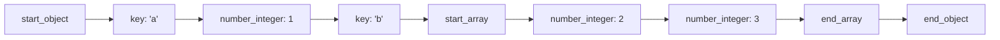

# The SAX interface

DOM parsing — `json::parse` — builds the entire document in memory before you can look at any of
it. SAX (Simple API for XML, borrowed here for JSON) parsing instead fires a callback for every
token as it's read, and lets you decide what to keep, without ever materializing a full tree.

## The event model



For the document `{"a": 1, "b": [2, 3]}`, the parser calls your handler in exactly this sequence —
no lookahead, no buffering beyond what the token itself requires.

## The json_sax interface

Implementing a handler means overriding the virtuals your case cares about (the base class has
default no-op implementations for the rest):

- `null()`
- `boolean(bool)`
- `number_integer(number_integer_t)`
- `number_unsigned(number_unsigned_t)`
- `number_float(number_float_t, const string_t&)`
- `string(string_t&)`
- `binary(binary_t&)`
- `start_object(std::size_t elements)` / `end_object()`
- `key(string_t&)`
- `start_array(std::size_t elements)` / `end_array()`
- `parse_error(std::size_t position, const std::string& last_token, const detail::exception& ex)`

Every callback returns a `bool`. Returning `false` from any of them **aborts the parse immediately**
— useful for early-exit once you've found what you were looking for, without reading the rest of
the document.

## A worked example

```cpp showLineNumbers title="count_keys.cpp"
struct KeyCounter : public json::json_sax_t {
    std::string target;
    std::size_t count = 0;

    explicit KeyCounter(std::string key) : target(std::move(key)) {}

    bool key(string_t& val) override {
        if (val == target) {
            ++count;
        }
        return true;   // keep parsing
    }

    // every other event uses the base class's no-op default,
    // so no DOM is ever built
};

KeyCounter handler("password");
json::sax_parse(input, &handler);
std::cout << handler.count << " occurrences\n";
```

The handler only overrides `key()`; every other token in the document is still visited but does
nothing, so peak memory stays flat regardless of document size.

## When SAX is worth it

| | DOM (`parse`) | SAX (`sax_parse`) |
|---|---|---|
| Peak memory | Proportional to document size | Proportional to what your handler retains |
| Random access after parsing | Yes — full tree available | No — only what you kept |
| Code complexity | Low — access the tree normally afterward | Higher — you write the traversal logic |
| Early exit on a match | Not without parsing everything first | Yes — return `false` to stop immediately |

## SAX for binary formats

`sax_parse` isn't limited to JSON text — the same handler interface drives parsing of CBOR,
MessagePack, and the other supported binary formats too, so a handler written once works across all
of them. See [Binary formats](./binary-formats.md) for the formats themselves.

## See also

- <Icon icon="lucide:file-json" inline /> [Parsing JSON](../01-basics/parsing-json.md) — the DOM-based `json::parse` this is an alternative to.
- <Icon icon="lucide:binary" inline /> [Binary formats](./binary-formats.md) — driving `sax_parse` with CBOR/MessagePack input.
- <Icon icon="lucide:alert-triangle" inline /> [Error handling and exceptions](./error-handling-and-exceptions.md) — how `parse_error` fits into the SAX callback set.
- <Icon icon="lucide:gauge" inline /> [Performance and best practices](../05-numbers-memory-and-performance/performance-and-best-practices.md) — when SAX is the right lever to pull.
- <Icon icon="lucide:book-open" inline /> [nlohmann/json overview](../readme.md) — the full section map.
