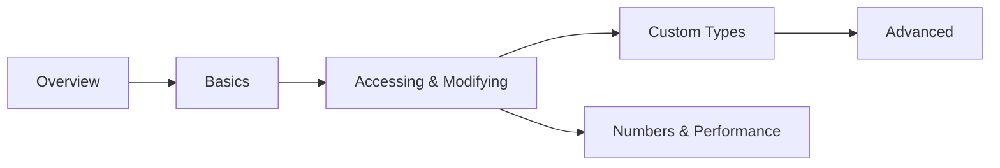

# nlohmann/json Knowledge Base

[nlohmann/json](https://github.com/nlohmann/json) — formally "JSON for Modern C++" — is a
single-header, C++11 library that models JSON as an STL-like container. Assigning a `std::string`
into a `json`, iterating it with a range-for, comparing two documents with `==`: all of it reads
like ordinary C++ rather than a bolted-on parsing API.

It is not the fastest JSON library in C++ — RapidJSON and simdjson both outrun it on raw parse
throughput — but it became the de facto default anyway, because most code that touches JSON is
bottlenecked on developer time, not parse time. These docs cover the library as you'll actually use
it: parsing and building documents, accessing and iterating them safely, converting your own types,
and the advanced corners (SAX, binary formats, numeric precision) you reach for once the easy path
stops being enough.

:::info[How this is organised]
Roughly outside-in: **Overview → Basics** get you parsing and printing JSON; **Accessing &
Modifying** and **Custom Type Conversion** are the day-to-day work of reading fields and mapping
them to your own structs; **Advanced Features** and **Numbers, Memory & Performance** are what you
reach for when the easy path stops being enough — streaming parses, binary wire formats, precision
and allocation control. Each folder is self-contained — follow the cross-links between pages.
:::

## Sections

|   | Section | What it covers |
|---|---------|----------------|
| <Icon icon="lucide:book-open" inline /> | [Overview](./00-overview/what-is-nlohmann-json.md) | What it is, installing it, design philosophy, how it compares to RapidJSON/simdjson |
| <Icon icon="lucide:wrench" inline /> | [Basics](./01-basics/parsing-json.md) | Parsing, constructing values, the value type, dumping |
| <Icon icon="lucide:pointer" inline /> | [Accessing & Modifying](./02-accessing-and-modifying/element-access.md) | `operator[]` vs `.at()`, iteration, conversions, JSON Pointer/Patch |
| <Icon icon="lucide:shuffle" inline /> | [Custom Type Conversion](./03-custom-type-conversion/to_json-and-from_json.md) | `to_json`/`from_json`, the macros, `adl_serializer` |
| <Icon icon="lucide:layers" inline /> | [Advanced Features](./04-advanced-features/sax-interface.md) | SAX parsing, CBOR/MessagePack/BSON, the exception hierarchy |
| <Icon icon="lucide:gauge" inline /> | [Numbers, Memory & Performance](./05-numbers-memory-and-performance/number-handling-and-precision.md) | Number storage and precision, `basic_json` template parameters, avoiding copies |

## Suggested reading paths



- <Icon icon="lucide:rocket" inline /> **Just need to read a config file:** [Parsing](./01-basics/parsing-json.md) → [Element access](./02-accessing-and-modifying/element-access.md) → [Error handling](./04-advanced-features/error-handling-and-exceptions.md).
- <Icon icon="lucide:shuffle" inline /> **Serializing your own structs:** [to_json/from_json](./03-custom-type-conversion/to_json-and-from_json.md) → [Macros](./03-custom-type-conversion/serialization-macros.md) → [adl_serializer](./03-custom-type-conversion/adl_serializer-and-templates.md).
- <Icon icon="lucide:gauge" inline /> **It's too slow / too big:** [Comparison with alternatives](./00-overview/comparison-with-alternatives.md) → [SAX interface](./04-advanced-features/sax-interface.md) → [Performance](./05-numbers-memory-and-performance/performance-and-best-practices.md).

## Quick reference

```cpp showLineNumbers title="the 90% of the API"
#include <nlohmann/json.hpp>
using json = nlohmann::json;

json j = json::parse(R"({"name":"ada","age":36})");  // parse
std::string name = j.at("name");                     // checked access
int age = j.value("age", 0);                          // access with default
j["tags"] = {"math", "engine"};                       // assign an array
std::string out = j.dump(2);                          // pretty-print, 2-space indent
```

| Task | Call |
|---|---|
| Parse a string | `json::parse(str)` |
| Parse a stream | `json j; ifs >> j;` |
| Access, throwing | `j.at("k")` |
| Access, with default | `j.value("k", fallback)` |
| Type test | `j.is_object()`, `j.is_null()`, … |
| Convert out | `j.get<T>()` / `j.get_to(x)` |
| Serialize | `j.dump()` / `j.dump(indent)` |
