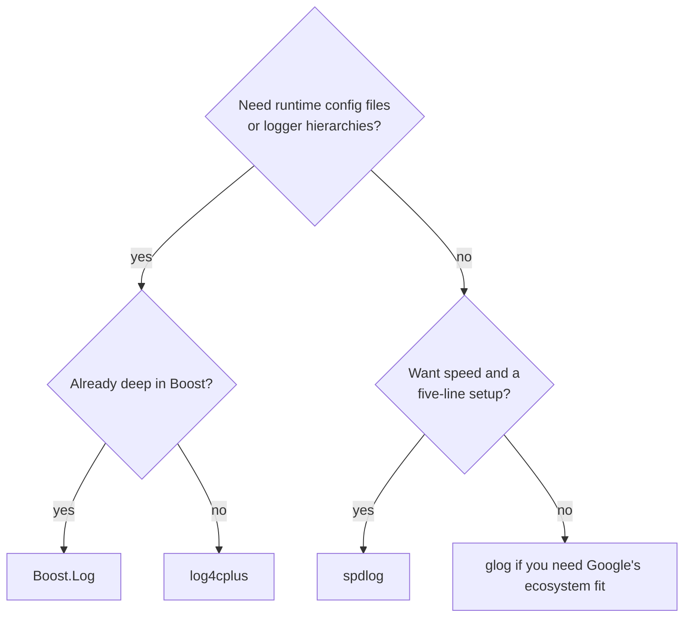

# Comparison with alternatives

The C++ logging libraries you'll actually run into differ less in "can it log" and more in how much
machinery they impose before your first log line, and how much configurability they trade for that
simplicity.

## The field

**glog** (Google's logging library) is battle-tested and extremely fast at the primitives it
supports, but its API predates modern C++ — no `{}` formatting, streams-based (`LOG(INFO) << x`), and
comparatively few sink options out of the box.

**Boost.Log** is the most configurable of the group: hierarchical loggers, runtime filtering
expressions, and a settings-file format, all built on Boost's usual heavy template machinery. That
configurability comes with a steeper learning curve and a slower path to "logs are appearing."

**log4cplus** is a log4j-style port: XML/properties configuration files, appender/logger hierarchies,
and rich runtime reconfiguration. It's the closest thing to Java-style enterprise logging in C++, and
it feels like it.

**Hand-rolled logging** — a macro over `std::ostream`, maybe `std::print` in C++23 — has zero
dependency cost and starts as "good enough." It stays good enough right up until you need level
filtering, file rotation, or async I/O, at which point you're re-implementing spdlog badly.

## Comparison table

| | spdlog | glog | Boost.Log | log4cplus |
|---|---|---|---|---|
| Throughput | Very high | High | Moderate | Moderate |
| Setup effort | Minutes, header-only | Minutes, needs a build | Hours, steep API | Hours, config files |
| Formatting syntax | fmt `{}` | streams (`<<`) | streams / expressions | streams / `%` patterns |
| Config file support | No | No | Yes (settings file) | Yes (XML/properties) |
| Dependency weight | Light (fmt only) | Light | Heavy (many Boost libs) | Moderate |
| Async support | Yes, built in | Limited | Yes | Yes |
| C++ standard | C++11+ | C++11+ | C++11+ | C++11+ |

## Choosing

## When spdlog is the wrong tool

Reach for something else if you need a configuration DSL that non-developers can edit
(log4cplus/Boost.Log), hierarchical logger inheritance where child loggers implicitly pick up parent
settings (Boost.Log), or first-class structured/JSON events rather than formatted text lines.

:::note[spdlog gets you structured-ish logging, not structured logging]
spdlog logs text lines fast; it does not model typed events. See
[Source location and structured logging](../04-formatting-and-patterns/source-location-and-structured-logging.md)
for the custom-formatter workaround if you need JSON output.
:::

For teams already using Boost.Log in production, [Boost.Log](../../boost/15-diagnostics-and-testing/boost-log.md)
covers the same ground from the Boost side.

## See also

- <Icon icon="lucide:compass" inline /> [Design philosophy](./design-philosophy.md) — why spdlog is shaped the way it is.
- <Icon icon="lucide:info" inline /> [What is spdlog?](./what-is-spdlog.md) — the feature set this page compares against.
- <Icon icon="lucide:settings" inline /> [Global settings and best practices](../06-performance-and-configuration/global-settings-and-best-practices.md) — what a production spdlog setup looks like.
- <Icon icon="lucide:book-open" inline /> [spdlog overview](../readme.md).
