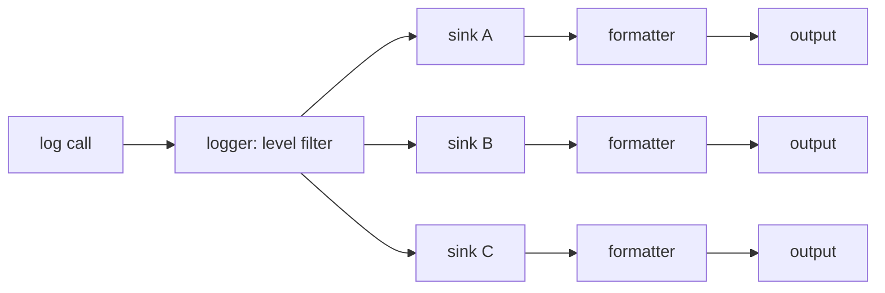

# Design philosophy

Three decisions explain almost every API in spdlog: formatting is delegated to fmt, sinks are the
one extension point, and work happens off the caller's thread only if you explicitly ask for it.
Once those three land, the rest of the API — loggers, the registry, patterns, async — reads as
consequences rather than separate features.

## Logger → sinks fan-out

Every log call follows the same path:

The logger's job stops at "should this message exist at all" — a single level check. Everything
after that (formatting, writing, flushing) is delegated to each sink independently, which is why one
logger can quietly write plain text to a file and colored text to a console at the same time.

## Built on fmt

spdlog's format strings are [fmt](https://github.com/fmtlib/fmt)'s format strings. That buys two
things `printf` and `iostream` don't offer together: type safety (the compiler — or fmt itself —
catches a mismatched `{}` argument) and speed (fmt's formatting is consistently faster than both
alternatives in benchmarks, because it avoids the locale and virtual-dispatch overhead streams carry
and the string-scanning overhead `printf` carries). See
[Basic formatting](../01-basics/basic-formatting.md) for the syntax.

## Speed-first defaults

- The level check happens *before* arguments are formatted — a disabled `spdlog::debug(...)` call
  costs one comparison, not a string build.
- The common logging path avoids heap allocation where the message fits in a small stack buffer.
- Every factory function comes in an `_mt` (mutex-protected) and `_st` (single-threaded, no locking)
  flavor:

| Suffix | Thread safety | Cost |
|---|---|---|
| `_mt` | Safe to log from multiple threads | One mutex lock/unlock per message |
| `_st` | Only safe from a single thread | No locking overhead |

Default to `_mt` unless you've profiled and confirmed a logger is genuinely single-threaded — the
cost of guessing wrong is a data race, not a slow log line.

## Extension points

Sinks are the officially supported place to add behavior spdlog doesn't ship: a new destination
([Custom sinks](../03-sinks/custom-sinks.md)), or a new pattern flag for the line format
([Custom formatters](../04-formatting-and-patterns/custom-formatters.md)). Everything else in the
library — loggers, the registry, the thread pool — is infrastructure that exists to get messages to
sinks efficiently, not something you're expected to subclass.

## The cost

None of this is free. Header-only mode means real compile-time cost in large projects (see
[Installation and integration](./installation-and-integration.md)). The vendored fmt copy is extra
code in your binary if you don't opt out of it. And the registry — the global name→logger map that
makes `spdlog::get("db")` work from anywhere — is convenient specifically because it's global state,
with all the shutdown-ordering and testability trade-offs that implies.

:::note[Global state is a design choice, not an accident]
spdlog could have required you to pass a logger reference everywhere. It didn't, because most
applications want "log from anywhere without threading a reference through every function" more than
they want to avoid a global. See [The registry](../02-loggers-and-registry/the-registry.md) for what
that trade actually costs you.
:::

## See also

- <Icon icon="lucide:info" inline /> [What is spdlog?](./what-is-spdlog.md) — the same architecture at a glance.
- <Icon icon="lucide:plug" inline /> [Sink overview](../03-sinks/sink-overview.md) — the extension point in depth.
- <Icon icon="lucide:waypoints" inline /> [Thread pool and async logger](../05-async-logging/thread-pool-and-async-logger.md) — "off the caller's thread if you ask for it", explained.
- <Icon icon="lucide:book-open" inline /> [spdlog overview](../readme.md).
