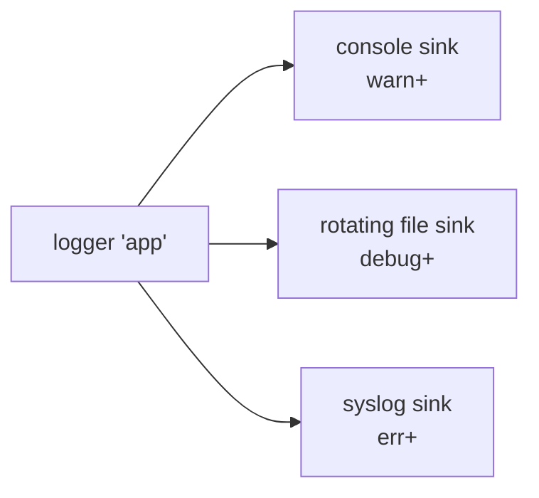

# Multi-sink loggers

One logger, several destinations — this is the standard shape for a real application: everything to
a file for later inspection, warnings and above to the console for whoever's watching right now.

## Constructing one

```cpp showLineNumbers title="multi_sink.cpp"
std::vector<spdlog::sink_ptr> sinks;

auto console_sink = std::make_shared<spdlog::sinks::stdout_color_sink_mt>();
console_sink->set_level(spdlog::level::warn);
sinks.push_back(console_sink);

auto file_sink = std::make_shared<spdlog::sinks::rotating_file_sink_mt>(
    "logs/app.log", 1024 * 1024 * 5, 3);
file_sink->set_level(spdlog::level::debug);
sinks.push_back(file_sink);

auto logger = std::make_shared<spdlog::logger>("app", sinks.begin(), sinks.end());
logger->set_level(spdlog::level::debug);
spdlog::register_logger(logger);
```

## Per-sink levels

Each sink filters independently of the others and independently of the logger's own level.

| | Logger level | Sink level |
|---|---|---|
| Filters | Every message, before any sink sees it | Only that sink's output |
| Order applied | First | Second, per sink |
| Typical use | The loosest level you'll ever want anywhere | Tighten per destination |

In the example above, the logger passes `debug` and up; the console sink then narrows that further to
`warn`+, while the file sink keeps everything down to `debug`. The console stays quiet, the file gets
everything.

## Per-sink patterns

Each sink can have its own `set_pattern`, independent of the others — a short colored pattern for the
console, a full timestamped one for the file:

```cpp
console_sink->set_pattern("[%^%l%$] %v");
file_sink->set_pattern("[%Y-%m-%d %H:%M:%S.%e] [%n] [%l] %v");
```

See [Pattern flags](../04-formatting-and-patterns/pattern-flags.md) for the full flag reference.

## The fan-out



One log call, filtered once by the logger, then filtered and formatted independently by each sink
that's still interested.

## Cost

Every enabled sink formats the message on its own — there's no shared formatting pass. A logger with
five sinks does five separate format operations per log call.

:::note[Sinks each run their own formatter — five sinks means five format passes]
If profiling shows formatting cost dominating, that cost scales with sink count, not just message
volume. Fewer, more targeted sinks (or moving expensive sinks to
[async](../05-async-logging/thread-pool-and-async-logger.md)) is the usual fix.
:::

## See also

- <Icon icon="lucide:list-tree" inline /> [Creating loggers](./creating-loggers.md) — the single-sink case this builds on.
- <Icon icon="lucide:plug" inline /> [Sink overview](../03-sinks/sink-overview.md) — what each sink family offers.
- <Icon icon="lucide:type" inline /> [Pattern flags](../04-formatting-and-patterns/pattern-flags.md) — per-sink pattern reference.
- <Icon icon="lucide:book-open" inline /> [spdlog overview](../readme.md).
