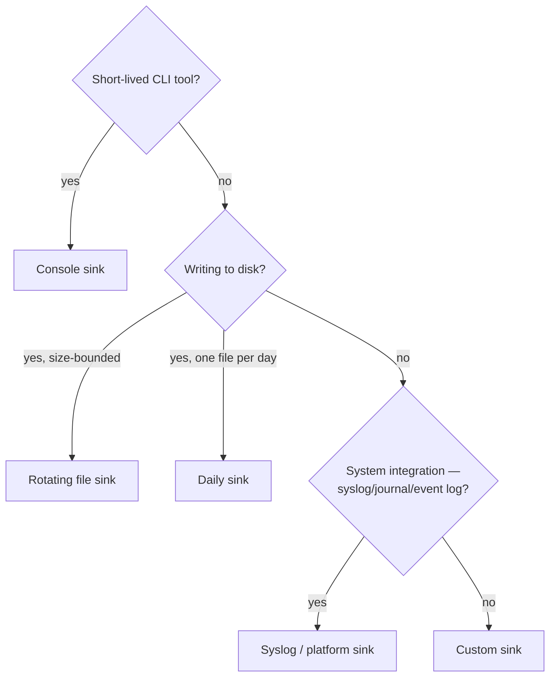

# Sink overview

The split of responsibility is deliberate: a logger decides *whether* to log at all, a sink decides
*where* and *how* an accepted message ends up. Everything about spdlog's sink family — the built-in
ones and the ones you write — follows from that one interface.

## The sink interface

```cpp showLineNumbers
class sink {
public:
    virtual ~sink() = default;
    virtual void log(const spdlog::details::log_msg& msg) = 0;
    virtual void flush() = 0;
    virtual void set_pattern(const std::string& pattern) = 0;
    virtual void set_formatter(std::unique_ptr<spdlog::formatter> sink_formatter) = 0;
};
```

`log` receives an already level-checked message; `flush` forces buffered output out; the two
`set_pattern`/`set_formatter` calls control how that message is rendered before it's written.

## Decision diagram



## The _mt / _st suffix

Every built-in sink ships in a mutex-guarded (`_mt`) and unguarded (`_st`) flavor — same class,
different locking.

| | `_st` | `_mt` |
|---|---|---|
| Locking cost | None | One mutex lock/unlock per `log()` call |
| Safe from multiple threads | No | Yes |
| When to use | A logger you've confirmed is single-threaded | The default choice |

## Sinks are shareable

A `sink_ptr` (a `std::shared_ptr<sink>`) can back more than one logger. That's how two independent
components write to the same file without interleaving corrupted lines — the mutex lives on the sink,
so every writer through it serializes correctly regardless of which logger they came through. See
[Multi-sink loggers](../02-loggers-and-registry/multi-sink-loggers.md) for the construction pattern.

## Built-in sink families

| Family | Header | Page |
|---|---|---|
| Console | `spdlog/sinks/stdout_color_sinks.h` | [Console sinks](./console-sinks.md) |
| File | `spdlog/sinks/basic_file_sink.h` | [File sinks](./file-sinks.md) |
| Rotating / daily | `spdlog/sinks/rotating_file_sink.h`, `daily_file_sink.h` | [Rotating and daily sinks](./rotating-and-daily-sinks.md) |
| Syslog / platform | `spdlog/sinks/syslog_sink.h` and others | [Syslog and platform sinks](./syslog-and-platform-sinks.md) |

## See also

- <Icon icon="lucide:terminal" inline /> [Console sinks](./console-sinks.md) — the destination that's always there.
- <Icon icon="lucide:wrench" inline /> [Custom sinks](./custom-sinks.md) — the extension point when nothing built-in fits.
- <Icon icon="lucide:layers" inline /> [Multi-sink loggers](../02-loggers-and-registry/multi-sink-loggers.md) — attaching several sinks to one logger.
- <Icon icon="lucide:book-open" inline /> [spdlog overview](../readme.md).
