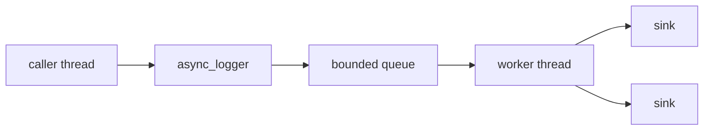

# Thread pool and async logger

Async logging moves formatting and I/O off the calling thread and onto a background pool — the
calling thread's job shrinks to "copy the message into a queue" and return immediately.

## The pipeline



## Setting it up

```cpp showLineNumbers title="async_setup.cpp"
spdlog::init_thread_pool(8192, 1);   // queue size, worker thread count

auto logger = spdlog::create_async<spdlog::sinks::rotating_file_sink_mt>(
    "app", "logs/app.log", 1024 * 1024 * 10, 3);

logger->info("this call returns almost immediately");
```

## Queue size and worker count

Each queued entry costs roughly `sizeof(async_msg)` plus the formatted arguments — memory scales
directly with `queue_size`. Worker count is more subtle:

:::danger[More than one worker thread means log lines can appear out of order]
With a single worker, messages are written in the order they were queued. With more than one, two
workers can pull messages off the queue and reach a sink in either order, so log lines can appear
out of sequence relative to when they were actually logged. Stick to one worker unless you've
measured that a single worker is the bottleneck and you can tolerate reordering.
:::

## What gets copied

The message is formatted and copied into the queue at call time — not deferred until the worker
picks it up.

:::note[Async does not make expensive arguments free — it only moves the I/O]
An expensive-to-format argument still costs the caller thread the same as it would synchronously.
Async logging saves you the I/O wait (writing to disk, syslog, the network); it does nothing for
formatting cost. See [Basic formatting](../01-basics/basic-formatting.md) for where that cost comes
from.
:::

## Shutdown

`spdlog::shutdown()` drains the queue and joins the worker thread(s) before returning.

:::danger[Destroying the thread pool before the loggers that use it is undefined]
An `async_logger` holds a reference to the thread pool it was created with. If the pool is destroyed
(or `init_thread_pool` is called again, replacing it) while a logger built against the old pool is
still reachable, logging through that logger afterward is undefined behavior. Let
`spdlog::shutdown()` own teardown order — see
[Logger lifecycle](../02-loggers-and-registry/logger-lifecycle.md) for the general shared-ownership
picture.
:::

## create_async vs create_async_nb

`create_async<Sink>(...)` blocks the caller when the queue is full (the default overflow policy);
`create_async_nb<Sink>(...)` ("non-blocking") drops the oldest queued message instead of stalling the
caller. See [Overflow policies](./overflow-policies.md) for the full trade-off.

## See also

- <Icon icon="lucide:gauge" inline /> [Overflow policies](./overflow-policies.md) — what happens when the queue fills up.
- <Icon icon="lucide:scale" inline /> [Async vs sync trade-offs](./async-vs-sync-tradeoffs.md) — whether async is the right call at all.
- <Icon icon="lucide:timer" inline /> [Logger lifecycle](../02-loggers-and-registry/logger-lifecycle.md) — the extra lifetime constraint the thread pool adds.
- <Icon icon="lucide:book-open" inline /> [spdlog overview](../readme.md).
