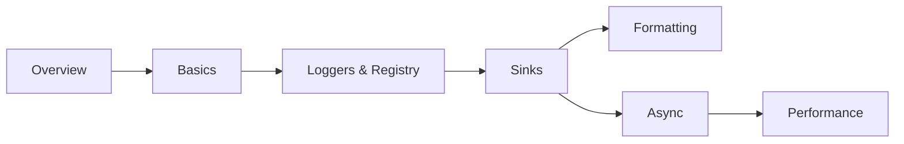

# spdlog Knowledge Base

spdlog is a **very fast, header-only-by-default C++ logging library** built on top of
[fmt](https://github.com/fmtlib/fmt). You add one include, call `spdlog::info(...)`, and you have
color console output — no build step, no configuration file, no init call required.

It displaced glog, log4cplus, and hand-rolled `iostream`/macro logging as the default choice for new
C++ projects for a simple reason: it is both easier to start with and faster in production.
Throughput is measured in millions of lines per second, formatting uses fmt's compile-time-checked
`{}` syntax instead of `printf`, and every layer above the basics — file rotation, async logging,
backtraces, custom sinks — is opt-in rather than mandatory ceremony.

:::info[How this is organised]
**Overview → Basics** gets you logging in five minutes. **Loggers and Registry** and **Sinks** are
the architecture you configure once per application — how loggers, sinks, and the global registry
fit together. **Formatting**, **Async Logging**, and **Performance and Configuration** are the tuning
layers you reach for once the defaults stop fitting: custom pattern flags, moving I/O off the hot
path, and squeezing out the last bit of overhead.
:::

## Sections

|   | Section | What it covers |
|---|---------|----------------|
| <Icon icon="lucide:book-open" inline /> | [Overview](./00-overview/what-is-spdlog.md) | What it is, installing it, the sink architecture, how it compares to glog/Boost.Log |
| <Icon icon="lucide:play" inline /> | [Basics](./01-basics/quick-start.md) | The default logger, log levels, fmt-style formatting |
| <Icon icon="lucide:list-tree" inline /> | [Loggers & Registry](./02-loggers-and-registry/creating-loggers.md) | Creating loggers, the global registry, lifetime, multi-sink loggers |
| <Icon icon="lucide:plug" inline /> | [Sinks](./03-sinks/sink-overview.md) | Console, file, rotating, daily, syslog, and writing your own |
| <Icon icon="lucide:type" inline /> | [Formatting & Patterns](./04-formatting-and-patterns/pattern-flags.md) | Pattern flags, custom flag formatters, source location |
| <Icon icon="lucide:waypoints" inline /> | [Async Logging](./05-async-logging/thread-pool-and-async-logger.md) | The thread pool, overflow policies, when async pays off |
| <Icon icon="lucide:gauge" inline /> | [Performance & Configuration](./06-performance-and-configuration/compile-time-log-level.md) | Compile-time levels, backtrace, flush policies, global setup |

## Suggested reading paths



- <Icon icon="lucide:rocket" inline /> **Just want logs in my app:** [Quick start](./01-basics/quick-start.md) → [Log levels](./01-basics/log-levels.md) → [Console sinks](./03-sinks/console-sinks.md).
- <Icon icon="lucide:folder-cog" inline /> **Setting up logging for a real service:** [Creating loggers](./02-loggers-and-registry/creating-loggers.md) → [Multi-sink loggers](./02-loggers-and-registry/multi-sink-loggers.md) → [Rotating and daily sinks](./03-sinks/rotating-and-daily-sinks.md) → [Flush policies](./06-performance-and-configuration/flush-policies.md).
- <Icon icon="lucide:gauge" inline /> **Logging is showing up in the profile:** [Compile-time log level](./06-performance-and-configuration/compile-time-log-level.md) → [Async vs sync](./05-async-logging/async-vs-sync-tradeoffs.md) → [Overflow policies](./05-async-logging/overflow-policies.md).

## Quick reference

```cpp showLineNumbers title="the 90% of the API"
#include "spdlog/spdlog.h"
#include "spdlog/sinks/rotating_file_sink.h"

spdlog::info("plain message");
spdlog::warn("formatted: {} of {}", done, total);      // fmt syntax

auto file = spdlog::rotating_logger_mt(
    "app", "logs/app.log", 1024 * 1024 * 5, 3);        // 5 MB x 3 files
file->set_level(spdlog::level::debug);
file->set_pattern("[%Y-%m-%d %H:%M:%S.%e] [%n] [%l] %v");
file->flush_on(spdlog::level::err);

spdlog::set_default_logger(file);                      // spdlog::info now goes here
spdlog::shutdown();                                    // at exit
```

| Task | Call |
|---|---|
| Log at a level | `spdlog::trace/debug/info/warn/error/critical(...)` |
| Named console logger | `spdlog::stdout_color_mt("name")` |
| Named file logger | `spdlog::basic_logger_mt("name", "path.log")` |
| Fetch by name | `spdlog::get("name")` |
| Runtime level | `logger->set_level(spdlog::level::debug)` |
| Compile-time level | `-DSPDLOG_ACTIVE_LEVEL=SPDLOG_LEVEL_DEBUG` |
| Pattern | `logger->set_pattern("%+")` |
| Flush | `logger->flush()` / `flush_on(level)` |
