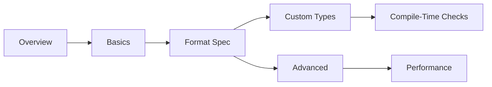

# fmt Documentation Set Implementation Plan

> **For agentic workers:** REQUIRED SUB-SKILL: Use superpowers:subagent-driven-development (recommended) or superpowers:executing-plans to implement this plan task-by-task. Steps use checkbox (`- [ ]`) syntax for tracking.

**Goal:** Add a comprehensive, boost-style documentation set for `fmt` at `docs/programming/fmt/` (26 topic pages + overview), wired into the autogenerated `programming` sidebar.

**Architecture:** Task 1 creates the whole skeleton — folder, all `_category_.json` files, `readme.md`, and every topic `.md` as a valid stub (frontmatter + H1 + one framing sentence). Every later task fleshes out exactly one numbered subfolder. This ordering means `npm run build` (with `onBrokenLinks: "throw"`) passes after *every* task, because all link targets exist from Task 1 onward.

**Tech Stack:** Docusaurus 3.9 Markdown (MDX), Docusaurus admonitions, Mermaid (`@docusaurus/theme-mermaid`), Prism code fences, `<Icon icon="lucide:..." inline />` from the site's swizzled Icon component.

## Global Constraints

These apply to **every** page this plan creates. They are always in force and are not restated per task.

- **Folder position:** `docs/programming/fmt/_category_.json` gets `"position": 8` (existing siblings: `cpp`=2, `python`=3, `cmake`=4, `boost`=5; `nlohmann-json`=6 and `spdlog`=7 are claimed by the parallel plans — keep 8 regardless of whether those have run). Label is exactly `"fmt"`.
- **JSON files are tab-indented** — every existing `_category_.json` in this repo uses a literal tab. Match it. (Biome's 2-space setting targets JS/TS; do not reformat these files.)
- **Subfolder `_category_.json` scheme** (copied from `docs/programming/cmake/*/`): folder `NN-name` gets `"label": "<NN+1>. <Human name>"` and `"position": <NN+2>`. So `00-overview` → label `"1. Overview"`, position `2`.
- **`readme.md` frontmatter** has `title`, `sidebar_label: Overview`, `sidebar_position: 1`, `tags` — **no `id`** (matches `boost/readme.md`, `cmake/readme.md`).
- **Topic page frontmatter** is exactly:
  ```md
  ---
  id: <kebab-case-id>
  title: <Human Title>
  sidebar_label: <short label>
  sidebar_position: <int, starts at 1 within its folder>
  tags: [c++, fmt, <topic-tag>, <topic-tag>]
  ---
  ```
- **Tags** always start `c++, fmt`, then 1-3 lowercase hyphenated topic tags.
- **Every topic page** opens with `# H1` matching `title`, then 1-2 prose paragraphs on *why this exists / what problem it solves* before any API detail, then `##` sections (`###` sparingly), and ends with a `## See also` list of 3-5 bullets in this exact shape:
  `- <Icon icon="lucide:xyz" inline /> [Link text](./relative-path.md) — one-line reason to go there.`
  Order: siblings first, then cross-folder, then `../readme.md` last.
- **Admonitions** — only these four, with these meanings: `:::info[...]` framing why a feature exists; `:::tip[...]` idiomatic usage / best practice; `:::danger[...]` UB and footguns; `:::note[...]` "which should I use", migration, version caveats.
- **Code fences:** ` ```cpp ` (or ` ```bash `, ` ```cmake `). Add `showLineNumbers` to any snippet longer than ~5 lines. Add `title="filename.cpp"` when the snippet is a real standalone file. Snippets must be conceptually compilable — correct `#include <fmt/format.h>` / `<fmt/ranges.h>` / `<fmt/chrono.h>` / `<fmt/color.h>`, no hand-waved syntax.
- **No `json` fences are needed in this plan.** Do not touch `prism.additionalLanguages`.
- **Braces in MDX:** Docusaurus renders these files as MDX. Braces inside fenced code blocks and inline backticks are safe. **Never** write a bare `{}` or `{:d}` in prose outside backticks — wrap every format-spec fragment in inline code. This matters more here than in any other doc set in the repo.
- **Voice:** precise, technical, conversational but not casual, willing to state opinions ("prefer X unless Y"). Every "how" paired with a "why" or a "when".
- **Comparison tables** (`| Feature | Option A | Option B |`) are mandatory wherever a page's job is to help the reader choose.
- **Never** add a `Co-Authored-By` trailer or "Generated with Claude Code" line to commits (`CLAUDE.md`). Commit messages are one line, `<type>: <what>`.
- **Verification gate for every task:** `npm run build` must exit 0. That is this repo's only correctness gate — it validates internal links, MDX syntax, and admonition syntax.

---

## File Structure

```
docs/programming/fmt/
├── _category_.json                    label "fmt", position 8
├── readme.md                          landing page: sections table, reading paths, quick reference
├── 00-overview/                       what it is, install, std::format lineage, vs printf/iostreams
├── 01-basics/                         format strings, the function family, named/positional args
├── 02-format-spec-mini-language/      the spec grammar, alignment, sign/precision, types, locales
├── 03-formatting-custom-types/        formatter<T>, ostream bridge, ranges, chrono
├── 04-compile-time-checks/            FMT_STRING / consteval checks, error diagnostics
├── 05-advanced-features/              format_to, memory_buffer, color, unicode
└── 06-performance-and-best-practices/ benchmarks, build modes, migration, pitfalls
```

No sidebar edit is needed — `sidebars.js` autogenerates from `dirName: "programming"`.

---

### Task 1: Skeleton — folders, categories, stubs, readme

Creates every file the rest of the plan will fill in, so that all cross-links resolve from here on.

**Files:**
- Create: `docs/programming/fmt/_category_.json`
- Create: `docs/programming/fmt/readme.md`
- Create: `docs/programming/fmt/{00-overview,01-basics,02-format-spec-mini-language,03-formatting-custom-types,04-compile-time-checks,05-advanced-features,06-performance-and-best-practices}/_category_.json`
- Create: 26 stub `.md` files (listed below)

**Interfaces:**
- Consumes: nothing.
- Produces: the exact file paths and frontmatter `id`/`title`/`sidebar_position` values that Tasks 2-8 fill in, and that every `See also` link in this plan targets.

- [ ] **Step 1: Create the folder `_category_.json` (tab-indented)**

`docs/programming/fmt/_category_.json`:
```json
{
	"label": "fmt",
	"position": 8,
	"link": {
		"type": "generated-index"
	}
}
```

- [ ] **Step 2: Create the seven subfolder `_category_.json` files (tab-indented)**

`00-overview/_category_.json`:
```json
{
	"label": "1. Overview",
	"position": 2,
	"link": {
		"type": "generated-index"
	}
}
```
Same shape for the rest, changing only label and position:
- `01-basics/` → `"label": "2. Basics"`, `"position": 3`
- `02-format-spec-mini-language/` → `"label": "3. Format spec mini-language"`, `"position": 4`
- `03-formatting-custom-types/` → `"label": "4. Formatting custom types"`, `"position": 5`
- `04-compile-time-checks/` → `"label": "5. Compile-time checks"`, `"position": 6`
- `05-advanced-features/` → `"label": "6. Advanced features"`, `"position": 7`
- `06-performance-and-best-practices/` → `"label": "7. Performance and best practices"`, `"position": 8`

- [ ] **Step 3: Create the 26 topic stubs**

Each stub is frontmatter + H1 + exactly one sentence of framing prose. No `## See also` yet (Tasks 2-8 write the real body). Exact stub shape:

```md
---
id: what-is-fmt
title: What is fmt?
sidebar_label: What is fmt
sidebar_position: 1
tags: [c++, fmt, overview, introduction]
---

# What is fmt?

A fast, type-safe formatting library whose design became C++20's `std::format`.
```

Create all 26 with exactly these paths, ids, titles, sidebar labels, positions and tags:

**`00-overview/`**
| file | id | title | sidebar_label | pos | tags after `c++, fmt` |
|---|---|---|---|---|---|
| `what-is-fmt.md` | `what-is-fmt` | What is fmt? | What is fmt | 1 | `overview, introduction` |
| `installation-and-integration.md` | `installation-and-integration` | Installation and integration | Installation | 2 | `install, cmake, build` |
| `relationship-to-std-format.md` | `relationship-to-std-format` | Relationship to std::format | std::format | 3 | `std-format, standard, lineage` |
| `comparison-with-printf-and-iostreams.md` | `comparison-with-printf-and-iostreams` | Comparison with printf and iostreams | vs printf/iostreams | 4 | `comparison, printf, iostreams` |

**`01-basics/`**
| file | id | title | sidebar_label | pos | tags after `c++, fmt` |
|---|---|---|---|---|---|
| `format-strings-and-arguments.md` | `format-strings-and-arguments` | Format strings and arguments | Format strings | 1 | `basics, format-strings` |
| `the-format-function-family.md` | `the-format-function-family` | The format function family | Function family | 2 | `basics, api` |
| `positional-and-named-arguments.md` | `positional-and-named-arguments` | Positional and named arguments | Positional and named | 3 | `basics, arguments` |

**`02-format-spec-mini-language/`**
| file | id | title | sidebar_label | pos | tags after `c++, fmt` |
|---|---|---|---|---|---|
| `format-spec-syntax.md` | `format-spec-syntax` | Format spec syntax | Spec syntax | 1 | `format-spec, grammar` |
| `alignment-fill-and-width.md` | `alignment-fill-and-width` | Alignment, fill and width | Alignment and width | 2 | `format-spec, alignment` |
| `sign-and-numeric-precision.md` | `sign-and-numeric-precision` | Sign and numeric precision | Sign and precision | 3 | `format-spec, numbers` |
| `type-specific-presentation.md` | `type-specific-presentation` | Type-specific presentation | Presentation types | 4 | `format-spec, presentation` |
| `numeric-grouping-and-locales.md` | `numeric-grouping-and-locales` | Numeric grouping and locales | Locales | 5 | `format-spec, locale` |

**`03-formatting-custom-types/`**
| file | id | title | sidebar_label | pos | tags after `c++, fmt` |
|---|---|---|---|---|---|
| `formatter-specialization.md` | `formatter-specialization` | formatter specialization | formatter | 1 | `custom-types, formatter` |
| `ostream-fallback-formatting.md` | `ostream-fallback-formatting` | ostream fallback formatting | ostream bridge | 2 | `custom-types, ostream` |
| `ranges-tuples-and-containers.md` | `ranges-tuples-and-containers` | Ranges, tuples and containers | Ranges | 3 | `custom-types, ranges` |
| `chrono-and-time-formatting.md` | `chrono-and-time-formatting` | Chrono and time formatting | Chrono | 4 | `custom-types, chrono, time` |

**`04-compile-time-checks/`**
| file | id | title | sidebar_label | pos | tags after `c++, fmt` |
|---|---|---|---|---|---|
| `compile-time-format-string-checking.md` | `compile-time-format-string-checking` | Compile-time format string checking | Compile-time checks | 1 | `compile-time, safety` |
| `error-diagnostics.md` | `error-diagnostics` | Error diagnostics | Diagnostics | 2 | `errors, diagnostics` |

**`05-advanced-features/`**
| file | id | title | sidebar_label | pos | tags after `c++, fmt` |
|---|---|---|---|---|---|
| `output-iterators-and-format_to.md` | `output-iterators-and-format-to` | Output iterators and format_to | format_to | 1 | `advanced, output-iterators` |
| `memory-buffer-and-buffered-output.md` | `memory-buffer-and-buffered-output` | memory_buffer and buffered output | memory_buffer | 2 | `advanced, buffers, allocation` |
| `color-and-text-styles.md` | `color-and-text-styles` | Color and text styles | Color and styles | 3 | `advanced, color, terminal` |
| `unicode-and-encoding-notes.md` | `unicode-and-encoding-notes` | Unicode and encoding notes | Unicode | 4 | `advanced, unicode, encoding` |

**`06-performance-and-best-practices/`**
| file | id | title | sidebar_label | pos | tags after `c++, fmt` |
|---|---|---|---|---|---|
| `performance-characteristics.md` | `performance-characteristics` | Performance characteristics | Performance | 1 | `performance, benchmarks` |
| `header-only-vs-compiled-mode.md` | `header-only-vs-compiled-mode` | Header-only vs compiled mode | Build modes | 2 | `build, compile-time` |
| `migration-from-std-format.md` | `migration-from-std-format` | Migration between fmt and std::format | Migration | 3 | `migration, std-format` |
| `common-pitfalls.md` | `common-pitfalls` | Common pitfalls | Pitfalls | 4 | `pitfalls, lifetime` |

- [ ] **Step 4: Write the full `readme.md`**

This is the real page, not a stub — every link target now exists. Structure copied from `docs/programming/cmake/readme.md`:

````md
---
title: Overview of fmt
sidebar_label: Overview
sidebar_position: 1
tags: [c++, fmt]
---

# fmt Knowledge Base

<1-2 paragraphs: a type-safe, fast formatting library with Python-style replacement fields;
it is the reference implementation that became C++20's `std::format`, and it still ships
features the standard hasn't caught up with.>

:::info[How this is organised]
<Explain the progression: Overview → Basics gets you formatting strings; the Format spec
mini-language is the reference you keep coming back to; Custom types and Compile-time checks
are what you need to use it across a real codebase; Advanced and Performance are the
allocation- and throughput-sensitive corners.>
:::

## Sections

|   | Section | What it covers |
|---|---------|----------------|
| <Icon icon="lucide:book-open" inline /> | [Overview](./00-overview/what-is-fmt.md) | What it is, installing it, its relationship to `std::format`, why not `printf` |
| <Icon icon="lucide:wrench" inline /> | [Basics](./01-basics/format-strings-and-arguments.md) | Replacement fields, the `format`/`print`/`format_to` family, named arguments |
| <Icon icon="lucide:ruler" inline /> | [Format Spec Mini-Language](./02-format-spec-mini-language/format-spec-syntax.md) | The full spec grammar: fill, align, sign, width, precision, type, locale |
| <Icon icon="lucide:shapes" inline /> | [Formatting Custom Types](./03-formatting-custom-types/formatter-specialization.md) | `fmt::formatter<T>`, the ostream bridge, ranges, `std::chrono` |
| <Icon icon="lucide:shield-check" inline /> | [Compile-Time Checks](./04-compile-time-checks/compile-time-format-string-checking.md) | `FMT_STRING`, `consteval` checking, reading the errors |
| <Icon icon="lucide:layers" inline /> | [Advanced Features](./05-advanced-features/output-iterators-and-format_to.md) | `format_to`, `memory_buffer`, color and styles, Unicode |
| <Icon icon="lucide:gauge" inline /> | [Performance & Best Practices](./06-performance-and-best-practices/performance-characteristics.md) | Where the speed comes from, build modes, migration, pitfalls |

## Suggested reading paths



- <Icon icon="lucide:rocket" inline /> **Coming from printf:** [Comparison with printf](./00-overview/comparison-with-printf-and-iostreams.md) → [Format strings](./01-basics/format-strings-and-arguments.md) → [Format spec syntax](./02-format-spec-mini-language/format-spec-syntax.md).
- <Icon icon="lucide:shapes" inline /> **Formatting your own types:** [formatter specialization](./03-formatting-custom-types/formatter-specialization.md) → [Ranges](./03-formatting-custom-types/ranges-tuples-and-containers.md) → [Compile-time checks](./04-compile-time-checks/compile-time-format-string-checking.md).
- <Icon icon="lucide:gauge" inline /> **Chasing allocations:** [format_to](./05-advanced-features/output-iterators-and-format_to.md) → [memory_buffer](./05-advanced-features/memory-buffer-and-buffered-output.md) → [Performance characteristics](./06-performance-and-best-practices/performance-characteristics.md).

## Quick reference

```cpp showLineNumbers title="the 90% of the API"
#include <fmt/format.h>
#include <fmt/ranges.h>

std::string s = fmt::format("{} scored {:.1f}", name, score);
fmt::print("{:>10} | {:<10}\n", left, right);          // aligned columns
fmt::print(stderr, "error: {}\n", msg);

fmt::memory_buffer buf;                                // no std::string allocation
fmt::format_to(std::back_inserter(buf), "{:08.3f}", x);

fmt::print("{}\n", std::vector{1, 2, 3});              // [1, 2, 3] via fmt/ranges.h
fmt::print("{}\n", fmt::join(v, ", "));                // 1, 2, 3
```

| Want | Spec |
|---|---|
| Right-align in 10 | `{:>10}` |
| Zero-pad to 8 | `{:08}` |
| 3 decimal places | `{:.3f}` |
| Hex, with `0x` | `{:#x}` |
| Binary | `{:b}` |
| Thousands separators | `{:L}` |
| Escape a brace | `{{` |
| Named argument | `fmt::format("{n}", fmt::arg("n", x))` |
````

- [ ] **Step 5: Verify the build passes**

Run: `npm run build`
Expected: exits 0, no `Docusaurus found broken links` error. A new sidebar section "fmt" is generated.

- [ ] **Step 6: Commit**

```bash
git add docs/programming/fmt
git commit -m "docs: scaffold fmt doc set"
```

---

### Task 2: 00-overview

**Files:**
- Modify: `docs/programming/fmt/00-overview/what-is-fmt.md`
- Modify: `docs/programming/fmt/00-overview/installation-and-integration.md`
- Modify: `docs/programming/fmt/00-overview/relationship-to-std-format.md`
- Modify: `docs/programming/fmt/00-overview/comparison-with-printf-and-iostreams.md`

**Interfaces:**
- Consumes: the stubs and frontmatter created in Task 1.
- Produces: `./00-overview/*.md` link targets used by `readme.md` and later folders' `See also` blocks.

- [ ] **Step 1: Write `what-is-fmt.md`**

Keep the Task 1 frontmatter unchanged. Body sections:
- Opening prose: C++ had two bad options for formatting — `printf` (fast, unsafe, not extensible) and iostreams (safe, verbose, slow). fmt is the third option, and it won hard enough to become the standard.
- `## The core idea` — a format string with `{}` replacement fields parsed at compile time, arguments passed type-erased; a `cpp` fence with two or three `fmt::format` calls.
- `## What you get` — bullet list: type safety, extensibility via `fmt::formatter<T>`, positional/named arguments, `std::chrono` and range support, color, no allocations for small outputs.
- `## Where it lives` — `<fmt/base.h>` / `<fmt/format.h>` / `<fmt/ranges.h>` / `<fmt/chrono.h>` / `<fmt/color.h>`; a table `| Header | Brings in | Cost |`. Note the older `<fmt/core.h>` name — `:::note[Header names shifted around fmt 10/11; check the version you are on]`.
- `## A first taste` — a `cpp showLineNumbers title="hello_fmt.cpp"` fence: `fmt::print` with alignment and precision, and one `fmt::format` into a `std::string`.
- `## See also` → `./relationship-to-std-format.md`, `./installation-and-integration.md`, `./comparison-with-printf-and-iostreams.md`, `../readme.md`.

- [ ] **Step 2: Write `installation-and-integration.md`**

Body sections:
- Opening prose: fmt can be a header-only drop-in or a compiled library, and the choice is entirely about compile time.
- `## Header-only` — `FMT_HEADER_ONLY` before including, or the `fmt::fmt-header-only` CMake target; no build step, slower compiles.
- `## Compiled` — the default CMake target `fmt::fmt`; a `cmake showLineNumbers title="CMakeLists.txt"` fence with `find_package(fmt REQUIRED)` + `target_link_libraries(app PRIVATE fmt::fmt)`.
- `## CMake: FetchContent` — a `cmake showLineNumbers` fence pinning a release tag; cross-link `../../cmake/03-dependencies/fetchcontent.md`.
- `## vcpkg and Conan` — one `bash` fence each.
- `## Version pinning` — `:::danger[fmt has made source-breaking changes across major versions — pin a version, do not track master]`.
- `## Coexisting with spdlog` — spdlog vendors its own fmt; `SPDLOG_FMT_EXTERNAL` makes them share one. `:::danger[Two copies of fmt in one binary is an ODR violation waiting to happen]`.
- `## Which mode should I use?` — comparison table `| | Header-only | Compiled |` on compile time, link step, binary size, ease of vendoring. Link `../06-performance-and-best-practices/header-only-vs-compiled-mode.md` for the detailed version.
- `## See also` → `./what-is-fmt.md`, `../06-performance-and-best-practices/header-only-vs-compiled-mode.md`, `../../cmake/03-dependencies/find-package.md`, `../../cmake/03-dependencies/fetchcontent.md`, `../readme.md`.

- [ ] **Step 3: Write `relationship-to-std-format.md`**

Body sections:
- Opening prose: `std::format` is fmt, standardised — P0645 took the design almost unchanged, which is why the two are near-drop-in for each other and why fmt is still ahead.
- `## The lineage` — mandatory `mermaid flowchart`: `fmt → P0645 → C++20 std::format → C++23 std::print`, with fmt continuing alongside.
- `## What's in both` — the format spec mini-language, `format`, `format_to`, `format_to_n`, `vformat`, `formatter<T>` customization; link `../02-format-spec-mini-language/format-spec-syntax.md`.
- `## What's still fmt-only` — table `| Feature | fmt | std::format |` covering named arguments, `fmt::join`, color/styles, printing to a `FILE*`, the ostream bridge, compile-time checks on older standards, and faster/smaller output in practice.
- `## Toolchain reality` — `std::format` needs a recent standard library; `std::print` needs newer still. `:::note[If you must support an older libstdc++/libc++, fmt is not a preference — it's the only option]`.
- `## Should I use fmt or std::format?` — a decision paragraph with a clear opinion; link `../06-performance-and-best-practices/migration-from-std-format.md`.
- Cross-link the site's own `std::format` context: run `ls docs/programming/cpp/` and link the standard-library page that covers formatting if one exists (the spec suggests `../../cpp/09-standard-library/...`); if none exists, link the closest standard-library overview page in that folder instead.
- `## See also` → `./what-is-fmt.md`, `../06-performance-and-best-practices/migration-from-std-format.md`, `./comparison-with-printf-and-iostreams.md`, `../readme.md`.

- [ ] **Step 4: Write `comparison-with-printf-and-iostreams.md`**

Body sections:
- Opening prose: the two incumbents fail in opposite directions, and fmt was designed by looking at exactly those failures.
- `## printf` — a `cpp` fence with a format-string/argument mismatch that compiles and corrupts; why `%d` vs `%lld` is a portability tax; why it can't format your types.
- `## iostreams` — a `cpp` fence formatting a fixed-precision aligned number with `std::setw`/`std::setprecision`/`std::setfill`, next to the one-line fmt equivalent. `:::danger[Stream manipulators are sticky — setting precision changes every later output on that stream]`.
- `## Comparison table` — mandatory: `| | printf | iostreams | fmt |` with rows for type safety, extensibility, throughput, output size, localisation, compile time, readability of the call site.
- `## Where printf still wins` — a short honest paragraph: C interop, ubiquity, no dependency.
- `## Migration sketch` — a small table mapping `%d`/`%s`/`%.3f`/`%-10s`/`%08.2f` to the fmt spec equivalents; link `../02-format-spec-mini-language/format-spec-syntax.md`.
- `## See also` → `./what-is-fmt.md`, `./relationship-to-std-format.md`, `../02-format-spec-mini-language/format-spec-syntax.md`, `../readme.md`.

- [ ] **Step 5: Verify the build passes**

Run: `npm run build`
Expected: exits 0. If it reports `Docusaurus found broken links`, the failing link is printed with its source page — fix the path and re-run.

- [ ] **Step 6: Commit**

```bash
git add docs/programming/fmt/00-overview
git commit -m "docs: add fmt overview section"
```

---

### Task 3: 01-basics

**Files:**
- Modify: `docs/programming/fmt/01-basics/format-strings-and-arguments.md`
- Modify: `docs/programming/fmt/01-basics/the-format-function-family.md`
- Modify: `docs/programming/fmt/01-basics/positional-and-named-arguments.md`

**Interfaces:**
- Consumes: `../00-overview/*.md` (Task 2) as `See also` targets.
- Produces: `./01-basics/*.md` targets referenced by `readme.md` and Tasks 4-8.

- [ ] **Step 1: Write `format-strings-and-arguments.md`**

Body sections:
- Opening prose: a format string is a template with holes; everything else in fmt is about what you can write inside a hole and where the result goes.
- `## Replacement fields` — `{}` for the next argument, `{0}` for an explicit index, `{:spec}` for a spec; a `cpp` fence.
- `## Escaping` — `{{` and `}}` produce literal braces.
- `## Automatic vs manual indexing` — `:::danger[Mixing automatic and manual indexing in one format string is an error — fmt rejects it]` with a `cpp` fence showing the rejected case.
- `## Argument types` — what fmt formats out of the box: integers, floating point, `bool`, `char`, `const char*`, `std::string`/`string_view`, `void*`; table `| Type | Default output |`. `:::danger[Formatting a raw pointer other than void* requires an explicit cast — fmt will not silently print an address]`.
- `## What happens on a mismatch` — a spec that doesn't apply to the argument type is a compile-time error with a compile-time-checked string, a `fmt::format_error` at runtime otherwise. Link `../04-compile-time-checks/compile-time-format-string-checking.md`.
- `## Runtime format strings` — `fmt::runtime("...")` to opt out of compile-time checking; `:::danger[A user-supplied string must go through fmt::runtime and should never be trusted as a format string]`.
- `## See also` → `./the-format-function-family.md`, `./positional-and-named-arguments.md`, `../02-format-spec-mini-language/format-spec-syntax.md`, `../readme.md`.

- [ ] **Step 2: Write `the-format-function-family.md`**

Body sections:
- Opening prose: one formatting engine, several entry points that differ only in *where the characters land* — pick by destination, not by taste.
- `## The family` — mandatory table `| Function | Writes to | Returns | Allocates |` covering `fmt::format`, `fmt::print` (stdout), `fmt::print(FILE*, ...)`, `fmt::format_to`, `fmt::format_to_n`, `fmt::formatted_size`, `fmt::vformat`/`fmt::vformat_to`.
- `## format` — returns a `std::string`; the simple case.
- `## print` — writes directly, no intermediate string; `:::tip[fmt::print is faster than std::cout << fmt::format(...) — it skips the string]`.
- `## format_to` — appends through an output iterator; a `cpp showLineNumbers` fence appending into a `std::string` via `std::back_inserter`. Link `../05-advanced-features/output-iterators-and-format_to.md`.
- `## format_to_n` — bounded output into a fixed buffer, returning `out` and `size`; `:::danger[format_to_n truncates and reports the size it would have needed — check the returned size before trusting the buffer]`.
- `## formatted_size` — measure first, allocate exactly once.
- `## vformat and type erasure` — `fmt::make_format_args`; why it exists (avoiding template instantiation per call site) and the lifetime caveat. Link `../06-performance-and-best-practices/common-pitfalls.md`.
- `## See also` → `./format-strings-and-arguments.md`, `../05-advanced-features/output-iterators-and-format_to.md`, `../05-advanced-features/memory-buffer-and-buffered-output.md`, `../readme.md`.

- [ ] **Step 3: Write `positional-and-named-arguments.md`**

Body sections:
- Opening prose: positional and named arguments exist for the same reason — the order of the holes in the string should not be dictated by the order of your variables, especially once translators get involved.
- `## Positional` — `fmt::format("{1} {0}", a, b)`; reusing one argument twice; a `cpp` fence.
- `## Named` — `fmt::arg("name", value)` and the `_a` literal from `<fmt/args.h>` (`using namespace fmt::literals;`); a `cpp showLineNumbers` fence.
- `## Why this matters for translation` — a worked example where a translated string reorders the fields but the call site doesn't change; `:::tip[Named arguments make a format string safe to hand to a translator]`.
- `## Dynamic argument lists` — `fmt::dynamic_format_arg_store` for arguments assembled at runtime; a `cpp showLineNumbers` fence pushing args in a loop.
- `## Lifetime` — `:::danger[fmt::arg and dynamic_format_arg_store hold references — the referenced values must outlive the format call]` linking `../06-performance-and-best-practices/common-pitfalls.md`.
- `## std::format compatibility` — `:::note[Named arguments are fmt-only — std::format has no equivalent]` linking `../00-overview/relationship-to-std-format.md`.
- `## See also` → `./format-strings-and-arguments.md`, `./the-format-function-family.md`, `../00-overview/relationship-to-std-format.md`, `../readme.md`.

- [ ] **Step 4: Verify the build passes**

Run: `npm run build`
Expected: exits 0, no broken-link error.

- [ ] **Step 5: Commit**

```bash
git add docs/programming/fmt/01-basics
git commit -m "docs: add fmt basics section"
```

---

### Task 4: 02-format-spec-mini-language

**Files:**
- Modify: `docs/programming/fmt/02-format-spec-mini-language/format-spec-syntax.md`
- Modify: `docs/programming/fmt/02-format-spec-mini-language/alignment-fill-and-width.md`
- Modify: `docs/programming/fmt/02-format-spec-mini-language/sign-and-numeric-precision.md`
- Modify: `docs/programming/fmt/02-format-spec-mini-language/type-specific-presentation.md`
- Modify: `docs/programming/fmt/02-format-spec-mini-language/numeric-grouping-and-locales.md`

**Interfaces:**
- Consumes: `../01-basics/format-strings-and-arguments.md` (Task 3) as the entry point for replacement fields.
- Produces: `./02-format-spec-mini-language/*.md` targets used by Tasks 5-8 and `readme.md`.

- [ ] **Step 1: Write `format-spec-syntax.md`**

Body sections:
- Opening prose: everything after the `:` in a replacement field is one small grammar — learn it once and it applies to every type, including your own.
- `## The grammar` — the spec written out as `[[fill]align][sign][#][0][width][.precision][L][type]`, inside a code fence so the brackets render literally.
- `## Component table` — mandatory reference table `| Component | Values | Meaning | Page |`, one row per component, linking `./alignment-fill-and-width.md`, `./sign-and-numeric-precision.md`, `./type-specific-presentation.md`, `./numeric-grouping-and-locales.md`.
- `## Reading a spec` — three worked examples decomposed component by component: `{:*^12}`, `{:+.3e}`, `{:#010x}`; each with the input value and the exact output, in a `cpp showLineNumbers` fence.
- `## Dynamic width and precision` — width and precision taken from an argument (`{:{}}`, `{:.{}}`); a `cpp` fence.
- `## Where the spec is parsed` — the spec is handed to `formatter<T>::parse`, which is why a custom type can accept its own spec grammar. Link `../03-formatting-custom-types/formatter-specialization.md`.
- `## See also` → `./alignment-fill-and-width.md`, `./type-specific-presentation.md`, `../01-basics/format-strings-and-arguments.md`, `../readme.md`.

- [ ] **Step 2: Write `alignment-fill-and-width.md`**

Body sections:
- Opening prose: width and alignment are what turn a stream of values into a readable table, and the defaults differ by type in a way that surprises people once.
- `## The three alignments` — `<`, `>`, `^`, plus `=` for numbers (pad after the sign); table `| Align | Meaning | Default for |` noting strings default left, numbers default right.
- `## Fill characters` — the character *before* the alignment marker; `{:*>8}`, `{:0>5}`; `:::danger[A fill character without an explicit alignment is not parsed as fill]` with the correct and incorrect forms.
- `## Width` — minimum, not maximum: `:::danger[Width never truncates — an over-long value blows out your column]`; use precision on strings to truncate, link `./sign-and-numeric-precision.md`.
- `## Building a table` — a `cpp showLineNumbers title="table.cpp"` fence printing a small aligned table with a header row and dynamic column widths.
- `## Width and Unicode` — width counts display width, with caveats for combining characters and East Asian wide characters; link `../05-advanced-features/unicode-and-encoding-notes.md`.
- `## See also` → `./format-spec-syntax.md`, `./sign-and-numeric-precision.md`, `../05-advanced-features/unicode-and-encoding-notes.md`, `../readme.md`.

- [ ] **Step 3: Write `sign-and-numeric-precision.md`**

Body sections:
- Opening prose: sign and precision are where formatted numbers stop being an aesthetic choice and start being a correctness one.
- `## Sign` — `-` (default, negative only), `+` (always), space (space for positive); a table with example outputs for `42` and `-42`.
- `## The alternate form` — the `#` flag: `0x`/`0b`/`0o` prefixes for integers, always-a-decimal-point for floats.
- `## Zero padding` — `{:08}` and how it interacts with sign; `:::danger[Zero-padding and an explicit fill/align cannot both apply — the explicit one wins]`.
- `## Precision on floats` — `.N` with `f`, `e`, `g`; a table showing `3.14159` under `{:.2f}`, `{:.2e}`, `{:.2g}`, `{}`.
- `## Precision on strings` — truncation to N characters; `:::tip[A precision spec bounds a string in a fixed column]` linking `./alignment-fill-and-width.md`.
- `## Default float output` — shortest round-trip representation; `:::note[fmt's default float output round-trips exactly — printf's %g does not]`.
- `## Special values` — `nan`, `inf`, `-inf` and how the sign spec applies to them.
- `## See also` → `./type-specific-presentation.md`, `./format-spec-syntax.md`, `./numeric-grouping-and-locales.md`, `../readme.md`.

- [ ] **Step 4: Write `type-specific-presentation.md`**

Body sections:
- Opening prose: the final character of a spec picks a presentation, and the legal set depends on the argument's type — this is the page you actually look things up in.
- `## Integers` — mandatory table `| Type char | Meaning | Example |` for `d`, `b`/`B`, `o`, `x`/`X`, `c`, and the default.
- `## Floating point` — mandatory table for `f`/`F`, `e`/`E`, `g`/`G`, `a`/`A`, and the default (shortest round-trip).
- `## Strings and chars` — `s`, and the debug/escaped form `?`; `:::tip[The debug presentation prints an escaped, quoted string — the right thing for logging user input]`.
- `## bool` — `s` for `true`/`false` vs `d` for `1`/`0`.
- `## Pointers` — `p`, and the `static_cast<const void*>` requirement.
- `## Mismatches` — `:::danger[A presentation type that doesn't apply to the argument is a compile-time error with a checked format string, and a fmt::format_error at runtime otherwise]` linking `../04-compile-time-checks/error-diagnostics.md`.
- `## See also` → `./format-spec-syntax.md`, `./sign-and-numeric-precision.md`, `../03-formatting-custom-types/formatter-specialization.md`, `../readme.md`.

- [ ] **Step 5: Write `numeric-grouping-and-locales.md`**

Body sections:
- Opening prose: fmt is locale-independent by default, and that is a feature — you opt in to locale-dependent output exactly where a human will read it.
- `## The locale specifier` — `{:L}` applying the locale's grouping and decimal separator; a `cpp showLineNumbers` fence with `fmt::format(std::locale("en_US.UTF-8"), "{:L}", 1234567)`.
- `## Default is locale-independent` — `:::tip[Locale-independence by default is why fmt output is safe to write to files, wire formats and logs]`.
- `## The trap` — `:::danger[A global locale change silently alters every locale-aware format — including one in a file your parser reads back]`.
- `## Comparison table` — `| | printf | iostreams | fmt |` on default locale sensitivity and how you opt in or out.
- `## Availability` — locale support lives behind `<fmt/format.h>` and requires `<locale>`; embedded builds often disable it (`FMT_STATIC_THOUSANDS_SEPARATOR`); `:::note[Check whether your target even has locale support before relying on the L specifier]`.
- `## See also` → `./sign-and-numeric-precision.md`, `./format-spec-syntax.md`, `../05-advanced-features/unicode-and-encoding-notes.md`, `../readme.md`.

- [ ] **Step 6: Verify the build passes**

Run: `npm run build`
Expected: exits 0, no broken-link error.

- [ ] **Step 7: Commit**

```bash
git add docs/programming/fmt/02-format-spec-mini-language
git commit -m "docs: add fmt format spec section"
```

---

### Task 5: 03-formatting-custom-types

**Files:**
- Modify: `docs/programming/fmt/03-formatting-custom-types/formatter-specialization.md`
- Modify: `docs/programming/fmt/03-formatting-custom-types/ostream-fallback-formatting.md`
- Modify: `docs/programming/fmt/03-formatting-custom-types/ranges-tuples-and-containers.md`
- Modify: `docs/programming/fmt/03-formatting-custom-types/chrono-and-time-formatting.md`

**Interfaces:**
- Consumes: `../02-format-spec-mini-language/format-spec-syntax.md` (Task 4) as the definition of the spec a `formatter` parses.
- Produces: `./03-formatting-custom-types/*.md` targets used by Tasks 6-8 and `readme.md`.

- [ ] **Step 1: Write `formatter-specialization.md`**

Body sections:
- Opening prose: extensibility is the thing `printf` can never have — a `formatter<T>` specialization makes your type a first-class formattable value, spec grammar included.
- `## The minimal specialization` — a `cpp showLineNumbers title="point_formatter.hpp"` fence: `template <> struct fmt::formatter<Point>` with `constexpr auto parse(format_parse_context& ctx)` and `auto format(const Point& p, format_context& ctx) const`, formatting as `(x, y)`.
- `## Inheriting parse` — deriving from `fmt::formatter<std::string_view>` or `fmt::formatter<double>` to get an existing spec grammar for free; a `cpp showLineNumbers` fence where `Point` forwards a float spec to both coordinates.
- `## Accepting your own spec` — parsing a custom letter in `parse` and throwing `fmt::format_error` on anything else; `:::danger[parse must stop at the closing brace and return the iterator to it — running past it corrupts the rest of the format string]`.
- `## const-correctness` — `:::danger[format must be const for the type to be formattable as a const reference — a non-const format compiles until someone passes a const object]`.
- `## Enums` — a short specialization mapping enum values to names.
- `## Where it must live` — namespace `fmt` (or the `FMT_FORMAT_AS` shortcut for types convertible to a formattable one).
- `## See also` → `./ranges-tuples-and-containers.md`, `./ostream-fallback-formatting.md`, `../02-format-spec-mini-language/format-spec-syntax.md`, `../readme.md`.

- [ ] **Step 2: Write `ostream-fallback-formatting.md`**

Body sections:
- Opening prose: a codebase with hundreds of `operator<<` overloads doesn't need rewriting to adopt fmt — the ostream bridge is the migration path, not the destination.
- `## Using it` — `#include <fmt/ostream.h>` and `fmt::streamed(value)`; a `cpp showLineNumbers` fence with a type that has only `operator<<`.
- `## The version caveat` — `:::note[Older fmt formatted ostream-able types implicitly; modern fmt requires fmt::streamed or an explicit formatter — check your version before assuming]`.
- `## The cost` — an intermediate stream, locale involvement, and no spec support beyond width/alignment; comparison table `| | formatter<T> | ostream bridge |` on speed, spec support, compile time, effort.
- `## Direction of travel` — `:::tip[Use the bridge to migrate, then write a real formatter for the types formatted in hot paths]` linking `./formatter-specialization.md`.
- `## Interaction with std::format` — `:::note[std::format has no ostream bridge — code relying on it will not port]` linking `../06-performance-and-best-practices/migration-from-std-format.md`.
- `## See also` → `./formatter-specialization.md`, `../06-performance-and-best-practices/migration-from-std-format.md`, `../00-overview/comparison-with-printf-and-iostreams.md`, `../readme.md`.

- [ ] **Step 3: Write `ranges-tuples-and-containers.md`**

Body sections:
- Opening prose: printing a container is the single most common debugging need in C++ and the one thing the standard library never made easy.
- `## fmt/ranges.h` — `fmt::print("{}", std::vector{1,2,3})` producing `[1, 2, 3]`; maps producing brace-wrapped `key: value` pairs; nested containers; a `cpp showLineNumbers` fence.
- `## Tuples and pairs` — `(1, "a")` output; `std::pair` inside a map.
- `## fmt::join` — `fmt::join(v, ", ")` for custom separators and per-element specs (`fmt::format("{:.2f}", fmt::join(v, " | "))`); a `cpp showLineNumbers` fence.
- `## Lifetime of join` — `:::danger[fmt::join stores references — never return or store the result of fmt::join; format it immediately]` linking `../06-performance-and-best-practices/common-pitfalls.md`.
- `## Element specs` — the spec after the colon applies to each element, not the container.
- `## Strings inside containers` — quoted/escaped by default in newer fmt; `:::note[Container elements of string type are printed quoted — use fmt::join if you want them raw]`.
- `## Your own range types` — a range with `begin`/`end` works automatically; a type that isn't a range needs `formatter<T>`, link `./formatter-specialization.md`.
- `## See also` → `./formatter-specialization.md`, `./chrono-and-time-formatting.md`, `../06-performance-and-best-practices/common-pitfalls.md`, `../readme.md`.

- [ ] **Step 4: Write `chrono-and-time-formatting.md`**

Body sections:
- Opening prose: `std::chrono` types carry their units in the type system, and `fmt/chrono.h` is what turns that into readable output without a `strftime` round-trip through `std::tm`.
- `## Durations` — `fmt::print("{}", std::chrono::milliseconds(1500))` producing `1500ms`; the unit suffix table `| Duration | Suffix |`.
- `## strftime-style specs` — `{:%H:%M:%S}`, `{:%Y-%m-%d}` on durations and time points; a `cpp showLineNumbers title="timestamp.cpp"` fence formatting a `system_clock::time_point`.
- `## The flag table` — mandatory table `| Flag | Meaning |` for the common subset: `%Y`, `%m`, `%d`, `%H`, `%M`, `%S`, `%F`, `%T`, `%z`, `%Z`, `%j`, `%p`.
- `## Sub-second precision` — `%S` with a duration whose period is finer than a second; precision via `.N`.
- `## Time zones` — `:::danger[system_clock::time_point formats as UTC — there is no implicit local-time conversion]`; the C++20 `std::chrono::zoned_time` route and what fmt does with it.
- `## Cost` — chrono formatting is markedly heavier than integer formatting; `:::tip[In a hot logging path, format the timestamp once per line, not once per field]` linking `../06-performance-and-best-practices/performance-characteristics.md`.
- `## See also` → `./formatter-specialization.md`, `./ranges-tuples-and-containers.md`, `../02-format-spec-mini-language/format-spec-syntax.md`, `../readme.md`.

- [ ] **Step 5: Verify the build passes**

Run: `npm run build`
Expected: exits 0, no broken-link error.

- [ ] **Step 6: Commit**

```bash
git add docs/programming/fmt/03-formatting-custom-types
git commit -m "docs: add fmt custom type formatting section"
```

---

### Task 6: 04-compile-time-checks

**Files:**
- Modify: `docs/programming/fmt/04-compile-time-checks/compile-time-format-string-checking.md`
- Modify: `docs/programming/fmt/04-compile-time-checks/error-diagnostics.md`

**Interfaces:**
- Consumes: `../01-basics/format-strings-and-arguments.md`, `../03-formatting-custom-types/formatter-specialization.md` as link targets.
- Produces: `./04-compile-time-checks/*.md` targets used by Tasks 7-8 and `readme.md`.

- [ ] **Step 1: Write `compile-time-format-string-checking.md`**

Body sections:
- Opening prose: the whole point of replacing `printf` is that a wrong format string should not be a runtime surprise — fmt turns it into a compile error whenever the string is a literal.
- `## How it works today` — with C++20, `fmt::format` takes a `consteval`-checked `fmt::format_string<Args...>`, so a literal is checked with no extra syntax; a `cpp showLineNumbers` fence with a call that fails to compile and the reason.
- `## FMT_STRING` — the pre-C++20 macro that forces the check; `:::note[FMT_STRING is only needed on older standards — on C++20 the plain call is already checked]`.
- `## Opting out` — `fmt::runtime(s)` for a string that isn't known at compile time; `:::danger[fmt::runtime moves the error to runtime as a thrown fmt::format_error — catch it or validate the string first]`.
- `## What is and isn't checked` — mandatory table `| Case | Checked | When it fails |` covering literal + known types, `fmt::runtime`, `vformat`, and a custom `formatter<T>` whose `parse` is not `constexpr`.
- `## Making your formatter checkable` — `parse` must be `constexpr` for the check to reach custom types; link `../03-formatting-custom-types/formatter-specialization.md`.
- `## Compile-time cost` — `:::note[Checking happens per call site — it is a real compile-time cost, and it is worth it]` linking `../06-performance-and-best-practices/header-only-vs-compiled-mode.md`.
- `## See also` → `./error-diagnostics.md`, `../01-basics/format-strings-and-arguments.md`, `../03-formatting-custom-types/formatter-specialization.md`, `../readme.md`.

- [ ] **Step 2: Write `error-diagnostics.md`**

Body sections:
- Opening prose: fmt's errors arrive in two flavours — a wall of template output at compile time, and a `fmt::format_error` at runtime — and both are readable once you know where to look.
- `## fmt::format_error` — what throws it (a bad runtime format string, a spec that doesn't apply, an out-of-range argument index) and the message shape; a `cpp showLineNumbers` fence catching it around a `fmt::runtime` call.
- `## Reading a compile-time failure` — the fmt-authored line in the error text (an "invalid format string" / "not formattable" note) and the advice to search for it rather than reading the first template frame. Show a trimmed example error in a fence.
- `## The "no formatter" error` — the most common one: a type with no `formatter<T>` and no ostream bridge; the two fixes, linking `../03-formatting-custom-types/formatter-specialization.md` and `../03-formatting-custom-types/ostream-fallback-formatting.md`.
- `## Common causes table` — mandatory: `| Symptom | Cause | Fix |` covering unmatched brace, mixed automatic/manual indexing, spec/type mismatch, missing formatter, non-`constexpr` `parse`, passing a `std::string` as a format string without `fmt::runtime`.
- `## Assertions and hardening` — `FMT_ASSERT` and the behaviour on precondition failure in release builds; `:::danger[Do not rely on a format-string error being caught in release — validate untrusted strings before formatting]`.
- `## See also` → `./compile-time-format-string-checking.md`, `../01-basics/format-strings-and-arguments.md`, `../06-performance-and-best-practices/common-pitfalls.md`, `../readme.md`.

- [ ] **Step 3: Verify the build passes**

Run: `npm run build`
Expected: exits 0, no broken-link error.

- [ ] **Step 4: Commit**

```bash
git add docs/programming/fmt/04-compile-time-checks
git commit -m "docs: add fmt compile-time checks section"
```

---

### Task 7: 05-advanced-features

**Files:**
- Modify: `docs/programming/fmt/05-advanced-features/output-iterators-and-format_to.md`
- Modify: `docs/programming/fmt/05-advanced-features/memory-buffer-and-buffered-output.md`
- Modify: `docs/programming/fmt/05-advanced-features/color-and-text-styles.md`
- Modify: `docs/programming/fmt/05-advanced-features/unicode-and-encoding-notes.md`

**Interfaces:**
- Consumes: `../01-basics/the-format-function-family.md` (Task 3) as the introduction to `format_to`/`format_to_n`.
- Produces: `./05-advanced-features/*.md` targets used by Task 8 and `readme.md`.

- [ ] **Step 1: Write `output-iterators-and-format_to.md`**

Body sections:
- Opening prose: `fmt::format` allocates a `std::string` you often immediately throw away — `format_to` writes straight into whatever you already have.
- `## The signature` — `template <typename OutputIt, typename... T> OutputIt format_to(OutputIt out, format_string<T...> fmt, T&&... args)`; it returns the iterator past the last written character.
- `## Appending to a string` — `fmt::format_to(std::back_inserter(s), "{}", x)`; a `cpp showLineNumbers` fence building a multi-part message with several calls.
- `## Writing into a fixed array` — `fmt::format_to_n(buf, sizeof(buf), ...)` returning an iterator and a size; a `cpp showLineNumbers title="fixed_buffer.cpp"` fence including the truncation check and null-termination. `:::danger[format_to_n does not null-terminate — write the terminator yourself]`.
- `## Sizing first` — `fmt::formatted_size(...)` then a single `reserve`; a `cpp` fence.
- `## Any output iterator` — writing into a `std::vector<char>`, an `ostream_iterator`, or a custom iterator that writes to a socket.
- `## Comparison table` — mandatory: `| | format | format_to | format_to_n | print |` on allocation, bounds, return value, typical use.
- `## See also` → `./memory-buffer-and-buffered-output.md`, `../01-basics/the-format-function-family.md`, `../06-performance-and-best-practices/performance-characteristics.md`, `../readme.md`.

- [ ] **Step 2: Write `memory-buffer-and-buffered-output.md`**

Body sections:
- Opening prose: `fmt::memory_buffer` is the container fmt itself uses internally — a small inline buffer that only heap-allocates when the output outgrows it.
- `## What it is` — `fmt::memory_buffer` (a `basic_memory_buffer<char, 500>`), stack storage first, heap growth after; a `cpp showLineNumbers` fence formatting into one and then using `buf.data()`/`buf.size()`.
- `## Not null-terminated` — `:::danger[memory_buffer::data() is not null-terminated — pass data() and size() together, or call fmt::to_string(buf)]`.
- `## Choosing the inline size` — `fmt::basic_memory_buffer<char, 128>` for a known-small message; the trade-off between stack usage and allocation. Table `| Inline size | Stack cost | Allocates when |`.
- `## Reuse across calls` — `buf.clear()` in a loop to amortize the single allocation; a `cpp showLineNumbers title="log_loop.cpp"` fence.
- `## Handing it to an API` — `fmt::to_string(buf)`, `std::string_view(buf.data(), buf.size())`, or `write(fd, buf.data(), buf.size())`.
- `## When not to bother` — `:::tip[If you are formatting once per HTTP request, fmt::format is fine — memory_buffer is for the inner loop]` linking `../06-performance-and-best-practices/performance-characteristics.md`.
- `## See also` → `./output-iterators-and-format_to.md`, `../06-performance-and-best-practices/performance-characteristics.md`, `../01-basics/the-format-function-family.md`, `../readme.md`.

- [ ] **Step 3: Write `color-and-text-styles.md`**

Body sections:
- Opening prose: terminal color is a formatting concern, and fmt handles it with the same type-safe API instead of leaving you to paste ANSI escapes.
- `## Basic use` — `#include <fmt/color.h>`; `fmt::print(fg(fmt::color::crimson) | fmt::emphasis::bold, "{}\n", msg)`; a `cpp showLineNumbers` fence.
- `## The pieces` — `fg`, `bg`, `fmt::emphasis` (`bold`, `italic`, `underline`, `strikethrough`), `fmt::terminal_color` for the 8/16-color palette vs `fmt::color` for 24-bit; table `| API | Palette | Portability |`.
- `## fmt::styled` — attaching a style to a single argument inside a larger format string; a `cpp` fence.
- `## Getting it into a string` — `fmt::format(fg(...), ...)` embeds the escape codes in the result.
- `## Redirection` — `:::danger[fmt does not detect whether the output is a TTY — escape codes will land in your log file if you redirect]`; the fix (check `isatty` and pick a style-free path).
- `## Windows` — virtual terminal processing must be enabled; `:::note[On older Windows consoles the escapes print literally unless VT mode is enabled]`.
- `## See also` → `./unicode-and-encoding-notes.md`, `../01-basics/the-format-function-family.md`, `../02-format-spec-mini-language/alignment-fill-and-width.md`, `../readme.md`.

- [ ] **Step 4: Write `unicode-and-encoding-notes.md`**

Body sections:
- Opening prose: fmt treats `char` strings as UTF-8, which is the right default and also the source of every surprise on Windows and in aligned output.
- `## UTF-8 by default` — `char`-based output is assumed UTF-8; `fmt::print` handles the transcoding needed on Windows consoles.
- `## Width vs bytes vs code points` — the three different counts and which one the `width` spec uses; a table `| String | Bytes | Code points | Display width |` with an ASCII, an accented, an East Asian, and an emoji example. Link `../02-format-spec-mini-language/alignment-fill-and-width.md`.
- `## Alignment with non-ASCII` — `:::danger[Aligning a column of mixed-script text by width will still look ragged — display width is an approximation, and combining characters and emoji sequences break it]`.
- `## Precision on strings` — truncation counts display width, not bytes; `:::danger[Truncation can still split a grapheme cluster — do not use it to cut user-visible text at an arbitrary point]`.
- `## Wide strings` — `<fmt/xchar.h>` and wide format strings; `:::note[Prefer UTF-8 char strings everywhere and convert at the OS boundary — wide-string formatting is a compatibility path, not the recommended one]`.
- `## Windows specifics` — console code pages, `fmt::print` vs writing to a `FILE*` yourself, and why source files should be saved UTF-8 without a BOM.
- `## See also` → `./color-and-text-styles.md`, `../02-format-spec-mini-language/alignment-fill-and-width.md`, `../02-format-spec-mini-language/numeric-grouping-and-locales.md`, `../readme.md`.

- [ ] **Step 5: Verify the build passes**

Run: `npm run build`
Expected: exits 0, no broken-link error.

- [ ] **Step 6: Commit**

```bash
git add docs/programming/fmt/05-advanced-features
git commit -m "docs: add fmt advanced features section"
```

---

### Task 8: 06-performance-and-best-practices

**Files:**
- Modify: `docs/programming/fmt/06-performance-and-best-practices/performance-characteristics.md`
- Modify: `docs/programming/fmt/06-performance-and-best-practices/header-only-vs-compiled-mode.md`
- Modify: `docs/programming/fmt/06-performance-and-best-practices/migration-from-std-format.md`
- Modify: `docs/programming/fmt/06-performance-and-best-practices/common-pitfalls.md`

**Interfaces:**
- Consumes: every earlier folder as `See also` targets.
- Produces: the final four pages referenced by `readme.md`'s Sections table.

- [ ] **Step 1: Write `performance-characteristics.md`**

Body sections:
- Opening prose: fmt is fast for structural reasons, not micro-optimizations — knowing which ones lets you tell when you're paying for something you didn't need.
- `## Where the speed comes from` — bullet list with a sentence each: format string parsed at compile time, no virtual dispatch per argument, no locale lookup by default, small-buffer output, Dragonbox-class float formatting, no per-argument allocation.
- `## Rough shape of the numbers` — a comparison table `| Operation | sprintf | iostreams | fmt | std::format |` with an order-of-magnitude caveat stated in prose. `:::note[Treat published formatting benchmarks as directional — measure on your compiler, standard library and workload before acting on them]`.
- `## Binary size` — fmt is usually smaller than iostreams-based formatting because it avoids instantiating a stream per type; the compiled mode matters here, link `./header-only-vs-compiled-mode.md`.
- `## What actually costs you` — table `| Pattern | Cost | Cheaper alternative |` covering `std::cout << fmt::format(...)` (use `fmt::print`), formatting into a discarded `std::string` (use `format_to`), chrono in an inner loop, locale-aware output, per-call `memory_buffer` construction.
- `## Measuring` — format the same payload many times against a no-op baseline; the compile-time cost is measured separately, link `./header-only-vs-compiled-mode.md`.
- `## See also` → `./common-pitfalls.md`, `../05-advanced-features/memory-buffer-and-buffered-output.md`, `../05-advanced-features/output-iterators-and-format_to.md`, `../readme.md`.

- [ ] **Step 2: Write `header-only-vs-compiled-mode.md`**

Body sections:
- Opening prose: fmt's runtime cost is settled; its compile-time cost is the one you still choose, and the choice is a single CMake target.
- `## The two modes` — `fmt::fmt` (compiled) vs `fmt::fmt-header-only` / `FMT_HEADER_ONLY`; a `cmake showLineNumbers title="CMakeLists.txt"` fence showing both.
- `## Comparison table` — mandatory: `| | Header-only | Compiled |` on compile time per TU, link step, binary size, ease of vendoring, ABI stability across fmt versions.
- `## Why compiled is usually right` — the formatting implementation is instantiated once instead of per TU; `:::tip[Default to the compiled library in any project with more than a handful of translation units]`.
- `## Reducing instantiations` — the lightweight base header in your own headers, the heavy `<fmt/format.h>` only where needed; the type-erased `vformat` path for widely-included code. Link `../01-basics/the-format-function-family.md`.
- `## ODR hazards` — `:::danger[FMT_HEADER_ONLY defined in some TUs and not others is an ODR violation — set it project-wide or not at all]`; the same hazard with a vendored fmt inside spdlog, link `../00-overview/installation-and-integration.md`.
- `## Measuring the difference` — build the project both ways and compare wall-clock; `:::note[The gap grows with translation-unit count, not with call-site count]`.
- `## See also` → `./performance-characteristics.md`, `../00-overview/installation-and-integration.md`, `../04-compile-time-checks/compile-time-format-string-checking.md`, `../readme.md`.

- [ ] **Step 3: Write `migration-from-std-format.md`**

Body sections:
- Opening prose: the two APIs are close enough that migration is mostly mechanical in either direction — the interesting part is the short list of things that don't port.
- `## Mechanical mapping` — mandatory table `| fmt | std | Notes |` for `fmt::format`/`std::format`, `fmt::format_to`/`std::format_to`, `fmt::format_to_n`, `fmt::formatted_size`, `fmt::print`/`std::print`, `fmt::formatter<T>`/`std::formatter<T>`, `fmt::runtime`/`std::runtime_format`.
- `## What does not port from fmt to std` — named arguments, `fmt::join` (until the standard's range formatting covers your case), color/styles, the ostream bridge, `FMT_STRING`, printing to a `FILE*`. Each links to its page: `../01-basics/positional-and-named-arguments.md`, `../03-formatting-custom-types/ranges-tuples-and-containers.md`, `../05-advanced-features/color-and-text-styles.md`, `../03-formatting-custom-types/ostream-fallback-formatting.md`.
- `## What does not port from std to fmt` — very little; the header and namespace change only.
- `## Code that compiles against both` — an alias-header approach in a `cpp showLineNumbers title="format_compat.hpp"` fence selecting `namespace fmtc = fmt;` or the `std` equivalent behind a feature-test macro (`__cpp_lib_format`), with the caveat that only the common subset is usable through it.
- `## Custom formatters` — a `formatter<T>` written for one is nearly source-compatible with the other; the `parse`/`format` signatures match, the namespace does not. `:::tip[Write the formatter body once and specialize both templates from a shared implementation]`.
- `## Which to prefer` — a clear opinion: `:::note[Use std::format when your minimum toolchain supports it and you need nothing on the fmt-only list; otherwise use fmt and don't feel bad about it]`.
- `## See also` → `../00-overview/relationship-to-std-format.md`, `./common-pitfalls.md`, `../03-formatting-custom-types/formatter-specialization.md`, `../readme.md`.

- [ ] **Step 4: Write `common-pitfalls.md`**

Body sections:
- Opening prose: nearly every fmt bug is a lifetime bug or a format-string-from-a-variable bug — this page is the checklist.
- `## Dangling references in argument stores` — `:::danger[fmt::arg, fmt::join and dynamic_format_arg_store hold references — formatting them after the referenced object dies is undefined]`; a `cpp showLineNumbers` fence showing a function returning `fmt::join(local, ",")` and the corrected version returning the formatted `std::string`.
- `## Returning format args` — the same hazard with `fmt::make_format_args`; `:::danger[Never store the result of fmt::make_format_args beyond the call it feeds]`.
- `## A variable used as a format string` — the compile-time check does not apply; `fmt::runtime` is required, and untrusted input must never be the format string. Link `../04-compile-time-checks/compile-time-format-string-checking.md`.
- `## Mixed automatic and manual indexing` — rejected; link `../01-basics/format-strings-and-arguments.md`.
- `## Width does not truncate` — link `../02-format-spec-mini-language/alignment-fill-and-width.md`.
- `## format_to_n does not null-terminate` — link `../05-advanced-features/output-iterators-and-format_to.md`.
- `## memory_buffer::data() is not null-terminated` — link `../05-advanced-features/memory-buffer-and-buffered-output.md`.
- `## Color codes in redirected output` — link `../05-advanced-features/color-and-text-styles.md`.
- `## Two fmt versions in one binary` — link `../00-overview/installation-and-integration.md`.
- `## Non-const formatter::format` — link `../03-formatting-custom-types/formatter-specialization.md`.
- `## Checklist` — a compact bulleted recap of all of the above, one line each, suitable for a code-review pass.
- `## See also` → `./performance-characteristics.md`, `./migration-from-std-format.md`, `../04-compile-time-checks/error-diagnostics.md`, `../readme.md`.

- [ ] **Step 5: Verify the whole doc set builds and lints**

Run: `npm run build`
Expected: exits 0, no broken-link error.

Run: `npm run lint`
Expected: exits 0. If Biome reports formatting on the new Markdown, run `npm run format`, then re-run `npm run lint`.

- [ ] **Step 6: Verify no `_category_.json` position collides**

Run: `for d in docs/programming/*/; do echo "$d $(grep '"position"' $d/_category_.json)"; done`
Expected: `cpp`=2, `python`=3, `cmake`=4, `boost`=5, `fmt`=8, each appearing once (`nlohmann-json`=6 and `spdlog`=7 appear only if those plans have also run).

- [ ] **Step 7: Commit**

```bash
git add docs/programming/fmt/06-performance-and-best-practices
git commit -m "docs: add fmt performance and best practices section"
```

---

## Spec coverage check

| Spec requirement | Task |
|---|---|
| Folder at `docs/programming/fmt/`, position 8, label `"fmt"` | 1 |
| `readme.md` with framing, `:::info[How this is organised]`, Sections table, reading paths + mermaid, Quick reference | 1 |
| Numbered subfolders each with `_category_.json` (label/position/generated-index) | 1 |
| Frontmatter shape, `id` omitted on readme, tag rules, `sidebar_position` from 1 | 1 (stubs carry final frontmatter) |
| Page structure: H1, framing prose, `##` sections, `## See also` with Icons | 2-8 |
| Four admonition types with the given semantics | 2-8 |
| Code fence rules (`showLineNumbers`, `title=`, compilable) | 2-8 |
| Mermaid: fmt vs std::format lineage | 2 (relationship-to-std-format) |
| Comparison tables (fmt vs std::format, header-only vs compiled, vs printf/iostreams) | 2, 3, 4, 5, 6, 7, 8 |
| Cross-links to `cmake/` and `cpp/` where genuine | 2 (`cmake/03-dependencies/*`, `cpp/` standard-library formatting page) |
| All 26 spec'd pages across 7 folders | 1 (stubs) + 2-8 (content) |
| Verification via `npm run build`, `npm run lint`, position-collision check | every task; 8 for lint + collision |
